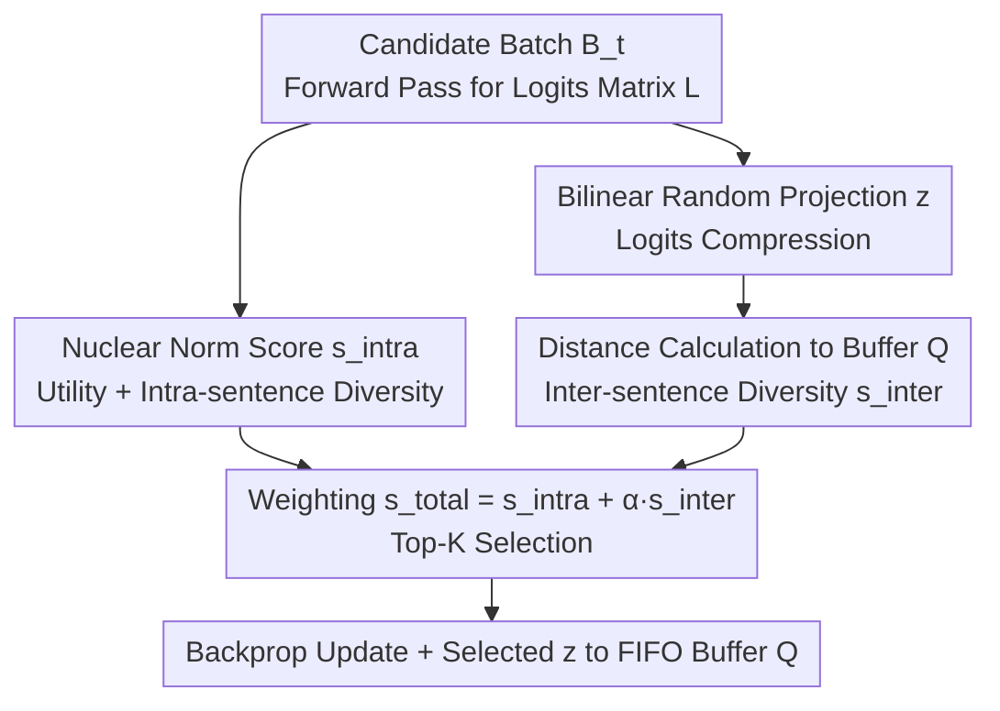

# Utility-Diversity Aware Online Batch Selection for LLM Supervised Fine-tuning

**Conference**: ICML 2026  
**arXiv**: [2510.16882](https://arxiv.org/abs/2510.16882)  
**Code**: https://github.com/gfyddha/UDS  
**Area**: Online Batch Selection / Data Pruning / Efficient SFT  
**Keywords**: Online Batch Selection, Supervised Fine-tuning, Logits Nuclear Norm, Diversity, Memory Buffer

## TL;DR
UDS proposes an efficient online batch selection framework for LLM Supervised Fine-tuning (SFT): it leverages the **nuclear norm of the logits matrix** obtained solely from forward passes to simultaneously characterize "optimization utility + intra-sentence diversity." It then uses **low-dimensional bilinear random projection** of logits to measure similarity matching against a historical sample memory buffer for "inter-sentence diversity." By selecting top-K samples based on a weighted sum of these metrics, UDS avoids reliance on external resources like reference models or validation sets and performs no additional backpropagation. Consequently, it is faster than full SFT and consistently outperforms existing SOTA online batch selection methods across several benchmarks.

## Background & Motivation
**Background**: SFT is the dominant post-training paradigm for adapting LLMs to downstream tasks, yet fine-tuning on full datasets is expensive and often leads to overfitting or bias amplification. Consequently, "data selection" has emerged, particularly **online batch selection**, which dynamically scores and filters samples during training: in each iteration, a large candidate batch $\mathcal{B}_t$ is sampled, and only a subset $\widehat{\mathcal{B}}_t$ is selected for parameter updates, facilitating real-time adaptation to the model state.

**Limitations of Prior Work**: The authors categorize existing methods into three types of issues. First, **utility-only focus, ignoring diversity**—methods like MaxLoss prioritize high-loss samples and MaxGrad selects large-gradient samples, but they ignore intra-sentence token repetition or inter-sentence redundancy. Second, **reliance on external resources**—RHO-Loss requires a reference model, while GREATS requires a held-out validation set, which is impractical when test distributions are unknown or reference models are unavailable. Third, **high computational overhead**—the training time for many methods (requiring per-sample gradients or reference models) even exceeds that of full training, violating the original intent of computational efficiency.

**Key Challenge**: Online batch selection must balance "evaluating every candidate sample under the current model" with "ensuring evaluation is cheap enough not to slow down training." Accurate evaluation requires at least one forward pass (to capture the model's current understanding), but computing gradients or running reference models for every sample causes cost explosion.

**Goal**: The authors formalize an ideal method through three desiderata: **D1** jointly considers data utility, intra-sentence diversity, and inter-sentence diversity; **D2** does not access external resources like reference models or validation sets; **D3** maintains a total pipeline training time lower than full SFT.

**Key Insight**: Since the forward pass naturally generates a **logits matrix** $\bm{L}(\bm{x}_t^i;\bm{\theta}_t)\in\mathbb{R}^{N\times V}$ (where $N$ is sequence length and $V$ is vocabulary size), which encodes both utility and diversity information, the method should **use logits only**—avoiding expensive per-sample gradients (satisfying D3) and external resources (satisfying D2).

**Core Idea**: Utilize the **nuclear norm** of the logits matrix to simultaneously capture "optimization utility + intra-sentence diversity," and employ **low-dimensional projection + history buffer distance** to capture "inter-sentence diversity." Top-K samples are selected via linear weighting (satisfying D1).

## Method

### Overall Architecture
UDS is a plug-and-play subset selection module integrated into the SFT pipeline. In the forward pass of each iteration $t$, for each sample $\bm{x}_t^i$ in the candidate batch $\mathcal{B}_t$: the **intra-sentence importance score** $s_{\text{intra}}^{t,i}$ is calculated via the nuclear norm of its logits matrix. Simultaneously, logits are compressed into a low-dimensional vector $\bm{z}_t^i$ via bilinear random projection, and the average distance to samples in the historical memory buffer $\bm{Q}$ yields the **inter-sentence importance score** $s_{\text{inter}}^{t,i}$. The weighted sum $s_{\text{total}}^{t,i}=s_{\text{intra}}^{t,i}+\alpha\,s_{\text{inter}}^{t,i}$ determines the top-K samples for parameter updates, and the $\bm{z}$ of selected samples is pushed into the FIFO buffer. The entire pipeline **uses only forward outputs, requires no extra backpropagation, and depends on no external models**.

### Key Designs

**1. Nuclear Norm as Intra-sentence Score: A Single Metric for "Utility" and "Intra-sentence Diversity"**

This is the core observation of UDS. The nuclear norm (trace norm) of the logits matrix $s_{\text{intra}}^{t,i}=\|\bm{L}(\bm{x}_t^i;\bm{\theta}_t)\|_*=\sum_{j=1}^r\sigma_j$ is the sum of all singular values. How does it characterize both utility and diversity? Based on the squeeze bound in Lemma 3.1 $\|\bm{L}\|_F\le\|\bm{L}\|_*\le\sqrt{\min(N,V)}\,\|\bm{L}\|_F$: there are two ways the nuclear norm increases.

First, an **increase in the Frobenius norm**, corresponding to larger overall logits. The authors use a first-order Taylor expansion to argue that larger logits lead to larger perturbations $\delta\bm{L}$ caused by parameter updates. Since loss change $\delta\ell\approx\langle\bm{\Delta},\delta\bm{L}\rangle$ ($\bm{\Delta}=\bm{P}-\bm{Y}$ is the cross-entropy gradient relative to logits, which is scale-insensitive), $\|\bm{L}\|_F$, $\|\bm{L}\|_*$, and the accessible loss reduction $-\delta\ell$ grow in the same direction. Thus, the nuclear norm serves as an indicator of **optimization utility** (samples yielding higher loss reduction are more valuable). Second, **approaching the upper bound under a fixed $\|\bm{L}\|_F$**, which corresponds to a full-rank, equal-singular-value "flat spectrum." Here, the row vectors of logits for each token are orthogonal and directionally scattered, meaning the model predicts diverse words across the sequence. Conversely, a rank-1 state (collinear row vectors) corresponds to degenerate cases where the model repeatedly predicts the same word. Thus, a high nuclear norm also signifies high **intra-sentence diversity**. Correlation analysis with Qwen-2.5-7B on MMLU confirms that $-\delta\ell$ vs. $\|\bm{L}\|_*$ and $\mathrm{rank}(\bm{L})$ vs. $\|\bm{L}\|_*$ are both strongly linearly correlated. ⚠️ Note: The linear relationship between nuclear norm and loss reduction is based on intuitive reasoning and empirical observation, not strict proof.

**2. Low-dimensional Bilinear Random Projection: Making Logits Bufferable**

To calculate inter-sentence diversity, representations of samples must be stored in a buffer. However, the original logits matrix $\bm{L}\in\mathbb{R}^{N\times V}$ is too large (storing 1024 samples for Qwen-2.5-7B requires ~74GB). Using a direct projection $\bm{\Gamma}\in\mathbb{R}^{NV\times d}$ would also cause the projection matrix itself to exceed memory limits (~74GB for $d=1024$). UDS **factorizes** the projection into two small matrices: $\bm{\Gamma}_1\in\mathbb{R}^{d_1\times V}$ to compress the vocabulary dimension and $\bm{\Gamma}_2\in\mathbb{R}^{d_2\times N}$ to compress the sequence dimension, resulting in $\bm{z}_t^i=\mathrm{vec}(\bm{\Gamma}_2\,\bm{L}\,\bm{\Gamma}_1^\top)$ with effective dimension $d=d_1 d_2$. The matrices are constructed in an SRFT (Subsampled Randomized Fourier Transform) style $\bm{\Gamma}=\sqrt{\cdot}\,\bm{S}\bm{F}\bm{D}$ ($\bm{F}$ is the DFT matrix, $\bm{D}$ is a $\pm1$ Rademacher diagonal matrix, and $\bm{S}$ randomly selects rows). This approximately satisfies the Johnson–Lindenstrauss lemma for distance preservation $(1-\epsilon)\|\bm{u}_i-\bm{u}_j\|^2\le\|\bm{v}_i-\bm{v}_j\|^2\le(1+\epsilon)\|\bm{u}_i-\bm{u}_j\|^2$ and **obviates the need to explicitly store $NV\times d$ matrices**, reducing complexity from $\mathcal{O}(NVd)$ to $\mathcal{O}((N+V)d\log(NV))$. This step is critical for making global diversity calculations technically feasible.

**3. Memory Buffer for Inter-sentence Diversity: Expanding Vision from "Intra-batch" to "Global"**

Existing methods (like GREATS) only consider diversity within the candidate batch, but the batch size $B$ is much smaller than the global dataset, leading to a narrow vision. UDS maintains a fixed-capacity $M$ FIFO buffer $\bm{Q}\in\mathbb{R}^{M\times d}$ ($M\gg B$) storing low-dimensional representations of the most recently selected samples. The inter-sentence score is the average Euclidean distance from the candidate sample to all representations in the buffer:

$$s_{\text{inter}}^{t,i}=\frac{1}{|\bm{Q}|}\sum_{\bm{z}_j\in\bm{Q}}\|\bm{z}_t^i-\bm{z}_j\|_2+\underbrace{\frac{1}{|\mathcal{B}_t|}\sum_{\bm{z}_k\in\mathcal{B}_t}\|\bm{z}_t^i-\bm{z}_k\|_2}_{\text{(Optional) Intra-batch Diversity}}$$

If the buffer is empty, $s_{\text{inter}}^{t,i}=0$. Higher scores indicate a sample is "different" from recent training history, suppressing repeated training on redundant content. The authors argue the intra-batch term is usually negligible ($B\ll M$ and data is shuffled), so it is omitted by default. Finally, $s_{\text{total}}^{t,i}=s_{\text{intra}}^{t,i}+\alpha\,s_{\text{inter}}^{t,i}$ balances "utilizing high-utility samples" and "exploring less-visited regions of the data distribution"—integrating the three elements of D1 into a single selection metric.

### Loss & Training
The training objective remains the standard self-regressive cross-entropy for SFT. UDS only modifies "which samples are used at each step." In each step: ① Perform forward pass on candidate batch to get logits, calculate $s_{\text{intra}}$ (nuclear norm) and $\bm{z}$ (bilinear projection); ② Calculate $s_{\text{inter}}$ via buffer, synthesize $s_{\text{total}}$ to select top-K; ③ Update buffer (ejecting the oldest if full) and perform backprop on the selected subset to update $\bm{\theta}_t\to\bm{\theta}_{t+1}$. Default hyperparameters: Buffer $M=1024$, projection dimensions $d_1=128, d_2=8$, batch size $B=8$, LoRA rank=8; $\alpha$ and selection ratio vary by backbone/dataset.

## Key Experimental Results

### Main Results (4 benchmarks, average accuracy $\bar{A}$ / Pass@1 for HumanEval, higher throughput is faster)
Comparison of full training (Regular) with various online batch selection baselines, excerpt for Qwen-2.5-7B:

| Method | MMLU $\bar A$ | ScienceQA $\bar A$ | GSM8K $\bar A$ | HumanEval Pass@1 |
|------|------|------|------|------|
| Regular (Full) | 55.32 | 94.56 | 78.23 | 45.82 |
| MaxLoss | 54.51 | 93.05 | 77.78 | 41.34 |
| RHO-Loss | 57.08 | 93.80 | 78.38 | 43.08 |
| GREATS (Prev. SOTA) | 58.19 | 94.17 | 78.61 | 45.04 |
| **UDS (Ours)** | **63.34** | **95.19** | **79.91** | **46.28** |

UDS achieves the best performance across all four benchmarks: on MMLU, it outperforms GREATS by **+5.15%**, with similar leads on Llama-3.1-8B (e.g., MMLU 40.16 vs. GREATS 39.04). In terms of efficiency, UDS's throughput on Qwen-2.5-7B for MMLU is 3.41 samples/s and HumanEval is 6.81 samples/s, both higher than Regular training (2.27, 6.24). MaxGrad is fast but yields little gain and slows down training, while GREATS is consistently slower than UDS—UDS achieves the **best trade-off between accuracy and efficiency**.

### Ablation Study (Qwen-2.5-7B, $\Delta$ indicates gain over Random baseline)

| Configuration | MMLU $\bar A$ | $\Delta$ | GSM8K $\bar A$ | $\Delta$ | HumanEval $\bar A$ | $\Delta$ |
|------|------|------|------|------|------|------|
| Random (Baseline) | 54.26 | – | 77.69 | – | 40.20 | – |
| Nuclear Norm Only (Intra) | 58.35 | +4.09 | 79.22 | +1.53 | 44.18 | +3.98 |
| Diversity Distance Only (Inter) | 57.75 | +3.49 | 78.96 | +0.67 | 43.84 | +3.64 |
| **UDS (Full)** | **63.34** | **+9.08** | **79.91** | **+2.22** | **46.28** | **+6.08** |

### Key Findings
- **Both components are effective and complementary**: Both nuclear norm only and diversity distance only significantly outperform random selection. Their combination yields the best results across all benchmarks; notably, the full UDS gain on MMLU (+9.08) is significantly greater than the sum of individual components, suggesting that utility and diversity provide mutual gains when modeled jointly.
- **Nuclear Norm = Utility + Intra-sentence Diversity is empirically valid**: On Qwen-2.5-7B, $-\delta\ell$, $\mathrm{rank}(\bm{L})$, and $\|\bm{L}\|_*$ show strong linear correlations, supporting the strategy of "selecting large nuclear norm samples ≈ selecting samples with high loss-reduction potential + high intra-sentence diversity."
- **Bilinear projection + buffer has minimal memory overhead**: Increasing $d_1, d_2, M$ improves accuracy with only a small increase in peak GPU memory, validating the engineering feasibility of storing logits in a buffer.
- **Robustness across data scales**: UDS consistently leads at different training data ratios and surpasses full fine-tuning (Llama-3.1-8B / MMLU).

## Highlights & Insights
- **One nuclear norm answers two questions**: Unifying "potential loss reduction (utility)" and "token diversity within a sequence" into the sum of singular values of the logits matrix is an economical design—using existing forward pass data saves the cost of per-sample gradients.
- **Factorized random projection solves "logits too large to store"**: Splitting the $NV\times d$ projection into two small matrices with SRFT construction preserves distances (JL lemma) while reducing complexity to $\mathcal{O}((N+V)d\log(NV))$. This technique is transferable to any scenario requiring similarity matching on high-dimensional activations under memory constraints.
- **Global diversity perspective**: Using a historical buffer to extend diversity from "intra-batch" to "cross-iteration global" is more aligned with the goal of "avoiding repetitive learning of similar content throughput the training process" compared to GREATS' intra-batch approach.
- **Engineering closure of three desiderata**: D1/D2/D3 are more than slogans—UDS achieves joint utility + dual diversity, zero external resources, and faster speed than full SFT. This "define standards then satisfy them" argumentation structure is clear and reusable.

## Limitations & Future Work
- **Lack of rigorous proof for nuclear norm/loss relationship**: The authors acknowledge that due to model complexity and nonlinearity, they can only provide intuitive reasoning and empirical correlations; why this holds theoretically remains an open question.
- **Hyperparameter sensitivity**: The selection ratio $\alpha$ and weighting factor are highly dependent on the backbone and dataset combination (requiring per-dataset tuning). $d_1, d_2, M$ must also be balanced between accuracy and memory.
- **Hardware/Scope constraints**: Experiments focused on LoRA + 7/8B scale. Conclusions for full-parameter SFT, larger batches, or larger models are primarily in the appendix, with limited coverage in the main tables.
- **Reliance on Logits for Diversity**: If logits are affected by calibration issues or temperature, the semantics of nuclear norm and projection distance may drift. For very long sequences ($N$ is large), the computational cost of the nuclear norm also warrants further evaluation.

## Related Work & Insights
- **vs. MaxLoss / MaxGrad**: These use a single utility signal (high loss / large gradient) and ignore diversity. MaxGrad specifically slows down training due to per-sample gradient computation. UDS uses forward logits nuclear norm for both utility and intra-sentence diversity without extra backpropagation.
- **vs. RHO-Loss**: Depends on a reference model to estimate "samples that reduce holdout loss," which is often unavailable in practice. UDS eliminates external resources (D2).
- **vs. GREATS (Prev. SOTA)**: Both are online selection methods, but GREATS only considers intra-batch diversity, requires a validation set, and has high overhead. UDS uses a history buffer for global inter-sentence diversity, requires zero external resources, trains faster, and consistently outperforms it on four benchmarks (MMLU +5.15%).

## Rating
- Novelty: ⭐⭐⭐⭐ The observation that "nuclear norm encodes utility + intra-sentence diversity" combined with factorized random projection for memory efficiency is novel and practical.
- Experimental Thoroughness: ⭐⭐⭐⭐ Extensive benchmarks (4) × 2 backbones + ablations + hyperparameter/data scale analysis, though main results are limited to LoRA/7-8B and theoretical guarantees are weak.
- Writing Quality: ⭐⭐⭐⭐ Clear framework based on three desiderata and logical progression of Lemma 3.1; notation is somewhat dense.
- Value: ⭐⭐⭐⭐ Plug-and-play, no external resources, faster and more accurate than full training; carries direct value for practical SFT data selection.

<!-- RELATED:START -->

## Related Papers

- [\[ICML 2026\] Learning a Zeroth-Order Optimizer for Fine-Tuning LLMs](learning_a_zeroth-order_optimizer_for_fine-tuning_llms.md)
- [\[ICLR 2026\] Arbitrary-Order Block SignSGD for Memory-Efficient LLM Fine-Tuning](../../ICLR2026/optimization/arbitrary-order_block_signsgd_for_memory-efficient_llm_fine-tuning.md)
- [\[ICML 2026\] Distilling Linearized Behavior into Non-Linear Fine-Tuning for Effective Task Arithmetic](distilling_linearized_behavior_into_non-linear_fine-tuning_for_effective_task_ar.md)
- [\[ICLR 2026\] Bi-LoRA: Efficient Sharpness-Aware Minimization for Fine-Tuning Large-Scale Models](../../ICLR2026/optimization/bi-lora_efficient_sharpness-aware_minimization_for_fine-tuning_large-scale_model.md)
- [\[ICML 2026\] Diversity-Driven Offline Multi-Objective Optimization via Nested Pareto Set Learning](diversity-driven_offline_multi-objective_optimization_via_nested_pareto_set_lear.md)

<!-- RELATED:END -->
