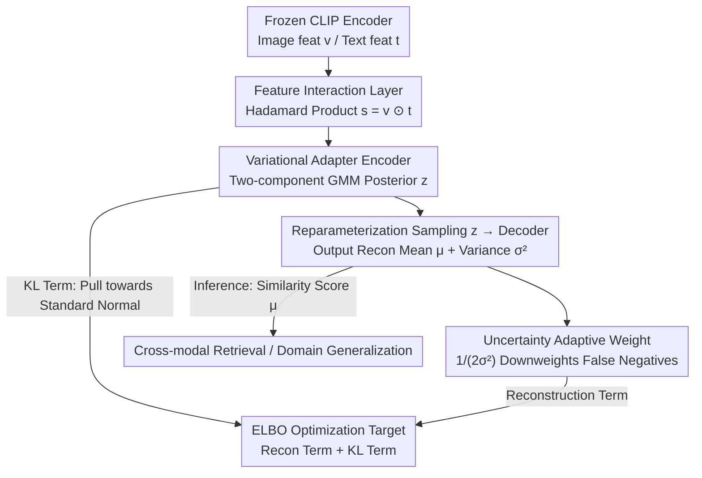

# Variational Adapter for Cross-modal Similarity Representation

**Conference**: ICML 2026  
**arXiv**: [2605.30968](https://arxiv.org/abs/2605.30968)  
**Code**: TBD  
**Area**: Multimodal VLM  
**Keywords**: Cross-modal Retrieval, Variational Autoencoder, Binary Labeling Problem, False Negatives, CLIP Fine-tuning

## TL;DR
Learning continuous cross-modal similarity distributions through a variational inference framework—mitigating false negative issues caused by binary labeling with adaptive uncertainty weights, significantly enhancing VLM performance in cross-modal retrieval and domain generalization tasks.

## Background & Motivation

**Background**: VLMs such as CLIP align image and text features in a unified representation space, seeing wide application in zero-shot classification, cross-modal retrieval, and open-vocabulary detection. However, existing methods often face data labeling limitations during the fine-tuning phase.

**Limitations of Prior Work**: Multimodal datasets like MS-COCO typically employ binary sparse labeling ("match" or "mismatch"), forcibly partitioning the continuous similarity space into two categories. This prevents the model from capturing fine-grained semantic relationships between samples, severely damaging generalization performance, especially in fine-tuning scenarios with limited samples.

**Key Challenge**: The matching relationship between image-text pairs is inherently continuous and complex (e.g., the match between the Mona Lisa and "mysterious smile" involves both object-level features and subjective perception). The coarseness of binary labeling leads to a large number of false negatives (semantically related but labeled as mismatched), destroying the semantic consistency of the representation space.

**Goal**: While keeping the CLIP base model frozen, explicitly model the continuous distribution of cross-modal similarity in the latent space through fine-tuning adapters, enabling the model to assign higher uncertainty to false negatives.

**Core Idea**: Transform the binary supervised learning problem into a latent variable generative model using a VAE framework, naturally introducing uncertainty-based adaptive sample weights to achieve "adjustment of learning intensity based on label confidence."

## Method

### Overall Architecture
VACSR consists of three key modules—(1) **Feature Interaction Layer**: Uses the Hadamard product to fuse encoder outputs for image features $\bm{v}_i$ and text features $\bm{t}_j$ into a similarity vector $\bm{s}_{i,j} = \bm{v}_i \odot \bm{t}_j$; (2) **Variational Adapter**: Maps the similarity vector to a two-component Gaussian Mixture Model (GMM) latent space $\mathbf{z}_{i,j}$ via an encoder network; (3) **Decoder Network**: Reconstructs similarity scores from latent variables and outputs uncertainty $\sigma^2(\mathbf{z}_{i,j})$. The CLIP backbone remains frozen throughout, training only these three lightweight adapters using an ELBO objective (reconstruction term + KL term).

### Key Designs

**1. Two-component Gaussian Mixture Posterior: Accommodating "Match" and "Mismatch" Semantics**

A unimodal Gaussian cannot simultaneously characterize the highly divergent semantic distributions of "match" and "mismatch," limiting expression. VACSR approximates the posterior as a two-component mixture:

$$p_\phi(\mathbf{z}_{i,j}\mid\bm{s}_{i,j})=\sum_{k=1}^{2}\alpha_k\,\mathcal{N}(\mathbf{z}_{i,j}\mid\mu_k,\sigma_k^2),$$

where the mixture weights $\alpha_1, \alpha_2$ are learnable. The encoder automatically selects the appropriate component based on the input. Since the KL term for mixture distributions has no closed-form solution, the authors use Jensen's inequality to derive a computable upper bound $\text{KL}[\sum_k\alpha_k p_k\,\|\,q]\le\sum_k\alpha_k\text{KL}[p_k\,\|\,q]$, ensuring the objective remains optimizable.

**2. Uncertainty Adaptive Weight: Automatic Downweighting via Learned Variance**

Binary labeling forces semantically relevant but "mismatched" false negatives into the negative class, breaking representation consistency. While traditional contrastive loss relies on manual temperature $\tau$ tuning, VACSR learns both the mean $\mu(\mathbf{z}_{i,j})$ and variance $\sigma^2(\mathbf{z}_{i,j})$ simultaneously. The reconstruction loss is:

$$\mathcal{L}_{\text{recon}}=\frac{1}{2\sigma^2}\|\hat y-\mu\|^2+\log\sigma+\frac{1}{2}\log 2\pi.$$

From an asymptotic perspective: as $\sigma^2\to 0$, the model strictly follows the binary label; as $\sigma^2\to\infty$, the label signal is submerged by noise. Consequently, false negatives are assigned high uncertainty (smaller $1/(2\sigma^2)$ weight, weaker learning), while certain positive and hard samples are assigned low uncertainty (larger weight, stronger learning). By interpreting uncertainty as a "measure of label quality" rather than "semantic ambiguity," the model dynamically adapts to label noise without manual temperature tuning.

**3. ELBO Optimization Target: Unifying Uncertainty Weighting and Latent Regularization**

An objective is required to maximize data fit while constraining the latent space to prevent the model from "cheating" with variance. VACSR utilizes the standard VAE ELBO:

$$\text{ELBO}=\mathbb{E}_{p_\phi}[\log q_\theta(\hat y\mid\mathbf{z})]-\text{KL}[p_\phi\,\|\,q].$$

The reconstruction term employs Gaussian likelihood (equivalent to MSE), naturally providing the uncertainty weighting mechanism without additional design. The KL term pulls the latent representation toward a standard normal prior, preventing the model from infinitely increasing latent variance to avoid fitting. Combined, these terms ensure that "adjusting learning intensity based on label confidence" becomes an intrinsic behavior of the objective.

## Key Experimental Results

### Main Results (COCO Dataset, 1K and 5K Test Sets)

| Model | 1K R@1(I→T) | 1K R@1(T→I) | 5K R@1(I→T) | 5K R@1(T→I) | Gain |
|------|-------------|-------------|-------------|-------------|------|
| PCME++ (ViT-B/32) | 81.6 | 69.2 | 62.1 | 48.1 | baseline |
| **Ours (ViT-B/32)** | **84.2** | **70.3** | **66.5** | **49.8** | +3.2%, +1.6% |
| PCME++ (ViT-B/16) | 85.3 | 73.4 | 68.7 | 53.4 | baseline |
| **Ours (ViT-B/16)** | **87.4** | **74.3** | **71.6** | **54.5** | +2.5%, +1.6% |

### Noise Robustness (COCO 20% Noisy Labels)

| Method | 1K R@1 | 5K R@1 | RSUM | Gain vs PCME++ |
|------|---------|---------|-------|----------------|
| PCME++ | 71.6 | 50.4 | 524.6 | baseline |
| **Ours** | **76.4** | **57.1** | **539.0** | +4.8% (R@1), +13.2% (RSUM) |

### Key Findings
- Under clean labeling, VACSR improves by an average of 2-3% compared to PCME++.
- Advantages are more pronounced in 20% noise injection scenarios (gains up to 5%+), proving that adaptive uncertainty effectively mitigates label noise.
- Cross-dataset (EC/CxC) tests verify generalization performance.

## Highlights & Insights
- **Theoretical Depth**: Rigorously proves the specific harm of binary labeling on contrastive and sigmoid losses through gradient analysis, quantifying the "relative gradient penalty" $r_i$.
- **Elegant Uncertainty Design**: Shifting the perspective of uncertainty to a "measure of label quality" rather than "semantic ambiguity" allows the model to handle false negatives more rationally.
- **Lightweight Adapter**: Adds only two MLPs on top of frozen CLIP features, resulting in extremely low parameter counts and computational overhead.

## Limitations & Future Work
- The choice of Hadamard product was not systematically compared with other feature interaction methods (e.g., bilinear pooling, outer products).
- The fixed number of mixture components (two) may limit modeling of highly complex labeling patterns.
- Label correction constraints—excessive concentration of false negatives may still lead to learning bias.
- Potential improvements: Dynamic component counts; other flexible posterior forms; combination with active learning or manual data cleaning.

## Related Work & Insights
- **vs Probabilistic Embedding Methods (PCME/PCME++)**: PCME attributes uncertainty to semantic ambiguity of samples; VACSR attributes it to label noise, which better aligns with real-world data labeling scenarios.
- **vs Contrastive Learning Temperature Tuning**: Traditional methods require meticulous adjustment of temperature coefficients; VACSR achieves adaptivity through self-learned variance parameters.

## Rating
- Novelty: ⭐⭐⭐⭐ Reformulating binary labeling as variational inference is novel; application of VAE in representation learning has precedents.
- Experimental Thoroughness: ⭐⭐⭐⭐⭐ COCO/EC/CxC + 1K/5K + noise robustness + domain generalization.
- Writing Quality: ⭐⭐⭐⭐ Clear logic with rigorous theoretical derivation.
- Value: ⭐⭐⭐⭐⭐ Addresses practical issues in CLIP fine-tuning with a lightweight, integrable method.

<!-- RELATED:START -->

## Related Papers

- [\[ICLR 2026\] Constraint Matters: Multi-Modal Representation for Reducing Mixed-Integer Linear programming](../../ICLR2026/optimization/constraint_matters_multi-modal_representation_for_reducing_mixed-integer_linear_.md)
- [\[ICML 2026\] Dynamics and Representation Structure of Local Approximations to Gradient-Based Learning in Linear Recurrent Neural Networks](dynamics_and_representation_structure_of_local_approximations_to_gradient-based_.md)
- [\[ICLR 2026\] Align-SAM: Seeking Flatter Minima for Better Cross-Subset Alignment](../../ICLR2026/optimization/align-sam_seeking_flatter_minima_for_better_cross-subset_alignment.md)
- [\[ICLR 2026\] Combination-of-Experts with Knowledge Sharing for Cross-Task Vehicle Routing Problems](../../ICLR2026/optimization/combination-of-experts_with_knowledge_sharing_for_cross-task_vehicle_routing_pro.md)
- [\[CVPR 2026\] Label-Free Cross-Task LoRA Merging with Null-Space Compression](../../CVPR2026/optimization/label-free_cross-task_lora_merging_with_null-space_compression.md)

<!-- RELATED:END -->
