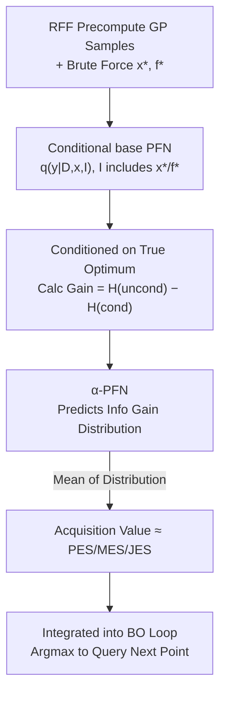

# $α$-PFN: Fast Entropy Search via In-Context Learning

**Conference**: ICML 2026  
**arXiv**: [2606.07134](https://arxiv.org/abs/2606.07134)  
**Code**: https://github.com/automl/AlphaPFN  
**Area**: Black-box Optimization / Bayesian Optimization / Acquisition Functions  
**Keywords**: Bayesian Optimization, Entropy Search, Prior-Fitted Networks, Acquisition Function Amortization, in-context learning

## TL;DR
This paper "amortizes" information-theoretic acquisition functions like Entropy Search (ES) into a single forward pass using a two-stage Prior-data Fitted Network (PFN). It first trains a base PFN capable of making predictions conditioned on optimal point information, then trains an $α$-PFN that directly outputs the distribution of information gain. This bypasses slow and complex Monte Carlo approximations, achieving performance comparable to SOTA Entropy Search on synthetic and real HPO benchmarks while providing speedups of up to 70x.

## Background & Motivation
**Background**: Bayesian Optimization (BO) aims to maximize an expensive black-box function $f(x)$ with minimal trials, balancing exploration and exploitation via an acquisition function. Classic Expected Improvement (EI) has analytical forms and is fast but is inherently "myopic"—only looking at immediate improvements over the current observed value, which often fails to identify the global optimum in noisy or heterogeneous scenarios. Information-theoretic acquisition functions (Entropy Search (ES) and its variants PES / MES / JES) choose query points that maximize the reduction in uncertainty about the optimum's location or value, which is theoretically more elegant, supports non-myopic behavior, handles noise, and accounts for evaluation costs.

**Limitations of Prior Work**: ES lacks a simple analytical definition for Gaussian Processes (GPs). All practical implementations rely on handcrafted, sampling-based approximations—such as using Monte Carlo to estimate information gain, Random Fourier Features (RFF) to approximate GP sample paths for optimization, or Expectation Propagation and moment matching to approximate entropy. These approximations are slow, prone to numerical errors, and require expert-level implementation for each ES variant. As BO is increasingly used in "high-throughput" scenarios (where evaluations themselves are fast), the runtime of the acquisition function itself becomes a bottleneck.

**Key Challenge**: The elegance of the ES framework vs. the complexity and expense of its approximations—the elegant information-theoretic objectives are buried under layers of handcrafted heuristics, making them slow and difficult to extend to new variants or fully Bayesian settings.

**Goal**: Instead of deriving yet another handcrafted approximation, the goal is to let a neural network **learn** to approximate these acquisition functions, replacing expensive inference-time sampling with a single forward pass.

**Key Insight**: PFNs have been proven to approximate the posterior predictive distribution of GP regression in a single forward pass using transformers (in-context learning, without inference-time gradient descent). The authors observe that the information gain of ES is essentially the "unconditional entropy" minus the "entropy conditioned on information about the optimum." If a PFN can make predictions conditioned on information about the optimum, this gain can be learned directly.

**Core Idea**: Use two-stage amortization—the base PFN learns "posterior predictions conditioned on $x^*/f^*$," and the $α$-PFN learns to "directly predict the distribution of information gain." The mean of this distribution equals the acquisition value of PES/MES/JES, enabling single-forward-pass results.

## Method

### Overall Architecture
The method addresses how to calculate Entropy Search acquisition values without relying on inference-time Monte Carlo sampling. The pipeline consists of two training phases and one deployment phase: Phase one trains a **base PFN** to provide the posterior predictive distribution $q(y\mid D_{trn},x,I)$ given a dataset $D_{trn}$, query point $x$, and optional information about the optimum $I$ ($x^*$, $f^*$, or both). Phase two uses the output of the base PFN to construct training targets for the **$α$-PFN**, which directly predicts the distribution of information gain looking only at $D_{trn}$ and $x$. During deployment, the $α$-PFN is integrated into a standard BO loop, where a single forward pass for each candidate point yields the acquisition value, and the point with the maximum value is queried.

The key transformation is: ES acquisition value $=\mathbb{E}_{I}[H(q(y\mid D,x)) - H(q(y\mid D,x,I))]$, representing the "expectation of information gain over the uncertainty of the optimum." Traditional methods sample many $I$ during inference to estimate this; this paper lets the $α$-PFN learn the entire distribution of gain and use the mean as the acquisition value, "internalizing" the expectation into the network.

### Key Designs

**1. Two-stage Amortization: Base PFN for Foundations, $α$-PFN for Execution**

This addresses the pain point that "inference-time Monte Carlo sampling is both slow and a source of error." Instead of deriving a 30th handcrafted approximation, the authors split the acquisition calculation into two amortization steps. The first stage trains an auxiliary base PFN $q(y\mid x,D_{trn},I)$, which can provide both normal posterior predictions $q(y\mid D_{trn},x)$ and conditional posteriors when fed information about the optimum $I$; this amortizes the "GP inference." The second stage trains the $α$-PFN $a_\theta(\cdot\mid D,x)$, which **directly** outputs the distribution of acquisition values, amortizing the "expectation over the optimum"—this provides the additional speedup compared to similar works (e.g., chang2024amortized, which only amortizes the base layer and still requires MC sampling for MES). By chaining two forward passes, evaluation for each candidate point is reduced to a single forward pass.

**2. Conditional Base PFN: Feeding Optimum Info as a Special Context Token**

To enable the base PFN to learn "conditioning on the optimum," the authors **add an extra data point** to the PFN context to carry $x^*$ and/or $f^*$. This point is encoded using a dedicated encoder different from regular data points, allowing the transformer to treat it uniquely. During training, $x^*$ and $f^*$ are randomly provided with a $50\%$ probability, allowing the same model to cover four scenarios: unconditional, $x^*$ only (PES), $f^*$ only (MES), or both (JES). Thus, a single base PFN serves three ES variants. The architecture uses TabPFNv2, which encodes cell-by-cell without requiring dimension-wise zero-padding, enabling flexible generalization between 1–6D.

**3. $α$-PFN Learns the "Distribution" of Information Gain Rather than Point Estimates**

The training target for $α$-PFN is $\tilde{\alpha}(D,x,I)=H(q(y\mid D,x))-H(q(y\mid D,x,I))$, which is the information gain calculated by the base PFN conditioned on the "true optimum" (entropy is analytically computable on the Riemann discrete distribution of PFN). Critically, since the location/value of the optimum varies across datasets, $\tilde{\alpha}$ is a random variable. The $α$-PFN is trained to fit its **entire distribution** $p(\tilde\alpha\mid D,x)$ via the loss $l_\theta=\mathbb{E}_{D,x,I}[-\log a_\theta(\tilde\alpha\mid x,D)]$. The paper proves (Proposition 4.1) that this loss is equivalent to the KL divergence between $p(\tilde\alpha\mid D,x)$ and the network output plus a constant, thus:

$$\mathbb{E}_{\tilde\alpha\sim a_\theta(\cdot\mid x,D)}[\tilde\alpha]\approx\mathbb{E}_{I\sim p(I\mid D,x)}[\tilde\alpha(D,x,I)],$$

The RHS is exactly the definition of PES/MES/JES. In other words, the mean of the $α$-PFN output distribution is the acquisition value—inference no longer requires sampling $x^*$ or $f^*$. These values are only used to define labels during **training** and are not needed at test time.

**4. Nearly Free Fully Bayesian Inference + Correcting Domain Shift with Simulated BO Trajectories**

Classic GP-ES is extremely expensive for fully Bayesian inference (integrating over hyperparameter priors), usually requiring slice sampling approximations where acquisition is computed for each hyperparameter sample. Ours simply requires "sampling hyperparameters before sampling the GP" during training; the base model naturally integrates out hyperparameter uncertainty. During inference, only **one** acquisition function is computed with almost zero additional cost, and it can actively choose points to reduce uncertainty about the hyperparameters themselves. Additionally, the authors identified a risk: PFN pre-training samples $x$ uniformly, but real BO queries **cluster** near local optima. This domain shift hampers performance in high dimensions. They mitigate this by generating approximate BO trajectories using a fast heuristic to simulate this clustering during PFN training.

### Loss & Training
The base PFN uses standard PFN cross-entropy targets, additionally conditioned on $I$. The $α$-PFN uses the negative log-likelihood from Equation (6), equivalent to fitting the KL divergence of the information gain distribution. Training data consists of 100 million datasets sampled from a hyper-prior (1–6D, ARD with varying length scales). GP samples are approximated using 500 RFFs, and $x^*, f^*$ are found via brute-force optimization using SGD/Adam with early stopping. Training costs: base model ~13 hours (4×H200), each $α$-PFN ~16 hours (4×L40S) for three ES variants. This is a one-time pre-training cost that is amortized over all future BO tasks.

## Key Experimental Results

Experiments aim to prove $α$-PFN is a practical, efficient alternative to GP-ES. For fairness, PFN and GP **share the same prior**, so performance should be similar. The authors do not claim SOTA on these benchmarks but perform "stress tests": most test functions do not match the restricted prior (Out-of-Distribution, OOD), and they test extrapolation to higher dimensions (up to 16D) and longer contexts (100 iterations, whereas training was 6D and context 50).

### Main Results

| Setting | Evaluation Metric | $α$-PFN Performance |
|--------|------|------|
| Synthetic Functions (Branin/Hartmann/Ackley, 30 seeds) | Inference Regret (lower is better) | Consistently close to GP; PES variants are competitive or better; PFN variants outperform on Hartmann 6D |
| LCBench (Real HPO, 30 initializations) | Best Performance Prediction Accuracy (higher is better) | $α$-PFN variants often outperform baselines (except on Segment); JES-$α$-PFN is most stable |
| HPO-B (5 search spaces) | Average Rank (lower is better) | Performance generally close; MES-$α$-PFN is weaker on HPO-B, often outperformed by GP baselines |

Baselines include BoTorch implementations of JES, MES-GIBBON, and PES, plus EI as a reference. Since no standard fully Bayesian ES implementation exists, the GP side uses NUTS (HMC) for MCMC-ES.

### Ablation Study

| Task (Dimension) | Acquisition | GP-MCMC (min) | $α$-PFN (min) | Speedup |
|------|------|------|------|------|
| HPO-B-7609 (9D, Discrete) | PES | 100.2 | 1.4 | 72.4× |
| HPO-B-5891 (8D, Discrete) | MES | 51.8 | 1.7 | 31.3× |
| HPO-B-7609 (9D, Discrete) | MES | 74.5 | 1.1 | 65.0× |
| Car (7D, Continuous) | JES | 259.7 | 19.9 | 13.1× |
| Segment (7D, Continuous) | JES | 66.8 | 32.8 | 2.0× |
| Hartmann (6D, Continuous) | JES | 172.3 | 18.9 | 9.1× |

| Ablation | Setting | Conclusion |
|------|---------|------|
| OOD Noise | $\sigma_n=0.5$ (rare in training prior) vs. $\sigma_n=0.316$, Hartmann 4D/6D | Both GP and $α$-PFN performance drop with noise, but $α$-PFN **displays no additional failure modes**, degrading similarly to its GP baseline |

### Key Findings
- Speedups occur across all tasks and acquisition functions, ranging from $1.6\times$ to $72\times$, often exceeding $>30\times$ or even $>70\times$ on HPO-B; speedup is most significant for discrete high-dimensional tasks where GP acquisition optimization is particularly slow.
- The performance vs. runtime is not a trade-off: $α$-PFN matches GP-ES quality while significantly reducing cost, suggesting learned approximations are more efficient than handcrafted ones.
- JES-$α$-PFN is the most robust variant; MES-$α$-PFN is weaker on HPO-B, reflecting known limitations of the MES truncated normal assumption in noisy scenarios.
- OOD degradation is graceful with no catastrophic failures because $α$-PFN essentially mimics the GP it approximates; it degrades when the GP degrades rather than collapsing independently.

## Highlights & Insights
- **Amortizing Expectation over the Optimum**: Unlike prior work (chang2024amortized) that only amortizes GP inference, the $α$-PFN learns the distribution of gain and uses the mean, "internalizing" the most expensive expectation layer. This is the source of the $>50\times$ speedup and a transferable idea for other Monte Carlo acquisition functions.
- **Unified Conditioning via Special Tokens**: Using an additional context point with a different encoder to carry $x^*/f^*$ allows a single base PFN to serve multiple tasks (unconditional + PES + MES + JES) via random masking during training, avoiding redundant modeling.
- **Nearly Free Fully Bayesian Inference**: While classic GP-ES requires sampling and multiple acquisition computations, $α$-PFN integrates hyperparameter uncertainty during training. Inference remains a single computation, turning a complex approximation into a simple sampling step during data generation.
- **Correcting for BO Domain Shift**: Recognizing that BO query points cluster near optima whereas training data is uniform, the authors used simulated BO trajectories to align pre-training data with downstream distribution—a crucial insight for any amortization or meta-learning method.

## Limitations & Future Work
- **OOD Degradation**: Performance drops when test functions or datasets deviate from the training prior (e.g., higher noise). The authors suggest broader priors or test-time transformations as mitigation.
- **Retraining for New Priors**: $α$-PFN is tied to its prior; switching to BNNs or ensembles requires new pre-training, though methods like whittle2025distribution might address this.
- **Scale of Dimensions/Context**: Currently trained up to 6D and context size 50. Although it extrapolates to 16D/100 iterations, larger-scale training (PFNs have been shown to handle 500D) is left for future work.
- **Runtime Comparison Caveats**: Baseline runtimes are influenced by hyperparameters like the number of MC samples; speedup factors should be viewed as estimates rather than precise metrics.
- **Personal Observation**: By forcing PFN and GP to share priors, "comparable performance" validates that PFN faithfully replicates GP-ES, but doesn't necessarily prove ES is superior to EI on these specific benchmarks (where EI is often strong).

## Related Work & Insights
- **vs. Handcrafted PES/MES/JES (BoTorch)**: These rely on RFF sampling of the optimum plus heuristics like EP or moment matching. Ours replaces these with a learned forward pass, matching performance but running 1-2 orders of magnitude faster.
- **vs. chang2024amortized (Amortized MES)**: They amortize the posterior conditioned on $f^*$ but still require MC sampling for MES at inference. Ours amortizes the acquisition calculation itself and extends to PES and JES.
- **vs. OptFormer / BORE / End-to-End Meta-BO**: These often focus on transfer learning BO or direct acquisition/surrogate learning. We focus strictly on amortizing information-theoretic acquisition functions without assuming cross-task similarity.
- **vs. igoe2026efficient / hu2024infonet**: These share the motivation of replacing expensive inference. The two-stage amortization here is particularly efficient as it avoids inference-time expectations over the optimum.

## Rating
- Novelty: ⭐⭐⭐⭐ Two-stage amortization + learning the gain distribution is a solid step in Entropy Search amortization.
- Experimental Thoroughness: ⭐⭐⭐⭐ Covers synthetic and real HPO suites with noise/OOD ablations, though sharing priors limits absolute performance claims.
- Writing Quality: ⭐⭐⭐⭐ Clear motivation, clean theoretical derivation (Prop 4.1), and effective pipeline diagrams.
- Value: ⭐⭐⭐⭐ The $>50\times$ speedup makes information-theoretic acquisition functions practical for high-throughput BO.

<!-- RELATED:START -->

## Related Papers

- [\[ICML 2026\] Learning Context-Conditioned Predicate Semantics via Prototype Feedback](learning_context-conditioned_predicate_semantics_via_prototype_feedback.md)
- [\[ICML 2026\] Test time training enhances in-context learning of nonlinear functions](test_time_training_enhances_in-context_learning_of_nonlinear_functions.md)
- [\[NeurIPS 2025\] In Search of Adam's Secret Sauce](../../NeurIPS2025/optimization/in_search_of_adams_secret_sauce.md)
- [\[ICML 2026\] ePC: Fast and Deep Predictive Coding in Digital Simulation](epc_fast_and_deep_predictive_coding_in_digital_simulation.md)
- [\[ICML 2026\] LiMuon: Light and Fast Muon Optimizer for Large Models](limuon_light_and_fast_muon_optimizer_for_large_models.md)

<!-- RELATED:END -->
