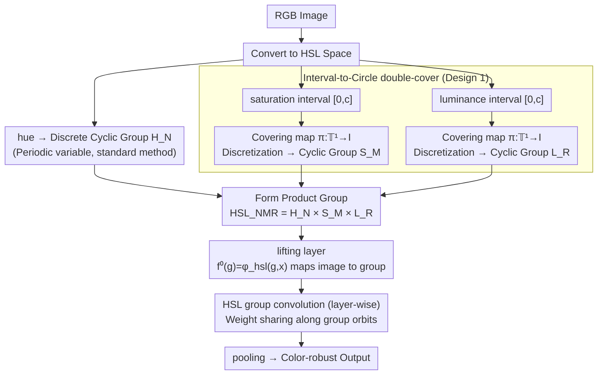

# A Hypertoroidal Covering for Perfect Color Equivariance

**Conference**: ICML2026  
**arXiv**: [2603.04256](https://arxiv.org/abs/2603.04256)  
**Code**: Code not provided in the paper  
**Area**: Computer Vision / Color Equivariance / Robust Classification  
**Keywords**: Color Equivariance, Group Convolution, Topological Covering, HSL Color Space, Out-of-Distribution Generalization  

## TL;DR
This paper uses a double-cover mapping to lift the interval-valued saturation and luminance in HSL space onto circle groups, constructing $\mathbb{T}^3$CEN. This enables the network to achieve precise color equivariance for hue, saturation, and luminance shifts, enhancing robustness in tasks such as color-shifted and medical imaging.

## Background & Motivation
**Background**: Convolutional networks are naturally equivariant to translations but lack structural guarantees against color variations. While standard data augmentation expands the training distribution and color-invariant networks eliminate color influence, color-equivariant networks aim to preserve color information while ensuring features change in a predictable manner under color transformations.

**Limitations of Prior Work**: Existing color-equivariance methods handle hue well because it is inherently a periodic variable that can be modeled with cyclic groups. However, saturation and luminance are bounded intervals. Forcing them into one-dimensional translation groups leads to boundary clipping and zero padding, which introduces artifacts into the representation and results in only approximate equivariance.

**Key Challenge**: Color changes can be either noise or useful information. Complete invariance discards critical color cues for fine-grained classification, while approximate equivariance produces structural errors at interval boundaries. A representation is needed that both preserves color information and achieves a strict group structure for bounded channels.

**Goal**: The authors aim to define group actions for all three HSL channels suitable for group convolution, enabling the network to be precisely equivariant to hue, saturation, and luminance shifts. They aim to verify that this structure improves generalization on OOD color shifts, Camelyon17 color imbalances, and various natural image datasets.

**Key Insight**: A topological covering can lift an interval without a group structure to a circle with periodic structure. Although saturation and luminance are values in $[0,c]$, they can be mapped to $\mathbb{T}^1$ via a double-cover map, followed by convolution using a cyclic group.

**Core Idea**: Instead of performing clipping and translation at the saturation/luminance interval boundaries, the intervals are first double-covered onto circles. Subsequently, group lifting and group convolution are performed on a hypertorus formed by $H\times S\times L$.

## Method

### Overall Architecture
$\mathbb{T}^3$CEN is a color-equivariant convolutional architecture designed to make the network precisely equivariant to color transformations across all three HSL channels, not just hue. It inherits the intuitive decomposition of HSL—hue for color type, saturation for purity, and luminance for brightness—but introduces a key modification: rather than treating bounded saturation/luminance as real-line translation groups, it lifts each into a discrete cyclic group to bypass interval clipping. The pipeline is: RGB images are converted to HSL; hue follows the discrete cyclic group $H_N$; saturation and luminance are lifted from interval values to the circle $\mathbb{T}^1$ via a double-cover, then discretized into cyclic groups $S_M$ and $L_R$. These form the product group $HSL_{NMR}=H_N\times S_M\times L_R$. A lifting layer maps the original image to features $f^0(g)=\varphi_{hsl}(g,x)$ defined on this group, followed by HSL group convolutions in subsequent layers. Finally, appropriate pooling yields outputs robust to color changes.

### Key Designs

**1. Interval-to-Circle double-cover: Providing Group Structure for Bounded Color Channels**

Saturation and luminance are bounded intervals $[0,c]$, making them incompatible with the cyclic groups used for hue. Previous methods treated them as 1D translations with clipping and zero padding, wasting boundary information and resulting in only approximate equivariance. The authors construct a covering map $\pi:\mathbb{T}^1\rightarrow I$ for the interval $I=[0,c]$, mapping interval values onto a circle. For instance, centered saturation might use a form like $\pi(\theta)=c\sin\theta/2$. After discretization, group operations reduce to angle addition modulo $2\pi$. Since a circle has no "endpoints," cyclic shifts always remain within the circle. Thus, group actions correspond strictly to cyclic permutations of features, transforming equivariance from approximate to exact—the reason equivariance error drops to the $10^{-6}$ magnitude.

**2. Lifting Layer on the HSL Product Group: Connecting Images to Group Convolutions**

Group convolution requires input functions defined on a group. Since raw images are not, a "lifting layer" acts as a bridge to lift the image onto the group. For each group element $g_{ijk}$, the lifting layer applies the corresponding HSL color transformation, obtaining $f^0(g_{ijk})=\varphi_{hsl}(g_{ijk},x)$, effectively enumerating responses along the H/S/L axes. The benefit is immediate: when the input image undergoes a color shift, the lifted representation does not change arbitrarily but simply undergoes a cyclic shift along the corresponding group axis, locking in equivariance from the first layer.

**3. HSL Group Convolution and Equivariant Features: Embedding Color Symmetry into Every Layer**

Following the lifting, each layer substitutes standard convolution with group convolution $[f*\psi](a)=\sum_{r\in HSL}\sum_k f_k(r)\psi_k(r^{-1}a)$. Convolution kernels share weights across the entire group orbit. Consequently, if the input color changes, the output features follow an isomorphic global change rather than requiring the network to approximate the change. Unlike pure augmentation which relies on "luck" within the training distribution, this approach embeds color-invariant/equivariant inductive biases directly into the architecture. Unlike color-invariant networks that discard color immediately, this method preserves color channel information throughout the network, allowing the task head to decide whether to pool into an invariant representation—ensuring no performance loss in tasks where "color is a useful cue."

### Loss & Training
The paper does not propose a new supervisory loss; modifications are concentrated on the network architecture itself. Classification and segmentation tasks are trained with standard task losses. For fair comparison, the authors fix the total parameter count; thus, increasing the HSL lifting cardinality requires a corresponding reduction in filter depth. This introduces a trade-off between capacity and equivariance: higher group orders provide finer coverage but squeeze the number of channels per layer. As shown in the ablation studies, an order of 4 often outperforms higher orders due to this balance.

## Key Experimental Results

### Main Results
Experiments are divided into two categories: the first directly measures equivariance and lifting errors to verify if the structure truly resolves saturation/luminance boundary artifacts; the second measures generalization for classification and medical imaging under OOD color shifts.

| Dataset / Task | Metric | $\mathbb{T}^3$CEN | Main Comparison | Conclusion |
|---------------|------|------------------|----------|------|
| 3D Shapes saturation equivariance | Mean Equiv. Error | $4.66\times 10^{-6}$ | LCER 0.445 | Double-cover nearly eliminates saturation equiv. error |
| Lifting error | 8-bit RGB Mean Error | $6.33\times 10^{-6}$ | LCER 8.65 | Nearly no reconstruction artifacts after round-trip shift |
| 3D Shapes saturation shift | A/B, A/C error | 0.00, 0.00 | ResNet 41.40, 42.20; LCER-S3 0.00, 0.04 | More stable generalization to saturation shifts |
| small NORB luminance shift | low lighting error | 11.09 to 14.42 | ResNet18 37.70; LCER-L3 34.83 | Significantly more robust to luminance changes |
| HSL-shift 3D Shapes | error | 0.00 | LCER-H4S3 9.76; ResNet44 55.40 | Clear advantage in joint three-channel equivariance |
| Camelyon17 | error | S4: 12.11 | ResNet50 28.91; LCER-S3 16.08 | Better on color-imbalanced medical images |

### Ablation Study
The analysis focuses on lifting cardinality, whether color acts as a label signal, and the presence of train-test color shifts.

| Configuration / Scenario | Key Metric | Description |
|-------------|----------|------|
| Increase hue cardinality to 20 | hue-shift MNIST error 9.19 | Channels drop under fixed parameters; capacity loss outweighs equiv. gain |
| Optimal cardinality $\approx$ 4 | hue-shift MNIST error 1.96 | Order with highest covering entropy density often yields best performance |
| Color as label signal | KUTomaData error 31.75 vs ResNet18 19.13 | Tomato ripeness depends on absolute color; invariant pooling hurts the task |
| No train-test color shift | 0° hue shift 94.18 vs ResNet44 98.38 | Without shift, equivariance constraints primarily impose a capacity cost |
| Shift increased to 15° | 97.75 vs ResNet44 97.06 | At sufficient shifts, structured equivariance outperforms standard CNNs |

### Key Findings
- The primary issue with saturation/luminance is not a "lack of data augmentation" but a lack of group structure at interval boundaries; the double-cover topologically resolves this.
- Color equivariance is not unconditionally superior. It is best suited for scenarios where color change is a nuisance and the train-test color distribution varies. If color itself is evidence for a category, invariant pooling discards information.
- Under a fixed parameter budget, group order cannot be increased blindly. The paper uses covering entropy density to explain why order 4 is often more suitable than higher orders.

## Highlights & Insights
- The core insight is clean: the failure of saturation/luminance stems from the modeling error of "treating intervals as translation groups," not just insufficient network capacity. Reconstructing group structure via topological covering is more fundamental than patching with losses or augmentation.
- It preserves an interpretable structure of color information. Cyclic permutations of lifted feature maps along H/S/L group axes correspond directly to input color shifts, making robustness easier to analyze than that learned via standard augmentation.
- Constraints are reported honestly. The authors explicitly identify "color-as-signal" and "no-shift" as two failure modes, which helps in determining whether to use color-equivariant networks in real-world tasks.

## Limitations & Future Work
- Group convolutions introduce computational overhead; larger filter orbits increase costs. Reducing channels to fix parameter counts may compromise expressivity.
- Using invariant pooling for classification weakens the model's perception of absolute color. If task labels depend on color (e.g., ripeness, texture, or pathological staining intensity), invariant pooling must be used cautiously or conditional branches should be retained.
- While experiments cover various image datasets and Camelyon17, there is a lack of systematic validation on large modern backbones, real-world deployment calibration errors, and dense prediction scenarios like segmentation or detection.
- Double-covering produces redundant representations, particularly when certain input values map to duplicate lifted values. Higher efficiency in discretization or learnable sampling to reduce redundancy is a valuable future direction.

## Related Work & Insights
- **vs LCER / HSL translation lifting**: LCER uses translation and zero padding for saturation/luminance, achieving only approximate equivariance at boundaries. Ours replaces interval translation with cyclic groups, dropping equivariance error to numerical levels.
- **vs CEConv / hue-equivariant CNN**: Hue-only equivariance handles color phase changes but fails with luminance and saturation shifts; $\mathbb{T}^3$CEN unifies all three HSL channels into a product group.
- **vs Data Augmentation**: Methods like AugMix, DeepAugment, or color jitter depend on training coverage and do not guarantee structural equivariance. Ours writes the inductive bias into the architecture, ensuring stability under large distribution shifts.
- **Inspiration for other tasks**: Double-cover is not limited to color. The paper suggests construction ideas for RGB shift and scale equivariance, implying that "lifting interval variables to circles for group convolution" could be a general-purpose tool.

## Rating
- Novelty: ⭐⭐⭐⭐⭐ Using topological covering to solve exact equivariance for interval color channels is a highly focused and distinct idea.
- Experimental Thoroughness: ⭐⭐⭐⭐☆ Covers equivariance error, OOD shifts, Camelyon17, multiple datasets, and failure modes, but lacks massive model experiments.
- Writing Quality: ⭐⭐⭐⭐☆ Motivation and limitations are clearly explained with complete mathematical definitions; some background sections are slightly repetitive.
- Value: ⭐⭐⭐⭐☆ Highly valuable for vision tasks with significant color distribution shifts; provides a transferable paradigm for modeling interval-valued symmetry.

<!-- RELATED:START -->

## Related Papers

- [\[CVPR 2025\] Integral Fast Fourier Color Constancy](../../CVPR2025/others/integral_fast_fourier_color_constancy.md)
- [\[NeurIPS 2025\] Equivariance by Contrast: Identifiable Equivariant Embeddings from Unlabeled Finite Group Actions](../../NeurIPS2025/others/equivariance_by_contrast_identifiable_equivariant_embeddings_from_unlabeled_fini.md)
- [\[ECCV 2024\] Real-Data-Driven 2000 FPS Color Video from Mosaicked Chromatic Spikes](../../ECCV2024/others/real-data-driven_2000_fps_color_video_from_mosaicked_chromatic_spikes.md)
- [\[ICML 2026\] Beyond Model Readiness: Institutional Readiness for AI Deployment in Public Systems](beyond_model_readiness_institutional_readiness_for_ai_deployment_in_public_syste.md)
- [\[ICML 2026\] Comprehensive AI Governance Requires Addressing Non-Model Gains](comprehensive_ai_governance_requires_addressing_non-model_gains.md)

<!-- RELATED:END -->
