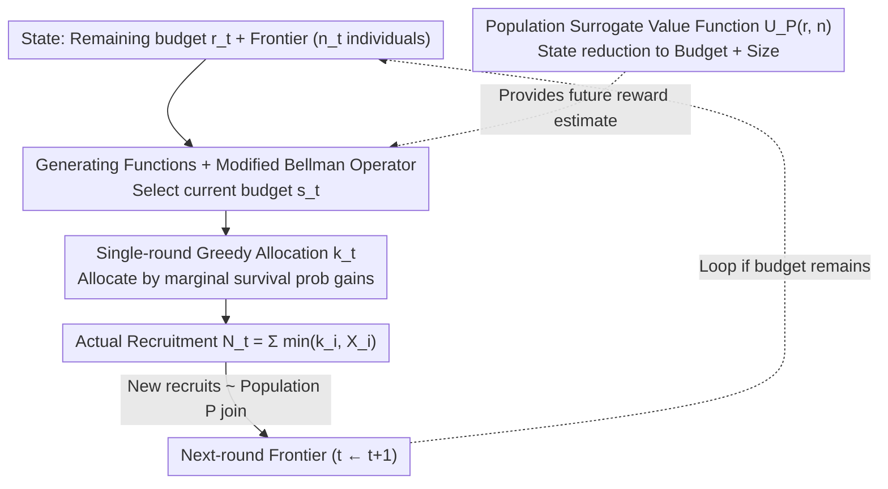

# Adaptive Multi-Round Allocation with Stochastic Arrivals

**Conference**: ICML 2026  
**arXiv**: [2605.12111](https://arxiv.org/abs/2605.12111)  
**Code**: Publicly available  
**Area**: Sequential Decision Making / Budget-Constrained Optimization / Stochastic Control  
**Keywords**: Adaptive recruitment, multi-round allocation, stochastic arrivals, dynamic programming, population-level surrogate value function

## TL;DR
This paper formalizes network recruitment as a budget-constrained sequential control problem and proves that single-round optimal allocation is greedy. By introducing a population-level surrogate value function, the complexity of multi-round planning is reduced to $O(b^5\log b)$. Furthermore, a robustness guarantee is provided, decomposing model errors into frontier-level, population-level, and approximation errors.

## Background & Motivation

**Background**
Adaptive network recruitment is widely applied in public health (HIV 95-95-95, contact tracing, survey sampling), epidemiology, and social sciences. Under resource scarcity, the core problem is how to allocate limited incentives (referral coupons, testing kits) to maximize participation coverage and early-stage recruitment.

**Limitations of Prior Work**
1. **Endogenous Dynamics**: Unlike stochastic knapsack or bandits, allocation in this problem not only consumes budget for immediate rewards but also alters the distribution of future decision opportunities by recruiting new individuals, leading to complex state evolution.
2. **High-Dimensional Intractability**: Individual features (demographics, network positions, etc.) are high-dimensional. A precise value function must track the entire distribution of the frontier, making computation infeasible.
3. **Difficult Optimal Planning**: Even with a fully known distribution, Bellman recursion involves an infinite-dimensional continuous state space, rendering traditional DP inapplicable.

**Key Challenge**
The trade-off between performing fine-grained adaptive allocation based on individual features and solving the optimal policy within a finite computational budget—namely, the balance between precise planning and scalability.

**Goal**
Design a computable policy that maximizes recruitment under multi-round budget constraints and remains robust to model errors.

**Key Insight**
The study begins with the combinatorial structure of a single round: for a fixed round budget, greedy optimality is derived via marginal decomposition of survival probabilities, separating the problems into "intra-round allocation" and "inter-round budgeting." For multi-round scenarios, a population-level surrogate value function is introduced to collapse individual heterogeneity into population statistics.

**Core Idea**
Single-round optimality (greedy) + population surrogate value function (state dimensionality reduction) $\rightarrow$ exact yet computable multi-round DP. The surrogate Bellman equation is calculated precisely using probability generating functions with a complexity of $O(b^5\log b)$. Robustness guarantees are provided via error decomposition into frontier-level, population-level, and approximation components.

## Method

### Overall Architecture
At time $t\geq 1$, the system is in state $(r_t,\mathcal D_{1:n_t}^{(t)})$ (remaining budget $r_t$, arrival distributions of $n_t$ individuals in the frontier). The policy $\pi$ selects at each round: (i) a round budget $s_t\in\{0,\ldots,r_t\}$, and (ii) an allocation vector $\mathbf k_t=(k_1,\ldots,k_{n_t})$ such that $\sum_i k_i\leq s_t$. Each individual $i$ is constrained by their arrival capacity $X_i\sim\mathcal D_i$, resulting in actual recruitment $\min\{k_i,X_i\}$. Newly recruited individuals enter the frontier for the next round, with their distributions sampled from a population $\mathcal P$. The objective is $\max_\pi\mathbb E[\sum_{t\geq 1}\gamma^{t-1}N_t]$. The methodology unfolds along three main lines: intra-round allocation (greedy), state compression (population-level surrogate value functions), and precise calculation of recursive steps (generating functions + modified Bellman operator).

### Key Designs

**1. Single-Round Optimal Greedy Allocation: Transforming Stochastic Constraints into Discrete Concave Optimization**

For a fixed round budget and frontier, the problem originally required searching for an optimal allocation in a combinatorial space. The authors decompose it using survival probability marginals: $\mathbb E[\sum_i\min\{k_i,X_i\}]=\sum_i\sum_{\ell=1}^{k_i}p_i(\ell)$. The objective is rewritten as a sum of survival probabilities, which are discrete concave with diminishing marginal returns. Consequently, a greedy approach is optimal: allocating units sequentially based on the highest marginal gain (Theorem 4.2 proves optimality). This step bypasses combinatorial explosion by leveraging discrete concavity, and the marginal decomposition only requires survival probabilities, making it intuitive and computationally efficient.

**2. Population-Level Surrogate Value Function: Reducing High-Dimensional Individual States to One-Dimensional Statistics**

The exact value function for multi-round planning $V_{\mathcal P}(r,\mathcal D_{1:n})$ must track the entire distribution of the frontier, which is infinite-dimensional and computationally intractable. The key observation is that future individuals are ex ante indistinguishable, as they all originate from the same population distribution $\mathcal P$; thus, treating them uniformly is optimal. Based on this, the surrogate value function $U_{\mathcal P}(r,n)$ is defined as the optimal expected recruitment given remaining budget $r$ and size $n$ (where individuals are i.i.d. from $\mathcal P$). The state is compressed from the "entire frontier" to "budget + size." The recurrence is $U_{\mathcal P}(r,n)=\max_{0\leq s\leq r}\mathbb E[N_s^e+\gamma U_{\mathcal P}(r-s,N_s^e)]$, where $N_s^e$ is the expected recruitment under uniform allocation of $s$ to $n$ individuals. Proposition 6.1 proves the optimality of uniform allocation in the population model via exchangeability and diminishing marginals. This abstraction captures the essence of planning while discarding irrelevant individual details.

**3. Generating Function Computation + Modified Bellman Operator: Precise Recursion and Integration**

The recurrence of the surrogate value function must be calculated precisely and quickly, and its integration back into the original Bellman equation must not violate intra-round optimality. The authors use truncated probability generating functions (PGF) of the population survival probability $\bar p(\ell)$ to describe the distribution of $N_s^e$. By utilizing polynomial arithmetic to avoid discrete convolution enumeration, the complexity is reduced to $O(b^2)$ space and $O(b^5\log b)$ time (Theorem 6.2). On any actual frontier $\mathcal D_{1:n}$, the greedy allocation $\mathbf k^{\text{greedy}}$ yields the current recruitment $N_s^g$. Future expectations are then substituted with $U_{\mathcal P}(r-s,N_s^g)$ instead of the exact $V$, forming a modified Bellman operator $\widetilde V_{\mathcal P;U_{\mathcal P}}$. This surrogate insertion is a principled form of value function approximation that preserves round-level optimality while maintaining multi-round computability.

### Loss & Training
Objective: $\sum_{t\geq 1}\gamma^{t-1} N_t$. Multi-round error decomposition (Theorem 7.2): under estimation noise, suboptimality $\leq 2(1+\gamma)r\sum_i\|\mathcal D_i-\hat{\mathcal D}_i\|_{\text{TV}}+c_{r,\gamma}\|\mathcal P-\hat{\mathcal P}\|_{\text{TV}}+c_{r,\gamma}r\mathbb E\|\mathcal D-\bar{\mathcal D}\|_{\text{TV}}$, where $c_{r,\gamma}=2\gamma r/(1-\gamma)$. These terms correspond to frontier error, population distribution error, and surrogate approximation error, respectively.

## Key Experimental Results

### Main Results (ICPSR HIV Social Network, Simulated RDS)

| Initial Frontier | $\gamma$ | Total Budget $b$ | Const(k=3) | Greedy(α=0.5) | GreedyRem | TAP (Ours) |
|---------|----------|----------|-----------|--------------|-----------|--------|
| n=5 | 0.5 | 200 | 32.1 | 35.4 | 36.2 | **39.8** |
| n=5 | 0.7 | 200 | 28.3 | 31.1 | 31.7 | **34.5** |
| n=5 | 0.9 | 200 | 24.1 | 26.8 | 27.3 | **29.1** |
| n=10 | 0.5 | 200 | 58.2 | 62.1 | 63.5 | **68.3** |
| n=10 | 0.7 | 200 | 51.4 | 55.3 | 56.4 | **61.2** |
| n=15 | 0.5 | 200 | 79.5 | 85.3 | 87.1 | **94.2** |
| n=15 | 0.9 | 200 | 42.7 | 46.5 | 47.2 | **51.8** |

Const(k) allocates $k$ per person (tuned post-hoc); Greedy methods use fixed or remaining budget ratios without cross-round planning. TAP integrates greedy intra-round allocation with population-level multi-round planning.

### Simulated vs. Real Networks

| Setting | Method | HIV | Chlamydia | Gonorrhea |
|------|------|-----|-----------|-----------|
| Simulated Dist. | TAP | **68.3** | 72.1 | 65.4 |
| Simulated Dist. | Const(3) | 58.2 | 63.5 | 58.1 |
| Real Network | TAP | **67.5** | 71.2 | 64.8 |
| Real Network | Const(3) | 57.1 | 62.8 | 57.3 |

Simulated and real results are close, validating the effectiveness of learning $\mathcal P$. In some cases (e.g., Gonorrhea, $\gamma=0.9$), greedy variants perform better, suggesting that robustness under model error remains a real challenge.

### Ablation Study

| Component | Change | Avg. Recruitment | Description |
|------|------|---------|------|
| Full TAP | - | 68.3 | Baseline |
| W/O Multi-round Planning | Fixed round budget (0.5x) | 62.1 | No cross-round optimization |
| W/O Population Surrogate | Enumerate all frontier configs | 68.1 | Computationally expensive/No scalability |
| W/O Greedy Intra-round | Random intra-round + Pop. Planning | 55.3 | Intra-round optimality is critical |
| Equalized Baseline | Same amount for everyone | 51.2 | Ignores heterogeneity |

### Key Findings
- **Both Greedy Intra-round and Multi-round Planning are Mandatory**: Removing either component significantly degrades TAP's performance.
- **Population Surrogate is Nearly Lossless**: Compared with enumerating frontiers (68.1), TAP (68.3) is slightly better, likely because the surrogate avoids overfitting to specific configurations.
- **Robust on Real Networks**: Differences between simulated and real data are < 2 recruits, verifying the feasibility of transferring the model to real-world data.
- **Baselines Win in Specific Settings**: Under Gonorrhea with a high discount factor, greedy wins, indicating that model errors are not yet fully eliminated.

## Highlights & Insights
- **Elegance of Greedy Single-Round Optimality**: The survival probability decomposition transforms complex stochastic constraints into discrete concave objectives, representing a refined improvement over the stochastic knapsack problem.
- **Creativity of Population Surrogates**: The modeling assumption that "new individuals are ex ante identically distributed" is converted into a dimensionality reduction tool that is both theoretically grounded and practically relevant.
- **Transparent Error Decomposition**: Theorem 7.2 clearly separates three types of error, allowing practitioners to identify which input's precision is most sensitive.
- **Validation on Real Networks**: Application to HIV networks demonstrates the real-world value of this framework in public health.

## Limitations & Future Work
- **Scalability Issues**: $O(b^5\log b)$ remains high for large budgets, necessitating further approximations or heuristics.
- **Model Error Challenges**: In certain disease and discount factor combinations, greedy outperforms TAP, suggesting that adaptive learning strategies for model errors might be more valuable.
- **Data Availability**: The model assumes access to arrival distributions or sufficient statistics; in scenarios like emerging infectious diseases, historical data may be insufficient.

## Related Work & Insights
- **vs. Stochastic Knapsack / Bandits**: Classic problem action sets remain constant; here, the action space evolves endogenously, requiring cross-round dynamics consideration.
- **vs. Prophet Inequalities**: Prophet inequalities assume independent candidates; here, recruitment generates correlated future candidates, resulting in more complex dependency structures.
- **vs. Heuristic RDS Methods**: In practice, Respondent-Driven Sampling (RDS) often uses fixed per-round allocations; this paper provides theoretical improvements through adaptive multi-round planning.

## Rating
- Novelty: ⭐⭐⭐⭐⭐ The combination of greedy single-round and population surrogate value functions forms a novel, computable multi-round planning framework.
- Experimental Thoroughness: ⭐⭐⭐⭐ Real HIV network + two other infections + simulated/real comparisons + multiple baselines + thorough ablation.
- Writing Quality: ⭐⭐⭐⭐ The problem formalization is clear, and the primary algorithms and theorems are rigorously presented.
- Value: ⭐⭐⭐⭐ Direct utility in adaptive network recruitment and public health scenarios, with a tight integration of theory and practice.

<!-- RELATED:START -->

## Related Papers

- [\[ICML 2026\] Envy-Free Allocation of Indivisible Goods via Noisy Queries](envy-free_allocation_of_indivisible_goods_via_noisy_queries.md)
- [\[AAAI 2026\] Center-Outward q-Dominance: A Sample-Computable Proxy for Strong Stochastic Dominance in Multi-Objective Optimisation](../../AAAI2026/others/center-outward_q-dominance_a_sample-computable_proxy_for_strong_stochastic_domin.md)
- [\[AAAI 2026\] Online Linear Regression with Paid Stochastic Features](../../AAAI2026/others/online_linear_regression_with_paid_stochastic_features.md)
- [\[ICML 2026\] Theoretical Analysis of Sparse Optimization with Reparameterization, Weight Decay, and Adaptive Learning Rate](theoretical_analysis_of_sparse_optimization_with_reparameterization_weight_decay.md)
- [\[CVPR 2026\] Adaptive Data Augmentation with Multi-armed Bandit: Sample-Efficient Embedding Calibration for Implicit Pattern Recognition](../../CVPR2026/others/adaptive_data_augmentation_with_multi-armed_bandit_sample-efficient_embedding_ca.md)

<!-- RELATED:END -->
