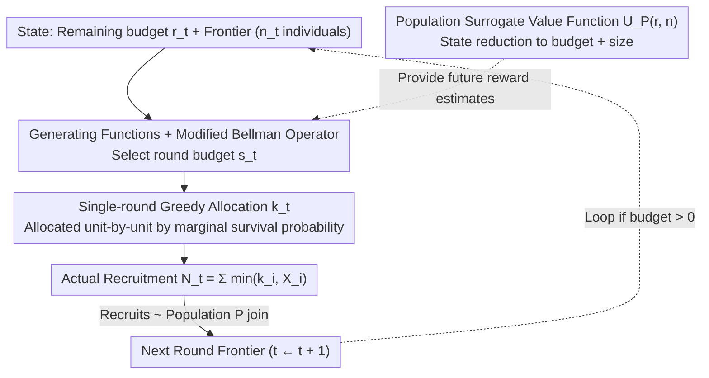

# Adaptive Multi-Round Allocation with Stochastic Arrivals

**Conference**: ICML 2026  
**arXiv**: [2605.12111](https://arxiv.org/abs/2605.12111)  
**Code**: Available  
**Area**: Sequential Decision Making / Budget-Constrained Optimization / Stochastic Control  
**Keywords**: Adaptive Recruitment, Multi-Round Allocation, Stochastic Arrivals, Dynamic Programming, Population Surrogate Value Function

## TL;DR
This paper formalizes network recruitment as a budget-constrained sequential control problem and proves that single-round optimal allocation is greedy. By introducing a population-level surrogate value function, the multi-round planning complexity is reduced to $O(b^5\log b)$. Robustness guarantees are provided by decomposing model error into frontier, population, and approximation terms.

## Background & Motivation

**Background**
Adaptive network recruitment is widely applied in public health (HIV 95-95-95, contact tracing, survey sampling), epidemiology, and social sciences. Under resource scarcity, the core problem is how to allocate limited incentives (referral coupons, testing kits) to maximize participation coverage and early recruitment.

**Limitations of Prior Work**
1. **Endogenous Dynamics**: Unlike the stochastic knapsack or bandits, allocations in this problem consume budget to obtain immediate rewards while simultaneously changing the distribution of future decision opportunities via new recruits, creating complex state evolution.
2. **High-Dimensional Intractability**: Individual features are high-dimensional (demographics, network positions, etc.). An exact value function must track the entire frontier distribution, making computation infeasible.
3. **Difficult Optimal Planning**: Even if distributions are fully known, the Bellman recurrence involves an infinite-dimensional continuous state space, rendering traditional DP inapplicable.

**Key Challenge**
The trade-off between performing fine-grained adaptive allocation based on individual features and solving the optimal policy within a finite computational budget—balancing exact planning with scalability.

**Goal**
Design a computable policy to maximize recruitment under multi-round budget constraints while maintaining robustness against model errors.

**Key Insight**
The authors start with the combinatorial structure of a single round: for a fixed round budget, greedy optimality is derived through the marginal decomposition of survival probabilities; this separates "intra-round allocation" from "inter-round budgeting." For multiple rounds, a population-level surrogate value function is introduced to collapse individual heterogeneity into group statistics.

**Core Idea**
Single-round optimality (greedy) + Population surrogate value function (state reduction) $\rightarrow$ Exact yet computable multi-round DP. The surrogate Bellman equation is calculated precisely via probability generating functions with $O(b^5\log b)$ complexity. The robustness error is decomposed into frontier-level, population-level, and approximation terms.

## Method

### Overall Architecture
At time $t\geq 1$, the system is in state $(r_t,\mathcal D_{1:n_t}^{(t)})$ (remaining budget $r_t$, arrival distributions of $n_t$ individuals in the frontier). The policy $\pi$ selects in each round: (i) a round budget $s_t\in\{0,\ldots,r_t\}$, and (ii) an allocation vector $\mathbf k_t=(k_1,\ldots,k_{n_t})$ where $\sum_i k_i\leq s_t$. Individual $i$ is limited by their arrival capacity $X_i\sim\mathcal D_i$, with actual recruitment being $\min\{k_i,X_i\}$. Newly recruited individuals join the next round's frontier, sampled from population $\mathcal P$. The objective is $\max_\pi\mathbb E[\sum_{t\geq 1}\gamma^{t-1}N_t]$. The methodology follows three lines: how to allocate in a single round (greedy intra-round), how to compress multi-round states (population surrogate), and how to compute the recurrence (generating functions + modified Bellman operator).

### Key Designs

**1. Single-Round Optimal Greedy Allocation: Converting Stochastic Constraints into Discrete Concave Optimization**

For a fixed round budget and frontier, one would normally search the combinatorial space for the optimal allocation. The authors use survival probability marginal decomposition to break it down: $\mathbb E[\sum_i\min\{k_i,X_i\}]=\sum_i\sum_{\ell=1}^{k_i}p_i(\ell)$. The objective becomes a sum of survival probabilities—discrete concave with diminishing margins. Thus, greedy is optimal: allocating unit-by-unit by the highest marginal reward (Theorem 4.2). This step leverages the discrete concave structure to bypass combinatorial explosion, requiring only survival probabilities for computation.

**2. Population-Level Surrogate Value Function: Reducing High-Dimensional States to Population Statistics**

The exact value function $V_{\mathcal P}(r,\mathcal D_{1:n})$ for multi-round planning must track the entire frontier distribution, which is infinite-dimensional. The key observation is that future individuals are *ex ante* indistinguishable—all coming from the same population $\mathcal P$—so treating them uniformly is optimal. The surrogate value function $U_{\mathcal P}(r,n)$ is defined as the optimal expected recruitment given budget $r$ and size $n$ (where individuals are i.i.d. from $\mathcal P$). This compresses the state to "budget + size." The recurrence is $U_{\mathcal P}(r,n)=\max_{0\leq s\leq r}\mathbb E[N_s^e+\gamma U_{\mathcal P}(r-s,N_s^e)]$, where $N_s^e$ is the expected recruitment from $n$ individuals under uniform allocation. Proposition 6.1 proves uniform allocation is optimal in the population model due to exchangeability and marginal diminishing returns.

**3. Generating Function Computation + Modified Bellman Operator: Computing Recurrence and Reinsertion**

The surrogate recurrence must be calculated quickly and precisely. The authors use truncated probability generating functions of the population survival probability $\bar p(\ell)$ to describe the distribution of $N_s^e$. Polynomial arithmetic avoids discrete convolution enumeration, achieving $O(b^2)$ space and $O(b^5\log b)$ time (Theorem 6.2). On a real frontier $\mathcal D_{1:n}$, greedy allocation $\mathbf k^{\text{greedy}}$ yields $N_s^g$, while future expectations are replaced by $U_{\mathcal P}(r-s,N_s^g)$ in the modified Bellman operator $\widetilde V_{\mathcal P;U_{\mathcal P}}$. This surrogate insertion is a principled form of value function approximation.

### Loss & Training
The objective is $\sum_{t\geq 1}\gamma^{t-1} N_t$. The multi-round suboptimality under estimation noise (Theorem 7.2) is $\leq 2(1+\gamma)r\sum_i\|\mathcal D_i-\hat{\mathcal D}_i\|_{\text{TV}}+c_{r,\gamma}\|\mathcal P-\hat{\mathcal P}\|_{\text{TV}}+c_{r,\gamma}r\mathbb E\|\mathcal D-\bar{\mathcal D}\|_{\text{TV}}$, where $c_{r,\gamma}=2\gamma r/(1-\gamma)$. These terms correspond to frontier error, population distribution error, and surrogate approximation error.

## Key Experimental Results

### Main Results (ICPSR HIV Social Network, Simulated RDS)

| Initial Frontier | $\gamma$ | Total Budget $b$ | Const(k=3) | Greedy(α=0.5) | GreedyRem | TAP (Ours) |
|---------|----------|----------|-----------|--------------|-----------|--------|
| n=5 | 0.5 | 200 | 32.1 | 35.4 | 36.2 | **39.8** |
| n=5 | 0.7 | 200 | 28.3 | 31.1 | 31.7 | **34.5** |
| n=5 | 0.9 | 200 | 24.1 | 26.8 | 27.3 | **29.1** |
| n=10 | 0.5 | 200 | 58.2 | 62.1 | 63.5 | **68.3** |
| n=10 | 0.7 | 200 | 51.4 | 55.3 | 56.4 | **61.2** |
| n=15 | 0.5 | 200 | 79.5 | 85.3 | 87.1 | **94.2** |
| n=15 | 0.9 | 200 | 42.7 | 46.5 | 47.2 | **51.8** |

Const(k) allocates a fixed $k$ per person, while Greedy methods use fixed/remaining budget ratios without cross-round planning. TAP integrates greedy intra-round allocation with population-level multi-round planning.

### Simulation vs. Real Networks

| Setting | Method | HIV | Chlamydia | Gonorrhea |
|------|------|-----|-----------|-----------|
| Simulated Dist. | TAP | **68.3** | 72.1 | 65.4 |
| Simulated Dist. | Const(3) | 58.2 | 63.5 | 58.1 |
| Real Network | TAP | **67.5** | 71.2 | 64.8 |
| Real Network | Const(3) | 57.1 | 62.8 | 57.3 |

Simulated and real results are close, validating the effectiveness of learning $\mathcal P$. Specific cases (Gonorrhea, $\gamma=0.9$) where greedy is competitive suggest robustness under model error remains a challenge.

### Ablation Study

| Component | Change | Mean Recruitment | Description |
|------|------|---------|------|
| Full TAP | - | 68.3 | Baseline |
| No Multi-round | Fixed round budget (0.5x) | 62.1 | No inter-round optimization |
| No Population Surrogate | Enumerate all configurations | 68.1 | Expensive, not scalable |
| No Greedy Intra-round | Random intra-round + Population planning | 55.3 | Intra-round optimality is key |
| Uniform Baseline | Same quantity for everyone | 51.2 | Ignores heterogeneity |

### Key Findings
- **Both Greedy and Planning are Necessary**: Removing either component significantly degrades performance compared to the full TAP.
- **Population Surrogate is Nearly Lossless**: Compared to enumerating configurations (68.1), TAP (68.3) is slightly better, likely because the surrogate avoids overfitting to specific configurations.
- **Robustness on Real Networks**: The gap between simulation and real networks is < 2 recruits, validating the feasibility of transferring the model to real data.
- **Baselines Win in Rare Settings**: Greedy wins in some Gonorrhea + high discount scenarios, indicating model error wasn't entirely eliminated.

## Highlights & Insights
- **Elegance of Greedy Optimality**: The survival probability decomposition transforms complex stochastic constraints into a discrete concave objective, a refined improvement over the stochastic knapsack problem.
- **Creative Population Surrogate**: Converting the "ex ante identically distributed" assumption into a state reduction tool is theoretically grounded and practically relevant.
- **Transparent Error Decomposition**: Theorem 7.2 clearly separates three types of error, allowing practitioners to identify which input precision is most sensitive.
- **Real-World Validation**: The application to HIV networks demonstrates the framework's practical value in public health.

## Limitations & Future Work
- **Scalability Issues**: $O(b^5\log b)$ is still high for very large budgets; further approximations or heuristics are needed.
- **Model Error Challenges**: Greedy performing better in certain disease/discount combinations suggests that model-free adaptive strategies might be valuable.
- **Data Availability**: The framework assumes access to arrival distributions; historical data may be insufficient in scenarios like emerging infectious diseases.

## Related Work & Insights
- **vs. Stochastic Knapsack / Bandit**: Classic problem action sets are static; this problem features endogenously evolving action spaces requiring cross-round dynamics.
- **vs. Prophet Inequalities**: Prophet inequalities assume independent candidates; here, recruitment generates correlated future candidates, resulting in more complex dependency structures.
- **vs. Heuristic RDS**: In practice, Respondent-Driven Sampling (RDS) often uses fixed allocations; this paper provides theoretical improvements via adaptive multi-round planning.

## Rating
- Novelty: ⭐⭐⭐⭐⭐ The combination of greedy intra-round and population surrogate value functions forms a novel, computable multi-round planning framework.
- Experimental Thoroughness: ⭐⭐⭐⭐ Real HIV network + two other diseases + sim/real comparisons + multiple baselines + ablation.
- Writing Quality: ⭐⭐⭐⭐ Clear problem formalization; rigorous presentation of algorithm and theorems.
- Value: ⭐⭐⭐⭐ High utility in adaptive network recruitment and public health, linking theory with practice.

<!-- RELATED:START -->

## Related Papers

- [\[ICML 2026\] Envy-Free Allocation of Indivisible Goods via Noisy Queries](envy-free_allocation_of_indivisible_goods_via_noisy_queries.md)
- [\[CVPR 2026\] Cross-View Distillation and Adaptive Masking for Incomplete Multi-View Multi-Label Classification](../../CVPR2026/others/cross-view_distillation_and_adaptive_masking_for_incomplete_multi-view_multi-lab.md)
- [\[AAAI 2026\] Center-Outward q-Dominance: A Sample-Computable Proxy for Strong Stochastic Dominance in Multi-Objective Optimisation](../../AAAI2026/others/center-outward_q-dominance_a_sample-computable_proxy_for_strong_stochastic_domin.md)
- [\[ICML 2026\] Theoretical Analysis of Sparse Optimization with Reparameterization, Weight Decay, and Adaptive Learning Rate](theoretical_analysis_of_sparse_optimization_with_reparameterization_weight_decay.md)
- [\[AAAI 2026\] Online Linear Regression with Paid Stochastic Features](../../AAAI2026/others/online_linear_regression_with_paid_stochastic_features.md)

<!-- RELATED:END -->
