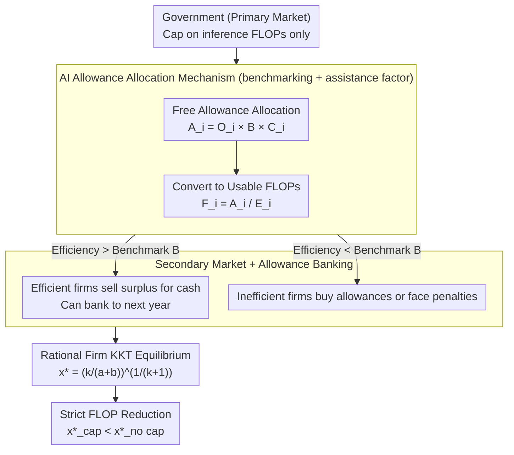

# AI Cap-and-Trade: Efficiency Incentives for Accessibility and Sustainability

**Conference**: ICML 2026  
**arXiv**: [2601.19886](https://arxiv.org/abs/2601.19886)  
**Code**: None (Position + Theoretical Analysis Paper)  
**Area**: AI Governance / Economics / Sustainability  
**Keywords**: Emissions Trading, FLOP Quotas, AI Accessibility, Energy Incentives, KKT Analysis

## TL;DR
Drawing on carbon cap-and-trade, the authors propose a quota-trading market for AI inference FLOPs (AI Allowance). Using KKT conditions, they prove this mechanism strictly reduces FLOP usage by companies under reasonable parameters, simultaneously addressing energy consumption and the exclusion of small companies in the LLM era.

## Background & Motivation

**Background**: Large models follow a hyper-scaling path—larger models, more data, and more GPUs. OpenAI processes ~2.5 billion queries per day, with annual inference consuming approximately 1 ronnaFLOP ($10^{27}$ FLOPs), requiring about 120,000 H100 GPUs. A single ChatGPT/Gemini query consumes 0.24–0.34 Wh; OpenAI uses ~850,000 kWh and emits ~350 tons of $CO_2$ daily, far exceeding the EPA "major polluter" threshold (100 tons/year).

**Limitations of Prior Work**: (1) Academia and small companies are squeezed out by GPU costs, with 70% of AI PhDs moving to industry; (2) Data center energy consumption is expected to double to 1000 TWh by 2030, with water consumption reaching 120 billion liters; (3) Existing AI governance (EU AI Act, CA SB-1047) focuses on compliance and safety, with almost no market-based "efficiency incentives."

**Key Challenge**: The current AI industry naturally leans toward "hyper-scaling > efficiency"—as long as compute is affordable, there are no external costs necessitating energy savings. The negative externalities of energy consumption remain unpriced.

**Goal**: Design a market-based mechanism where efficiency generates intrinsic economic value, turning "completing the same inference with fewer FLOPs" into a tradable asset, while avoiding crude paths like Pigouvian taxes (risk of "AI leakage") or direct bans (harming innovation).

**Key Insight**: Adapt the mature mechanisms of carbon cap-and-trade (EU ETS, California, China, Korea) to AI—changing the core unit from "carbon emissions" to "AI Allowance" (electricity/FLOP quotas for inference). Allocation uses benchmarking rather than grandfathering to avoid an AI version of "carbon leakage."

**Core Idea**: The government issues free AI Allowances based on each company's FLOP output $\times$ industry watts-per-FLOP benchmark $\times$ company-specific assistance factor ($A_i = O_i \cdot B \cdot C_i$). Companies can buy, sell, or bank these allowances. It is theoretically provable that with trading constraints, a rational company's optimal FLOP usage $x^\ast$ is strictly less than its value in a scenario without the mechanism.

## Method

### Overall Architecture
The paper first quantifies "why market-based incentives are needed" (Sec 1–3), then reviews existing market approaches (Sec 4: Pigouvian taxes, user fees, credits/subsidies, deposit-refunds, tradable permits), and finally proposes the AI version of cap-and-trade (Sec 5). It caps only inference FLOPs, uses benchmarking for allocation + secondary market trading, proves strict FLOP reduction via KKT conditions, and validates this through numerical experiments under two buy/sell price settings. The mechanism is a multi-party process: "Government issues quotas $\to$ firms trade/bank based on efficiency $\to$ rational firms re-optimize $\to$ FLOP reduction." The three key designs correspond to three stages of this process.

### Key Designs

**1. AI Allowance Allocation Mechanism (Benchmarking + Assistance Factor): Avoiding fixed historical injustice without uniform cuts.**

Carbon markets have two traditional allocation paths: grandfathering (free allocation based on historical emissions), which locks in past inequalities, and uniform distribution, which would force high-user companies like OpenAI to throttle services, causing "regulatory regression." This paper adopts the carbon ETS benchmarking approach: for each regulated firm $i$, the allowance $A_i = O_i \cdot B \cdot C_i$. $O_i$ is its FLOP output (e.g., a two-year rolling average adjusted by 15%), $B$ is the industry benchmark watts-per-FLOP (referencing the "top 10% best / 90% average" setting in carbon markets), and $C_i$ is a company-specific assistance factor—where $C_i > 1$ for clean energy use and $C_i < 1$ for fossil fuels or violators. Given its efficiency $E_i$ (watts/FLOP), the actual permitted FLOPs are $F_i = A_i / E_i$. This gives large companies reasonable FLOP space while requiring those below efficiency standards to purchase allowances, while small, efficient companies have surplus allowances to sell—neither squeezing out incumbents nor locking out startups.

**2. Secondary Market + Allowance Banking: Giving efficiency tradable cash value.**

The current incentive distortion in the AI industry is that "if compute is affordable, no one forces you to save energy"; energy externalities are unpriced. This design prices efficiency: the government acts as the primary market for free allocation, while companies trade freely in a secondary market (similar to the European Energy Exchange). Over-quota firms must purchase allowances or face heavy fines, and surplus allowances can be "banked" to the next year to smooth fluctuations. The paper positions this new cash flow as "breathing room revenue stream" for startups during their burn rate period. Empirical evidence from carbon markets (e.g., EU ETS) has proven that turning "reduction" into a profit opportunity is the most effective lever for incentivizing efficiency innovation. Translated to AI, "training high-efficiency small models" gains a market price, reversing the "compute-only" distortion.

**3. Rational Company Equilibrium & FLOP Reduction Proof (KKT Conditions): Mathematical backing for legislators.**

Many AI governance proposals remain at the level of political argument; closed-form solutions allow legislators to see the sensitivity of "reduction rates" to parameters. The authors model single-firm utility as $u(x) = -x^{-k} - ax$ ($x$ is FLOPs, $-x^{-k}$ reflects diminishing returns on performance improvement, $a$ is cost-per-FLOP). Without the mechanism, $\nabla u = 0$ yields $x^\ast = (k/a)^{1/(k+1)}$. Introducing trading variable $y$ ($y > 0$ to sell, $y < 0$ to buy), price $b$, and allowance cap $F_i$, the constrained problem becomes:

$$\max u(x,y) = -x^{-k} - ax + by\quad\text{s.t.}\ x+y \le F_i,\ x \ge 0.$$

Lagrangian first-order conditions give $\mu_1 = b$, and combining with complementary slackness solves to $x^\ast = (k/(a+b))^{1/(k+1)}$ and $y^\ast = F_i - x^\ast$. Since $b > 0$, it follows that $x^\ast_{\text{cap}} < x^\ast_{\text{no cap}}$. The trading price $b$ adds the opportunity cost of buying/selling allowances to the cost-per-FLOP, strictly reducing optimal FLOP usage. With a closed-form solution, legislators can determine under what price $b$ reduction goals become effective and identify parameters (low $b$, high $a$) where the mechanism would be futile.

### Loss & Training
N/A. The paper focus is position + economic modeling. "Training" only occurs in numerical experiments—scanning $x^\ast_{\text{no cap}}$ vs $x^\ast_{\text{cap}}$ for different $a$ (cost-per-FLOP) and plotting curves (Fig 1) under two price settings: $b=10^{-2}$ (fixed) and $b = \sqrt{a}$ (scaled by cost).

## Key Experimental Results

### Main Results
The authors plotted equilibrium FLOP usage $x^\ast$ for companies under different cost-per-FLOP $a$ (Fig 1):

| Scenario | Key Parameters | $x^\ast_{\text{no cap}}$ vs $x^\ast_{\text{cap}}$ | Conclusion |
|------|----------|---------------------------------------------------|------|
| Fixed trading price $b=10^{-2}$ | Scan $a \in [10^{-4}, 10^{-1}]$ | $x^\ast_{\text{cap}} < x^\ast_{\text{no cap}}$ holds | FLOP reduction for any $a > 0$ |
| Scaled by cost $b=\sqrt{a}$ | Same as above | $x^\ast_{\text{cap}} < x^\ast_{\text{no cap}}$, larger reduction | Scaling $b$ with $a$ increases efficiency pressure |

### Ablation Study

| Configuration | Key Findings | Interpretation |
|------|----------|------|
| No cap (baseline) | $x^\ast = (k/a)^{1/(k+1)}$ | Firms only balance performance vs direct costs |
| With cap, $b \to 0$ | $x^\ast \to x^\ast_{\text{no cap}}$ | Mechanism failure when allowance is worthless |
| With cap, large $b$ | Significant reduction in $x^\ast$ | Higher prices drive more reduction, but caution against industry damage is needed |
| Benchmarking vs grandfathering | Benchmarking incentivizes efficiency more | Consistent with real-world carbon market observations (Yang 2020, Wang 2022) |
| Cap training vs cap inference | Inference cap is more realistic | Training caps stifle frontier research; inference caps reduce emissions while shifting cost pressure to the largest revenue source |

### Key Findings
- The closed-form solution clearly indicates that $b$ (trading price) is the most sensitive parameter: too low, and the mechanism is "futile"; too high, and it suppresses the industry.
- Choosing to "cap only inference FLOPs" is a critical policy trade-off—it targets the bulk of emissions (Schmidt 2021, De Vries 2023, Jegham 2025) while protecting innovation on the training side.
- DeepSeek serves as a natural empirical example: US chip export restrictions formed a de facto cap on China, forcing efficiency innovations like MoE + MLA. This paper formalizes the causal path of "market constraints $\to$ efficiency innovation."
- Learning from carbon leakage, free + benchmarking allocation is the key design to minimize "AI leakage" (firms moving to unregulated jurisdictions).

## Highlights & Insights
- "Translating" the mature carbon cap-and-trade mechanism to AI is a precise move—it retains the core mechanisms of benchmarking + secondary market + banking and adds an assistance factor for clean energy in the AI context, ensuring high feasibility.
- Publishing a governance + economics paper at a top ML conference is rare; providing a closed-form solution via KKT gives legislators direct "mathematical evidence," turning policy rhetoric into a quantifiable model.
- Naming and analogizing the "AI leakage" concept allows economists and policy researchers to immediately apply the existing carbon leakage toolbox—this "interface design" for conceptual migration is highly valuable for interdisciplinary progress.
- Monetizing efficiency—turning the "efficiency surplus" of small companies into sellable cash—reverses the current "compute gap $\to$ irreversible industrial concentration" pattern, offering insights for cloud computing and model hosting.

## Limitations & Future Work
- The model simplifies the performance-FLOP relationship as $-x^{-k}$, lacking the multi-breakpoint structure of real LLM scaling laws; $k$ also varies by task, which might make conclusions less robust in certain regimes.
- It does not model "strategic gaming between firms" (e.g., incumbents suppressing entrants by hoarding allowances); it only analyzes single-firm KKT.
- The price $b$ is determined endogenously by the secondary market, but the paper treats it as an exogenous constant without modeling supply-demand equilibrium; real emission markets often experience severe price volatility.
- Regulatory costs (FLOP counting, third-party audits, cross-border allowance recognition) are barely discussed; the engineering threshold for implementation might be higher than that of carbon markets.
- How to uniformly measure allowances for emerging modalities (e.g., video generation with FLOPs many times higher than text) remains unaddressed.

## Related Work & Insights
- **vs Pigouvian Tax / Token Tax (Hebous & Vernon-Lin, Korinek & Lockwood)**: They tax electricity/tokens directly; Ours uses cap-and-trade because it has proven more effective at reducing emissions at lower costs in carbon markets and prevents geographical leakage.
- **vs User-side Fees (e.g., UN UNEP 2025)**: User-side fees only incentivize users to use less; they do not drive server-side efficiency optimization. Cap-and-trade pushes both ends.
- **vs Insurance / Certification (Lior 2021, Ball 2025)**: Those focus on misuse liability; Ours focuses on efficiency and sustainability.
- **vs AGI Safety Market (Tomašev 2025)**: They discuss agent-to-agent markets to mitigate AGI risk; Ours is a firm-level quota market, making them complementary.

## Rating
- Novelty: ⭐⭐⭐⭐ Porting cap-and-trade to AI with KKT proof is a rare angle in the ML community, though the mechanism itself is a mature adaptation.
- Experimental Thoroughness: ⭐⭐⭐ Only toy-level numerical experiments (the two curves in Fig 1); no calibration with real company energy data; lacks governance and game-theoretic simulations.
- Writing Quality: ⭐⭐⭐⭐ Clear structure, solid citations, and refined conceptual analogies (AI leakage, AI Allowance).
- Value: ⭐⭐⭐⭐ In an era of urgent AI governance, it provides a concrete proposal for legislators—the actual impact of such interdisciplinary manifesto papers often exceeds their technical novelty.

<!-- RELATED:START -->

## Related Papers

- [\[AAAI 2026\] Forest vs Tree: The (N, K) Trade-off in Reproducible ML Evaluation](../../AAAI2026/others/forest_vs_tree_the_n_k_trade-off_in_reproducible_ml_evaluation.md)
- [\[ICCV 2025\] On the Complexity-Faithfulness Trade-off of Gradient-Based Explanations](../../ICCV2025/others/on_the_complexity-faithfulness_trade-off_of_gradient-based_explanations.md)
- [\[ICML 2026\] Mapping Human Anti-collusion Mechanisms to Multi-agent AI Systems](mapping_human_anti-collusion_mechanisms_to_multi-agent_ai_systems.md)
- [\[ICML 2026\] Comprehensive AI Governance Requires Addressing Non-Model Gains](comprehensive_ai_governance_requires_addressing_non-model_gains.md)
- [\[ICML 2026\] Beyond Model Readiness: Institutional Readiness for AI Deployment in Public Systems](beyond_model_readiness_institutional_readiness_for_ai_deployment_in_public_syste.md)

<!-- RELATED:END -->
