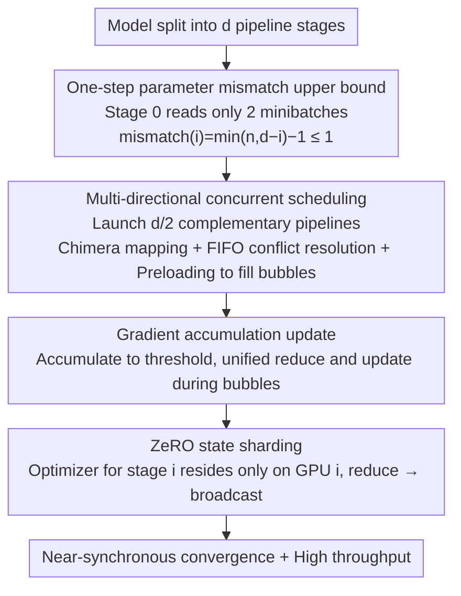

# AMDP: Asynchronous Multi-Directional Pipeline Parallelism for Large-Scale Models Training

**Conference**: ICML 2026  
**arXiv**: [2605.29664](https://arxiv.org/abs/2605.29664)  
**Code**: https://github.com/Vinsmoke86/AMDP  
**Area**: LLM Efficiency / Distributed Training  
**Keywords**: pipeline parallelism, asynchronous training, parameter mismatch, gradient accumulation, ZeRO  

## TL;DR
AMDP utilizes multi-directional asynchronous pipelines, a one-step parameter mismatch upper bound, gradient accumulation, and ZeRO state sharding to improve the throughput of large-scale model pipeline parallel training while maintaining near-synchronous convergence. In 8-GPU GPT/BERT experiments, it achieves a maximum improvement of approximately 17% relative to the strongest asynchronous baselines.

## Background & Motivation
**Background**: Large model training typically requires pipeline parallelism to partition network layers across multiple GPUs. Synchronous pipelines such as GPipe, DAPPLE, and Inter-1F1B provide stable convergence but suffer from pipeline bubbles due to forward-backward dependencies. Asynchronous pipelines like PipeDream improve utilization but introduce parameter version inconsistencies between forward and backward passes, which can harm convergence.

**Limitations of Prior Work**: Traditional asynchronous 1F1B continuously feeds minibatches into the pipeline to eliminate bubbles. As pipeline depth increases, early stages may undergo multiple parameter updates between the forward and backward passes of a specific minibatch, leading to stale gradients or parameter mismatch. Parameter caching ensures consistency but introduces secondary gradients and memory overhead, while parameter prediction relies on approximating future weights, making error control difficult.

**Key Challenge**: Training systems seek both the high throughput of asynchronous pipelines and the convergence stability of synchronous training. The real issue is not whether "asynchrony is usable," but how to structurally limit parameter mismatch between forward and backward passes while filling the bubbles caused by limiting the feeding rate.

**Goal**: AMDP aims to restrict the parameter mismatch of each stage to within a single step and use multiple complementary directional pipelines to fill idle time, while controlling communication and memory costs via gradient accumulation and ZeRO.

**Key Insight**: The authors first analyze the structural source of parameter mismatch: the more minibatches stage 0 reads before its first backward pass, the larger the maximum mismatch. If stage 0 is forced to read a maximum of two minibatches, the mismatch for all stages will not exceed one step.

**Core Idea**: By using "limited intake to control mismatch and multi-directional concurrency to recover utilization," the convergence risk of asynchronous training is compressed from growing with depth to a constant level.

## Method
AMDP can be viewed as a rescheduling of asynchronous pipelines. Rather than pursuing full load for a single pipeline, it ensures each pipeline maintains controlled mismatch and then uses multiple pipelines with different directions to fill idle slots. This maintains high system-level utilization while the optimization level perceives a near-synchronous one-step delay.

### Overall Architecture
The model is partitioned into $d$ pipeline stages. In standard asynchronous 1F1B, stage 0 reads nearly $d$ minibatches before the first backward pass to eliminate bubbles, resulting in a parameter mismatch of approximately $d-1$ at stage 0. AMDP fixes stage 0 to read only two minibatches; thus, the mismatch for any stage $i$ is $\min(n,d-i)-1$, which is bounded by 1 when $n=2$.

Limiting intake introduces idle time, so AMDP simultaneously launches multiple pipelines. For depth $d$, the active ratio of a single controlled pipeline is approximately $2/d$; therefore, launching $d/2$ pipelines with complementary directions can fill the hardware. Different pipelines are mapped to GPUs in a Chimera-style fashion, but AMDP executes asynchronously and uses FIFO rules to resolve operational conflicts between multiple pipelines on the same GPU.

To reduce the communication frequency of all-reduce after each backward pass, AMDP does not update parameters immediately. Instead, it accumulates gradients from multiple minibatches until a threshold is reached before performing a unified reduce and update. Finally, AMDP utilizes the ZeRO concept so that the optimizer state for each stage is held by only one GPU. Other replicas send gradients and receive updated parameters, thereby avoiding the duplication of optimizer states brought by multiple pipelines. The entire method consists of four interconnected components, illustrated by the data flow below.

### Key Designs

**1. One-step parameter mismatch upper bound: Nailing asynchronous perturbation to a constant level at the source**

The convergence risk of asynchronous pipelines stems entirely from how many times parameters are updated between forward and backward passes (parameter mismatch). The authors first define this quantity with a structural formula: the mismatch of stage $i$ equals the "number of minibatches read before the first backward pass minus one," limited by two constraints—to ensure the backward pass does not bubble, stage $i$ reads at most $d-i$; meanwhile, the intake of any stage cannot exceed the intake $n$ of stage 0, thus $\mathrm{mismatch}(i)=\min(n,d-i)-1$. Previous methods set $n=d$ to eliminate bubbles, causing mismatch to grow linearly with depth to $d-i-1$, which worsens stale gradients in deep models. AMDP sets $n=2$ directly, ensuring the mismatch of all stages does not exceed 1, regardless of pipeline depth, multi-node deployment, or multi-directional placement. Theoretically, this constrains the upper bound of AMDP's average gradient norm to only an $O(\eta^2)$ second-order perturbation compared to synchronous SGD.

**2. Multi-directional concurrent pipeline scheduling: Filling bubbles left by limited intake with complementary directions**

Setting $n=2$ controls mismatch but leaves a single pipeline largely idle—the active ratio of a single controlled pipeline on a GPU is only $r=2/d$. AMDP does not strive for full load on a single pipeline; instead, it concurrently starts $d/2$ pipelines with complementary directions, allowing their idle periods to overlap and fill the hardware. The pipeline directions follow Chimera mapping: even pipeline stage $i$ is mapped to GPU $(2j+i)\bmod d$, while odd pipelines are mapped in reverse, ensuring different pipelines occupy GPUs at staggered times. Unlike synchronous Chimera, AMDP is asynchronous and forward/backward durations are asymmetric. Multiple pipelines compete for resources on the same GPU, which AMDP resolves with FIFO rules: the first operation to arrive is executed first. Extra forwards are preloaded at the boundaries of every $d$ minibatches based on the backward/forward duration ratio to eliminate leading/trailing bubbles at the start and end.

**3. Gradient accumulation update: Reducing communication frequency and limiting the mismatch window**

Updating immediately after each backward pass has two side effects: all-reduce must occur after every backward pass, leading to high communication overhead; and bubble filling can disrupt 1F1B, introducing multi-step mismatches (e.g., between the forward and backward of minibatch 6 on GPU 0, two updates from minibatches 2 and 4 are interleaved). AMDP changes this by accumulating gradients from multiple minibatches and performing a unified reduce and update during the next bubble. This reduces all-reduce frequency and ensures that within each accumulation window, only the first $d$ minibatches experience a one-step mismatch, while the rest use consistent parameters. In practice, the threshold is much larger than $d$, making the mismatch impact negligible—this is the fundamental difference between AMDP and PipeDream-like methods: the latter's mismatch grows with the number of stages, whereas AMDP locks it to the first $d$ minibatches per window.

**4. ZeRO state sharding: A necessary condition for scalable multi-pipeline replicas**

Multi-directional scheduling requires each GPU to store parameters, gradients, and optimizer states for multiple stages. A naive implementation would see throughput gains consumed by optimizer state duplication. AMDP introduces ZeRO: the optimizer for stage $i$ resides only on GPU $i$, which is exclusively responsible for updating the parameters of stage $i$. Other GPUs holding replicas of stage $i$ send their gradients to GPU $i$ for reduction, and updated parameters are broadcast back. This reduces the optimizer state memory on each GPU to $2/d$ of the naive scheme. The total communication volume for reduce + broadcast is identical to all-reduce, adding no overhead, and synchronization occurs only once per update, independent of the number of pipelines. Ablations show that removing ZeRO reduces throughput by about 4%; it is not an optional optimization but a prerequisite for multi-pipeline scalability.

### Loss & Training
AMDP does not change the model's training objective, only the pipeline execution and update semantics. The theoretical section proves that under the assumptions of $L$-smooth non-convex objectives and unbiased stochastic gradients with bounded variance, the upper bound of the average gradient norm introduced by the one-step mismatch is only an $O(\eta^2)$ perturbation compared to synchronous SGD. Experiments use AdamW, mixed precision, and a microbatch size of 4, comparing throughput, memory, and convergence on GPT-style and BERT-style models.

## Key Experimental Results

### Main Results
Experiments were conducted on 8 NVIDIA A800 80GB GPUs interconnected via NVLink 3.0. Models included a GPT-style model with ~1.56B parameters and a BERT-style model with ~1.04B parameters. The table below excerpts 8-GPU throughput results in ktokens/s.

| Model | $d$ | $b$ | PipeDream-2BW | XPipe | Inter-1F1B | AMDP | Gain vs Prev. SOTA |
|------|-----|-----|---------------|-------|------------|------|--------------|
| GPT-style | 4 | 16 | 38.6 | 38.5 | 35.4 | 39.1 | +1.3% |
| GPT-style | 4 | 64 | 41.0 | 40.7 | 39.8 | 42.1 | +2.7% |
| GPT-style | 8 | 32 | 70.3 | 66.0 | 57.0 | 75.5 | +7.4% |
| GPT-style | 8 | 128 | 71.6 | 69.7 | 67.5 | 83.7 | +16.9% |
| BERT-style | 8 | 32 | 74.3 | 73.6 | 37.5 | 78.5 | +5.7% |
| BERT-style | 8 | 128 | 75.8 | 75.6 | 58.8 | 86.1 | +13.6% |

### Ablation Study
The authors further examined the effects of the gradient accumulation threshold and ZeRO, and reported training quality metrics.

| Configuration | Metric | Description |
|------|---------|------|
| GPT, AMDP, $d=8,b=128$ | 40k iter train loss 2.90 | Close to Inter-1F1B's 2.88 |
| BERT, AMDP, $d=8,b=128$ | 40k iter train loss 2.36 | Comparable to DAPPLE |
| GPT, reaching loss 2.9 | 23% faster than Inter-1F1B | High throughput without significant convergence loss |
| BERT, reaching loss 2.4 | 22% faster than DAPPLE | Significant wall-clock convergence advantage |
| Acc threshold 1/2/4/8, GPT | 75.5 / 78.9 / 83.7 / 83.3 | Medium threshold is optimal |
| Acc threshold 1/2/4/8, BERT | 78.5 / 81.0 / 86.1 / 84.6 | Diminishing returns with further increases |
| w/o ZeRO, GPT/BERT | 80.3 / 82.7 | Throughput ~4% lower |
| with ZeRO, GPT/BERT | 83.7 / 86.1 | Reduced redundant optimizer states and boosted throughput |

### Key Findings
- The throughput advantage of AMDP becomes more pronounced as pipeline depth and update batch size increase, as deep pipelines and large accumulation windows more easily expose stage imbalances and bubbles in baselines.
- Convergence curves are close to synchronous methods, indicating that a one-step mismatch upper bound is more reliable than "fully asynchronous with posterior compensation."
- Peak memory for AMDP is slightly higher than XPipe and PipeDream-2BW but lower than the high activation peaks of Inter-1F1B, and the memory distribution is more balanced.
- In 16-GPU two-node experiments, AMDP maintains the highest throughput in both pure pipeline and hybrid pipeline+data parallel configurations (e.g., reaching 159.8 ktokens/s at $d=8,b=128$).

## Highlights & Insights
- The strongest aspect of the paper is the formulation of a structural mismatch equation, followed by designing the system around it. It is not an empirical schedule but addresses the root cause: "how many minibatches were read before the first backward."
- Multi-directional scheduling transfers the intuition of Chimera to asynchronous training, but the goal shifts from "filling bubbles synchronously" to "filling bubbles under controlled mismatch," which is better suited for asynchronous stability.
- ZeRO is not just an additional optimization here; it is a necessary condition for multi-pipeline replicas to scale. Otherwise, the throughput gained from multi-directionality would be consumed by optimizer state duplication.

## Limitations & Future Work
- The effectiveness of AMDP depends on pipeline stage partitioning and the forward-to-backward duration ratio; more validation is needed under extreme imbalance, strong communication bottlenecks, or non-Transformer architectures.
- The theoretical analysis is based on smooth objectives and SGD-like assumptions. While the appendix extends this to Adam-class optimizers, it remains an approximate explanation.
- Multi-directional scheduling is more complex to implement than standard 1F1B; integration with existing training frameworks, debugging, and fault tolerance costs need consideration.
- Future work could combine mismatch-aware learning rates, automatic stage partitioning, and dynamic pipeline quantity selection to make the scheduler more adaptive.

## Related Work & Insights
- **vs DAPPLE / Inter-1F1B**: Synchronous methods offer stable convergence but significant bubbles; AMDP uses controlled asynchrony and multi-directional scheduling for higher throughput.
- **vs PipeDream / PipeDream-2BW**: PipeDream series eliminate bubbles but require handling delayed gradients or parameter versions; AMDP directly limits mismatch to one step, reducing convergence risk at the source.
- **vs XPipe / vNAG**: Parameter prediction methods attempt to estimate future weights; AMDP does not predict parameters but reduces the degree of inconsistency through its structural schedule.
- **vs Chimera**: Chimera is a synchronous bidirectional pipeline; AMDP borrows the multi-directional idea for asynchronous scenarios and incorporates gradient accumulation and ZeRO.

## Rating
- Novelty: ⭐⭐⭐⭐☆ The combination of multi-directional asynchrony and a one-step mismatch bound is of high system design value, building upon mature pipeline parallelism concepts.
- Experimental Thoroughness: ⭐⭐⭐⭐☆ Covers multiple models, depths, batches, memory, convergence, and 16-GPU scaling, though verification at true ultra-large model scales is still possible.
- Writing Quality: ⭐⭐⭐⭐☆ Problem decomposition is clear, and theory, scheduling diagrams, and system experiments successfully support each other.
- Value: ⭐⭐⭐⭐☆ Very practical for large model training systems, especially in scenarios pursuing throughput where asynchronous convergence failure is unacceptable.

<!-- RELATED:START -->

## Related Papers

- [\[ICML 2026\] Torus Graphs for Large-Scale Neural Phase Analysis](torus_graphs_for_large_scale_neural_phase_analysis.md)
- [\[CVPR 2026\] MSPT: Efficient Large-Scale Physical Modeling via Parallelized Multi-Scale Attention](../../CVPR2026/others/mspt_efficient_large-scale_physical_modeling_via_parallelized_multi-scale_attent.md)
- [\[ICML 2026\] HASTE: Hardware-Aware Dynamic Sparse Training for Large Output Spaces](haste_hardware-aware_dynamic_sparse_training_for_large_output_spaces.md)
- [\[CVPR 2026\] Bi-directional Autoregressive Diffusion for Large Complex Motion Interpolation](../../CVPR2026/others/bi-directional_autoregressive_diffusion_for_large_complex_motion_interpolation.md)
- [\[CVPR 2026\] Large-scale Robust Enhanced Ensemble Clustering via Outlier Decoupling](../../CVPR2026/others/large-scale_robust_enhanced_ensemble_clustering_via_outlier_decoupling.md)

<!-- RELATED:END -->
