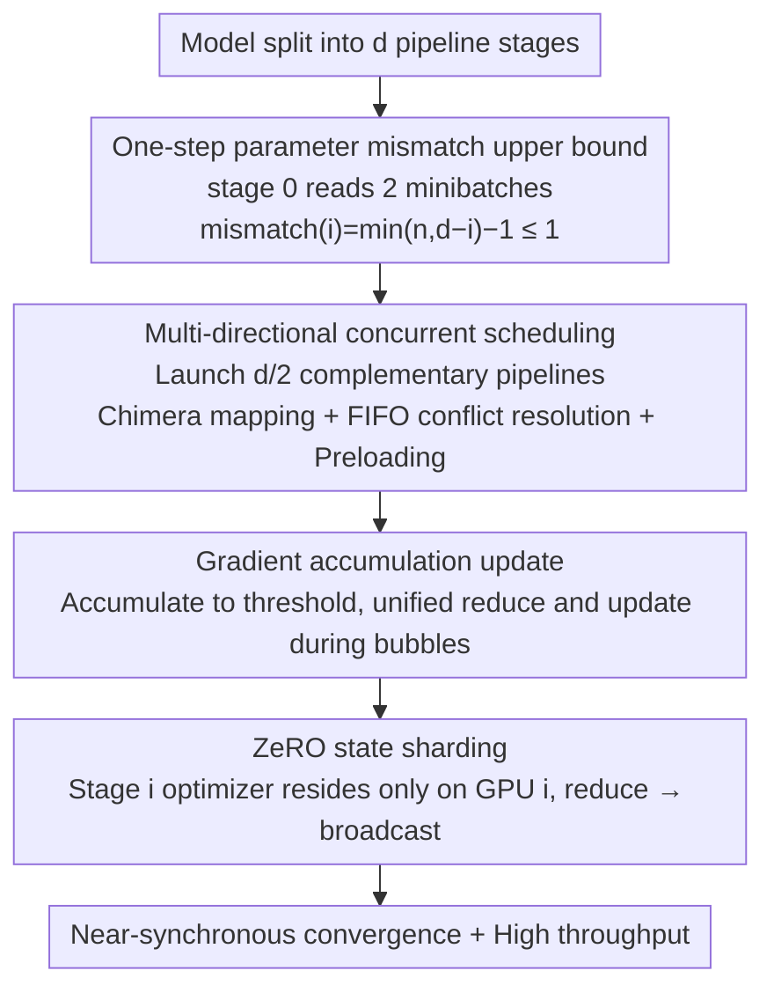

# AMDP: Asynchronous Multi-Directional Pipeline Parallelism for Large-Scale Models Training

**Conference**: ICML 2026  
**arXiv**: [2605.29664](https://arxiv.org/abs/2605.29664)  
**Code**: https://github.com/Vinsmoke86/AMDP  
**Area**: LLM Efficiency / Distributed Training  
**Keywords**: pipeline parallelism, asynchronous training, parameter mismatch, gradient accumulation, ZeRO  

## TL;DR
AMDP employs multi-directional asynchronous pipelines, a one-step parameter mismatch upper bound, gradient accumulation, and ZeRO state sharding to enhance large-scale model pipeline parallel training throughput while maintaining near-synchronous convergence. In 8-GPU GPT/BERT experiments, it achieves a maximum improvement of approximately 17% over the strongest asynchronous baselines.

## Background & Motivation
**Background**: Large-scale model training typically requires pipeline parallelism to partition network layers across multiple GPUs. Synchronous pipelines such as GPipe, DAPPLE, and Inter-1F1B offer stable convergence but suffer from pipeline bubbles due to forward-backward dependencies. Asynchronous pipelines like PipeDream improve utilization, but inconsistent parameter versions between forward and backward passes can impair convergence.

**Limitations of Prior Work**: Traditional asynchronous 1F1B continuously feeds minibatches into the pipeline to eliminate bubbles. As pipeline depth increases, early stages may experience multiple parameter updates between the forward and backward passes of a specific minibatch, leading to stale gradients or parameter mismatch. While parameter caching ensures consistency, it introduces delayed gradients and memory overhead, whereas parameter prediction relies on approximations with uncontrollable errors.

**Key Challenge**: Training systems seek the high throughput of asynchronous pipelines alongside the convergence stability of synchronous training. The fundamental issue is not whether asynchrony is viable, but how to structurally limit the parameter mismatch between forward and backward passes while filling the bubbles caused by limiting the feed rate.

**Goal**: AMDP aims to restrict the parameter mismatch of each stage to within a single step and utilize multiple complementary directional pipelines to fill idle time, while controlling communication and memory costs through gradient accumulation and ZeRO.

**Key Insight**: The authors analyze the structural source of parameter mismatch: the more minibatches stage 0 reads before its first backward pass, the larger the maximum mismatch becomes. By forcing stage 0 to read a maximum of two minibatches, the mismatch across all stages can be limited to no more than one step.

**Core Idea**: By utilizing a "low-input to control mismatch, multi-directional concurrency to fill utilization" approach, the convergence risk of asynchronous training is compressed from a depth-dependent growth to a constant level.

## Method
AMDP can be viewed as a rescheduling of asynchronous pipelines. Rather than pursuing full load for a single pipeline, it maintains controlled mismatch for every pipeline and overlaps multiple pipelines with different directions to fill idle slots. This maintains high system-level utilization while the optimization perspective observes near-synchronous one-step delay.

### Overall Architecture
The model is partitioned into $d$ pipeline stages. In standard asynchronous 1F1B, stage 0 reads nearly $d$ minibatches before the first backward pass to eliminate bubbles, resulting in a parameter mismatch of approximately $d-1$ for stage 0. AMDP fixes stage 0 to read only two minibatches, ensuring the mismatch for any stage $i$ is $\min(n,d-i)-1$, which has an upper bound of 1 when $n=2$.

Restricting the number of active minibatches introduces idle time; thus, AMDP simultaneously launches multiple pipelines. For a depth $d$, the active ratio of a single controlled pipeline is approximately $2/d$, so $d/2$ pipelines with complementary directions are launched to fill the device. Different pipelines are mapped to GPUs in a Chimera-style fashion, but AMDP executes asynchronously and uses FIFO rules to resolve operational conflicts between multiple pipelines on the same GPU.

To reduce the communication frequency of all-reduce after each backward pass, AMDP does not update parameters immediately. Instead, it accumulates gradients from multiple minibatches until a threshold is reached, after which a unified reduce and update are performed. Finally, AMDP utilizes ZeRO concepts so that the optimizer state for each stage is held by only one GPU. Other replicas send gradients and receive updated parameters, avoiding the duplication of optimizer states across multiple pipelines. The entire method consists of four interconnected components, illustrated by the data flow below.

### Key Designs

**1. One-step parameter mismatch upper bound: Pinning asynchronous perturbations to a constant level**

The convergence risk of asynchronous pipelines stems entirely from the number of times parameters are updated between forward and backward passes (parameter mismatch). The authors formulate this structurally: the mismatch of stage $i$ equals the "number of minibatches read before the first backward pass minus one," subject to two constraints—to maintain a bubble-free backward pass, stage $i$ reads at most $d-i$; simultaneously, the input count of any stage cannot exceed the input count of stage 0 ($n$), thus $\mathrm{mismatch}(i)=\min(n,d-i)-1$. Previous methods set $n=d$ to eliminate bubbles, causing mismatch to grow linearly with depth to $d-i-1$, which worsens stale gradients in deep models. AMDP sets $n=2$, ensuring mismatch does not exceed 1 for all stages, regardless of pipeline depth, multi-node deployment, or multi-directional placement. Theoretically, this restricts the upper bound of AMDP's average gradient norm to a second-order perturbation of only $O(\eta^2)$ relative to synchronous SGD.

**2. Multi-directional concurrent pipeline scheduling: Filling bubbles with complementary directions**

Setting $n=2$ controls mismatch but leaves a single pipeline largely idle—the active ratio for a single controlled pipeline on a GPU is only $r=2/d$. AMDP launches $d/2$ complementary pipelines simultaneously, allowing their idle periods to overlap and fill the device. Pipeline directions follow Chimera mapping: even-indexed pipeline stage $i$ maps to GPU $(2j+i)\bmod d$, while odd-indexed pipelines map in reverse. Unlike synchronous Chimera, AMDP is asynchronous with asymmetric forward/backward execution times. Multiple pipelines compete for resources on the same GPU, which AMDP resolves using FIFO rules. At the boundary of every $d$ minibatches, extra forwards are preloaded based on the backward/forward time ratio to eliminate leading/trailing bubbles.

**3. Gradient accumulation update: Reducing communication frequency and limiting mismatch windows**

Updating immediately after each backward pass has two side effects: it requires an all-reduce after every backward pass (high communication overhead) and bubble filling may disrupt 1F1B, introducing multi-step mismatch (e.g., updates from minibatch 2 and 4 occurring between the forward and backward passes of minibatch 6 on GPU 0). AMDP instead accumulates gradients from multiple minibatches and performs a unified reduce and update during the next bubble. This reduces all-reduce frequency and ensures that within each accumulation window, only the first $d$ minibatches experience a one-step mismatch, while the rest use consistent parameters. In practice, the threshold is much larger than $d$, making the mismatch impact negligible—a fundamental difference between AMDP and PipeDream-like methods where mismatch scales with stage count.

**4. ZeRO state sharding: A necessary condition for scalable multi-pipeline replicas**

Multi-directional scheduling requires each GPU to store parameters, gradients, and optimizer states for multiple stages. A naive implementation would suffer throughput loss due to optimizer state duplication. AMDP introduces ZeRO: the optimizer for stage $i$ resides only on GPU $i$, which is exclusively responsible for updating stage $i$ parameters. Other GPUs holding replicas of stage $i$ send gradients to GPU $i$ for reduction and receive the updated parameters via broadcast. This reduces the optimizer state memory on each GPU to $2/d$ of the naive scheme. The total communication volume for reduce + broadcast is identical to all-reduce, ensuring no added overhead, and synchronization occurs only once per update regardless of the number of pipelines. Ablations show that removing ZeRO reduces throughput by about 4%, demonstrating it is a prerequisite for scalability.

### Loss & Training
AMDP does not change the model training objective, only the pipeline execution and update semantics. Under the assumptions of an $L$-smooth non-convex objective and unbiased random gradients with bounded variance, the theoretical section proves that the upper bound of the average gradient norm with one-step mismatch adds only an $O(\eta^2)$ perturbation compared to synchronous SGD. Experiments use AdamW, mixed precision, and a microbatch size of 4, comparing throughput, memory, and convergence on GPT-style and BERT-style models.

## Key Experimental Results

### Main Results
Experiments were conducted on 8 NVIDIA A800 80GB GPUs with NVLink 3.0. Models included an approximately 1.56B parameter GPT-style model and an approximately 1.04B parameter BERT-style model. The table below excerpts the 8-GPU throughput results (ktokens/s).

| Model | $d$ | $b$ | PipeDream-2BW | XPipe | Inter-1F1B | AMDP | Gain vs. Best Baseline |
|------|-----|-----|---------------|-------|------------|------|--------------|
| GPT-style | 4 | 16 | 38.6 | 38.5 | 35.4 | 39.1 | +1.3% |
| GPT-style | 4 | 64 | 41.0 | 40.7 | 39.8 | 42.1 | +2.7% |
| GPT-style | 8 | 32 | 70.3 | 66.0 | 57.0 | 75.5 | +7.4% |
| GPT-style | 8 | 128 | 71.6 | 69.7 | 67.5 | 83.7 | +16.9% |
| BERT-style | 8 | 32 | 74.3 | 73.6 | 37.5 | 78.5 | +5.7% |
| BERT-style | 8 | 128 | 75.8 | 75.6 | 58.8 | 86.1 | +13.6% |

### Ablation Study
The authors further investigated the effects of gradient accumulation thresholds and ZeRO, reporting training quality metrics.

| Configuration | Key Metric | Description |
|------|---------|------|
| GPT, AMDP, $d=8,b=128$ | 40k iter train loss 2.90 | Close to Inter-1F1B (2.88) |
| BERT, AMDP, $d=8,b=128$ | 40k iter train loss 2.36 | Comparable to DAPPLE |
| GPT, reaching loss 2.9 | 23% faster than Inter-1F1B | High throughput without significant convergence loss |
| BERT, reaching loss 2.4 | 22% faster than DAPPLE | Significant wall-clock convergence advantage |
| Grad Accum Threshold 1/2/4/8, GPT | 75.5 / 78.9 / 83.7 / 83.3 | Optimal at medium threshold |
| Grad Accum Threshold 1/2/4/8, BERT | 78.5 / 81.0 / 86.1 / 84.6 | Diminishing returns with larger threshold |
| w/o ZeRO, GPT/BERT | 80.3 / 82.7 | Throughput approx. 4% lower |
| with ZeRO, GPT/BERT | 83.7 / 86.1 | Reduced redundant optimizer states improves throughput |

### Key Findings
- AMDP's throughput advantage becomes more pronounced as pipeline depth and update batch size increase, as deep pipelines and large accumulation windows more easily expose stage imbalance and bubbles in baselines.
- Convergence curves are close to synchronous methods, indicating that a one-step mismatch upper bound is more reliable than "full asynchrony with post-hoc compensation."
- Peak memory usage for AMDP is slightly higher than XPipe and PipeDream-2BW but lower than the high activation peaks of Inter-1F1B, with a more balanced memory distribution.
- In 16-GPU two-node experiments, AMDP maintains the highest throughput across pure pipeline and hybrid pipeline+data parallel configurations (e.g., reaching 159.8 ktokens/s at $d=8,b=128$).

## Highlights & Insights
- The primary strength of this work is formulating the mismatch quantity into a structural formula first, then designing the system around it. This is not empirical scheduling but addresses the root cause: "how many minibatches are read before the first backward."
- Multi-directional scheduling migrates the intuition of Chimera to asynchronous training, but the goal shifts from "synchronous bubble filling" to "filling bubbles under controlled mismatch," making the design objective more aligned with asynchronous stability.
- ZeRO is not an optional optimization here; it is a prerequisite for making multi-pipeline replicas scalable. Otherwise, the throughput gains from multi-directional scheduling would be negated by optimizer state duplication.

## Limitations & Future Work
- The effectiveness of AMDP depends on pipeline stage partitioning and the ratio of forward/backward pass durations; it requires further validation under extreme imbalance, strong communication bottlenecks, or non-Transformer architectures.
- The theoretical analysis is based on smooth objectives and SGD-like assumptions. While the appendix extends this to Adam-like optimizers, it remains an approximate explanation.
- The complexity of implementing multi-directional scheduling is higher than standard 1F1B, entailing costs for integration with existing frameworks, debugging, and fault tolerance.
- Future work could combine mismatch-aware learning rates, automatic stage partitioning, and dynamic pipeline quantity selection to make scheduling more adaptive.

## Related Work & Insights
- **vs DAPPLE / Inter-1F1B**: Synchronous methods provide stable convergence but suffer from significant bubbles; AMDP uses controlled asynchrony and multi-directional scheduling for higher throughput.
- **vs PipeDream / PipeDream-2BW**: PipeDream series eliminate bubbles but must handle delayed gradients or parameter versions; AMDP limits mismatch to one step to reduce convergence risk at the source.
- **vs XPipe / vNAG**: Parameter prediction methods attempt to estimate future weights; AMDP does not predict parameters but instead reduces the degree of inconsistency through structural scheduling.
- **vs Chimera**: Chimera is a synchronous bidirectional pipeline. AMDP borrows the multi-directional idea for asynchronous scenarios and adds gradient accumulation with ZeRO.

## Rating
- Novelty: ⭐⭐⭐⭐☆ The combination of multi-directional asynchrony and a one-step mismatch upper bound is highly valuable for system design, building upon mature pipeline parallelism concepts.
- Experimental Thoroughness: ⭐⭐⭐⭐☆ Covers multiple models, depths, and batch sizes, including memory, convergence, and 16-GPU scaling, though validation on truly massive scales remains.
- Writing Quality: ⭐⭐⭐⭐☆ Problem decomposition is clear, with theory, scheduling diagrams, and system experiments supporting each other well.
- Value: ⭐⭐⭐⭐☆ Highly practical for large model training systems, especially in scenarios requiring high throughput without risking asynchronous convergence failure.

<!-- RELATED:START -->

## Related Papers

- [\[ICML 2026\] Torus Graphs for Large-Scale Neural Phase Analysis](torus_graphs_for_large_scale_neural_phase_analysis.md)
- [\[CVPR 2026\] MSPT: Efficient Large-Scale Physical Modeling via Parallelized Multi-Scale Attention](../../CVPR2026/others/mspt_efficient_large-scale_physical_modeling_via_parallelized_multi-scale_attent.md)
- [\[ICML 2026\] HASTE: Hardware-Aware Dynamic Sparse Training for Large Output Spaces](haste_hardware-aware_dynamic_sparse_training_for_large_output_spaces.md)
- [\[CVPR 2026\] Accelerating Diffusion via Hybrid Data-Pipeline Parallelism Based on Conditional Guidance Scheduling](../../CVPR2026/others/accelerating_diffusion_via_hybrid_data-pipeline_parallelism_based_on_conditional.md)
- [\[CVPR 2026\] Large-scale Robust Enhanced Ensemble Clustering via Outlier Decoupling](../../CVPR2026/others/large-scale_robust_enhanced_ensemble_clustering_via_outlier_decoupling.md)

<!-- RELATED:END -->
