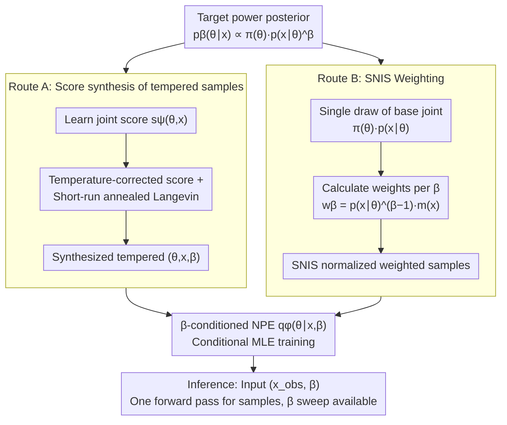

# Amortized Simulation-Based Inference in Generalized Bayes via Neural Posterior Estimation

**Conference**: ICML 2026  
**arXiv**: [2601.22367](https://arxiv.org/abs/2601.22367)  
**Code**: https://github.com/Komorebiww/amortized-generalized-bayes  
**Area**: Scientific Computing / Simulation-Based Inference  
**Keywords**: simulation-based inference, generalized Bayes, power posterior, neural posterior estimation, SNIS  

## TL;DR
This paper amortizes the power posterior family in generalized Bayes into a single neural posterior estimator conditioned on both the observation $x$ and the temperature $\beta$. This allows posterior sampling for different observations and various $\beta$ values to be completed in a single forward pass, eliminating the need to run MCMC for each instance.

## Background & Motivation
**Background**: Simulation-based inference deals with scientific problems where simulators exist but explicit likelihoods are unavailable. Modern SBI commonly uses NPE, NLE, or NRE to learn the posterior, likelihood, or likelihood ratio from simulated samples, enabling fast parameter inference on new observations.

**Limitations of Prior Work**: Standard SBI typically targets the ordinary Bayes posterior, i.e., $\beta=1$. Real-world scientific simulators are often misspecified, and the ordinary posterior may be overconfident. Generalized Bayes regulates the weights of the data and the prior through a temperature $\beta$ or loss-based updates. However, existing methods often require re-running MCMC, SDE samplers, or other iterative inference for every new observation and every $\beta$.

**Key Challenge**: The robustness of GBI stems from the ability to sweep across different $\beta$ values to check posterior stability, yet this temperature-sweeping process is precisely the most computationally expensive part of inference. If sampling must be performed separately for each $x$ and $\beta$, GBI is difficult to apply to large-scale observations or interactive scientific analysis.

**Goal**: The authors aim to train a $q_\phi(\theta\mid x, \beta)$ that directly approximates the power posterior $p_\beta(\theta\mid x) \propto \pi(\theta)p(x\mid \theta)^\beta$, thereby amortizing the inference costs for both observations and temperatures.

**Key Insight**: The paper focuses on the tempered posterior, a specific case of GBI that preserves the likelihood structure while introducing an adjustable temperature. Instead of amortizing a cost function and then sampling via MCMC, it directly amortizes the posterior sampler itself.

**Core Idea**: The training objective for the $\beta$-conditioned NPE is constructed via two complementary routes: Route A synthesizes tempered joint samples using score-assisted Langevin dynamics, and Route B reweights fixed simulator joint data using SNIS. Both routes train the same $\beta$-conditioned posterior network.

## Method
The core of the paper is transforming "sampling the power posterior given $x$ and $\beta$" into a conditional density estimation problem. Once training is complete, the user inputs an observation and a temperature, and the NPE directly outputs parameter distribution samples; this shifts the originally expensive per-instance sampling cost to an offline training phase.

### Overall Architecture
Let the prior be $\pi(\theta)$, and the simulator implicitly define $p(x\mid \theta)$. The power posterior is $p_\beta(\theta\mid x) \propto \pi(\theta)p(x\mid \theta)^\beta$, where $\beta < 1$ weakens the data to enhance robustness, and $\beta > 1$ strengthens the data for a more concentrated posterior. The goal is to train a single $q_\phi(\theta\mid x, \beta)$ over a bounded temperature interval or grid.

Route A first learns a joint score from the standard simulator joint $\pi(\theta)p(x\mid \theta)$, then runs short-run annealed Langevin dynamics with the temperature-corrected score to synthesize triplets $(\theta, x, \beta)$ approximately following $\pi(\theta)p(x\mid \theta)^\beta$. These samples are then used for conditional MLE training of the NPE.

Route B does not synthesize new samples but instead draws and reuses base joint data once. For each $\beta$, it estimates $p(x\mid \theta)^{\beta-1}$ or likelihood ratio weights using NLE or NRE, followed by self-normalized importance sampling to obtain a weighted NPE objective. Theoretically, this objective is equivalent to fitting the target power posterior via forward KL divergence. Training signals from both routes are fed into the same $\beta$-conditioned NPE, requiring only one forward pass during inference for a given $(x_{obs}, \beta)$.

### Key Designs

**1. $\beta$-conditioned NPE Objective: One network covering all observations and temperatures**

Robustness analysis in GBI is inseparable from temperature sweeping—examining posterior stability across different $\beta$ values and performing posterior predictive checks and calibration. However, prior methods required re-running sampling for every change in observation or $\beta$, making temperature sweeping the most expensive step. This paper feeds $\beta$ along with observation $x$ as conditions into the posterior network, training $q_\phi(\theta\mid x, \beta)$ to directly approximate the power posterior $p_\beta(\theta\mid x)$. After training, sweeping temperatures merely requires changing an input scalar and performing another forward pass, moving the per-instance sampling cost to the offline phase.

**2. Route A: Synthesizing tempered training samples with scores**

To train the aforementioned network, samples of $(\theta, x, \beta)$ following $\pi(\theta)p(x\mid \theta)^\beta$ are required, but this tempered joint cannot be sampled directly. Route A uses denoising score matching to learn a joint score $s_\psi(\theta, x)$ from the standard simulator joint, then employs a temperature-corrected score $\beta s_\psi(\theta, x) - (\beta-1)(\nabla_\theta \log \pi(\theta), 0)$ to run short-run annealed Langevin dynamics. This actively synthesizes samples close to the tempered joint for conditional MLE training. Its value lies in covering off-manifold regions that the base joint cannot reach—especially when $\beta$ is small or Route B's importance weights degrade.

**3. Route B: SNIS weighting on fixed data**

Route B takes a simpler path: it does not synthesize new samples but instead draws the base joint $\pi(\theta)p(x\mid \theta)$ once and reuses it across all temperatures. For each $\beta$, samples are assigned self-normalized importance weights $w_\beta(\theta, x) = p(x\mid \theta)^{\beta-1}m(x)$ (where $m(x)=1$ for NLE and $m(x)=p(x)^{1-\beta}$ for NRE). After normalization, the objective $\sum_i \tilde w_{\beta,i} [-\log q_\phi(\theta_i\mid x_i, \beta)]$ is minimized. The paper proves this weighted objective is equivalent to fitting the power posterior via forward KL (mass-covering), providing theoretical grounding. NRE weights have finite variance when $\beta \in [1/2, 1]$.

### Loss & Training
Route A training involves three steps: learning the joint score via denoising score matching, synthesizing tempered pairs using annealed Langevin for each $\beta$, and minimizing the conditional negative log-likelihood $\mathbb{E}[-\log q_\phi(\theta\mid x, \beta)]$. Route B trains an NLE or NRE first, then uses SNIS weights for each temperature to train the NPE. The posterior network can utilize MDN, MAF, or NSF; MDN is suitable for low-dimensional multimodal posteriors, while flow-based estimators are better for high-dimensional tasks. Inference for a given $x_{obs}$ and $\beta$ is a single forward pass without calling the simulator or running MCMC.

## Key Experimental Results

### Main Results
The paper evaluates the method on four SBI benchmarks: Gaussian Mixture, Two Moons, SLCP, and Lorenz-96, using MMD and C2ST to compare amortized samples against reference power posterior samples. Reference posteriors are constructed for each $\beta$ using high-quality MCMC, parallel tempering, or rejection samplers.

| Task | Posterior Characteristics | Evaluated Temperatures | Key Observations | Preferred Route |
|------|---------------------------|------------------------|------------------|-----------------|
| Gaussian Mixture | Low-dim multimodal, exact rejection sampling available | $\beta \in \{0.1, 0.3, \dots, 1.5\}$ | Route A is more stable at small $\beta$; Route B is effective near 1 | Both Route A / B |
| Two Moons | Crescent geometry, multimodal support | Same as above | Route A is more affected by score error and Langevin step size | Requires tuning Route A steps |
| SLCP | 5D complex posterior | Same as above | SNIS ESS drops and error increases far from $\beta=1$ | Route A has coverage advantage |
| Lorenz-96 | Chaotic dynamical system, scientific simulation | Same as above | Gaps more evident on complex structured posteriors, but amortized methods remain competitive | Depends on diagnostics |
| Hodgkin-Huxley | 8-parameter neuron electrophysiology model | $\beta=0.1, 1.0, 2.0$ | RouteB_NLE with 10K simulations produces stable marginals and reasonable trajectories | RouteB_NLE |

### Ablation Study
The paper provides analyses on Route A step size sensitivity, Route B ESS diagnostics, and HH temperature analysis.

| Analysis Item | Key Metric / Phenomenon | Description |
|---------------|-------------------------|-------------|
| Route A Step Size | Gaussian mixture, $\beta=0.9$ | C2ST vs Langevin step size is non-monotonic; large steps cause discretization bias, small steps cause poor mixing |
| Route B nESS | $K=2000$ samples, 30 held-out tasks | nESS is highest near $\beta=1$ and drops as the target moves away from the base proposal |
| SLCP / Lorenz-96 | ESS collapse at small $\beta$ | Reweighting struggles to cover regions where the base joint has no support |
| HH RouteB_NLE | 10,000 prior simulations | $g_{Na}, g_K$ show tail/peak changes with temperature; $E_{leak}$ remains stable |
| HH Posterior Predictive | 3 Allen Cell Types observations | $\beta=0.1$ samples qualitatively reproduce primary spike timings |

### Key Findings
- The paper does not claim amortized methods outperform non-amortized references in all scenarios, but demonstrates they achieve competitive approximations while drastically reducing costs for multiple $x$ and $\beta$ queries.
- Route B is most natural near $\beta=1$ where the base joint is closest to the target; as $\beta$ deviates, importance weights sharpen and ESS drops.
- Route A can actively generate tempered joint samples, performing better at small $\beta$ or when SNIS is unstable, but depends on score accuracy and Langevin tuning.
- The HH experiment shows the framework is applicable beyond toy benchmarks, allowing researchers to observe how temperature affects uncertainty in biophysical parameters.

## Highlights & Insights
- The primary value of the paper is incorporating the temperature dimension of GBI into amortization. Previously, methods amortized costs or likelihoods but still required per-observation MCMC; this work amortizes the sampler itself.
- The complementary relationship between Route A and Route B is discussed transparently. Route B is fast but limited by weight degradation, while Route A is flexible but limited by score and sampling errors.
- Explaining SNIS-weighted NPE via forward KL is crucial. it demonstrates that weighted MLE is a theoretically grounded fit for mass-covering tempered posteriors rather than just an engineering trick.

## Limitations & Future Work
- Route A has high offline costs, and short-run Langevin is sensitive to step size, noise schedules, and score errors, potentially becoming unstable for complex multimodal posteriors.
- Route B cannot recover posterior regions not covered by the base joint; when $|\beta-1|$ is large or likelihood ratio estimation is inaccurate, the NPE inherits these biases.
- All routes depend on the generalization of $q_\phi$ across both observations and temperatures; calibration may fail outside the training temperature range or for OOD observations.
- Experiments focus on trends and diagnostics; a unified quantitative table comparing average MMD/C2ST across all tasks/temperatures is missing, requiring readers to infer performance from curves.

## Related Work & Insights
- **vs ACE + MCMC**: ACE amortizes the expected cost but still uses MCMC for each observation; this work learns $q_\phi(\theta \mid x, \beta)$ to eliminate the sampling chain during inference.
- **vs Scoring-rule Posterior**: Scoring-rule GBI is attractive for misspecification but usually requires pseudo-marginal or SG-MCMC; this work restricts itself to the power posterior but achieves fully amortized sampling.
- **vs Standard NPE/SNPE**: Standard NPE mostly targets the $\beta=1$ posterior; this work treats temperature as a conditional variable, allowing one network to cover a family of targets in robust Bayesian analysis.
- **Insight**: For Bayesian workflows requiring hyperparameter sweeps, hyperparameters can be treated directly as conditions for the amortized posterior rather than re-running inference for each value.

## Rating
- Novelty: ⭐⭐⭐⭐☆ Amortizing the GBI temperature family into NPE is valuable, and the SNIS/fKL connection for Route B is solid.
- Experimental Thoroughness: ⭐⭐⭐☆☆ Covers multiple SBI benchmarks and HH case, but results are largely curves and qualitative diagnostics; unified quantitative tables are sparse.
- Writing Quality: ⭐⭐⭐⭐☆ Methodological routes and tradeoffs are clearly explained with theoretical propositions, though notation density is high.
- Value: ⭐⭐⭐⭐☆ Very practical for scientific inference scenarios requiring large-scale observations or temperature sweeps, serving as a bridge between GBI and amortized SBI.

<!-- RELATED:START -->

## Related Papers

- [\[ICML 2026\] TabMGP: Martingale Posterior with TabPFN](tabmgp_martingale_posterior_with_tabpfn.md)
- [\[ICLR 2026\] Neural Force Field: Few-shot Learning of Generalized Physical Reasoning](../../ICLR2026/others/neural_force_field_few-shot_learning_of_generalized_physical_reasoning.md)
- [\[AAAI 2026\] Bilevel MCTS for Amortized O(1) Node Selection in Classical Planning](../../AAAI2026/others/bilevel_mcts_for_amortized_o1_node_selection_in_classical_planning.md)
- [\[AAAI 2026\] ParaRevSNN: A Parallel Reversible Spiking Neural Network for Efficient Training and Inference](../../AAAI2026/others/pararevsnn_a_parallel_reversible_spiking_neural_network_for_efficient_training_a.md)
- [\[NeurIPS 2025\] Scalable Inference of Functional Neural Connectivity at Submillisecond Timescales](../../NeurIPS2025/others/scalable_inference_of_functional_neural_connectivity_at_submillisecond_timescale.md)

<!-- RELATED:END -->
