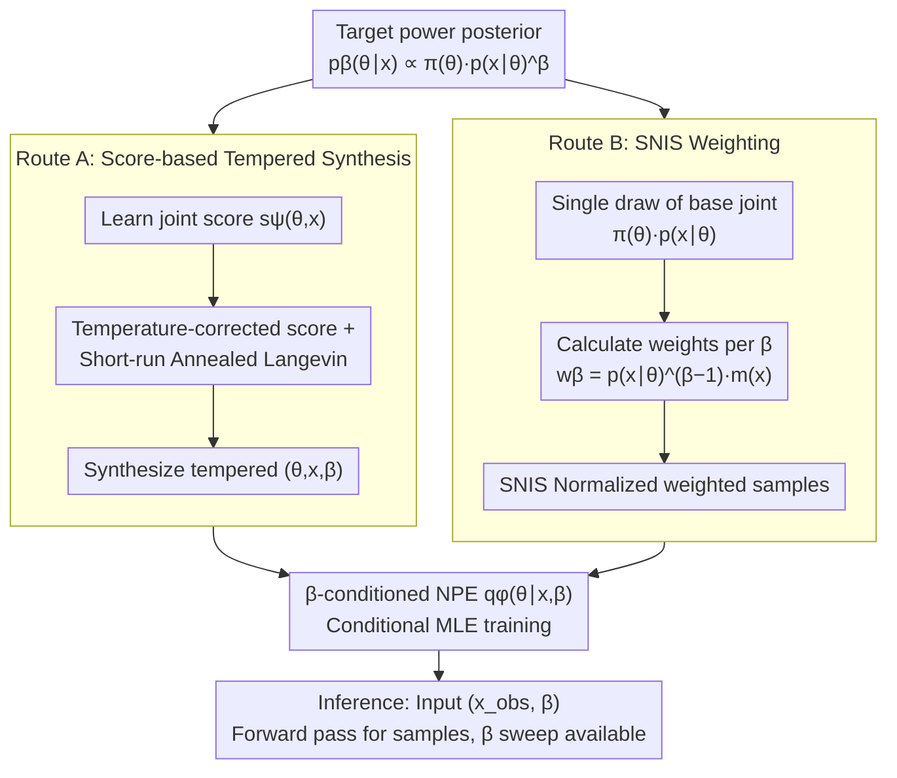

# Amortized Simulation-Based Inference in Generalized Bayes via Neural Posterior Estimation

**Conference**: ICML 2026  
**arXiv**: [2601.22367](https://arxiv.org/abs/2601.22367)  
**Code**: https://github.com/Komorebiww/amortized-generalized-bayes  
**Area**: Scientific Computing / Simulation-Based Inference  
**Keywords**: simulation-based inference, generalized Bayes, power posterior, neural posterior estimation, SNIS  

## TL;DR
This paper amortizes the power posterior family in generalized Bayes into a single neural posterior estimator conditioned on both the observation $x$ and the temperature $\beta$. This allows posterior sampling for different observations and varying temperatures to be completed in a single forward pass, eliminating the need to run MCMC for every instance.

## Background & Motivation
**Background**: Simulation-based inference (SBI) addresses scientific problems where simulators are available but explicit likelihoods are not. Modern SBI typically employs NPE, NLE, or NRE to learn the posterior, likelihood, or likelihood ratio from simulated samples, enabling fast inference on new observations.

**Limitations of Prior Work**: Standard SBI usually targets the ordinary Bayesian posterior, i.e., $\beta=1$. However, real-world scientific simulators are often misspecified, which can lead the standard posterior to be overconfident. Generalized Bayes regulates the weights of data and priors through a temperature $\beta$ or loss-based updates. Existing methods, however, often require re-running MCMC, SDE samplers, or other iterative inference procedures for every new observation and every value of $\beta$.

**Key Challenge**: The robustness of GBI stems from the ability to sweep across different $\beta$ values and check posterior stability. Yet, this temperature-sweeping process is precisely what incurs the highest inference cost. If sampling must be performed individually for every $x$ and $\beta$, GBI becomes difficult to apply to large-scale observations or interactive scientific analysis.

**Goal**: The authors aim to train a network $q_\phi(\theta\mid x,\beta)$ that directly approximates the power posterior $p_\beta(\theta\mid x)\propto\pi(\theta)p(x\mid\theta)^\beta$, thereby amortizing inference across both observations and temperatures.

**Key Insight**: The paper focuses on the tempered posterior—a specific case of GBI—which retains the likelihood structure while introducing an adjustable temperature. Instead of amortizing a cost function followed by MCMC sampling, it amortizes the posterior sampler itself.

**Core Idea**: Two complementary routes are constructed to define the NPE training objective with $\beta$. Route A synthesizes tempered joint samples via score-assisted Langevin dynamics, while Route B utilizes SNIS to reweight fixed simulator joint data. Both routes train the same $\beta$-conditioned posterior network.

## Method
The core of the paper is transforming the task of "sampling the power posterior given $x$ and $\beta$" into a conditional density estimation problem. Once training is complete, the user provides an observation and a temperature, and the NPE directly outputs samples from the parameter distribution. This shifts the traditionally expensive per-instance sampling cost to an offline training phase.

### Overall Architecture
Let the prior be $\pi(\theta)$ and the simulator implicitly define $p(x\mid\theta)$. The power posterior is expressed as $p_\beta(\theta\mid x)\propto\pi(\theta)p(x\mid\theta)^\beta$, where $\beta<1$ weakens the data influence to enhance robustness, and $\beta>1$ strengthens the data influence for a more concentrated posterior. The goal is to train a single $q_\phi(\theta\mid x,\beta)$ over a bounded temperature interval or grid.

Route A first learns a joint score from the standard simulator joint $\pi(\theta)p(x\mid\theta)$, then runs short-run annealed Langevin dynamics with a temperature-corrected score to synthesize triplets $(\theta,x,\beta)$ approximately from $\pi(\theta)p(x\mid\theta)^\beta$. These samples are subsequently used for conditional MLE training of the NPE.

Route B does not synthesize new samples but reuses a single batch of base joint data. For each $\beta$, it estimates $p(x\mid\theta)^{\beta-1}$ or likelihood ratio weights using NLE or NRE, followed by self-normalized importance sampling (SNIS) to derive a weighted NPE objective. Theoretically, this objective is equivalent to fitting the target power posterior using forward KL divergence. The training signals from both routes are fed into the same $\beta$-conditioned NPE, which requires only a single forward pass for any given $(x_{obs},\beta)$ during inference.

### Key Designs

**1. $\beta$-conditioned NPE Objective: One network to cover all observations and temperatures.**

Robustness analysis in GBI necessitates sweeping through temperatures to observe posterior stability, conduct posterior predictive checks, and evaluate calibration. However, prior methods required re-running sampling for every change in observation or $\beta$, making the sweep the most expensive step. This work feeds $\beta$ alongside $x$ as a condition into the posterior network, training $q_\phi(\theta\mid x,\beta)$ to directly approximate the power posterior $p_\beta(\theta\mid x)$. After training, sweeping temperatures is reduced to modifying an input scalar and performing a forward pass, moving the per-instance sampling cost to the offline phase—this is the unified network where both routes converge.

**2. Route A: Synthesizing Tempered Training Samples via Scores**

Training the aforementioned network requires samples $(\theta,x,\beta)$ follows $\pi(\theta)p(x\mid\theta)^\beta$, but this tempered joint cannot be sampled directly. Route A first employs denoising score matching to learn a joint score $s_\psi(\theta,x)$ from the standard simulator joint, then utilizes a temperature-corrected score $\beta s_\psi(\theta,x)-(\beta-1)(\nabla_\theta\log\pi(\theta),0)$ to run short-run annealed Langevin dynamics. This actively synthesizes samples close to the tempered joint for conditional MLE training of the NPE. Its value lies in covering off-manifold regions that the base joint cannot reach—when $\beta$ is small or Route B's importance weights degrade, this explicit synthesis is often more stable, though it depends on score accuracy and Langevin step-size tuning.

**3. Route B: SNIS Weighting on Fixed Data**

Route B takes a more efficient path: it avoids synthesizing new samples and instead reuses a single draw of base joint data $\pi(\theta)p(x\mid\theta)$ across all temperatures. For each $\beta$, self-normalized importance weights $w_\beta(\theta,x)=p(x\mid\theta)^{\beta-1}m(x)$ are assigned to samples (where NLE uses $m(x)=1$ and NRE uses $m(x)=p(x)^{1-\beta}$). After normalization, the objective $\sum_i\tilde w_{\beta,i}[-\log q_\phi(\theta_i\mid x_i,\beta)]$ is minimized. The paper proves this weighted objective is equivalent to a forward KL divergence fit (mass-covering) to the power posterior. Thus, it is a theoretically grounded approach rather than a heuristic, and NRE weights exhibit finite variance for $\beta\in[1/2,1]$. It is simple to deploy and fast to infer, although weights can become sparse and Effective Sample Size (ESS) may drop when $|\beta-1|$ is large.

### Loss & Training
Route A training consists of three steps: learning the joint score via denoising score matching, synthesizing tempered pairs for each $\beta$ using annealed Langevin dynamics, and minimizing the conditional negative log-likelihood $\mathbb{E}[-\log q_\phi(\theta\mid x,\beta)]$. Route B first trains an NLE or NRE, then uses SNIS weights for each temperature to train the NPE. The posterior network can utilize MDN, MAF, or NSF; MDN is suitable for low-dimensional multimodal posteriors, while flow-based estimators are preferred for high-dimensional tasks. During inference, sampling is a single forward pass given $x_{obs}$ and $\beta$, without calling the simulator or running MCMC.

## Key Experimental Results

### Main Results
The paper evaluates the method on four SBI benchmarks: Gaussian Mixture, Two Moons, SLCP, and Lorenz-96. Amortized samples are compared against reference power posterior samples using MMD and C2ST. Reference posteriors are constructed for each $\beta$ using high-quality MCMC, parallel tempering, or rejection sampling.

| Task | Posterior Characteristics | Evaluated Temperatures | Key Observations | Preferred Route |
|------|----------|----------|----------|----------|
| Gaussian Mixture | Low-dim multimodal; exact rejection sampling available | $\beta\in\{0.1,0.3,0.5,0.7,0.9,1.0,1.1,1.3,1.5\}$ | Route A more stable at small $\beta$; Route B effective near 1 | Both Route A / B |
| Two Moons | Crescent-shaped geometry, multimodal support | Same as above | Route A more sensitive to score error and Langevin steps | Requires Langevin tuning |
| SLCP | 5D complex posterior | Same as above | SNIS ESS drops and error rises as $\beta$ moves from 1 | Route A offers better coverage |
| Lorenz-96 | Chaotic dynamics, scientific simulation | Same as above | Discrepancy more apparent on structured posteriors; still competitive | Depends on diagnostics |
| Hodgkin-Huxley | 8-parameter neuron electrophysiology model | $\beta=0.1,1.0,2.0$ | RouteB_NLE with 10K simulations yields stable marginals and reasonable trajectories | RouteB_NLE |

### Ablation Study
While a traditional ablation table is absent, the paper provides diagnostics on Route A step-size sensitivity, Route B ESS, and HH temperature analysis.

| Analysis Item | Key Metric / Phenomenon | Description |
|--------|----------------|------|
| Route A Step Size | Non-monotonic C2ST w.r.t. Langevin step size in Gaussian mixture at $\beta=0.9$ | Decoupling bias if steps are too large; poor mixing if too small |
| Route B nESS | $K=2000$ importance samples across 30 held-out tasks | nESS peaks near $\beta=1$ and decays as it moves away from the base proposal |
| SLCP / Lorenz-96 | Significant ESS collapse at small $\beta$ or extreme temperatures | Reweighting struggles to cover regions missing from the base joint |
| HH RouteB_NLE | 10,000 prior simulations | $g_{Na}$ and $g_K$ vary with temperature (tails/peaks); $E_{leak}$ remains stable |
| HH Post. Pred. | 3 Allen Cell Types observations | $\beta=0.1$ samples qualitatively reproduce primary spike timings |

### Key Findings
- The paper does not claim amortized methods outperform non-amortized references in all tasks/temperatures, but demonstrates they achieve competitive approximations while significantly reducing query costs for multiple $x$ and $\beta$.
- Route B is most natural near $\beta=1$ where the base joint is closest to the target; as $\beta$ deviates, importance weights sharpen, ESS drops, and errors increase.
- Route A can actively generate tempered joint samples and may perform better at small $\beta$ or when SNIS becomes unstable, but it depends on score accuracy and Langevin hyperparameter tuning.
- The HH experiment shows the framework is applicable beyond toy benchmarks: on real neuro-electrophysiological recordings, the $\beta$-conditioned posterior allows observation of how temperature affects biophysical parameter uncertainty.

## Highlights & Insights
- The primary value of this paper is incorporating the temperature dimension of GBI into amortization. While previous methods amortized the cost or likelihood, they still required MCMC per observation; this work amortizes the sampler itself.
- The complementary relationship between Route A and Route B is discussed transparently. Route B is fast but limited by weight degradation, while Route A is more flexible in coverage but limited by score and sampling errors.
- Explaining SNIS-weighted NPE via forward KL is critical. It demonstrates that weighted MLE is not just an engineering trick but a theoretically grounded way to fit a mass-covering tempered posterior.

## Limitations & Future Work
- Route A involves high offline costs and short-run Langevin is sensitive to step size, noise schedules, and score errors, potentially becoming unstable for complex multimodal posteriors.
- Route B cannot recover posterior regions not covered by the base joint; when $|\beta-1|$ is large, likelihood ratio estimation is inaccurate, or ESS collapses, the NPE will inherit these biases.
- All routes rely on the generalization of $q_\phi$ across both observations and temperatures; calibration may fail outside the trained temperature range or on out-of-distribution observations.
- The experiments focus more on trends and diagnostics; a unified quantitative table comparing average MMD/C2ST across all tasks/temperatures would provide more direct comparisons.

## Related Work & Insights
- **vs. ACE + MCMC**: ACE amortizes the expected cost but still uses MCMC for each observation's generalized posterior; Ours directly learns $q_\phi(\theta\mid x,\beta)$, removing the sampling chain from the inference phase.
- **vs. Scoring-rule GBI**: Scoring-rule GBI is attractive for misspecification but typically requires pseudo-marginal or SG-MCMC; Ours is limited to power posteriors but achieves fully amortized sampling.
- **vs. Standard NPE / SNPE**: Standard NPE primarily learns the $\beta=1$ posterior; Ours treats temperature as a conditional variable, allowing a single network to cover a family of targets for robust Bayesian analysis.
- **Insight**: For Bayesian workflows requiring hyperparameter sweeps, hyperparameters can be treated as conditions for an amortized posterior rather than re-running inference for each setting.

## Rating
- Novelty: ⭐⭐⭐⭐☆ Amortizing the temperature family of generalized Bayes into NPE is highly valuable, and the SNIS/fKL connection for Route B is solid.
- Experimental Thoroughness: ⭐⭐⭐☆☆ Covers multiple SBI benchmarks and an HH case, though main results are primarily curves and qualitative diagnostics with limited unified quantitative tabulation.
- Writing Quality: ⭐⭐⭐⭐☆ Methodological routes and trade-offs are clearly explained, and theoretical propositions support the training objectives, though the notation is dense.
- Value: ⭐⭐⭐⭐☆ Highly practical for scientific inference scenarios requiring massive observations or temperature sweeps, serving as a bridge between GBI and amortized SBI.

<!-- RELATED:START -->

## Related Papers

- [\[ICML 2026\] TabMGP: Martingale Posterior with TabPFN](tabmgp_martingale_posterior_with_tabpfn.md)
- [\[ICLR 2026\] Neural Force Field: Few-shot Learning of Generalized Physical Reasoning](../../ICLR2026/others/neural_force_field_few-shot_learning_of_generalized_physical_reasoning.md)
- [\[ICML 2026\] nD-RoPE: A Generalized RoPE for n-Dimensional Position Embedding](nd-rope_a_generalized_rope_for_n-dimensional_position_embedding.md)
- [\[AAAI 2026\] Bilevel MCTS for Amortized O(1) Node Selection in Classical Planning](../../AAAI2026/others/bilevel_mcts_for_amortized_o1_node_selection_in_classical_planning.md)
- [\[AAAI 2026\] ParaRevSNN: A Parallel Reversible Spiking Neural Network for Efficient Training and Inference](../../AAAI2026/others/pararevsnn_a_parallel_reversible_spiking_neural_network_for_efficient_training_a.md)

<!-- RELATED:END -->
