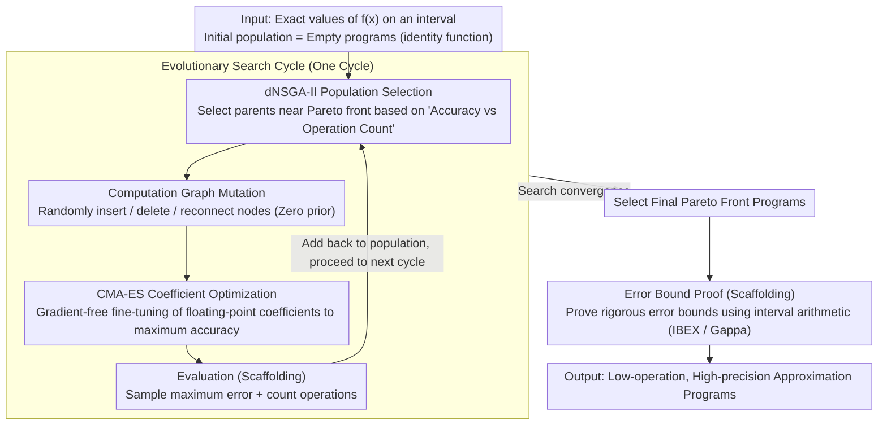

# AutoNumerics-Zero: Automated Discovery of State-of-the-Art Mathematical Functions

**Conference**: ICML2026  
**arXiv**: [2312.08472](https://arxiv.org/abs/2312.08472)  
**Code**: https://github.com/google-deepmind/autonumerics_zero  
**Area**: Other  
**Keywords**: Symbolic Regression, Evolutionary Search, Transcendental Function Approximation, Program Discovery, Numerical Computing

## TL;DR
AutoNumerics-Zero is proposed as an evolutionary symbolic regression method with zero prior knowledge. Starting from empty programs, it automatically discovers arithmetic programs for approximating transcendental functions (such as exponential and cosine functions). Under finite-precision targets, it surpasses classic approximation methods designed by mathematicians over centuries by requiring fewer operations.

## Background & Motivation

**Background**: Transcendental functions (exponential, logarithmic, trigonometric, etc.) are cornerstones of scientific computing. However, digital hardware cannot compute them natively and must approximate them using finite combinations of basic operations such as $\{+,-,\times,\div\}$. Classical methods include Taylor series, Chebyshev approximation, Padé approximants, and the Remez minimax algorithm, which have reached a high level of maturity over centuries of development.

**Limitations of Prior Work**: Classical mathematical approximation methods pursue "arbitrary precision"—meaning accuracy can be infinitely improved by increasing the number of terms. However, finite-precision data types like float32 used in modern computers are sufficient for the vast majority of applications, and accuracy exceeding the precision limit of the data type is effectively wasted. Furthermore, classical methods are restricted to specific functional forms (e.g., polynomials, rational functions) and cannot explore all possible combinations of operations.

**Key Challenge**: There is a mismatch between the design goals of classical methods (arbitrary precision) and actual requirements (finite precision). If the optimization goal is shifted from "infinite precision" to "sufficiently high but finite precision," can approximation schemes with fewer operations be discovered?

**Goal**: To explore whether large-scale evolutionary search can automatically discover transcendental function approximation programs that are more efficient than classical methods under finite-precision targets.

**Key Insight**: The authors observe that symbolic regression can search for arbitrary combinations of operations (unconstrained by fixed forms like polynomials or rational functions) and can optimize non-differentiable objectives (such as the number of operations). Representing functions as programs rather than formulas also allows for the reuse of intermediate computed values, further reducing the computational load.

**Core Idea**: Large-scale evolutionary symbolic regression is used to search for efficient finite-precision approximation programs for transcendental functions in the $\{+,-,\times,\div\}$ operation space, starting from empty programs. This approach aims to surpass centuries of manual design using "zero mathematical prior."

## Method

### Overall Architecture
AutoNumerics-Zero is a multi-objective evolutionary search system. The input consists of exact values of the target transcendental function $f(x)$ (e.g., $2^x$) over a specified interval as training data, and the output is a set of approximation programs, each achieving the highest possible accuracy with the minimum number of basic operations. The entire search process starts from empty programs (identity functions) and iteratively improves the population through a nested two-layer optimization: the outer layer uses genetic programming to discover program structures, while the inner layer employs CMA-ES to optimize floating-point coefficients. A single cycle of the search loop comprises four steps: dNSGA-II selects parent programs near the Pareto front, mutation of the computation graph generates offspring, CMA-ES fine-tunes offspring coefficients, and the programs are added back to the population after evaluating their accuracy and operation count. Upon search convergence, interval arithmetic is used to rigorously prove error bounds for the best programs on the final Pareto front.

### Key Designs

**1. Distributed Multi-objective Population Selection (dNSGA-II): Adapting NSGA-II to a decentralized version to maintain the "Accuracy vs Operation Count" Pareto front on large-scale clusters.**

Classic NSGA-II requires centralized population management, which is unsuitable for large-scale parallel search. dNSGA-II is its distributed variant: each worker receives $2S$ programs from other random workers, selects $S$ parent programs near the Pareto front (accuracy vs. operations) using SelectNearPareto, mutates each parent twice to produce $2S$ offspring for other workers. Accuracy is measured by $a = -\log_{10}(E)$, where $E$ is the maximum error. This decentralized population evolution through random communication between workers avoids central bottlenecks, supports asynchronous updates, and maintains a uniform distribution of programs on the Pareto front, ensuring efficiency in both compute power and solution diversity.

**2. Computation Graph Mutation Strategy: Using purely random "insert/delete/reconnect" operations to explore the program structure space without injecting mathematical priors.**

Programs are represented as computation graphs where input nodes are program inputs and coefficients, intermediate nodes are $\{+,-,\times,\div\}$ operations, and the output node is the result. Each mutation randomly performs one of three operations: inserting a random operation node at a random position, deleting a random node, or randomly reconnecting an edge. This "zero-knowledge" mutation strategy ensures the search is not biased toward any known approximation forms (e.g., polynomials), allowing the discovery of novel, unconventional expressions—such as a "nested division-addition combination raised to the 8th power," which is unlikely to emerge from human-designed ansatze.

**3. CMA-ES Inner-loop Coefficient Optimization: Mutation changes structure, while coefficients are fine-tuned to maximum precision by a gradient-free optimizer.**

While mutation alters the program structure, the floating-point coefficients for fixed structures still require fine-tuning. This work applies CMA-ES (Covariance Matrix Adaptation Evolution Strategy) to optimize the coefficients of each mutated offspring, aiming to minimize the maximum error over a batch of randomly sampled input-output examples. CMA-ES is selected for its superior performance in low-parameter gradient-free continuous optimization and its ability to avoid local optima. More importantly, its black-box characteristic means that non-differentiable operations (such as bit-shift instructions) can be added to the operation set in the future without modifying the optimizer, something gradient-based methods cannot achieve.

### Error Bound Proof
Following the search, interval arithmetic (via the IBEX library) is used to iteratively subdivide the domain for the best programs to prove an error upper bound, with the global bound being the maximum across all sub-intervals. For hardware-aware float32 programs, the Gappa prover is used to handle intermediate rounding errors. This ensures that the discovered programs possess rigorous mathematical guarantees.

## Key Experimental Results

### Main Results: Exponential Function Approximation

| Method | Operation Count | Accuracy (Significant Digits) | Gap with Baseline |
|------|---------|-------------------|-----------|
| AutoNumerics-Zero (Best) | 10 | 14.3 | Surpasses baseline by 6+ orders of magnitude |
| Ratio/Minimax | 10 | ~8 | Best baseline |
| Ratio/Padé | 10 | ~7 | — |
| Poly/Taylor (Horner) | 10 | ~6 | — |
| Chebyshev | 10 | ~7 | — |
| Poly/Minimax | 10 | ~8 | — |

The discovered 10-operation program $f(x) = \left(\frac{c_4}{\frac{c_1}{\frac{c_3}{x}+x}+c_2+\frac{c_3}{x}+x}-c_5\right)^8$ approximates $2^x$ with 14 guaranteed significant digits across the real line. The maximum relative error was rigorously proven by interval arithmetic to be below $5.4\times 10^{-15}$.

### Hardware-aware Exponential and Other Functions

| Target Function | Scenario | AutoNumerics-Zero | Best Baseline | Gain |
|---------|------|-------------------|---------|------|
| $2^x$ (Hardware-aware, Skylake) | float32 throughput | 3x+ faster | Poly/Minimax | Error <1 ULP, portable across 6 generations of Intel/AMD |
| $\cos(x)$ | Absolute error | Higher precision | Chebyshev | Better precision for same operation count |
| Airy $\text{Ai}(-7x)$ | Oscillatory function | 19 ops, 4.2 precision | 20 ops baseline | Error reduced by 2 orders of magnitude |
| Bessel $I_{1/2}(x)$ | Includes $\sqrt{\cdot}$ | 8 ops, 8.1 precision | 9 ops, 7.8 precision | 1 fewer op and more accurate |
| $\text{erf}(x)$ | $(0,2]$ | Better in low-precision | Padé (Better in high-precision) | Padé dominates at high precision |

### Ablation Study

| Configuration | Effect | Description |
|------|------|------|
| Full Method | Best Pareto front | dNSGA-II + Mutation + CMA-ES |
| Without dNSGA-II (Random Search) | Significant degradation | Lack of selection pressure leads to poor efficiency |
| Without CMA-ES | Significant degradation | Precision limited by unoptimized coefficients |
| Random Graph Replacement | Significant degradation | Equivalent to purely random search |

### Key Findings
- In exponential function approximation, the evolved programs surpass all classical baselines—including Taylor, Padé, Chebyshev, and Minimax—at all operation count levels, with advantages confirmed by mathematical proof.
- Hardware-aware search discovered code that triggers compiler anomalies but yields beneficial compilation paths; manually writing such code would be nearly impossible.
- Evolved programs maintain at least an 80% speedup across Intel and AMD architectures spanning 8 years, demonstrating excellent hardware portability.
- Convergent evolution was observed across different search experiments: optimal programs exhibited similar structural characteristics, analogous to the independent evolution of fins in nature.

## Highlights & Insights
- **Zero-knowledge Discovery Surpasses Human Design**: The entire search process uses no mathematical priors (no asymptotic expansions, no derivative calculations, no pre-training), yet it discovers approximation methods superior to those accumulated by mathematicians over centuries. This demonstrates the powerful exploratory capability of evolutionary search on structured mathematical problems.
- **Program Representation vs. Formula Representation**: Representing functions as programs (computation graphs) rather than mathematical formulas allows for the reuse of intermediate values, achieving higher precision with fewer operations. The discovered optimal programs take novel nested structures that are neither polynomials nor continued fractions.
- **Extensibility of Black-box Optimization**: Since both dNSGA-II and CMA-ES are black-box methods, the framework can easily be extended to new operation sets (e.g., $\sqrt{\cdot}$), new optimization objectives (e.g., hardware execution speed), and new target functions—capabilities that gradient-based methods lack.

## Limitations & Future Work
- **Dependence on Range Reduction**: The search process is zero-knowledge within bounded intervals, but extension to the entire real line still relies on standard range reduction techniques, a limitation shared with all baseline methods.
- **High Computational Overhead**: The search requires 100-10k processes running for 1-4 days. However, this is a one-time cost, and the discovered programs can amortize this overhead in all future uses.
- **Not Dominant for All Functions**: For the erf function, Padé approximants remain superior in high-precision ranges, indicating the method is not advantageous for every target function.
- **Interpretability-Quality Trade-off**: The discovered programs have unconventional forms and lack intuitive mathematical interpretations like Taylor expansions. Post-hoc analysis could be attempted to extract structural patterns.
- Future directions include incorporating range reduction into the search process, adding non-floating-point instructions such as bitwise operations, and exploring backward stability optimization.

## Related Work & Insights
- **AlphaTensor** (Fawzi et al., 2022) and **AlphaDev** (Mankowitz et al., 2023) utilized RL to discover optimal algorithms for matrix multiplication and sorting, respectively, but they often generalized analytically after searching small-scale problems; AutoNumerics-Zero searches directly at a practical scale.
- Unlike traditional symbolic regression, this work discovers previously unknown mathematical relationships verified by mathematical proofs, rather than recovering known formulas.
- Complementary to superoptimization: While superoptimization starts from existing correct programs to optimize them, AutoNumerics-Zero discovers entirely new programs starting from an empty state.

<!-- RELATED:START -->

## Related Papers

- [\[ACL 2025\] Limited Generalizability in Argument Mining: State-Of-The-Art Models Learn Datasets, Not Arguments](../../ACL2025/others/limited_generalizability_in_argument_mining_state-of-the-art_models_learn_datase.md)
- [\[ECCV 2024\] Auto-GAS: Automated Proxy Discovery for Training-Free Generative Architecture Search](../../ECCV2024/others/auto-gas_automated_proxy_discovery_for_training-free_generative_architecture_sea.md)
- [\[CVPR 2026\] UniMERNet: A Universal Network for Real-World Mathematical Expression Recognition](../../CVPR2026/others/unimernet_a_universal_network_for_real-world_mathematical_expression_recognition.md)
- [\[ACL 2026\] Neural Induction of Finite-State Transducers](../../ACL2026/others/neural_induction_of_finite-state_transducers.md)
- [\[ICLR 2026\] Bayesian Influence Functions for Hessian-Free Data Attribution](../../ICLR2026/others/bayesian_influence_functions_for_hessian-free_data_attribution.md)

<!-- RELATED:END -->
