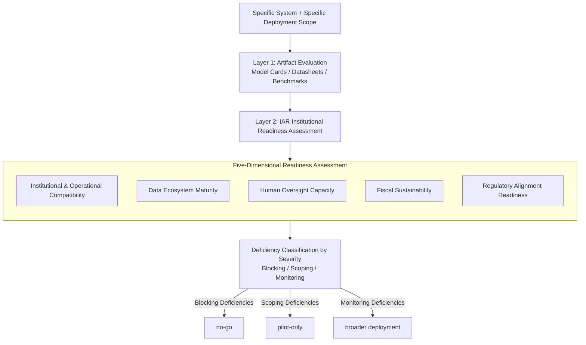

# Beyond Model Readiness: Institutional Readiness for AI Deployment in Public Systems

**Conference**: ICML2026  
**arXiv**: [2605.17203](https://arxiv.org/abs/2605.17203)  
**Code**: None  
**Area**: AI Governance/Deployment Policy  
**Keywords**: Institutional Readiness, AI Deployment, Public Sector, Responsible AI, Deployment Governance  

## TL;DR
Addressing the common phenomenon in public sectors where AI systems are "technically feasible but fail in deployment," this paper proposes the **Institutional Alignment Readiness (IAR)** framework. This five-dimensional assessment evaluates whether a receiving institution is prepared for responsible AI deployment across institutional compatibility, data ecosystem maturity, human oversight capacity, fiscal sustainability, and regulatory alignment.

## Background & Motivation

**Background**: The field of Responsible AI has produced numerous principles, checklists, and documentation tools—such as Model Cards, Datasheets for Datasets, and the NIST AI RMF—to evaluate the technical attributes of models and datasets. These tools are mature in assessing accuracy, robustness, and fairness at the model level.

**Limitations of Prior Work**: Public sector AI systems frequently stall between "prototype" and "scale," with bottlenecks often unrelated to model quality. Systems performing well in internal tests may fail to proliferate because the receiving institution lacks approval processes, data-sharing agreements, human oversight capacity, operational budgets, or legal mandates. Existing frameworks evaluate models and developer-side processes rather than the institutional readiness of the end-users.

**Key Challenge**: There is a systemic misalignment between current evaluation tools and real-world deployment needs—they assess the "artifact," while the "institution" determines deployment success. A system passing all technical evaluations may remain undeployable due to legal ambiguities in cross-agency data sharing, missing referral paths, or inadequate training for frontline staff.

**Goal**: To construct a practical, decision-oriented institutional readiness framework that helps teams answer a critical question before widespread rollout: "Is this institution ready to deploy this specific system at this specific scope right now?"

**Key Insight**: Based on two anonymized large-scale AI deployment cases in public education (an anthropometric screening tool and a speech analysis early-learning risk identification system), the authors categorize common institutional barriers identified from actual deployment failures.

**Core Idea**: Shift the focus of deployment readiness from the "AI artifact" to the "receiving institution," introducing the IAR five-dimensional framework as a complementary layer to existing model evaluation tools.

## Method

### Overall Architecture
IAR is a pre-deployment assessment framework that adds a **second layer of evaluation** atop existing artifact-level tools (Model Cards, Datasheets, benchmarks). It shifts the evaluative focus to the "receiving institution," auditing institutional preparedness across five dimensions. It deliberately avoids a single aggregate score, instead categorizing identified deficiencies into three severity levels (blocking, scoping, or monitoring). This positions the system within the deployment lifecycle and outputs actionable recommendations: **no-go**, **pilot-only**, or **broader deployment**.

### Key Designs

**1. Five-Dimensional Readiness Assessment System: Systematic Evaluation of Institutional Capacity**

Public sector AI often stalls between "prototype" and "scale" because bottlenecks reside in the institution rather than the model. Existing tools fail to answer if an institution is "ready." IAR identifies five critical dimensions derived from real-world failures: (1) Institutional & Operational Compatibility—approval chains, workflow integration, operator training, and deployment windows; (2) Data Ecosystem Maturity—target population representation, data-sharing agreements, and labeling capacity; (3) Human Oversight Capacity—qualified reviewers, referral paths, and anti-discrimination protocols; (4) Fiscal Sustainability—post-pilot budgeting, maintenance, and retraining plans; (5) Regulatory Alignment Readiness—privacy compliance, legal basis for consent, and grievance paths. These are "independent and necessary" as they cover blind spots in artifact-level assessments. Notably, "Fiscal Sustainability" is the only dimension with no standard machine learning evaluation equivalent—a key non-technical risk often overlooked by technical teams.

**2. Staged Deployment Decision Logic: Transitioning from Binary Judgments to Phased Management**

Public sector deployment is incremental and conditional. Applying hard thresholds or weighted scores often reduces a framework's applicability across diverse institutions. Consequently, IAR avoids quantitative scoring and instead categorizes deficiencies as blocking (must stop), scoping (pilot only), or monitoring (proceed with tracking). This maps systems to one of four stages: unready, internal validation, limited pilot, or broader deployment. The output is an actionable recommendation rather than a numerical score, matching the rhythm of real-world decision-making and avoiding misleading precision for qualitative constraints.

**3. Case-Driven Inductive Construction: Derived from Real Deployment Failures**

To ensure practical relevance, the dimensions were extracted from two large-scale public education AI projects that reached technical viability but stalled due to institutional factors. Case A (Anthropometric Screening) failed due to insufficient data representation, missing referral paths, and legal issues in cross-departmental data sharing. Case B (Speech Analysis Risk Identification) required a complete pivot because the necessary data was practically unavailable, followed by challenges in stakeholder alignment. These cases confirm that technical evaluations do not explain deployment trajectories; instead, institutional factors like approval delays and referral gaps determine whether a system moves from validation to scale.

## Key Experimental Results

### IAR Five-Dimension Assessment Matrix

| IAR Dimension | Observable Indicators | Typical Failure Modes |
| :--- | :--- | :--- |
| Institutional & Operational Compatibility | Documented approval chains, workflow adaptation, operator training plans, deployment windows | System is technically ready but fails to launch due to pending approvals, workflow mismatch, or unready operators |
| Data Ecosystem Maturity | Dataset representation, data-sharing agreements, labeling capacity, retention/deletion policies | Model performs well in development but cannot scale due to missing or slow access to target population data |
| Human Oversight Capacity | Qualified reviewers, clear veto power, referral paths, anti-discrimination protocols, personnel continuity | Human-in-the-loop becomes symbolic; edge cases go unreported; harmful outputs lack qualified intervention |
| Fiscal Sustainability | Post-pilot budget, maintenance/retraining plans, infrastructure cost estimates, leadership transition contingencies | Pilot runs well but becomes unmaintainable or unscalable once initial funding is exhausted |
| Regulatory Alignment Readiness | Privacy compliance, legal basis for collection/sharing, ethical review, consent/notice procedures, grievance paths | Deployment is delayed or halted due to legal classification, consent issues, or cross-agency data usage restrictions |

### Comparison of Evaluation Blind Spots (Existing Frameworks vs. IAR)

| IAR Dimension | Existing Mechanism Examples | Objects of Evaluation | Commonly Missed Deployment Issues |
| :--- | :--- | :--- | :--- |
| Institutional Compatibility | Model Cards, NIST AI RMF | Model behavior, intended use, governance recommendations | Presence of specific approval chains, frontline workflow fit, feasibility of training |
| Data Ecosystem | Datasheets, Fairness Metrics | Properties of given datasets, distribution robustness | Ability to access, share, label, and update target population data at the required scale |
| Human Oversight | HITL Guidelines, Impact Assessments | Whether a human review stage is designed | Actual existence and sustainability of qualified reviewers, referral paths, veto power, and grievance mechanisms |
| Fiscal Sustainability | **No standard ML mechanism** | Outside technical scope | Survival post-pilot, including maintenance, retraining, and continuity across leadership cycles |
| Regulatory Alignment | Privacy-preserving ML, Legal Checklists | Privacy properties at the data processing level | Jurisdiction-specific consent, data classification, and cross-institutional sharing requirements |

### Key Findings
- **Case A** (Anthropometric Screening): Reached technical readiness in 2 months, but expanding data collection to more schools required over 6 months due to site-by-site negotiations and school calendar constraints.
- **Case B** (Speech Analysis): Forced to pivot entirely before deployment because the required data was unavailable; data feasibility acted as a decisive institutional constraint.
- Common Pattern: **Technical evaluation does not explain deployment trajectories**. Institutional factors such as approval delays, referral gaps, and data-sharing limits determine the transition from validation to scale.
- Pre-dependencies exist between dimensions; for instance, regulatory alignment is often a prerequisite for data ecosystem maturity (e.g., establishing a legal basis for sharing health-related student data in Case A).

## Highlights & Insights
- **Paradigm Shift in Evaluation**: Shifting the focus from the "artifact" to the "institution" addresses a structural blind spot in Responsible AI frameworks. No existing tool adequately answers "Is the institution ready?"
- **Pragmatic Non-Quantitative Design**: By categorizing deficiencies into blocking/scoping/monitoring rather than using weighted scores, IAR aligns with the incremental decision-making reality of the public sector.
- **Unique Contribution of Fiscal Sustainability**: This dimension highlights the most overlooked non-technical risk in AI deployment, as it currently lacks any standard ML evaluation counterpart.

## Limitations & Future Work
- **Limited Validation Scope**: The framework is built on two cases within a single nation's public education system and lacks validation in other sectors (e.g., healthcare) or international contexts.
- **Lack of Quantitative Tools**: As a qualitative framework, it lacks standardized scoring scales or threshold guidelines, which may limit consistency across different evaluators.
- **Missing Supply-Side Readiness**: The framework focuses on the receiver rather than the developer's maintenance capacity or knowledge transfer protocols.
- **Future Directions**: Customizing readiness expectations for health vs. administrative tools and cross-domain validation to identify universal dimensions.

## Related Work & Insights
- Socio-technical critiques (Selbst et al., 2019): Systems cannot be assumed to transfer across contexts without rebuilding organizational supports.
- Data cascades (Sambasivan et al., 2021): Data failures in high-stakes AI often reflect upstream organizational conditions rather than dataset flaws.
- Distinction from AI Maturity Models: Maturity models assess general organizational capacity, while IAR evaluates readiness for a *specific* system's deployment.

<!-- RELATED:START -->

<!-- RELATED:END -->

## Related Papers

- [\[ICML 2026\] Comprehensive AI Governance Requires Addressing Non-Model Gains](comprehensive_ai_governance_requires_addressing_non-model_gains.md)
- [\[ICML 2026\] Mapping Human Anti-collusion Mechanisms to Multi-agent AI Systems](mapping_human_anti-collusion_mechanisms_to_multi-agent_ai_systems.md)
- [\[AAAI 2026\] Beyond World Models: Rethinking Understanding in AI Models](../../AAAI2026/others/beyond_world_models_rethinking_understanding_in_ai_models.md)
- [\[AAAI 2026\] Designing Incident Reporting Systems for Harms from General-Purpose AI](../../AAAI2026/others/designing_incident_reporting_systems_for_harms_from_general-purpose_ai.md)
- [\[CVPR 2026\] Rethinking SNN Online Training and Deployment: Gradient-Coherent Learning via Hybrid-Driven LIF Model](../../CVPR2026/others/rethinking_snn_online_training_and_deployment_grad.md)

<!-- RELATED:END -->
