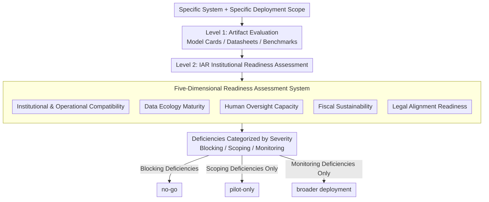

# Beyond Model Readiness: Institutional Readiness for AI Deployment in Public Systems

**Conference**: ICML2026  
**arXiv**: [2605.17203](https://arxiv.org/abs/2605.17203)  
**Code**: None  
**Area**: AI Governance/Deployment Policy  
**Keywords**: Institutional Readiness, AI Deployment, Public Sector, Responsible AI, Deployment Governance  

## TL;DR
Addressing the widespread phenomenon of AI systems in the public sector being "technically feasible but failing in deployment," this paper proposes the **Institutional Alignment Readiness (IAR)** five-dimensional assessment framework. It evaluates whether a receiving institution is prepared for the responsible deployment of AI systems across five dimensions: institutional compatibility, data ecology maturity, human oversight capacity, fiscal sustainability, and legal alignment.

## Background & Motivation

**Background**: The current field of responsible AI has produced numerous principles, checklists, and documentation tools, such as Model Cards, Datasheets for Datasets, and the NIST AI RMF, to evaluate the technical attributes of models and datasets. These tools are highly mature in assessing model accuracy, robustness, and fairness.

**Limitations of Prior Work**: AI systems in the public sector frequently stall between "prototype" and "scale," often due to bottlenecks that are not the model quality itself. Systems that perform well in internal tests may fail to proliferate because the receiving institution lacks approval processes, data-sharing protocols, human oversight capacity, operating budgets, or legal mandates. Existing frameworks evaluate the model and developer-side processes rather than whether the institution actually using the system is ready for deployment.

**Key Challenge**: There is a systemic misalignment between existing evaluation tools and real-world deployment needs—they evaluate the "artifact," whereas the "institution" determines deployment success. A system that passes all technical assessments may still fail to launch due to legal ambiguities in cross-agency data sharing, missing referral pathways, or insufficient training for frontline personnel.

**Goal**: To construct a practical, decision-oriented institutional readiness assessment framework that helps teams answer a critical question before scaling: "Is this institution currently ready to deploy this system within this scope?"

**Key Insight**: Based on two anonymized large-scale AI deployment cases in public education systems (an image-based anthropometric screening tool and a speech analysis system for early learning risk identification), the authors induce common dimensions of institutional barriers from actual deployment failures.

**Core Idea**: Shift the object of readiness assessment from "AI artifacts" to "receiving institutions" by proposing the IAR five-dimensional framework as a supplementary layer to existing model evaluation tools.

## Method

### Overall Architecture
IAR is a pre-deployment assessment framework that adds a **second layer of evaluation** on top of existing artifact-level assessments (tools like Model Cards, Datasheets, and benchmarks). It shifts the evaluation target to the "receiving institution," reviewing whether conditions for responsible system use are met across five institutional dimensions. It intentionally avoids a single score; instead, it categorizes identified deficiencies into three severity levels (blocking, scoping, monitoring). Based on these, it positions the system within the deployment lifecycle and outputs actionable recommendations: **no-go**, **pilot-only**, or **broader deployment**.

### Key Designs

**1. Five-Dimensional Readiness Assessment System: Systematically evaluating institutional deployment capacity across five independent and necessary dimensions**

Public sector AI often gets stuck between "prototype" and "scale" because bottlenecks reside in the receiving institution rather than the model. Current tools (Model Cards for models, Datasheets for datasets, NIST RMF for governance processes) fail to answer "Is this institution ready?" IAR shifts the evaluation focus to the institution, breaking down five dimensions of deployment constraints observed in real cases: (1) Institutional & Operational Compatibility—approval chains, workflow adaptation, operator training, windows for launch; (2) Data Ecology Maturity—representativeness of target populations, data sharing agreements, labeling capacity; (3) Human Oversight Capacity—qualified reviewers, referral pathways, anti-discrimination protocols; (4) Fiscal Sustainability—post-pilot budgets, maintenance and retraining plans; (5) Legal Alignment Readiness—privacy compliance, legal basis for consent, and appeal pathways. These five dimensions are "independent and necessary" because each covers a blind spot in artifact-level assessments. Failure in any single dimension can stall the system; notably, "fiscal sustainability" is the only dimension with virtually no corresponding standard ML evaluation mechanism—and it is the non-technical risk most often ignored by technical teams.

**2. Multi-stage Deployment Decision Logic: Converting readiness from a binary judgment into progressive stage management**

Public sector deployment is incremental and conditional in practice. Forcing a hard threshold or a weighted total score would cause the framework to lose applicability across different institutions and system types. Therefore, IAR intentionally avoids quantitative scoring. Instead, it categorizes deficiencies by severity—blocking (must stop), scoping (limited to pilot), and monitoring (can proceed but requires tracking). This positions the system into one of four stages: "not ready," "internal validation," "limited pilot," or "broader deployment." The output is an actionable deployment recommendation (no-go, pilot-only, or broader deployment) rather than a numerical score. This "good enough" design fits real-world decision-making rhythms and avoids assigning misleadingly precise numbers to qualitative institutional constraints.

**3. Inductive Construction Driven by Dual Case Studies: Extracting dimensions from real deployment failures rather than abstract derivation**

To ensure practical relevance, the five dimensions were not designed in a vacuum but were reverse-engineered from two large-scale AI projects in public education that reached technical feasibility yet stalled due to institutional reasons. Case A (image anthropometry screening) was hindered by insufficient data representativeness, missing referral pathways, and legal issues regarding inter-departmental data sharing. Case B (speech-based early risk identification) was forced into a complete pivot because required data was fundamentally unavailable, and later faced constraints from stakeholder alignment and governance requirements. Both cases confirm that technical evaluations cannot explain deployment trajectories—institutional factors like approval delays, referral gaps, and data sharing restrictions determine whether a system moves from validation to pilot and eventually to scale. By inducing dimensions from failure modes, each dimension includes observable signals of failure rather than vague principles.

## Key Experimental Results

### IAR Five-Dimensional Assessment Matrix

| IAR Dimension | Observable Indicators | Typical Failure Modes |
| :--- | :--- | :--- |
| Institutional & Operational Compatibility | Documented approval chains, workflow adaptation, operator training plans, deployment windows | System is technically ready but cannot launch due to pending approvals, workflow mismatch, or unprepared operators |
| Data Ecology Maturity | Dataset representativeness, data sharing protocols, labeling capacity, retention/deletion policies | Model performs well in development but cannot scale due to missing or slow acquisition of target population data |
| Human Oversight Capacity | Qualified reviewers, clear veto power, referral pathways, anti-discrimination protocols, personnel continuity | Human-in-the-loop becomes symbolic; edge cases go unreported; harmful outputs lack qualified intervention |
| Fiscal Sustainability | Post-pilot budget, maintenance/retraining plans, infrastructure cost estimates, leadership transition contingency | Pilot runs well, but becomes unmaintainable, cannot be retrained, or fails to scale after initial funding is exhausted |
| Legal Alignment Readiness | Privacy compliance, legal basis for collection/sharing, ethical review, consent/notice procedures, appeal pathways | Deployment delayed, reduced, or paused due to legal categorization, consent issues, or inter-agency data usage challenges |

### Comparison of Evaluation Blind Spots (Existing Frameworks vs. IAR)

| IAR Dimension | Example Existing Mechanisms | Object of Existing Assessment | Commonly Overlooked Deployment Issues |
| :--- | :--- | :--- | :--- |
| Institutional Compatibility | Model Cards, NIST AI RMF | Model behavior, intended use, governance recommendations | Whether specific approval chains exist, frontline workflow fit, feasibility of training |
| Data Ecology | Datasheets, Fairness Metrics | Properties of given datasets, distributional robustness | Whether target population data can be accessed, shared, labeled, and updated at the required scale |
| Human Oversight | HITL Design Guides, Impact Assessments | Presence of human review stages in design | Whether qualified reviewers, referral paths, veto power, and appeal mechanisms actually exist and are sustainable |
| Fiscal Sustainability | **No standard ML evaluation mechanism** | Outside scope of technical assessment | Survival of the system post-pilot, including maintenance, retraining, and continuity across leadership cycles |
| Legal Alignment | Privacy-preserving ML, Legal Checklists | Privacy attributes at the data processing level | Resolution of jurisdiction-specific consent, data classification, and cross-agency sharing requirements |

### Key Findings
- **Case A** (Image anthropometry screening): Initial development took only 2 months to reach technical readiness, but expanding data collection to more schools required over 6 additional months because approvals, coordination, and access had to be negotiated site-by-site and were constrained by the school calendar.
- **Case B** (Speech analysis risk identification): Forced into a complete pivot before deployment because required data was unavailable; data feasibility acted as a decisive institutional constraint. Stakeholder alignment remained the core challenge post-pivot.
- Common pattern across both cases: **Technical assessments fail to explain deployment trajectories**—institutional factors such as approval delays, referral gaps, and data sharing limits dictate whether a system moves from validation to pilot to scale.
- Antecedent dependencies exist between dimensions; for instance, legal alignment is often a prerequisite for data ecology maturity—in Case A, inter-departmental sharing of health-related student data required establishing a legal foundation first.

## Highlights & Insights
- **Paradigm Shift in Evaluation Object**: Shifting deployment readiness assessment from the "artifact" to the "institution." This change in perspective, while seemingly simple, precisely fills a structural blind spot in existing responsible AI frameworks—none of the existing tools answer "Is this institution ready?"
- **Pragmatic Non-Quantitative Design**: Intentionally avoiding a weighted scoring system for IAR and instead categorizing deficiencies into blocking/scoping/monitoring levels aligns with the incremental decision-making needs of the public sector. This "good enough" approach is a valuable lesson for the ML community when building evaluation tools.
- **Unique Contribution of "Fiscal Sustainability"**: Among the five dimensions, fiscal sustainability is the only one completely lacking a corresponding standard ML evaluation mechanism, highlighting the non-technical risk most prone to being ignored by technical teams during AI deployment.

## Limitations & Future Work
- **Limited Validation Scope**: The framework is built on only two anonymized cases within a single country's public education system. It has not yet been validated in other public sectors like healthcare or social services, or in international contexts.
- **Lack of Quantitative Tools**: Currently, IAR is a qualitative framework without standardized scoring scales, threshold settings, or dimensional weight guidance, which may limit the consistency and comparability of assessment results in practice.
- **Uncovered Supplier-Side Readiness**: The framework only evaluates the receiving institution; it does not assess the developer/delivery team's maintenance capabilities, audit responsiveness, or knowledge transfer protocols. The authors list this as a future direction.
- **Future Scalability**: Customizing different readiness expectations based on the risk level of the AI system (e.g., screening systems vs. administrative tools) and cross-domain validation to determine which dimensions are universal.

## Related Work & Insights
- Socio-technical critique by Selbst et al. (2019): Warns against assuming systems can migrate across contexts without rebuilding organizational support, providing a theoretical basis for IAR's institutional focus.
- Data cascades research by Sambasivan et al. (2021): Demonstrated that data failures in high-stakes AI reflect upstream organizational conditions rather than defects in the datasets themselves.
- Distinction from AI Maturity Models (Dreyling et al., 2024): While maturity models assess overall organizational AI capacity, IAR evaluates specific deployment conditions for a specific system—an organization might be "AI ready" at a macro level but still lack the referral pathways or legal basis required for a specific model.

<!-- RELATED:START -->

## Related Papers

- [\[ICML 2026\] Comprehensive AI Governance Requires Addressing Non-Model Gains](comprehensive_ai_governance_requires_addressing_non-model_gains.md)
- [\[ICML 2026\] Mapping Human Anti-collusion Mechanisms to Multi-agent AI Systems](mapping_human_anti-collusion_mechanisms_to_multi-agent_ai_systems.md)
- [\[AAAI 2026\] Beyond World Models: Rethinking Understanding in AI Models](../../AAAI2026/others/beyond_world_models_rethinking_understanding_in_ai_models.md)
- [\[AAAI 2026\] Designing Incident Reporting Systems for Harms from General-Purpose AI](../../AAAI2026/others/designing_incident_reporting_systems_for_harms_from_general-purpose_ai.md)
- [\[AAAI 2026\] Bridging the Skills Gap: A Course Model for Modern Generative AI Education](../../AAAI2026/others/bridging_the_skills_gap_a_course_model_for_modern_generative_ai_education.md)

<!-- RELATED:END -->
