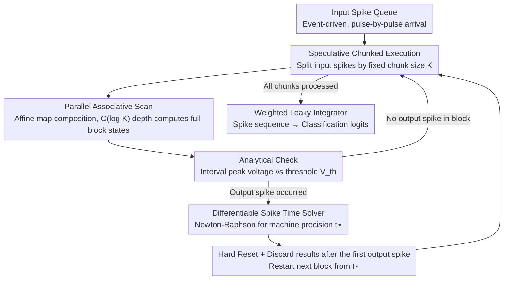

# Bullet Trains: Parallelizing Training of Temporally Precise Spiking Neural Networks

**Conference**: ICML 2026  
**arXiv**: [2603.13283](https://arxiv.org/abs/2603.13283)  
**Code**: https://github.com/ToddMorrill/snn-bullet-trains  
**Area**: Spiking Neural Networks / Parallel Training  
**Keywords**: Spiking Neural Networks, Parallel Associative Scan, Precise Spike Timing, Event-Driven, Neuromorphic Computing

## TL;DR

A parallel training method for Spiking Neural Networks (SNNs) based on parallel associative scan is proposed, achieving up to 44x speedup while maintaining exact hard-reset dynamics and utilizing a differentiable numerical root solver for machine-precision spike timing.

## Background & Motivation

**Background**: Spiking Neural Networks (SNNs) process information in an event-driven manner, computing only when spikes occur, which naturally aligns with biological neural computation and neuromorphic hardware. However, current SNN research primarily relies on GPU training, which faces severe parallelization bottlenecks.

**Limitations of Prior Work**: The "charge–fire–reset" dynamics of SNNs are inherently sequential—after consuming each input spike, a neuron must determine if an output spike is generated before the next input arrives. This results in training times that scale linearly $O(N)$ with the number of spikes, leading to extreme inefficiency on GPUs. Existing parallelization methods either completely remove the reset mechanism (PSN), use soft-reset approximations (SPikE-SSM), or relax discontinuous spike generation into continuous sigmoid proxies (FPT), all of which deviate from exact hard-reset semantics.

**Key Challenge**: A fundamental contradiction exists between parallelization and exact hard-reset dynamics—nonlinear dependencies introduced by hard resets block full parallelization, while abandoning hard resets reduces the neuron's nonlinear representational power and biological fidelity. Furthermore, most implementations rely on discrete time grids, limiting spike time precision to the time step and failing to distinguish the order of spikes within the same window.

**Goal**: (1) Achieve parallel processing of SNN spike events while maintaining exact hard resets; (2) Implement machine-precision spike time solving independent of discrete-time approximations.

**Key Insight**: The subthreshold state transition of a LIF neuron can be represented as an affine map, and the composition of affine maps remains an affine map, which naturally satisfies the associativity required for parallel scans. Through speculative chunked execution, spikes can be processed in parallel within blocks, while output spikes are quickly located via analytical checks.

**Core Idea**: Utilize parallel associative scan to consume multiple input spikes at once, combined with a Newton-Raphson root solver to precisely locate spike times, achieving significant GPU acceleration while fully preserving hard-reset semantics.

## Method

### Overall Architecture

The system operates in an event-driven manner: each LIF neuron maintains an input spike queue, and input spikes are divided into chunks of fixed size $K$. Within each chunk, a parallel associative scan is used to compute all future states simultaneously. Analytical checks determine if an output spike exists within the chunk; if so, a Newton-Raphson solver locates the precise spike time. After performing a hard reset, the process enters the next chunk. The final layer converts spike sequences into classification logits using weighted leaky integrators. The computational depth of the entire process is $O(C \log K)$, where $C$ is the number of chunks and $K$ is the chunk size.

### Key Designs

**1. Parallel Associative Scan: Bypassing Sequential Dependence of Hard Resets**

The bottleneck in SNN training lies in the "charge–fire–reset" process being sequentially processed spike-by-spike. The breakthrough lies in observing that the subthreshold state transition of a LIF neuron can be written as an affine map: from $\mathbf{s}_0=[V_0,I_0]^\top$ to $\mathbf{s}_1=[V_1,I_1]^\top$ satisfies $\mathbf{s}_1=M_1\mathbf{s}_0+\mathbf{b}_1$, where the decay matrix $M_1$ is determined by membrane and synaptic time constants, and $\mathbf{b}_1$ encodes synaptic weight injection. The composition of affine maps is still an affine map:

$$\text{Combine}\big((M_2,\mathbf{b}_2),(M_1,\mathbf{b}_1)\big)=(M_2M_1,\ M_2\mathbf{b}_1+\mathbf{b}_2)$$

This naturally satisfies the associativity needed for parallel scans. Thus, all intermediate states of a block of $K$ spikes can be computed in parallel with $O(\log K)$ depth using JAX's `associative_scan`, compressing $O(N)$ sequential steps into $O(C \log K)$ parallel depth.

**2. Differentiable Spike Time Solver: Numerical Root Solving for Machine Precision and Model Freedom**

Most SNN implementations discretize time into grids, limiting precision and spike ordering. Conversely, analytical solutions often impose constraints like $\tau_m=2\tau_s$, locking the model. This work defines a root function $R(\mathbf{p},t)=V(V_0,I_0,t)-V_{\text{th}}=0$. Within each interval between input spikes, the peak voltage time $t_{V_{\max}}$ and peak value $V(t_{V_{\max}})$ are calculated analytically to detect spikes. Newton-Raphson iteration then refines the spike time $t^\star$ to machine precision. Gradients are obtained directly via the implicit function theorem from $R(\mathbf{p},t^\star)=0$ as $\partial t^\star/\partial\mathbf{p}$, avoiding backtracking through solver iterations.

**3. Speculative Chunked Execution: Trading GPU Parallelization for Reset Correctness**

Associative scans require whole-block parallelism, but the reset point is unknown beforehand. This is solved via "speculate-then-verify": a parallel scan is run on a fixed chunk size $K$ (e.g., 128), followed by a parallel check for spikes. If a spike occurs, results after the first spike are discarded, a hard reset is applied, and the next chunk restarts from that spike time. This strategy is efficient because spike firing is sparse; most chunks trigger no spikes, meaning minimal discarded computation and significant throughput gains over sequential processing.

### Loss & Training

The output layer uses $N_{\text{cls}}$ weighted leaky integrators, converting spike sequences into logits via an exponentially decaying weighted integral $\int_0^{\tau_{\max}} e^{-t/\tau_{\text{LI}}} V(t) dt$, where earlier spikes receive higher weights. Training uses cross-entropy loss with a spike count regularizer to maintain sparsity. Synaptic weights $w_{ij}$ and learnable synaptic delays $d_{ij}$ are optimized end-to-end via exact gradients.

## Key Experimental Results

### Main Results

| Dataset | Method | Precise Gradient | Continuous Spike Time | Parallelization | Accuracy |
|--------|------|---------|-------------|--------|--------|
| MNIST | Göltz et al. (1F350H, $\tau_m=2\tau_s$) | ✓ | ✓ | ✗ | 97.20% |
| MNIST | Wunderlich & Pehle (1F350H) | ✓ | ✓ | ✗ | 97.60% |
| MNIST | **Ours** (1F350H) | ✓ | ✓ | ✓ | **98.04%** |
| SHD | Hammouamri et al. (2F256HD) | ✗ | ✗ | ✗ | **95.07%** |
| SHD | Mészáros et al. (2F512HD) | ✓ | ✗ | ✗ | 93.10% |
| SHD | **Ours** (2F512HD) | ✓ | ✓ | ✓ | 94.96% |
| SSC | Hammouamri et al. (2F512HD) | ✗ | ✗ | ✗ | **80.69%** |
| SSC | Mészáros et al. (2F512HD) | ✓ | ✗ | ✗ | 76.10% |
| SSC | **Ours** (2F512HD) | ✓ | ✓ | ✓ | 77.79% |

### Ablation Study

| Configuration | Speedup Factor | Description |
|------|---------|------|
| Max Speedup (SHD) | 44× | Relative to sequential event-driven baseline |
| chunk size = 128 | Optimal | Stable performance across various batch sizes and hidden dims |
| Yin-Yang, $\Delta t \to 0$ (Cont.) | Max Accuracy | Full temporal resolution |
| Yin-Yang, $\Delta t = 1$ ms | Significant drop | Discretization leads to precision loss |
| Yin-Yang, $\Delta t \geq 2$ ms | ~33% (Chance) | Complete loss of temporal encoding capability |

### Key Findings

- **Parallel associative scan achieves up to 44x speedup while preserving exact hard resets**, with significant advantages in scenarios involving large batch sizes and hidden dimensions.
- **A chunk size of 128 is a robust choice**; larger chunks increase parallelism but also increase memory bandwidth pressure and discarded computation.
- **Continuous spike timing is crucial for temporal encoding tasks**: on the Yin-Yang ITD task, discretization of $\Delta t \geq 2$ ms reduces accuracy to chance, while the continuous method maintains peak performance.
- On SHD/SSC, the method performs slightly below surrogate gradient methods (Hammouamri et al.), likely because current benchmarks rely heavily on rate-coding, where the smoothness of surrogate gradients is advantageous.

## Highlights & Insights

- **Migration of Associative Scan from SSM to SNN**: Adapting parallel associative scans from State Space Models to SNNs with non-linear hard resets using speculative execution is a key innovation. This "parallelize-then-correct" paradigm has potential applications in other parallel problems with conditional branching.
- **Gradients via Implicit Function Theorem**: Obtaining gradients directly via the implicit function theorem $R(\mathbf{p}, t^\star) = 0$ is efficient and avoids the memory overhead of backtracking through solver iterations.
- **Numerical Solvers for Model Freedom**: Numerical methods break the analytical constraints (e.g., $\tau_m = 2\tau_s$), allowing for heterogeneous time constants and more complex neuron models.

## Limitations & Future Work

- Currently validated only on fully connected feedforward architectures; **extension to convolutional or recurrent SNNs** is pending, where dynamic input queues in recurrent networks pose more challenges.
- Existing benchmarks (SHD, SSC) **rely primarily on rate-coding**, failing to fully exploit the advantages of continuous spike timing.
- Fixed computational budgets ($C$ and $S_{\max}$) might result in unprocessed input spikes in extreme high-firing scenarios.
- Impact of continuous-time training on deployment to actual neuromorphic hardware remains to be verified.

## Related Work & Insights

- **PSN** (Fang et al., 2023): Removes the reset mechanism, reducing the model to a linear filter solvable by convolution; efficient but loses non-linear expression.
- **SPikE-SSM** (Zhong et al., 2024): Decouples reset and integration using soft-resets (linear subtraction) rather than hard-resets.
- **FPT** (Feng et al., 2025): Models hard resets via fixed-point iteration scanning, but requires relaxation to continuous sigmoids during forward passes.
- **EventProp** (Wunderlich & Pehle, 2021): Exact gradient SNN training in continuous time, but restricted to sequential processing. This work serves as a parallelized acceleration of such methods.

<!-- RELATED:START -->

## Related Papers

- [\[ICLR 2026\] Training Deep Normalization-Free Spiking Neural Networks with Lateral Inhibition](../../ICLR2026/others/training_deep_normalization-free_spiking_neural_networks_with_lateral_inhibition.md)
- [\[CVPR 2026\] Robust Spiking Neural Networks by Temporal Mutual Information](../../CVPR2026/others/robust_spiking_neural_networks_by_temporal_mutual_information.md)
- [\[CVPR 2026\] On the Role of Temporal Granularity in the Robustness of Spiking Neural Networks](../../CVPR2026/others/on_the_role_of_temporal_granularity_in_the_robustness_of_spiking_neural_networks.md)
- [\[AAAI 2026\] ParaRevSNN: A Parallel Reversible Spiking Neural Network for Efficient Training and Inference](../../AAAI2026/others/pararevsnn_a_parallel_reversible_spiking_neural_network_for_efficient_training_a.md)
- [\[AAAI 2026\] TDSNNs: Competitive Topographic Deep Spiking Neural Networks for Visual Cortex Modeling](../../AAAI2026/others/tdsnns_competitive_topographic_deep_spiking_neural_networks_for_visual_cortex_mo.md)

<!-- RELATED:END -->
