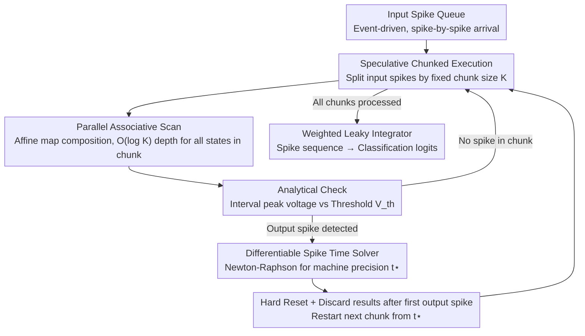

# Bullet Trains: Parallelizing Training of Temporally Precise Spiking Neural Networks

**Conference**: ICML 2026  
**arXiv**: [2603.13283](https://arxiv.org/abs/2603.13283)  
**Code**: https://github.com/ToddMorrill/snn-bullet-trains  
**Area**: Spiking Neural Networks / Parallel Training  
**Keywords**: Spiking Neural Networks, Parallel Associative Scan, Precise Spike Timing, Event-driven, Neuromorphic Computing

## TL;DR

A parallel training method for Spiking Neural Networks (SNNs) based on parallel associative scan is proposed, achieving up to 44× acceleration while maintaining exact hard-reset dynamics, using a differentiable numerical root solver to compute spike times with machine precision.

## Background & Motivation

**Background**: Spiking Neural Networks (SNNs) process information in an event-driven manner, computing only when spikes occur, which naturally aligns with biological neural computation and neuromorphic hardware. However, current SNN research primarily relies on GPUs for training, facing significant parallelization bottlenecks.

**Limitations of Prior Work**: The "charge–fire–reset" dynamics of SNNs are inherently sequential—after consuming each input spike, a neuron must determine whether to produce an output spike before the next input arrives. This leads to training times that grow linearly $O(N)$ with the number of spikes, which is highly inefficient on GPUs. Existing parallelization methods either completely remove the reset mechanism (PSN), use soft-reset approximations (SPikE-SSM), or relax discontinuous spike generation into continuous sigmoid proxies (FPT), all of which deviate from exact hard-reset semantics.

**Key Challenge**: A fundamental contradiction exists between parallelization and exact hard-reset dynamics—nonlinear dependencies introduced by hard resets block full parallelization, while abandoning hard resets reduces the neuron's nonlinear expressive power and biological fidelity. Furthermore, nearly all existing implementations rely on discrete time grids, where spike time precision is limited by the time step, and the order of spikes within the same window cannot be distinguished.

**Goal**: (1) Achieve parallel processing of SNN spike events while maintaining exact hard resets; (2) Implement machine-precision spike time solving independent of discrete-time approximations.

**Key Insight**: The authors observe that the subthreshold state transitions of Leaky Integrate-and-Fire (LIF) neurons can be expressed as affine maps. Since the composition of affine maps is still an affine map, it naturally satisfies the associativity required for parallel scans. Through speculative chunked execution, spikes can be processed in parallel within chunks, with analytical checks used to quickly locate output spikes.

**Core Idea**: Use parallel associative scans to consume multiple input spikes simultaneously, combined with a Newton-Raphson root solver to precisely locate spike times, achieving significant GPU acceleration while fully preserving hard-reset semantics.

## Method

### Overall Architecture

The system operates in an event-driven manner: each LIF neuron maintains an input spike queue, partitioning input spikes into fixed-size chunks of size $K$. Within each chunk, a parallel associative scan computes all future states at once. An analytical check determines if an output spike exists within the chunk; if so, a Newton-Raphson solver locates the precise spike time, and the next chunk starts after a hard reset at that time. The final layer uses weighted leaky integrators to transform spike sequences into classification logits. The computational depth of the entire process is $O(C \log K)$, where $C$ is the number of chunks and $K$ is the chunk size.

### Key Designs

**1. Parallel Associative Scan: Circumventing Sequential Dependencies of Hard Resets**

The root of slow SNN training is that "charge-fire-reset" is serial per spike—each input spike must be processed to see if an output triggers before the next. The breakthrough here is noting that LIF subthreshold state transitions are affine maps: from $\mathbf{s}_0=[V_0,I_0]^\top$ to $\mathbf{s}_1=[V_1,I_1]^\top$ such that $\mathbf{s}_1=M_1\mathbf{s}_0+\mathbf{b}_1$, where the decay matrix $M_1$ depends on time constants and $\mathbf{b}_1$ encodes synaptic weights. The composition is also affine:

$$\text{Combine}\big((M_2,\mathbf{b}_2),(M_1,\mathbf{b}_1)\big)=(M_2M_1,\ M_2\mathbf{b}_1+\mathbf{b}_2)$$

This satisfies associativity, allowing $K$ spikes to be processed in parallel using JAX's `associative_scan` with $O(\log K)$ depth, compressing $O(N)$ serial depth to $O(C\log K)$. While associative scans are mature in State Space Models (SSMs), the contribution here is applying them to SNNs with **nonlinear hard resets** by bypassing serial dependencies via the following designs.

**2. Differentiable Spike Time Solver: Machine Precision and Model Freedom via Root Finding**

Most SNNs discretize time into grids, limiting precision and spike ordering. Analytical spike times often require locking the model to constraints like $\tau_m=2\tau_s$. This work rejects both: defining a root function $R(\mathbf{p},t)=V(V_0,I_0,t)-V_{\text{th}}=0$. Within intervals between input spikes, the peak voltage time $t_{V_{\max}}$ and magnitude $V(t_{V_{\max}})$ are analytically checked; if a spike occurs, Newton-Raphson iterations solve for $t^\star$ with machine precision. Unimodality ensures convergence. Gradients bypass solver iterations via the Implicit Function Theorem: $R(\mathbf{p},t^\star)=0$ yields $\partial t^\star/\partial\mathbf{p}$ directly, saving memory and complexity. This liberates the model from discretization loss and analytical constraints, allowing heterogeneous time constants.

**3. Speculative Chunked Execution: Trading GPU Parallelism for Hard Reset Correctness**

Associative scans require whole-chunk parallelism, but which step fires and where to reset is unknown a priori—the core conflict between hard resets and parallelism. The solution is "speculate then verify": use a fixed chunk size $K$ (e.g., 128), run the scan, then check for output spikes in parallel. If any exist, discard everything after the first spike, reset at that time, and restart from there. Since firing is usually sparse relative to input spikes, most chunks yield no output and involve no discarded work. This strategy enables the 44× speedup by letting GPU throughput outweigh occasional redundant computation.

### Loss & Training

The output layer uses $N_{\text{cls}}$ weighted leaky integrators, converting spike sequences into logits via exponentially decayed integration $\int_0^{\tau_{\max}} e^{-t/\tau_{\text{LI}}} V(t) dt$, where early spikes receive higher weights. Training uses Cross-Entropy loss with a spike count regularizer for sparsity. Synaptic weights $w_{ij}$ and learnable delays $d_{ij}$ are optimized end-to-end using exact gradients.

## Key Experimental Results

### Main Results

| Dataset | Method | Exact Gradient | Continuous Spike Time | Parallelized | Accuracy |
|---------|--------|----------------|-----------------------|--------------|----------|
| MNIST | Göltz et al. (1F350H, $\tau_m=2\tau_s$) | ✓ | ✓ | ✗ | 97.20% |
| MNIST | Wunderlich & Pehle (1F350H) | ✓ | ✓ | ✗ | 97.60% |
| MNIST | **Ours** (1F350H) | ✓ | ✓ | ✓ | **98.04%** |
| SHD | Hammouamri et al. (2F256HD) | ✗ | ✗ | ✗ | **95.07%** |
| SHD | Mészáros et al. (2F512HD) | ✓ | ✗ | ✗ | 93.10% |
| SHD | **Ours** (2F512HD) | ✓ | ✓ | ✓ | 94.96% |
| SSC | Hammouamri et al. (2F512HD) | ✗ | ✗ | ✗ | **80.69%** |
| SSC | Mészáros et al. (2F512HD) | ✓ | ✗ | ✗ | 76.10% |
| SSC | **Ours** (2F512HD) | ✓ | ✓ | ✓ | 77.79% |

### Ablation Study

| Configuration | Acceleration | Description |
|---------------|--------------|-------------|
| Max Speedup (SHD) | 44× | Relative to sequential event-driven baseline |
| chunk size = 128 | Optimal | Stable across various batch sizes and hidden dims |
| Yin-Yang, $\Delta t \to 0$ (Cont.) | Max Accuracy | Full temporal resolution |
| Yin-Yang, $\Delta t = 1$ ms | Degraded | Discretization loss |
| Yin-Yang, $\Delta t \geq 2$ ms | ~33% (Chance) | Complete loss of temporal encoding capability |

### Key Findings

- **Parallel associative scan achieves up to 44× speedup while maintaining exact hard resets**, with advantages becoming more pronounced at larger batch sizes and hidden dimensions where sequential methods scale poorly.
- **A chunk size of 128 is robust**; larger chunks increase parallelism but also memory bandwidth pressure and discarded computation. In practice, sparse firing means wasted computation is minimal.
- **Continuous spike timing is critical for temporal tasks**: In the Yin-Yang ITD task, discretization at $\Delta t \geq 2$ ms drops accuracy to chance levels, while the continuous method maintains peak performance.
- On SHD/SSC, the method is slightly below surrogate gradient methods (Hammouamri et al.). The authors suggest these benchmarks rely more on rate-coding, where smooth surrogate gradients offer an optimization advantage.

## Highlights & Insights

- **Migrating Associative Scans from SSM to SNN**: Adapting parallel scans from State Space Models to SNNs with nonlinear hard resets via speculative execution is a key innovation—a "parallelize then correct" paradigm applicable to other parallel problems with conditional branches.
- **Implicit Function Theorem for Gradients**: Directly obtaining gradients of spike times with respect to parameters via $R(\mathbf{p}, t^\star) = 0$ is efficient and avoids unrolling solver iterations.
- **Numerical Solvers Liberating Neuron Models**: Breaking the analytical requirement for specific $\tau_m, \tau_s$ ratios allows for heterogeneous time constants and more complex neuron models.

## Limitations & Future Work

- Currently verified only for fully connected feedforward architectures; **extension to convolutional or recurrent SNNs** is more challenging as input queues become dynamic.
- Current benchmarks (SHD, SSC) **rely largely on rate-coding**, failing to fully exploit continuous spike timing. There is a lack of large-scale, strictly temporal encoding benchmarks.
- Fixed computational budgets ($C$ chunks and $S_{\max}$ spikes) may result in unprocessed input spikes in extreme high-firing scenarios.
- The impact of continuous-time training on deployment to physical neuromorphic hardware remains to be validated.

## Related Work & Insights

- **PSN** (Fang et al., 2023): Removes resets, becoming linear filters solvable via convolution; efficient but loses nonlinear power.
- **SPikE-SSM** (Zhong et al., 2024): Decouples reset and integration using soft-resets (linear subtraction).
- **FPT** (Feng et al., 2025): Models hard resets via fixed-point iterations but requires sigmoid relaxation for convergence.
- **EventProp** (Wunderlich & Pehle, 2021): Continuous-time exact gradient SNN training, but sequential; this work serves as its accelerated parallel counterpart.

<!-- RELATED:START -->

## Related Papers

- [\[ICLR 2026\] Online Pseudo-Zeroth-Order Training of Neuromorphic Spiking Neural Networks](../../ICLR2026/others/online_pseudo-zeroth-order_training_of_neuromorphic_spiking_neural_networks.md)
- [\[ICLR 2026\] Beyond Linear Processing: Dendritic Bilinear Integration in Spiking Neural Networks](../../ICLR2026/others/beyond_linear_processing_dendritic_bilinear_integration_in_spiking_neural_networ.md)
- [\[ICLR 2026\] Training Deep Normalization-Free Spiking Neural Networks with Lateral Inhibition](../../ICLR2026/others/training_deep_normalization-free_spiking_neural_networks_with_lateral_inhibition.md)
- [\[ICLR 2026\] Breaking Gradient Temporal Collinearity for Robust Spiking Neural Networks](../../ICLR2026/others/breaking_gradient_temporal_collinearity_for_robust_spiking_neural_networks.md)
- [\[AAAI 2026\] ParaRevSNN: A Parallel Reversible Spiking Neural Network for Efficient Training and Inference](../../AAAI2026/others/pararevsnn_a_parallel_reversible_spiking_neural_network_for_efficient_training_a.md)

<!-- RELATED:END -->
