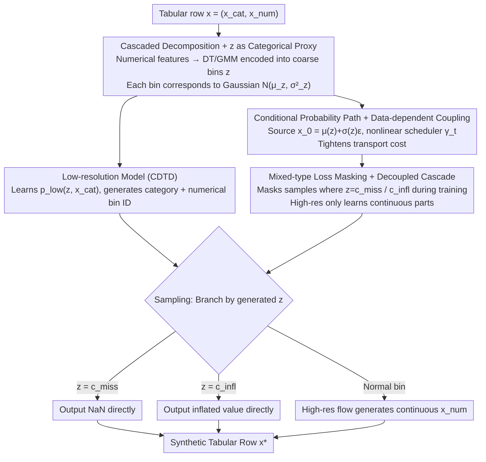

# Cascaded Flow Matching for Heterogeneous Tabular Data with Mixed-Type Features

**Conference**: ICML 2026  
**arXiv**: [2601.22816](https://arxiv.org/abs/2601.22816)  
**Code**: https://github.com/muellermarkus/tabcascade  
**Area**: Diffusion Models / Tabular Data Generation / Generative Modeling  
**Keywords**: Flow matching, Cascaded diffusion, Tabular data, Mixed-type features, Missing value generation

## TL;DR
TabCascade decomposes tabular rows into two cascaded stages: "low-resolution (categorical + discretized versions of numerical features)" and "high-resolution (continuous numerical details)." It first learns the low-resolution joint distribution using CDTD, then generates numerical details via flow matching guided by the low-resolution stage, while tightening transport costs through data-dependent coupling and a learnable nonlinear scheduler. It natively supports "mixed-type feature" generation (e.g., missing values, zero-inflation), achieving a 51.9% Gain in detection scores over SOTA across 12 datasets.

## Background & Motivation
**Background**: Tabular data generation is a core requirement in finance, medicine, and surveys. Prevailing methods (TabDDPM, TabSyn, CDTD, TabDiff) typically bundle categorical and numerical features into a shared diffusion/flow objective.

**Limitations of Prior Work**: (1) Categorical and numerical structures differ fundamentally (discrete support vs. continuous density, probability mass vs. probability density); a single objective allows certain features to implicitly dominate training. (2) **Mixed-type features** (e.g., zero-inflated wages, missing values, censored values) follow distributions where continuous densities overlap with discrete point masses. Existing diffusion models fail to handle this—they can be trained on data with missing values but only output continuous values during generation rather than NaN or exact zeros. (3) Literature indicates that numerical features are significantly harder to learn than categorical ones (numerical detection scores are much lower than categorical scores), yet current models apply the same capacity to both.

**Key Challenge**: The dual difficulty of heterogeneous features and mixed-type distributions—a single unified objective cannot simultaneously (a) balance the relative importance of categorical vs. numerical features, (b) accurately place point masses at specific discrete values (e.g., 0, NaN), and (c) provide sufficient expressivity for the remaining continuous parts of numerical features.

**Goal**: (1) Decouple "hard-to-learn numerical details" from "easy-to-learn categorical structures" by using specialized models for each. (2) Explicitly encode discrete decisions in the generation pipeline (e.g., "is this position missing/zero-inflated/normal"). (3) Introduce a "low-resolution guiding high-resolution" mechanism, inspired by cascaded diffusion in images, to reduce transport costs.

**Key Insight**: Image-based cascaded diffusion (e.g., Imagen) uses low-resolution versions to guide high-resolution detail generation. This work ports this metaphor to tabular data, modeling "categorical features = low-resolution" and "numerical features = high-resolution" separately.

**Core Idea**: Decomposing $p_\theta(x_{cat}, x_{num}) = \sum_z p_\theta^{\text{high}}(x_{num} | z, x_{cat}) p_\theta^{\text{low}}(z, x_{cat})$, where $z$ is a discretized version of numerical features (obtained via decision trees or GMM). This $z$ serves both as a conditioning variable and an expression for the discrete states of mixed-types.

## Method

### Overall Architecture
TabCascade extends a tabular row $x = (x_{cat}, x_{num})$ into $x_{low} = (x_{cat}, z)$ and $x_{num}$. **(1) Offline**: Train a Distributional Regression Tree (DT) or GMM encoder $\text{Enc}_i$ for each numerical feature $x^{(i)}_{num}$ to output $z^{(i)} = \text{Enc}_i(x^{(i)}_1)$ as a coarse bin ID; each bin corresponds to a Gaussian component $\mathcal{N}(\mu_{z^{(i)}}, \sigma^2_{z^{(i)}})$. **(2) Low-resolution model**: Use CDTD to learn $p_\theta^{\text{low}}(z, x_{cat})$ and generate categorical values along with numerical bin IDs. **(3) High-resolution model**: Use flow matching conditioned on $z, x_{cat}$ to generate numerical details $x_{num}$. **(4) Sampling**: First sample $z, x_{cat} \sim p_\theta^{\text{low}}$. If $z^{(i)} = c_{miss}$, output NaN directly; if $z^{(i)} = c_{infl}$, output the inflated value directly; otherwise, use the high-res flow to generate the continuous value.

### Key Designs

**1. Cascaded decomposition + $z$ as categorical proxy: Dividing hard numerical generation into "coarse bin selection then detail filling"**

The bottleneck in tabular diffusion lies in numerical features, which are harder to learn than categorical ones. Mixing discrete point masses (like missing values or zero-inflation) with continuous densities in a single objective is difficult to manage. This work borrows from image-based cascaded diffusion by first encoding numerical features $x^{(i)}_{num}$ into coarse bin IDs $z^{(i)}=\text{Enc}_i(x^{(i)})$ via Distributional Regression Trees (or GMM), where each leaf corresponds to a Gaussian component $\mathcal{N}(\mu_{z},\sigma^2_{z})$. This accomplishes two things: the chain rule ensures that when $z$ and $x_{num}$ are not independent, $H(x_{num}|z,x_{cat})<H(x_{num}|x_{cat})$, simplifying the high-resolution task; meanwhile, the discrete states of mixed-types are naturally encapsulated in $z$—missing values are assigned a unique category $c_{miss}$, and bins where $\sigma_z^2\approx0$ are treated as inflated values outputting $\mu_z$. The distribution is formulated as:

$$p_\theta(x_{cat},x_{num})=\sum_z p_\theta^{\text{high}}(x_{num}\mid z,x_{cat})\,p_\theta^{\text{low}}(z,x_{cat})$$

Using specialized models for categorical and numerical components eliminates the need for manual loss weighting (unlike CDTD) and offloads discrete point masses to the low-resolution model, allowing the high-resolution model to focus solely on the continuous parts.

**2. Guided conditional probability path + Data-dependent coupling: Using $z$ to shift source distributions near target bins**

Standard flow matching starts from an isotropic Gaussian $x_0\sim\mathcal{N}(0,I)$, where the distance between source and target leads to high transport costs. TabCascade uses low-resolution information $z$ to guide the high-resolution flow's source distribution and scheduler to tighten transport costs. First, data-dependent coupling $x_0=\mu(z)+\sigma(z)\varepsilon$ ensures the source falls near the target bin. Second, feature-specific nonlinear schedulers $\gamma_t(x_{low}):t\to[0,1]^{K_{num}}$, parameterized as 5th-order polynomials with closed-form derivatives, are used. The resulting probability path and guided vector field are:

$$x_t=\gamma_t(x_{low})x_1+(1-\gamma_t(x_{low}))[\mu(z)+\sigma(z)\varepsilon],\quad u_t(x_t\mid x_1,x_{low})=\frac{\dot{\gamma}_t(x_{low})(x_1-x_t)}{1-\gamma_t(x_{low})}$$

Theorem 1 proves that DT-derived coupling strictly tightens the transport cost bound and is easier to learn than independent coupling. Figure 3 visually confirms that under this coupling, $p_0$ is already very close to $p_1$, preserving model capacity for learning finer numerical details.

**3. Mixed-type loss masking + Decoupled cascade: Forcing the high-resolution model to ignore discrete states**

Traditional models must simultaneously learn "should it be missing" and "what value if not missing," leading to gradient interference. Since the discrete decision is fully managed by $z$ and the low-resolution model, the high-resolution model focuses only on continuous details. Specifically, during high-res training, the CFM loss for samples where $z=c_{miss}$ or $c_{infl}$ is masked (not participated), as they are already determined by $p_\theta^{\text{low}}$. During generation, branching occurs based on $z$—directly outputting fixed values (NaN / inflated) or running the flow for continuous values. This "divide and conquer" approach separates two fundamentally different tasks, enabling TabCascade to natively generate mixed-type features without cross-type loss balancing.

### Loss & Training
Low-res: Reuses the score interpolation loss from CDTD. High-res: Use CFM loss $\mathcal{L}_{\text{CFM}} = \mathbb{E} \| u_t^\theta(x_t | x_{low}) - \dot{\gamma}_t(x_{low})(x_1 - [\mu(z) + \sigma(z) \varepsilon]) \|^2$, where $u_t^\theta = \dot{\gamma}_t \cdot f^\theta(x_t, x_{low}, t)$. The two stages are trained independently, requiring no cross-type loss balancing—a significant engineering simplification compared to CDTD.

## Key Experimental Results

### Main Results
Average results across 12 standard tabular datasets with 7 SOTA comparisons:

| Metric | TabDDPM | TabSyn | TabDiff | CDTD | **Ours (DT)** |
|------|---------|--------|---------|------|-------|
| Detection Score↑ | 0.478 | 0.202 | 0.430 | 0.518 | **0.787** |
| Shape↑ | 0.938 | 0.927 | 0.954 | 0.970 | **0.984** |
| Shape (num)↑ | 0.943 | 0.918 | 0.952 | 0.962 | **0.985** |
| WD (num)↓ | 0.015 | 0.031 | 0.016 | 0.009 | **0.004** |
| JSD (cat)↓ | 0.083 | 0.063 | 0.030 | 0.020 | **0.018** |
| Trend↑ | 0.900 | 0.893 | 0.924 | 0.956 | **0.965** |

The detection score increases from 0.518 (CDTD) to 0.787, representing a relative Gain of approximately 52% (the 51.9% cited in the abstract). The numerical feature WD is reduced by more than half (0.009 → 0.004).

### Ablation Study
Motivational experiments (from Figure 2):

| Configuration | Detection Score | Description |
|------|---------|------|
| Average diffusion baseline (cat only) | ~0.85 | Categorical features are easier |
| Average diffusion baseline (num only) | ~0.55 | Numerical features are harder |
| Ours (on cat / num / all) | ~0.85+ across all | Num no longer drags down performance after decoupling |
| CDTD (adult) weight tuning cat=1×→4× | 0.72 → 0.76 | Manual tuning required for balance |

### Key Findings
- **Numerical generation quality is the real bottleneck**: After decoupling, numerical WD dropped from 0.009 to 0.004, a significant improvement that previous generations of models failed to achieve. Categorical performance remains at SOTA levels (near 1.0).
- **Mixed-type support is a qualitative leap**: All baselines (including strong ones like CDTD/TabDiff) cannot naturally generate NaN or exact zeros. TabCascade is the first diffusion model to natively support this.
- **DT encoder outperforms GMM**: As shown in the appendix, DT leaf nodes can partition based on other features, providing more informative $z$.
- **No loss balance tuning required**: Unlike CDTD, which requires grid-searching relative weights, TabCascade avoids this by using independent training stages.
- Low variance across 12 datasets (detection std 0.243 vs. CDTD 0.296) indicates the method's robustness.

## Highlights & Insights
- **Clever transplantation of "image cascaded diffusion" to tabular data**: Despite tabular data lacking an inherent concept of "resolution," the author maps "categorical = low-res" and "numerical = high-res," proving theoretically that $H(x_{num} | z, x_{cat}) < H(x_{num} | x_{cat})$ simplifies the task.
- **Mixed-type generation addresses a critical pain point**: In real-world tables, missing values are often informative (e.g., medical skips implying risk). The ability to accurately generate NaN is transformative for downstream imputation and counterfactual analysis.
- **Data-dependent coupling via Theorem 1**: DT-derived coupling strictly tightens the transport cost bound—aligning with recent work on mini-batch OT couplings (Tong 2024) but with zero extra overhead, applicable to any flow matching scenario.
- **Avoiding the "loss balance" trap**: While predecessor works spent much effort on cross-type loss balancing, TabCascade uses a "divide and conquer" cascade, signaling that for heterogeneous data, independent objectives are more engineering-feasible than a "unified" one.
- The logic (cascade + explicit discrete modeling + guided paths) is transferable to time-series with missing data, electronic health records, and multimodal recommendation features.

## Limitations & Future Work
- **Increased complexity due to two-stage training**: Requires training encoders, then low-res, then high-res; the pipeline is heavier than the single-stage CDTD.
- **Bottlenecked by encoder quality**: If DT binning is poor, $z$ fails to provide effective guidance, and the level 2 cascade fails; DT may overfit on high-cardinality categories.
- **Risk of correlation degradation**: If discretization binning is too coarse, fine-grained cross-feature correlations may be lost; "Trend (mixed)" was 0.928, slightly lower than "cat-only Trend."
- **Increased generation latency**: Sequential sampling from two models is slower; the paper lacks comparative speed data.
- Future directions: (a) End-to-end encoder learning; (b) exploring more cascade levels (coarse → medium → fine); (c) extending mixed-type frameworks to censored survival data; (d) unifying the framework with imputation models.

## Related Work & Insights
- **vs. TabDDPM / CoDi**: Those combine multinomial diffusion and DDPM but fail to solve numerical learning difficulty; TabCascade uses explicit stages.
- **vs. TabSyn**: TabSyn uses latent diffusion to compress all features, but data space has been shown to be superior for tabular data (Mueller 2025); TabCascade remains in data space but uses levels.
- **vs. CDTD / TabDiff**: Also from the Mueller team; while they used joint noise schedules for heterogeneity, TabCascade redefines heterogeneity as a resolution problem.
- **vs. Cascaded Diffusion (Ho 2022) / Imagen**: Methodologically derived from image cascades, but introduces tabular-specific interpretations and mixed-type generation as a unique contribution.
- **vs. Sahoo 2024 (latent noise schedule)**: That work makes the noise schedule latent-dependent (a weak cascade version); TabCascade's explicit $z$ generation is more interpretable.

## Rating
- Novelty: ⭐⭐⭐⭐⭐ First tabular cascaded diffusion + first to natively generate mixed-types; elegant concept mapping and solid theory.
- Experimental Thoroughness: ⭐⭐⭐⭐⭐ Coverage across 12 datasets, 7 SOTA, motivation, main results, MIA, MLE, and ablation.
- Writing Quality: ⭐⭐⭐⭐⭐ Data-driven motivation (Figure 2), rigorous theory (Theorem 1), and clear flowcharts; high-level execution for tabular papers.
- Value: ⭐⭐⭐⭐⭐ Resolves long-standing pain points (mixed-type + numerical precision); a 52% detection score jump is a major advancement for synthetic data and privacy-preserving release.

<!-- RELATED:START -->

## Related Papers

- [\[CVPR 2026\] Bidirectional Normalizing Flow: From Data to Noise and Back](../../CVPR2026/others/bidirectional_normalizing_flow_from_data_to_noise_and_back.md)
- [\[ICLR 2026\] TabStruct: Measuring Structural Fidelity of Tabular Data](../../ICLR2026/others/tabstruct_measuring_structural_fidelity_of_tabular_data.md)
- [\[ICML 2025\] Score Matching with Missing Data](../../ICML2025/others/score_matching_with_missing_data.md)
- [\[NeurIPS 2025\] Radar: Benchmarking Language Models on Imperfect Tabular Data](../../NeurIPS2025/others/radar_benchmarking_language_models_on_imperfect_tabular_data.md)
- [\[AAAI 2026\] Cash Flow Underwriting with Bank Transaction Data: Advancing MSME Financial Inclusion in Malaysia](../../AAAI2026/others/cash_flow_underwriting_with_bank_transaction_data_advancing_msme_financial_inclu.md)

<!-- RELATED:END -->
