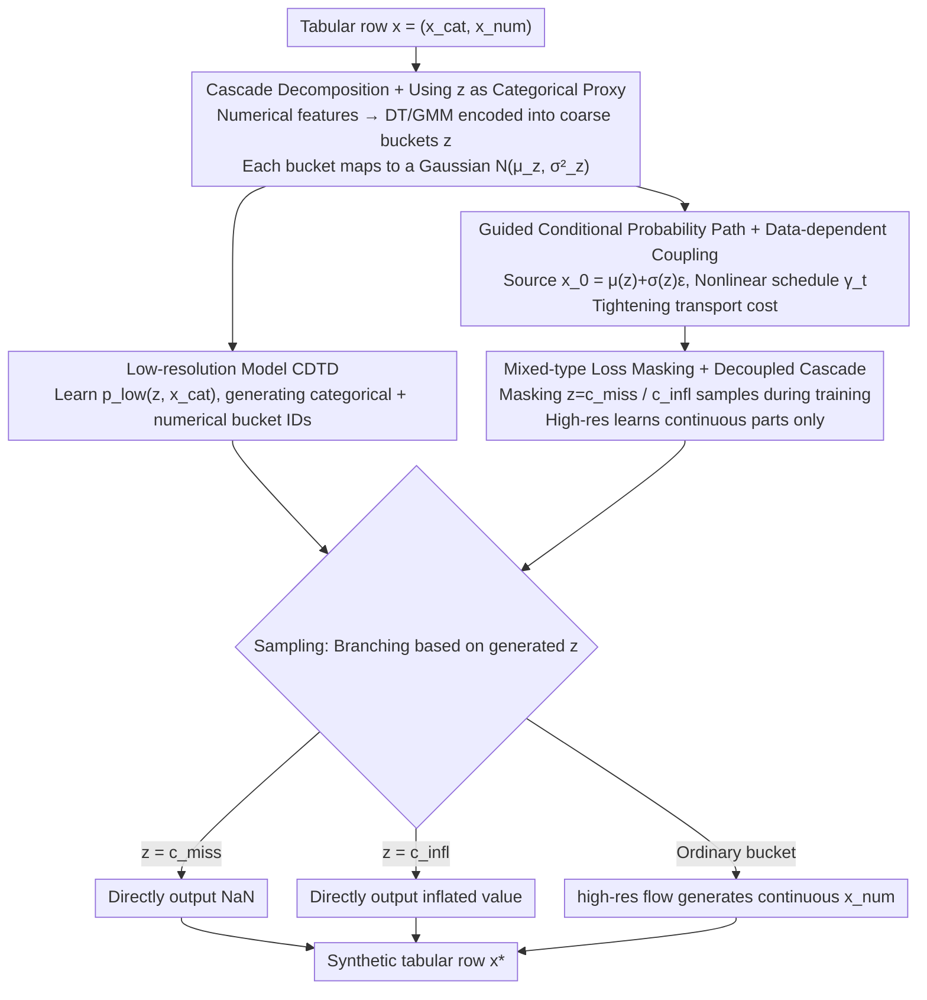

# Cascaded Flow Matching for Heterogeneous Tabular Data with Mixed-Type Features

**Conference**: ICML 2026  
**arXiv**: [2601.22816](https://arxiv.org/abs/2601.22816)  
**Code**: https://github.com/muellermarkus/tabcascade  
**Area**: Diffusion Models / Tabular Data Generation / Generative Modeling  
**Keywords**: Flow matching, Cascaded diffusion, Tabular data, Mixed-type features, Missing value generation

## TL;DR
TabCascade decomposes tabular rows into two cascaded segments: "low-resolution (categorical + discretized version of numerical)" and "high-resolution (continuous numerical)". It first learns the low-resolution joint distribution using CDTD and then generates numerical details using flow matching guided by the low-resolution information. Transport costs are tightened through data-dependent coupling and learnable non-linear time schedules. It natively supports the generation of "mixed-type features" (e.g., missing values, zero-inflation), achieving a 51.9% Gain in detection scores over SOTA across 12 datasets.

## Background & Motivation
**Background**: Tabular data generation is a core requirement in domains like finance, medicine, and surveys. Mainstream methods (TabDDPM, TabSyn, CDTD, TabDiff) typically incorporate categorical and numerical features into a single shared diffusion/flow objective.

**Limitations of Prior Work**: (1) Categorical and numerical structures are fundamentally different (discrete support vs. continuous density, probability mass vs. probability density), and a single objective may allow certain features to implicitly dominate training; (2) **Mixed-type features** (e.g., zero-inflated wages, missing values, censored values) involve a distribution of continuous density superimposed with discrete point masses, which current diffusion models cannot accurately handle—they can train on data with missing values but only output continuous values during generation, failing to produce precise NaNs or zeros; (3) Evidence in the literature suggests numerical features are significantly harder to learn than categorical ones (detection scores for numerical features are much lower than for categorical ones), yet current models use the same capacity for both.

**Key Challenge**: The dual difficulty of heterogeneous features and mixed-type distributions—a unified objective cannot simultaneously (a) balance the relative importance of categorical versus numerical features, (b) precisely place probability mass at specific discrete values (e.g., 0, NaN), or (c) provide sufficient expressivity for the remaining continuous parts of numerical data.

**Goal**: (1) Decouple "hard-to-learn numerical details" from the "easy-to-learn categorical structure," allowing each feature to use a specialized model; (2) Explicitly encode discrete decisions such as "this position is missing/zero-inflated/normal" within the generation pipeline; (3) Adapt the "low-resolution guided high-resolution" mechanism from image cascaded diffusion to reduce transport costs.

**Key Insight**: Image cascaded diffusion (e.g., Imagen) uses low-resolution versions to guide the generation of high-resolution details. The authors translate this metaphor to tabular data—modeling "categorical features = low-resolution" and "numerical features = high-resolution" as separate information levels.

**Core Idea**: Decomposing $p_\theta(x_{cat}, x_{num}) = \sum_z p_\theta^{\text{high}}(x_{num} | z, x_{cat}) p_\theta^{\text{low}}(z, x_{cat})$, where $z$ is a discretized version of the numerical features obtained via decision trees or GMMs. This $z$ acts as both a conditioning variable and a representation of the discrete states in mixed-type distributions.

## Method

### Overall Architecture
TabCascade expands a tabular row $x = (x_{cat}, x_{num})$ into $x_{low} = (x_{cat}, z)$ and $x_{num}$. **(1) Offline**: For each numerical feature $x^{(i)}_{num}$, a Distributional Regression Tree (DT) or GMM encoder $\text{Enc}_i$ is trained to output $z^{(i)} = \text{Enc}_i(x^{(i)}_1)$ as a coarse bucket ID; each bucket corresponds to a Gaussian component $\mathcal{N}(\mu_{z^{(i)}}, \sigma^2_{z^{(i)}})$. **(2) Low-resolution model**: A CDTD model learns $p_\theta^{\text{low}}(z, x_{cat})$ to generate categorical data and numerical bucket IDs. **(3) High-resolution model**: Using $z, x_{cat}$ as conditions, flow matching generates numerical details $x_{num}$. **(4) Sampling**: $z, x_{cat}$ are sampled first from $p_\theta^{\text{low}}$; if $z^{(i)} = c_{miss}$, NaN is output; if $z^{(i)} = c_{infl}$, the inflated value is output; otherwise, continuous values are generated using the high-res flow.

### Key Designs

**1. Cascade Decomposition & Using $z$ as Categorical Proxy: Breaking numerical generation into "coarse bucket selection, then detail filling"**

The real bottleneck in tabular diffusion is numerical features—they are much harder to learn than categories, and mixing discrete point masses like missing values or zero-inflation into continuous densities via a single objective is difficult. This work borrows the idea of image cascaded diffusion to first encode numerical features $x^{(i)}_{num}$ into coarse bucket IDs $z^{(i)}=\text{Enc}_i(x^{(i)})$ using a Distributional Regression Tree (or GMM), where each leaf corresponds to a Gaussian component $\mathcal{N}(\mu_{z},\sigma^2_{z})$. This step achieves two goals: the chain rule ensures that when $z$ and $x_{num}$ are not independent, $H(x_{num}|z,x_{cat})<H(x_{num}|x_{cat})$, simplifying the task for the high-resolution model. Furthermore, mixed-type discrete states are naturally contained in $z$—missing values are assigned to a standalone category $c_{miss}$, and buckets with $\sigma_z^2\approx0$ are treated as inflated values outputting $\mu_z$. The distribution is formulated as:

$$p_\theta(x_{cat},x_{num})=\sum_z p_\theta^{\text{high}}(x_{num}\mid z,x_{cat})\,p_\theta^{\text{low}}(z,x_{cat})$$

Specialized models for categorical and numerical data eliminate the need to tune relative loss weights (a challenge in CDTD) and offload discrete point masses to the low-resolution model, allowing the high-resolution model to focus solely on the continuous parts.

**2. Guided Conditional Probability Path & Data-Dependent Coupling: Using $z$ to shift the source distribution near the target bucket**

Standard flow matching starts from an isotropic Gaussian $x_0\sim\mathcal{N}(0,I)$, resulting in a large transport distance. TabCascade uses low-resolution information $z$ to guide the source distribution and time schedule of the high-resolution flow to tighten the transport cost: first, via data-dependent coupling $x_0=\mu(z)+\sigma(z)\varepsilon$, placing the source directly near the target bucket; second, through feature-specific non-linear time schedules $\gamma_t(x_{low}):t\to[0,1]^{K_{num}}$, parameterized as 5th-order polynomials with closed-form derivatives. The resulting probability path and guided vector field are:

$$x_t=\gamma_t(x_{low})x_1+(1-\gamma_t(x_{low}))[\mu(z)+\sigma(z)\varepsilon],\quad u_t(x_t\mid x_1,x_{low})=\frac{\dot{\gamma}_t(x_{low})(x_1-x_t)}{1-\gamma_t(x_{low})}$$

Theorem 1 proves that DT-derived coupling strictly tightens the transport cost bound and is easier to learn than independent coupling. Figure 3 visually confirms that under this coupling, $p_0$ is already very close to $p_1$—saving model capacity for learning numerical details.

**3. Mixed-Type Loss Masking & Decoupled Cascade: Allowing the high-resolution model to ignore discrete states**

Traditional models must simultaneously learn "whether it should be missing" and "what the value is if not missing," leading to gradient interference. Since the discrete decision is entirely managed by $z$ and the low-resolution model, the high-resolution model can focus on continuous details. Specifically, samples where $z=c_{miss}$ or $c_{infl}$ are masked from the high-res CFM loss during training. During generation, branches are followed based on $z$—discrete states directly output fixed values (NaN/inflated), while continuous paths run the flow. This "divide and conquer" approach separates fundamentally different tasks, which is the core reason TabCascade natively generates mixed-type features without requiring cross-type loss balancing.

### Loss & Training
Low-res: Utilizes the score interpolation loss from CDTD. High-res: CFM loss $\mathcal{L}_{\text{CFM}} = \mathbb{E} \| u_t^\theta(x_t | x_{low}) - \dot{\gamma}_t(x_{low})(x_1 - [\mu(z) + \sigma(z) \varepsilon]) \|^2$, where $u_t^\theta = \dot{\gamma}_t \cdot f^\theta(x_t, x_{low}, t)$. The two stages are trained independently, eliminating the need to balance cross-type loss weights—a significant engineering simplification compared to CDTD.

## Key Experimental Results

### Main Results
Average results across 12 standard tabular datasets vs. 7 SOTA baselines:

| Metric | TabDDPM | TabSyn | TabDiff | CDTD | **Ours (DT)** |
|------|---------|--------|---------|------|-------|
| Detection Score↑ | 0.478 | 0.202 | 0.430 | 0.518 | **0.787** |
| Shape↑ | 0.938 | 0.927 | 0.954 | 0.970 | **0.984** |
| Shape (num)↑ | 0.943 | 0.918 | 0.952 | 0.962 | **0.985** |
| WD (num)↓ | 0.015 | 0.031 | 0.016 | 0.009 | **0.004** |
| JSD (cat)↓ | 0.083 | 0.063 | 0.030 | 0.020 | **0.018** |
| Trend↑ | 0.900 | 0.893 | 0.924 | 0.956 | **0.965** |

The Detection score improved from 0.518 (CDTD) to 0.787, a relative Gain of approximately 52% (source of the 51.9% figure in the abstract). The WD for numerical features is more than halved compared to CDTD (0.009→0.004).

### Ablation Study
Motivational experiments (from Figure 2):

| Configuration | Detection Score | Description |
|------|---------|------|
| Avg. diffusion baseline on cat only | ~0.85 | Categorical is easy |
| Avg. diffusion baseline on num only | ~0.55 | Numerical is hard |
| Ours on cat / num / all | ~0.85+ throughout | Num no longer drags down performance after decoupling |
| CDTD on adult (cat loss weight=1×→4×) | 0.72 → 0.76 | Requires manual tuning for balance |

### Key Findings
- **Numerical generation quality is the true bottleneck**: After decoupling, numerical WD dropped from 0.009 to 0.004, progress that previous generations of models failed to achieve. Categorical performance, already near 1, remains at SOTA levels.
- **Mixed-type support is a qualitative breakthrough**: All baselines (including strong ones like CDTD/TabDiff) cannot natively generate NaNs or precise zeros; TabCascade is the first diffusion model with this native capability.
- **DT encoder outperforms GMM** (detailed in the appendix), as DT leaf nodes can split based on other features, providing more informative guidance $z$.
- **No need for loss balance tuning**: CDTD required grid-searching relative weights for gains; TabCascade completely avoids this pain point due to independent two-stage training.
- Low variance across 12 datasets (detection std of 0.243 vs. CDTD 0.296) indicates the method's robustness.

## Highlights & Insights
- **Novel Conceptual Translation**: The adaptation of "image cascaded diffusion to tabular data" is clever. While tabular data lacks a natural concept of "resolution," the authors implement this metaphor via "categorical = low-res" and "numerical = high-res," rigorously proving that $H(x_{num} | z, x_{cat}) < H(x_{num} | x_{cat})$ simplifies the task.
- **Mixed-type generation addresses a critical pain point**: In real-world tables, missing values are often informative (e.g., medical data omissions). The ability to precisely place NaNs is transformative for downstream imputation or counterfactual analysis.
- **Data-dependent Coupling Theorem**: Theorem 1 proves that DT-derived coupling strictly tightens the transport cost bound—aligning with recent work on mini-batch OT couplings (Tong 2024) but with zero additional overhead.
- **Eliminating "Loss Balance" Frustration**: Much effort in previous work like CDTD was spent on cross-type loss balancing. TabCascade's "divide and conquer" via cascade shows it is more engineering-feasible than unified objectives for heterogeneous data.
- The general framework (cascade + explicit discrete state modeling + guided paths) is transferable to: time series with missing values, multi-modal electronic health records, and multi-modal recommendation features.

## Limitations & Future Work
- **Two-stage training increases complexity**: Requires training encoders → low-res → high-res, making the pipeline longer and heavier than one-stage models like CDTD.
- **Encoder quality determines the upper bound**: If the DT bucket partitioning is poor, $z$ will fail to provide effective guidance, causing the Level 2 cascade to fail. DT might also overfit on high-cardinality categorical features.
- **Risk of correlation disruption**: If binning is too coarse when discretizing numerical features into $z$, fine-grained cross-feature correlations might be lost; the Mixed Trend score (0.928) was slightly lower than Cat-only Trend.
- **Increased generation latency**: Serial sampling from two models is slower than a single model; the paper lacks extensive speed comparison data.
- Future directions: (a) End-to-end learning of the encoder; (b) Exploring multi-level cascades (coarse → medium → fine); (c) Extending the mixed-type framework to censored survival data; (d) Unifying generation and completion with joint imputation models.

## Related Work & Insights
- **vs. TabDDPM / CoDi**: Those combine multinomial diffusion and DDPM without solving the numerical learning bottleneck; TabCascade uses explicit stages.
- **vs. TabSyn**: TabSyn uses latent diffusion to compress all features, but (Mueller 2025) showed that latent diffusion is inferior to data space in tabular contexts; TabCascade stays in data space while using hierarchical modeling.
- **vs. CDTD / TabDiff**: Previous works from the same team; TabDiff/CDTD learned joint noise schedules. TabCascade redefines the heterogeneity problem as a "resolution" problem, which is a more fundamental shift.
- **vs. Cascaded Diffusion (Ho 2022) / Imagen**: Methodologically descended from image cascades, but introduces unique tabular contributions through feature type reinterpretation and mixed-type generation.
- **vs. Sahoo 2024 (latent noise schedule)**: That work makes the noise schedule dependent on a latent variable; TabCascade explicitly generates $z$ instead of using latents, making it more interpretable.

## Rating
- Novelty: ⭐⭐⭐⭐⭐ First tabular cascaded diffusion + first to natively generate mixed-type features (NaN/inflated); elegant conceptual translation and solid theory.
- Experimental Thoroughness: ⭐⭐⭐⭐⭐ Covers 12 datasets, 7 SOTA baselines, and includes motivation/main results/MIA/MLE/ablation.
- Writing Quality: ⭐⭐⭐⭐⭐ Data-driven motivation (Figure 2), rigorous theoretical proof (Theorem 1), and clear flowcharts.
- Value: ⭐⭐⭐⭐⭐ Solves two long-standing tabular generation issues; the 52% detection score jump is a significant advance for synthetic data and privacy-preserving release.

<!-- RELATED:START -->

## Related Papers

- [\[ICLR 2026\] TabStruct: Measuring Structural Fidelity of Tabular Data](../../ICLR2026/others/tabstruct_measuring_structural_fidelity_of_tabular_data.md)
- [\[ICML 2025\] Score Matching with Missing Data](../../ICML2025/others/score_matching_with_missing_data.md)
- [\[ICML 2026\] GOTabPFN: From Feature Ordering to Compact Tokenization for Tabular Foundation Models on High-Dimensional Data](gotabpfn_from_feature_ordering_to_compact_tokenization_for_tabular_foundation_mo.md)
- [\[AAAI 2026\] Cash Flow Underwriting with Bank Transaction Data: Advancing MSME Financial Inclusion in Malaysia](../../AAAI2026/others/cash_flow_underwriting_with_bank_transaction_data_advancing_msme_financial_inclu.md)
- [\[NeurIPS 2025\] Radar: Benchmarking Language Models on Imperfect Tabular Data](../../NeurIPS2025/others/radar_benchmarking_language_models_on_imperfect_tabular_data.md)

<!-- RELATED:END -->
