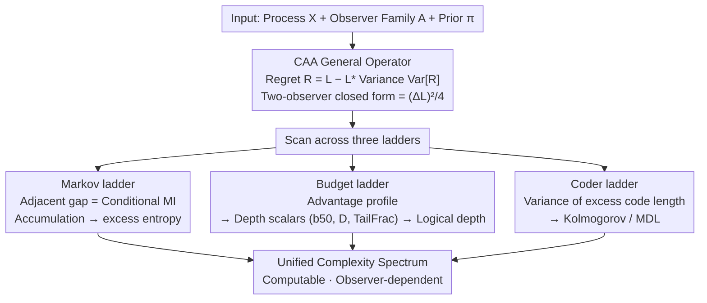

# Complexity as Advantage: A Regret-Based Perspective on Emergent Structure

**Conference**: ICML 2026  
**arXiv**: [2511.04590](https://arxiv.org/abs/2511.04590)  
**Code**: None  
**Area**: Theory/ML Foundations  
**Keywords**: Complexity measures, Regret dispersion, Information theory, Logical depth, MDL

## TL;DR
This paper proposes Complexity-as-Advantage (CAA): redefining "complexity" as the **regret dispersion** of a family of **resource-constrained observers** over the same process. It proves that under a log-loss + Markov framework, it is equivalent to the sum of conditional mutual information atoms (recovering excess entropy exactly), and from a coding perspective, it is equivalent to the variance of excess description length (MDL). This unifies Kolmogorov complexity, Bennett's logical depth, and excess entropy into a **computable and empirically estimable** scalar spectrum.

## Background & Motivation

**Background**: There are numerous classical definitions of complexity—Shannon entropy characterizes uncertainty, Kolmogorov complexity $K(x)$ is the shortest program length, Bennett's logical depth characterizes the "computational effort required to unfold structure," and Crutchfield’s excess entropy measures predictive information. Each captures an aspect of "structure" from a specific perspective.

**Limitations of Prior Work**: The authors highlight a problem with an intuitive question: why do Shakespearean texts and random noise have similar compression ratios under gzip, yet Large Language Models can easily learn the former while being defeated by the latter? Classical measures either **conflate** these two categories (e.g., entropy rate), are **non-computable** (e.g., $K(x)$), or **do not depend on observer resources** (failing to account for "who can extract the structure").

**Key Challenge**: The "utility" of complexity is essentially **relative to the observer's capability**—a source has "extractable structure" only when a strong observer can consistently predict better than a weak one. Most classical definitions are **single scalars** or **absolute quantities** that cannot express "to whom the structure is visible."

**Goal**: Construct a complexity measure that simultaneously satisfies: (i) computability (estimable via regret); (ii) observer-dependence (explicitly dependent on the observer family); (iii) compatibility with classical theory (reverting to entropy, MI, and logical depth in the limit); and (iv) the ability to empirically separate shallow, chaotic, and deep processes.

**Key Insight**: Instead of asking "how complex is this sequence," it is better to ask "what is the dispersion of regret among a family of observers on this process." If all observers have the same regret (equally weak or equally strong), the structure of the source is **indistinguishable** to that family; structure is only truly "exploitable" when there is significant regret dispersion.

**Core Idea**: Define complexity as the **variance** (or maximum gap) of regret over an observer distribution, characterizing "structure" as the **degree of dispersion** in "which observers can take advantage of which other observers."

## Method

### Overall Architecture

CAA is a **general operator** with three inputs:
- A process $X = (X_u)_{u \in I}$ (time series, spatial lattices, or graph nodes);
- An observer family $\mathcal{A}$ (any set of predictors/encoders);
- A reference distribution $\pi$ over the observers.

It outputs a scalar $\mathrm{CAA}(X; \mathcal{A}, \pi)$, characterizing the regret dispersion of this observer family on the process. The paper does not introduce new models or train networks; instead, it translates "complexity" into an **estimable statistic** and proves its equivalence to classical quantities under three specialized scenarios (Markov ladder, budget ladder, and coder ladder).

Mechanism:
1. Select $X$ and $\mathcal{A}$;
2. Estimate average loss $L(A; X)$ and regret $R(A;X) = L(A;X) - L^*(X)$ for each $A \in \mathcal{A}$;
3. Calculate $\mathrm{Var}_{A \sim \pi}[R(A;X)]$ or the maximum gap to obtain CAA;
4. Scan across different ladders (Markov order, computational budget, encoder sets) to obtain an "advantage profile" and extract scalar metrics.

The architecture is a divergent-convergent structure: **Common definition $\to$ Three ladders $\to$ Convergence to classical quantities**.

### Key Designs

**1. General definition of CAA: Turning "visibility of structure" into a computable scalar**

Classical complexity is either non-computable ($K(x)$) or observer-blind (entropy rate), leading gzip to conflate Shakespeare with noise. CAA shifts the question: instead of asking "how complex is this sequence," it asks "what is the regret dispersion of a family of observers on it." Formally, given asymptotic average loss $L(A;X) = \limsup_{|\Lambda|\to\infty}\frac{1}{|\Lambda|}\sum_{u\in\Lambda}\ell(\hat{y}^A_u, X_u)$, optimal loss $L^*(X) = \inf_A L(A;X)$, and regret $R(A;X)=L(A;X)-L^*(X)$, complexity is defined as:

$$\mathrm{CAA}(X;\mathcal{A},\pi) = \mathrm{Var}_{A\sim\pi}[R(A;X)],$$

with a max-gap variant $\mathrm{CAA}_{\max}(X) = \sup_{A,B}|R(A;X)-R(B;X)|$. For two observers $\{A_{\text{naive}},A_{\text{soph}}\}$ under a uniform prior, there is a clean closed form $\mathrm{CAA}(X)=\tfrac14(\Delta L)^2$ (where $\Delta L=L_{\text{naive}}-L_{\text{soph}}$), directly linking CAA to the familiar "performance gap." This design sidesteps non-computability and explicitly encodes "resource constraints" via the observer family.

**2. CAA decomposition under Markov ladder: CAA gaps as conditional MI atoms**

Under log-loss, the loss of an order-$m$ Markov predictor is exactly the conditional entropy $L(A^{(m)};X)=H(X_t\mid X_{t-1},\dots,X_{t-m})$. Thus, the gap between adjacent orders:

$$\Delta L_m = L(A^{(m-1)};X)-L(A^{(m)};X) = I(X_t; X_{t-m}\mid X_{t-1}^{t-m+1})$$

is exactly a conditional mutual information atom. Accumulating these via a telescoping sum $\sum_{m=1}^{M}\Delta L_m = H(X_t)-H(X_t\mid X_{t-1}^{t-M})$ converges to excess entropy $E=I(X_{-\infty}^{t-1};X_t)$ as $M\to\infty$. This demonstrates that CAA is a fine-grained version of excess entropy that identifies exactly at which order predictive advantages are unlocked.

**3. Budget ladder + scalar depth metrics: Operationalizing Bennett's logical depth**

Bennett's logical depth is theoretically elegant but practically non-computable. CAA operationalizes it using "computational budget" as the observer ladder. Taking a family $\{A^{(b)}\}$ where $b$ represents a budget (e.g., search depth, rollout length), the gap $\Delta L_b=L(A^{(b-1)};X)-L(A^{(b)};X)\ge 0$ defines a CAA gap. Three scalars are extracted from the profile $\{\Delta L_b\}$: tail fraction $\mathrm{TailFrac}_\alpha$, half-mass budget $b_{50}$, and normalized depth score $D$. These categorize processes: shallow processes (e.g., Rule 90) have front-loaded gains (small $b_{50}, D$); deep processes (e.g., Rule 110) have back-loaded gains (large tail fraction, $D$); chaotic processes (Rule 30) have minimal overall gains.

**4. CAA under coder ladder: Variance of excess code length**

This ladder links CAA back to Kolmogorov complexity and MDL. While $K(x^n)$ is non-computable, practical compressors provide upper bounds $K(x^n)\le L_n(A;x^n)+O(1)$. CAA replaces "loss" with code length: for a family of lossless encoders $A$ with per-symbol code length $\bar L_n(A;x^n)$, regret is $R_n(A;x^n)=\bar L_n(A;x^n)-\min_{B\in\mathcal{A}}\bar L_n(B;x^n)$. Taking the variance over encoders yields CAA. This measures how much different coding strategies diverge: if all encoders are asymptotically optimal or all are equally incapable (noise), CAA $\approx 0$. CAA is significant only when specific encoders can extract structures that others cannot.

### Loss & Training

This is a theoretical and diagnostic framework; **no models were trained**. All "losses" refer to the log-loss of observer predictions $\ell(x, \hat{P}) = -\log_2 \hat{P}(x)$ (or bits-per-symbol). Estimation follows a classic online protocol: average online log-loss is calculated over a sequence of length $N$, and mean/std of $\Delta L$ and CAA are computed over $B$ independent resampled trials. Markov predictors use Laplace smoothing with $\alpha = 1$.

## Key Experimental Results

### Main Results

Experiment I: U-shaped curve of CAA on adjustable sources. The source is a Bernoulli mixture—outputting a fixed periodic template with probability $p$ and a fair coin with $1-p$. $p=0$ is pure noise, $p=1$ is pure periodicity.

| Observer Pair | $p \approx 0$ (Noise) | $p \approx 1$ (Periodic) | Intermediate | Behavior |
|---|---|---|---|---|
| Pair A (k=1 vs k=3, period-2) | Small $\Delta L$ | Large $\Delta L$ (order-1 cannot lock phase) | Monotonic increase | Reflects consistent advantage of strong observer |
| Pair B (k=3 vs k=5, period-6) | Small $\Delta L$ | Small $\Delta L$ (both orders sufficient) | Peak in middle | Classical U-shape: CAA is significant only in "semi-structured" regions |

Experiment II: Relativistic complexity (HMM vs Cryptographic source × Statistical vs Search observers).

| Source \ Observer | Stat | Search | CAA$_{\max}$ |
|---|---|---|---|
| HMM | order-$k$ Markov | XOR-seeker | Stat/Stat=0.135, Stat/Search=0.135 |
| Crypto | order-$k$ Markov | XOR-seeker | Crypto/Stat=0.536, Crypto/Search=**0.963** |

→ The same cryptographic source appears "unstructured" to statistical observers but "structured" to search observers, demonstrating that complexity is observer-dependent.

### Ablation Study

Scalar depth metrics on CA ladder ($k=20$):

| Process | TailFrac$_{2/3}$ | $b_{50}$ | $D$ | Interpretation |
|---|---|---|---|---|
| Rule 90 (Shallow) | 1.00 | 20 | 1.00 | Gain is front-loaded |
| Rule 30 (Chaotic) | 0.22 | 2 | 0.29 | Almost no gain; noise-like |
| Rule 110 (Deep) | 0.40 | 7 | 0.42 | Gain is delayed/back-loaded |

Observer set ablation (gzip/bz2 perspective): Adding Huffman coding (which only captures 0-order frequencies) to the observer set significantly increases CAA for periodic and natural text because the gap between Huffman and LZ-based compressors (gzip/bz2) widens, whereas it remains near zero for pure noise.

### Key Findings

- **U-shaped curve as a CAA fingerprint**: Both pure noise and pure structure lead to zero CAA; significance is found only in "semi-learnable" intervals.
- **CAA is observer-relative**: Complexity is a joint product of the source and the observer family.
- **Budget ladders map to logical depth**: Rule 110's deep nature is consistently captured by scalar metrics ($b_{50}, D, \mathrm{TailFrac}$).
- **Robustness in control experiments**: Block-shuffling disrupts long-range dependencies and collapses the Huffman-LZ gap, which CAA correctly identifies.

## Highlights & Insights

- **Observer-dependence as a first-class citizen**: CAA explicitly encodes the observer family $\mathcal{A}$ and prior $\pi$ into the definition, aligning with the intuition that dataset difficulty varies across architectures.
- **Theoretical unification**: CAA recovers excess entropy, logical depth, and Kolmogorov/MDL under a single variance formula.
- **Transferability to ML practice**: Provides potential frameworks for dataset difficulty (structural criteria for scaling laws), inductive bias (effective bias $\iff$ significant regret dispersion), and intrinsic motivation.
- **CA pedagogical templates**: Provides a unified scalar framework to distinguish Rule 90, 30, and 110 based on when gains are realized.

## Limitations & Future Work

- **Subjectivity of observer selection**: CAA values depend heavily on $\mathcal{A}$ and $\pi$; the lack of a "standard observer family" weakens cross-study comparability.
- **Experimental scale**: Studies are limited to synthetic sources; validation on real-world datasets or modern neural predictors is needed.
- **Finite sample bias**: Rigorous analysis of variance and bias for short sequences and finite $B$ is missing.
- **Gap with MDL estimation**: Practical compression engineering details (systematic biases in algorithms like gzip) are not fully addressed.

## Related Work & Insights

- **vs Kolmogorov Complexity / MDL**: CAA measures "how much encoders diverge" rather than an absolute shortest description, sidestepping non-computability.
- **vs Bennett's Logical Depth**: CAA operationalizes depth by measuring when (at what budget) predictive gains appear.
- **vs Scaling Laws**: CAA explains *why* some datasets show larger performance gaps between model sizes—it identifies high advantage dispersion.
- **vs Curiosity / RND**: CAA grounds intrinsic reward in "advantage potential," providing a clear information-theoretic objective.

## Rating

- Novelty: ⭐⭐⭐⭐⭐ 
- Experimental Thoroughness: ⭐⭐⭐ 
- Writing Quality: ⭐⭐⭐⭐ 
- Value: ⭐⭐⭐⭐ 

<!-- RELATED:START -->

## Related Papers

- [\[CVPR 2026\] Rethinking Knowledge Transfer in Image Quality Assessment: A Perceptual Preference Structure Alignment Perspective](../../CVPR2026/others/rethinking_knowledge_transfer_in_image_quality_assessment_a_perceptual_preferenc.md)
- [\[ICML 2026\] Structure-Induced Information for Rerooting Levin Tree Search](structure-induced_information_for_rerooting_levin_tree_search.md)
- [\[AAAI 2026\] An Epistemic Perspective on Agent Awareness](../../AAAI2026/others/an_epistemic_perspective_on_agent_awareness.md)
- [\[CVPR 2026\] Affine Perspective-Three-Point Problem](../../CVPR2026/others/affine_perspective-three-point_problem.md)
- [\[AAAI 2026\] How to Marginalize in Causal Structure Learning?](../../AAAI2026/others/how_to_marginalize_in_causal_structure_learning.md)

<!-- RELATED:END -->
