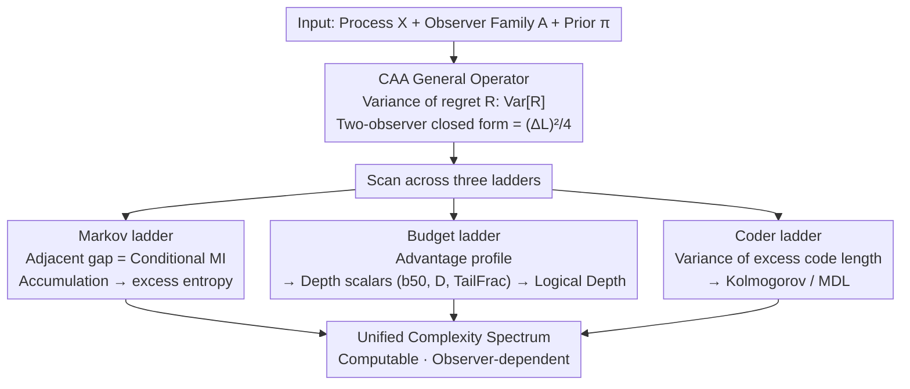

# Complexity as Advantage: A Regret-Based Perspective on Emergent Structure

**Conference**: ICML 2026  
**arXiv**: [2511.04590](https://arxiv.org/abs/2511.04590)  
**Code**: None  
**Area**: Theory/ML Foundations  
**Keywords**: Complexity measures, regret dispersion, information theory, logical depth, MDL

## TL;DR
This paper proposes Complexity-as-Advantage (CAA): redefining "complexity" as the **regret dispersion** of a family of **resource-constrained observers** on the same process. It proves that under the log-loss + Markov framework, it is equivalent to the sum of conditional mutual information atoms (recovering excess entropy); from a coding perspective, it is equivalent to the variance of excess description length (MDL). This unifies Kolmogorov complexity, Bennett's logical depth, and excess entropy into a **computable and empirically estimable** scalar spectrum.

## Background & Motivation

**Background**: Complexity has several classical definitions—Shannon entropy characterizes uncertainty, Kolmogorov complexity $K(x)$ is the shortest program length, Bennett's logical depth characterizes the "computational effort required to unfold structure," and Crutchfield’s excess entropy measures predictive information. Each captures a facet of "structure" from a certain angle.

**Limitations of Prior Work**: The authors highlight the issue with an intuitive question: why do Shakespearean texts and random noise have similar compression ratios under gzip, yet Large Language Models learn the former easily while failing at the latter? Classical measures either **conflate** these categories (e.g., entropy rate), are **non-computable** (e.g., $K(x)$), or **do not depend on observer resources** (failing to account for "who can extract the structure").

**Key Challenge**: The "utility" of complexity is inherently **relative to observer capabilities**—a source has "extractable structure" only when a strong observer can consistently perform better than a weak one. Most classical definitions are **single scalars** or **absolute quantities**, which cannot express "to whom the structure is visible."

**Goal**: Construct a complexity measure that satisfies: (i) computability (estimated via regret); (ii) observer-dependence (explicitly depends on the observer family); (iii) compatibility with classic theory (recovering entropy, MI, and logical depth in the limit); (iv) the ability to empirically separate shallow, chaotic, and deep processes.

**Key Insight**: Instead of asking "how complex is this sequence," one should ask "what is the dispersion of regret across a family of observers." If all observers have the same regret (all weak or all strong), the structure is **not distinguished** by that family. Structure is only "exploited" when a significant regret dispersion exists.

**Core Idea**: Define complexity as the **variance** (or maximum gap) of regret over the observer distribution, characterizing "structure" as the **degree of dispersion** in which some observers can gain an advantage over others.

## Method

### Overall Architecture

CAA is a **general operator** with three inputs:
- A process $X = (X_u)_{u \in I}$ (time series, spatial lattices, or graphs);
- A family of observers $\mathcal{A}$ (any set of predictors/encoders);
- A reference distribution $\pi$ over observers.

It outputs a scalar $\mathrm{CAA}(X; \mathcal{A}, \pi)$, characterizing the regret dispersion of the family on the process. The paper does not introduce new models or train new networks; instead, it translates "complexity" into an **estimable statistic** and proves its equivalence to classic quantities under three specialized scenarios (Markov ladder, budget ladder, and coder ladder).

The pipeline is as follows:
1. Select $X$ and $\mathcal{A}$;
2. Estimate average loss $L(A; X)$ and regret $R(A;X) = L(A;X) - L^*(X)$ for each $A \in \mathcal{A}$;
3. Calculate $\mathrm{Var}_{A \sim \pi}[R(A;X)]$ or the maximum gap under $\pi$ to obtain CAA;
4. Scan across different ladders (Markov orders, computational budgets, or encoder sets) to obtain an "advantage profile" and extract scalar metrics.

The architecture converges from a **common definition → three ladders → respective recovery of classical quantities**: a regret variance operator that returns to excess entropy on a Markov ladder, logical depth on a budget ladder, and Kolmogorov/MDL on a coder ladder.

### Key Designs

**1. General definition of CAA and the two-observer closed-form: Quantifying "to whom structure is visible"**

Classic complexity is either non-computable ($K(x)$) or observer-blind (entropy rate), leading to Shakespeare and noise being conflated under gzip. CAA breaks this by asking "what is the regret dispersion across observers." Formally, given asymptotic average loss $L(A;X) = \limsup_{|\Lambda|\to\infty}\frac{1}{|\Lambda|}\sum_{u\in\Lambda}\ell(\hat{y}^A_u, X_u)$, optimal loss $L^*(X) = \inf_A L(A;X)$, and regret $R(A;X)=L(A;X)-L^*(X)$, complexity is defined as:

$$\mathrm{CAA}(X;\mathcal{A},\pi) = \mathrm{Var}_{A\sim\pi}[R(A;X)],$$

with a max-gap variant $\mathrm{CAA}_{\max}(X) = \sup_{A,B}|R(A;X)-R(B;X)|$. For two observers $\{A_{\text{naive}},A_{\text{soph}}\}$ under a uniform prior, it yields a clean closed-form $\mathrm{CAA}(X)=\tfrac14(\Delta L)^2$ (where $\Delta L=L_{\text{naive}}-L_{\text{soph}}$), directly linking CAA to the familiar "performance gap." This design redefines absolute attributes as statistics relative to an observer family, bypassing non-computability while explicitly encoding "resource constraints" via the observer set.

**2. CAA decomposition under the Markov ladder: CAA gaps as conditional MI atoms**

In the log-loss setting, the loss of an order-$m$ Markov predictor is exactly the conditional entropy $L(A^{(m)};X)=H(X_t\mid X_{t-1},\dots,X_{t-m})$. Thus, the difference between adjacent orders:

$$\Delta L_m = L(A^{(m-1)};X)-L(A^{(m)};X) = I(X_t; X_{t-m}\mid X_{t-1}^{t-m+1})$$

is exactly a conditional mutual information atom. Accumulating these via a telescoping sum $\sum_{m=1}^{M}\Delta L_m = H(X_t)-H(X_t\mid X_{t-1}^{t-M})$ converges to excess entropy $E=I(X_{-\infty}^{t-1};X_t)$ as $M\to\infty$. This equates the "predictive dividend of extending context" with the total "predictable information," making CAA a fine-grained version of excess entropy.

**3. Budget ladder + scalar depth metrics: Operationalizing the non-computable Bennett logical depth**

Bennett's logical depth is theoretically elegant but practically incalculable as it requires $K(x)$ and execution time. CAA operationalizes it using "computational budget" as a ladder: taking an observer family $\{A^{(b)}\}$ where $b$ represents budgets like search depth or neighborhood radius. The gap $\Delta L_b=L(A^{(b-1)};X)-L(A^{(b)};X)\ge 0$ is a two-stage CAA gap. Three scalars are extracted from the profile $\{\Delta L_b\}$: tail fraction $\mathrm{TailFrac}_\alpha=\sum_{j>\lfloor\alpha B\rfloor}\Delta L_j/\sum_j\Delta L_j$, half-mass budget $b_{50}=\min\{b:\sum_{j\le b}\Delta L_j\ge M/2\}$, and normalized depth score $D=\frac{1}{B}\sum_b b\,\Delta L_b/\sum_b\Delta L_b$. Together, these classify processes: "shallow" (e.g., Rule 90) dividends appear early (small $b_{50}, D$); "deep" (e.g., Rule 110) dividends appear late; "chaotic" (Rule 30) dividends are overall minimal.

**4. CAA under the coder ladder: Variance of excess code length**

The third ladder connects CAA back to Kolmogorov complexity and MDL. Since $K(x^n)$ is non-computable, practical compressors only provide upper bounds $K(x^n)\le L_n(A;x^n)+O(1)$. CAA replaces "loss" with code length: for a lossless encoder $A$, let $\bar L_n(A;x^n)=\tfrac1n L_n(A;x^n)$ be the per-symbol code length. The regret $R_n(A;x^n)=\bar L_n(A;x^n)-\min_{B\in\mathcal{A}}\bar L_n(B;x^n)$ represents excess code length. CAA is the variance of this across a family of encoders. It measures "how diverging the coding strategies are": if all encoders are asymptotically optimal or all fail on i.i.d. noise, CAA is near 0. It is significant only when specific encoders exploit structures others cannot.

### Loss & Training

This work is a theoretical and diagnostic framework; **no models were trained**. All "losses" refer to the log-loss of observer predictions $\ell(x, \hat{P}) = -\log_2 \hat{P}(x)$ (or bits-per-symbol). The estimation protocol uses online averages: online log-loss means are calculated for sequences of length $N$, and then $\Delta L$ and CAA means/std are computed across $B$ independent resamples. Markov predictors utilize Laplace smoothing with $\alpha = 1$. In the cryptographic budget ladder, alignment is ensured between the burn-in and encryption starts, and key phases are reset for search observers.

## Key Experimental Results

### Main Results

**Experiment I: U-shaped CAA curves on tunable sources.** The source is a Bernoulli mixture—outputting a fixed periodic template with probability $p$ and a fair coin with probability $1-p$. Thus, $p=0$ is pure noise and $p=1$ is pure periodic. Two observer pairs: Pair A (order-1 vs order-3 on period-2) and Pair B (order-3 vs order-5 on period-6).

| Observer Pair | $p \approx 0$ (Noise) | $p \approx 1$ (Periodic) | Mid-range | Behavior |
|---|---|---|---|---|
| Pair A (k=1 vs k=3, period-2) | Small $\Delta L$ | Large $\Delta L$ (order-1 misses phase) | Monotonic increase | Strong observer consistently gains advantage |
| Pair B (k=3 vs k=5, period-6) | Small $\Delta L$ | Small $\Delta L$ (both sufficient) | Peak in middle | Classic U-shape: CAA significant only in "semi-structured" regions |

→ Confirms that CAA captures "exploitable structure"—neither noise nor trivial cycles, but **intermediate strength latent patterns** where strong observers truly gain an advantage.

**Experiment II: Relativistic complexity (HMM vs Crypto source x Statistical vs Search observers).** 

| Source \ Observer | Stat | Search | CAA$_{\max}$ |
|---|---|---|---|
| HMM | order-$k$ Markov | XOR-seeker (degrades to Markov) | Stat/Stat=0.135, Stat/Search=0.135 |
| Crypto | order-$k$ Markov | XOR-seeker (decrypts with key) | Crypto/Stat=0.536, Crypto/Search=**0.963** |

→ The same crypto source appears nearly "structureless" to statistical observers but has **fully revealed structure** to search observers. This directly demonstrates that "complexity is observer-dependent."

### Ablation Study

**Scalar depth metrics on CA ladder ($k=20$):**

| Process | TailFrac$_{2/3}$ | $b_{50}$ | $D$ | Interpretation |
|---|---|---|---|---|
| Rule 90 (Shallow) | 1.00 | 20 | 1.00 | Gain concentrated at low $b$; front-loaded |
| Rule 30 (Chaotic) | 0.22 | 2 | 0.29 | Negligible gain; noise-like |
| Rule 110 (Deep) | 0.40 | 7 | 0.42 | Gain only manifests at high $b$; back-loaded |

**Ablation of observer sets (gzip/bz2 coding perspective):**

| Source | $\mathcal{A}_1=\{$gzip, bz2$\}$ | $\mathcal{A}_2=\{$huffman, gzip, bz2$\}$ | Change |
|---|---|---|---|
| Simple order | 0.000 | 1.269 | +1.269 |
| Chaos (i.i.d.) | 0.002 | 0.002 | 0.000 |
| Structured text | 0.194 | 1.203 | +1.009 |

→ Adding Huffman (which only sees 0-order counts) to LZ-based coders increases CAA for periodic and text sources but not for noise. This confirms CAA's sensitivity to the observer family and its accuracy in diagnosing structure visibility.

### Key Findings

- **U-shaped curves as the "fingerprint" of CAA**: Both pure noise and pure structure result in near-zero CAA; it is prominent only in the "semi-learnable" region—where "interesting datasets" in ML usually reside.
- **Relativistic Complexity**: The same source can shift from CAA 0.536 to 0.963 depending on whether a search observer is included. Complexity is a joint product of the source and the observer family.
- **Budget ladders map to logical depth**: Rule 110’s deep nature (Turing-completeness) is effectively captured through $b_{50}, D, \mathrm{TailFrac}$, providing an operationalized interpretation of "depth = late-appearing gain."
- **Robustness in control experiments**: Block-shuffling disrupts long-range dependencies and collapses the Huffman–LZ gap, causing CAA to drop as expected.

## Highlights & Insights

- **Observer-dependence as a First-class Citizen**: Traditional complexity measures either ignore observers or hide them behind the "choice of Universal Turing Machine." CAA explicitly includes $\mathcal{A}$ and $\pi$ in the definition, aligning with the ML intuition that "dataset difficulty varies across architectures."
- **High Unification**: CAA unifies excess entropy (Markov ladder), logical depth (budget ladder), and Kolmogorov/MDL (coder ladder) under a single variance formula.
- **Transferability to ML Practice**: The authors propose three directions—dataset difficulty (structure criteria for scaling laws), inductive bias (bias is effective iff regret dispersion is high), and intrinsic motivation (curiosity as advantage potential).
- **CA Case Studies as Teaching Examples**: The framework provides a unified scalar characterization of Rule 90/30/110, distinguishing "early gain / no gain / late gain" more effectively than entropy rates.

## Limitations & Future Work

- **Subjectivity of Observer Selection**: CAA values depend heavily on $\mathcal{A}$ and $\pi$. While "budget alignment" is suggested, there is no "standard observer family," making cross-study comparisons difficult.
- **Scale of Experiments**: Experiments utilize synthetic sources (Bernoulli mixtures, HMM, XOR crypto, CA) rather than real-world datasets or modern neural predictors.
- **Finite Sample Bias**: The analysis of biases from short sequences, header overheads, and variance estimation stability is missing.
- **Integration with MDL Algorithms**: The discussion lacks focus on finite-size MDL biases (like NML) in engineering compressors like gzip.
- **Future Directions**: (i) Probing scaling laws using Transformers of different scales; (ii) Using CAA as a signal for curriculum learning or data pruning; (iii) Grounding curiosity rewards in RL as "advantage potential."

## Related Work & Insights

- **vs Kolmogorov Complexity / MDL**: Classic $K(x)$ is absolute and non-computable. CAA extends this to the "variance of excess length across a family," diagnosing "which coder outperforms which."
- **vs Bennett Logical Depth**: CAA operationalizes "effort to unfold structure" by observing at which budget $b$ significant gain $\Delta L_b$ appears.
- **vs Scaling Laws**: While scaling laws describe performance vs. compute, CAA explains *why* some datasets have larger gaps than others—due to higher advantage dispersion between weak and strong models.
- **vs Curiosity / RND**: Intrinsic motivation often uses prediction error as a reward. CAA grounds this as "advantage potential," providing a clear information-theoretic objective.

## Rating

- **Novelty**: ⭐⭐⭐⭐⭐ Using regret variance to unify Kolmogorov, Bennett, and excess entropy while introducing an "observer relativity" is a conceptually original contribution.
- **Experimental Thoroughness**: ⭐⭐⭐ Clever conceptual experiments (U-shape, CA rules, crypto/HMM), but lacks large-scale validation on real datasets or neural networks.
- **Writing Quality**: ⭐⭐⭐⭐ Logic is clear and theory matches empirical charts, though some derivations are dense.
- **Value**: ⭐⭐⭐⭐ Provides a computable, interpretable perspective on complexity that could impact scaling laws, inductive bias research, and intrinsic motivation.

<!-- RELATED:START -->

## Related Papers

- [\[AAAI 2026\] An Epistemic Perspective on Agent Awareness](../../AAAI2026/others/an_epistemic_perspective_on_agent_awareness.md)
- [\[ICML 2026\] Structure-Induced Information for Rerooting Levin Tree Search](structure-induced_information_for_rerooting_levin_tree_search.md)
- [\[AAAI 2026\] How to Marginalize in Causal Structure Learning?](../../AAAI2026/others/how_to_marginalize_in_causal_structure_learning.md)
- [\[ICLR 2026\] Non-Clashing Teaching in Graphs: Algorithms, Complexity, and Bounds](../../ICLR2026/others/non-clashing_teaching_in_graphs_algorithms_complexity_and_bounds.md)
- [\[CVPR 2026\] HypeVPR: Exploring Hyperbolic Space for Perspective to Equirectangular Visual Place Recognition](../../CVPR2026/others/hypevpr_exploring_hyperbolic_space_for_perspective_to_equirectangular_visual_pla.md)

<!-- RELATED:END -->
