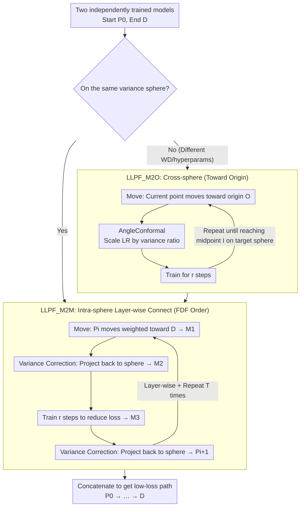

# Connecting Independently Trained Modes via Layer-Wise Connectivity

**Conference**: ICML2026  
**arXiv**: [2505.02604](https://arxiv.org/abs/2505.02604)  
**Code**: https://github.com/twoentartian/DFL_torch  
**Area**: Optimization Theory  
**Keywords**: Mode Connectivity, Loss Landscape, Variance Sphere, Layer-wise Connectivity, Low-loss Path  

## TL;DR

Ours proposes the Low-Loss Path Finding (LLPF) algorithm, which reliably constructs low-loss paths between independently trained neural network models through layer-wise connectivity and variance sphere constraints. It supports modern architectures such as MobileNet, EfficientNet, and CCT with high reproducibility.

## Background & Motivation

**Background**: Mode connectivity is a significant discovery in recent loss landscape research—two independently trained low-loss models can be connected by a continuous path where all intermediate models maintain low loss. Existing methods like FGE (Bézier curve fitting) and AutoNEB (progressive bending of linear interpolation) laid the foundation for this direction.

**Limitations of Prior Work**: The original FGE training script contains bugs and, in practice, can only connect modes that are close in weight space, failing to truly connect independently trained models. AutoNEB lacks reliability, with the maximum training loss along the path fluctuating wildly from 0.5 to 1.5 in four repeated experiments. Furthermore, these methods have only been validated on older architectures like basic CNNs, VGG, and ResNet; their applicability to modern architectures like MobileNet, EfficientNet, and CCT remains unknown.

**Key Challenge**: Linear interpolation between two independent models in the full parameter space typically produces high-loss barriers. However, layer-wise analysis reveals that two models may be linearly connected within the parameter space of a single layer—the root cause of global disconnection lies in the coupling effects between layers.

**Goal**: To design a general and reproducible mode connectivity algorithm capable of bridging independently trained models across different architectures and training hyperparameters.

**Key Insight**: From the geometric perspective of "variance spheres," it is observed that independently trained models have approximately equal parameter variance in each layer. Thus, models can move layer-wise under the constraint of variance spheres to avoid the variance vanishing problem.

**Core Idea**: Decompose the global mode connectivity problem into layer-wise local moves, combining variance correction projections and a few SGD training steps to reliably construct low-loss paths on variance spheres.

## Method

### Overall Architecture

LLPF consists of two complementary algorithms: **LLPF_M2M** (Model-to-Model) connects two models on the same variance sphere; **LLPF_M2O** (Model-to-Origin) pushes a model toward the origin along a low-loss path to achieve cross-sphere connectivity. For models on different variance spheres (e.g., trained with different weight decay), M2O is first used to reach the target variance sphere, followed by M2M to complete the final connection on that sphere.

### Key Designs

1.  **Variance Sphere Constraint & Variance Correction**
    
    Independently trained models have approximately equal variance in each layer ($\text{Var}(\theta_n) \approx \text{Var}(\theta_n')$). Define the variance sphere $S_{\text{var}=v} = \{P_{l_x} \in \mathbb{R}^{d_{l_x}} \mid \text{Var}(P_{l_x}) = v\}$. When taking a weighted average of two models, the parameter variance shrinks (variance vanishing), making subsequent training difficult. Variance correction re-projects parameters back to the sphere via scaling: $W'[i] = \bar{W} + \sqrt{v / \sigma_W^2} \cdot (W[i] - \bar{W})$, ensuring parameters stay on the correct variance manifold after each move.

2.  **Iterative Layer-wise Move & Follow Data Flow (FDF) Layer Order**
    
    M2M connects models through an iterative loop rather than a one-time move. Each iteration involves four geometric operations: (1) Use Move to step $P_i$ toward $D$ to get $M_1$; (2) Use variance correction to project $M_1$ back to the sphere to get $M_2$; (3) Train $r$ steps on $M_2$ to suppress loss to get $M_3$; (4) Perform another variance correction to get $P_{i+1}$. Repeating this $T$ times yields the path. The critical constraint is **layer-wise, sequential processing**: variance spheres are defined per layer, and iterations must follow the FDF strategy—(1) process from shallow to deep layers along the data flow; (2) parallel layers (e.g., attention modules) can be processed in any order but must all finish before moving downstream. Moving all layers simultaneously works for LeNet5 but fails for ResNet18, DLA, or CCT. FDF order is the decisive hyperparameter for success.

3.  **LLPF_M2O Cross-sphere & AngleConformal LR Scaling**
    
    When models reside on different variance spheres (e.g., different weight decay pushes models closer to the origin), M2O is required. M2O moves the model toward the origin $O$ along a low-loss path. It differs from M2M by removing variance correction and adding AngleConformal—applying the same LR to a smaller sphere would cause the model to deviate from the path. AngleConformal scales the learning rate by the variance ratio $\eta = \eta_{\text{base}} \cdot w / v$ (where $w$ is current variance and $v$ is reference), keeping the "angular displacement" of SGD updates consistent across spheres of different radii.

## Key Experimental Results

| Method | Supported Architectures | consistency | Cross-sphere | Worst Train Loss (CIFAR10) |
|------|---------|-----------|---------|----------------------|
| AutoNEB | Basic CNN, ResNet, DenseNet | Inconsistent | N/A | 0.0324 (ResNet20) |
| FGE | ResNet, VGG, WideResNet | N/A | N/A | 0.022 (ResNet158) |
| **LLPF** | **+MobileNet, ShuffleNet, EfficientNet, RegNet, DLA, CCT** | **Consistent** | **Yes** | **0.006 (ResNet18)** |

| Setting | Train Loss | Test Acc | Repetitions |
|---------|---------|-----------|---------|
| ResNet18@CIFAR10 M2M | < 0.1 (Path peak) | Converges to end-model level | ≥ 10 |
| DLA@CIFAR10 M2M | < 0.1 | Consistent convergence | ≥ 10 |
| CCT7@CIFAR10 M2M | < 0.1 | Consistent convergence | ≥ 10 |
| ResNet18 Fine-tuned | **< 0.006** | — | Specific tuning |
| DLA Cross-sphere | Low loss throughout | High train accuracy | M2O + M2M phases |

Continuity Validation: Linear interpolation between adjacent points on the CCT7 path (50 samples) shows that intermediate training loss remains low, supporting the path continuity hypothesis.

## Highlights & Insights

-   **Clear Geometric Intuition**: Transforms mode connectivity into layer-wise moves on variance spheres, consisting of intuitive "Move → Correct → Train → Correct" operations.
-   **Reproducibility Breakthrough**: In ≥10 repetitions with different seeds, LLPF trajectories for loss/accuracy almost perfectly overlap (minimal std dev), a property absent in AutoNEB and FGE.
-   **Strong Architectural Generalization**: First to validate mode connectivity on MobileNet, ShuffleNet, EfficientNet, RegNet, DLA, and CCT, significantly expanding the scope of this phenomenon.
-   **Insights into Global Structure**: Results suggest that all modes found by SGD may lie on a single connected low-loss manifold. If true, this profoundly changes the understanding of loss landscapes.

## Limitations & Future Work

-   No guarantee of low test loss—in ResNet18, test loss increases despite low training loss, suggesting the path may cross regions with poor generalization.
-   LLPF_M2O only supports moving from larger to smaller variance spheres; reverse movement fails due to gradient explosion.
-   Numerous hyperparameters ($\text{step}_f, \text{step}_a, \text{step}_c, r$, layer order); although layer order is the most critical, tuning still requires expertise.
-   Currently validated only on small datasets (CIFAR10/100, ImageNet10); applicability to large-scale models (ViT-Large, LLMs) is unknown.
-   Lack of theoretical guarantees; the global path connectivity hypothesis is currently supported only by empirical evidence.

## Related Work & Insights

-   **FGE** (Garipov et al., 2018) uses Bézier curves but only connects nearby modes in practice.
-   **AutoNEB** (Draxler et al., 2018) uses the NEB method for bending paths but is inconsistent.
-   **Layer-wise LMC** (Adilova et al., 2024) provides the theoretical basis for layer-wise strategies.
-   **Git Re-Basin** (Ainsworth et al., 2023) achieves connectivity via permutation alignment, whereas Ours handles independently trained modes without explicit alignment.
-   Ours' variance sphere perspective may provide new geometric insights for **Model Soups** and **Federated Learning model aggregation**.

## Rating

-   Novelty: 8/10
-   Experimental Thoroughness: 8/10
-   Writing Quality: 7/10
-   Value: 7/10

<!-- RELATED:START -->

## Related Papers

- [\[CVPR 2026\] MUFASA: A Multi-Layer Framework for Slot Attention](../../CVPR2026/others/mufasa_a_multi-layer_framework_for_slot_attention.md)
- [\[ICLR 2026\] Do We Really Need Permutations? Impact of Model Width on Linear Mode Connectivity](../../ICLR2026/others/do_we_really_need_permutations_impact_of_model_width_on_linear_mode_connectivity.md)
- [\[NeurIPS 2025\] Generalized Linear Mode Connectivity for Transformers](../../NeurIPS2025/others/generalized_linear_mode_connectivity_for_transformers.md)
- [\[CVPR 2026\] Region-Wise Correspondence Prediction between Manga Line Art Images](../../CVPR2026/others/region-wise_correspondence_prediction_between_manga_line_art_images.md)
- [\[NeurIPS 2025\] Impact of Layer Norm on Memorization and Generalization in Transformers](../../NeurIPS2025/others/impact_of_layer_norm_on_memorization_and_generalization_in_transformers.md)

<!-- RELATED:END -->
