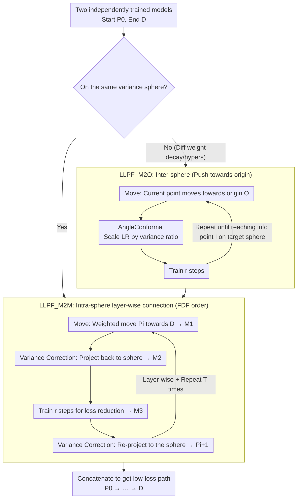

# Connecting Independently Trained Modes via Layer-Wise Connectivity

**Conference**: ICML2026  
**arXiv**: [2505.02604](https://arxiv.org/abs/2505.02604)  
**Code**: https://github.com/twoentartian/DFL_torch  
**Area**: Optimization Theory  
**Keywords**: Mode Connectivity, Loss Landscape, Variance Sphere, Layer-wise Connectivity, Low-loss Path  

## TL;DR

Proposes the Low-Loss Path Finding (LLPF) algorithm, which reliably constructs low-loss paths between independently trained neural network models through layer-wise connectivity and variance sphere constraints. It supports modern architectures such as MobileNet, EfficientNet, and CCT, yielding highly reproducible results.

## Background & Motivation

**Background**: Mode connectivity is a significant discovery in recent loss landscape research—two independently trained low-loss models can be connected by a continuous path where all intermediate models also maintain low loss. Existing methods such as FGE (Bézier curve fitting) and AutoNEB (gradual bending of linear interpolation) established the foundation for this direction.

**Limitations of Prior Work**: The original training scripts for FGE contain bugs, and in practice, it can only connect modes that are close in weight space, failing to truly connect independently trained models. AutoNEB lacks reliability, with the maximum training loss along the path fluctuating wildly from 0.5 to 1.5 across four repeated experiments. Furthermore, these methods have only been validated on relatively aging architectures like basic CNNs, VGG, and ResNet; their applicability to modern architectures like MobileNet, EfficientNet, and CCT remains unknown.

**Key Challenge**: Linear interpolation between two independent models in the full parameter space typically produces high-loss barriers. However, layer-wise analysis reveals that two models might be linearly connected within the parameter space of a single layer—the root of global disconnectivity lies in the coupling effects between layer parameters.

**Goal**: Design a general and reproducible mode connectivity algorithm capable of bridging independently trained models across different architectures and training hyperparameters.

**Key Insight**: Starting from the geometric perspective of the "variance sphere," the authors observe that independently trained models have approximately equal parameter variance at each layer. Thus, models can be moved layer-by-layer under the constraint of the variance sphere to avoid the variance vanishing problem.

**Core Idea**: Decompose the mode connectivity problem in the full parameter space into layer-wise local movements. By combining variance correction projection and a small number of SGD training steps, low-loss paths are reliably constructed on variance spheres.

## Method

### Overall Architecture

LLPF consists of two complementary algorithms: **LLPF_M2M** (Model-to-Model) connects two models on the same variance sphere; **LLPF_M2O** (Model-to-Origin) pushes a model towards the origin along a low-loss path to achieve inter-sphere connectivity. For models located on different variance spheres (e.g., trained with different weight decay), M2O is first used to reach the target variance sphere, followed by M2M to complete the final connection on that sphere.

### Key Designs

1. **Variance Sphere Constraints and Variance Correction**

   Independently trained models exhibit approximately equal variance in parameters for each layer ($\text{Var}(\theta_n) \approx \text{Var}(\theta_n')$). Define the variance sphere as $S_{\text{var}=v} = \{P_{l_x} \in \mathbb{R}^{d_{l_x}} \mid \text{Var}(P_{l_x}) = v\}$. When taking a weighted average of two models, the parameter variance shrinks (variance vanishing problem), leading to difficulties in subsequent training. Variance correction re-projects the parameters back to the variance sphere via scaling: $W'[i] = \bar{W} + \sqrt{v / \sigma_W^2} \cdot (W[i] - \bar{W})$, ensuring parameters stay on the correct variance manifold after each move.

2. **Iterative Layer-wise Movement in LLPF_M2M and Follow Data Flow (FDF) Order**

   M2M connects two models on the same variance sphere through an iterative loop rather than a one-time move. Each iteration consists of four geometric operations: first, use "Move" to move the current path point $P_i$ a small weighted step towards the target $D$ to get $M_1$ (step size controlled by $\text{step}_f, \text{step}_a, \text{step}_c$; smaller values result in denser path points and better continuity); then use variance correction to project $M_1$ back to the variance sphere to get $M_2$; train $M_2$ for $r$ steps to reduce loss and obtain $M_3$; finally, perform another variance correction to get the next path point $P_{i+1}$. Repeating this $T$ times produces a low-loss path from $P_0$ to $\approx D$. The crucial constraint is **layer-wise sequential processing**: since variance spheres are defined per layer, the iterations must be performed layer-by-layer following the FDF strategy—(1) proceed from shallow to deep layers along the data flow; (2) parallel layers (e.g., multiple attention modules after a patch) can be processed in any order but must all be completed before moving to downstream layers. Moving all layers simultaneously works for simple models like LeNet5 but fails for complex architectures like ResNet18, DLA, or CCT—the FDF sequence is the decisive hyperparameter for M2M's success.

3. **LLPF_M2O Inter-sphere Connectivity and AngleConformal LR Scaling**

   When two models reside on different variance spheres (e.g., trained with different weight decay, where stronger decay pushes models closer to the origin with smaller variance), M2M cannot connect them directly, requiring M2O for crossing spheres. M2O moves the model towards the origin $O$ along a low-loss path, transitioning from a large variance sphere to a smaller one. It differs from M2M in two ways: removing variance correction and introducing AngleConformal—applying the learning rate of a large sphere directly to a small sphere would cause the model to deviate from the low-loss path. AngleConformal scales the learning rate by the variance ratio $\eta = \eta_{\text{base}} \cdot w / v$ (where $w$ is the current variance and $v$ is the reference variance), keeping the "angular displacement" of SGD updates consistent across spheres of different radii. Full inter-sphere connectivity thus involves two steps: first using M2O to push the starting point $P$ to an intermediate point $I$ on the target sphere, then using M2M to connect $I$ to the endpoint $D$. Note that M2O only supports moving from large to small spheres; the reverse is infeasible due to gradient explosion.

## Key Experimental Results

| Method | Supported Architectures | Result Consistency | Across Var. Spheres | Max Training Loss (CIFAR10) |
|------|---------|-----------|---------|----------------------|
| AutoNEB | Basic CNN, ResNet, DenseNet | Inconsistent | Not Reported | 0.0324 (ResNet20) |
| FGE | ResNet, VGG, WideResNet | Not Reported | Not Reported | 0.022 (ResNet158) |
| **LLPF** | **+MobileNet, ShuffleNet, EfficientNet, RegNet, DLA, CCT** | **Consistent** | **Supported** | **0.006 (ResNet18)** |

| Experimental Setup | Training Loss | Test Accuracy | Reiterations |
|---------|---------|-----------|---------|
| ResNet18@CIFAR10 M2M | < 0.1 (Path peak) | Converges to endpoint level | ≥ 10 times |
| DLA@CIFAR10 M2M | < 0.1 | Consistent convergence | ≥ 10 times |
| CCT7@CIFAR10 M2M | < 0.1 | Consistent convergence | ≥ 10 times |
| ResNet18 Fine-tuned | **< 0.006** | — | Specific tuning |
| DLA Inter-sphere | Low loss throughout | High training accuracy | Two-phase M2O + M2M |

Continuity Validation: Linear interpolation between adjacent points on the CCT7 path (50 samples) shows that the training loss remains low, supporting the path continuity hypothesis.

## Highlights & Insights

- **Clear Geometric Intuition**: Transforms the mode connectivity problem into layer-wise movement on variance spheres, where each step consists of four intuitive geometric operations: "Move → Var-Correction → Small Training → Re-Correction."
- **Breakthrough in Reproducibility**: Across ≥10 repetitions with different random seeds, the loss/accuracy trajectories of LLPF paths are nearly identical (extremely small standard deviation), a property lacking in AutoNEB and FGE.
- **Strong Architectural Generalization**: Validates mode connectivity on MobileNet, ShuffleNet, EfficientNet, RegNet, DLA, and CCT for the first time, significantly expanding the scope of this phenomenon.
- **Implication of Global Loss Landscape Structure**: The results suggest that all modes trained by SGD might reside on a single, path-connected, low-loss manifold. If true, this conjecture would profoundly change our understanding of the loss landscape.

## Limitations & Future Work

- The algorithm does not guarantee low test loss—in ResNet18 experiments, while training loss was low, test loss increased, suggesting the path might traverse regions with poor generalization.
- LLPF_M2O only supports movement from large variance spheres to small ones; reverse movement is infeasible due to gradient explosion.
- High number of hyperparameters ($\text{step}_f$, $\text{step}_a$, $\text{step}_c$, $r$, layer order). Although the authors claim only layer selection/order is decisive, actual tuning still requires experience.
- Currently only validated on small datasets like CIFAR10/CIFAR100/ImageNet10; applicability to large-scale models (e.g., ViT-Large, LLM) is unknown.
- Lack of theoretical guarantees; the global path connectivity conjecture is currently supported only by empirical evidence.

## Related Work & Insights

- **FGE** (Garipov et al., 2018) uses Bézier curves to connect modes; it is a pioneering work in mode connectivity but practically only connects close-range modes.
- **AutoNEB** (Draxler et al., 2018) uses the NEB method to bend interpolation paths, but results are inconsistent.
- **Layer-wise LMC** (Adilova et al., 2024) introduced the concept of layer-wise linear mode connectivity, providing a theoretical foundation for the layer-wise strategy used here.
- **Git Re-Basin** (Ainsworth et al., 2023) achieves linear interpolation connectivity through neuron permutation alignment, but this belongs to permutation alignment rather than connectivity of independently trained modes.
- The variance sphere perspective in this paper may provide new geometric insights into **model merging/model soups** and **model aggregation in federated learning**.

## Rating

- Novelty: 8/10 — The framework of variance spheres + layer-wise movement is novel with clear geometric intuition.
- Experimental Thoroughness: 8/10 — Covers various architectures with ≥10 repetitions per experiment, providing strong consistency validation.
- Writing Quality: 7/10 — Rigorous notation, though the algorithm description is somewhat lengthy.
- Value: 7/10 — Advances the understanding of loss landscapes, though practical application scenarios remain to be explored.

<!-- RELATED:START -->

## Related Papers

- [\[CVPR 2026\] MUFASA: A Multi-Layer Framework for Slot Attention](../../CVPR2026/others/mufasa_a_multi-layer_framework_for_slot_attention.md)
- [\[ICML 2026\] TabSwift: An Efficient Tabular Foundation Model with Row-Wise Attention](tabswift_an_efficient_tabular_foundation_model_with_row-wise_attention.md)
- [\[ICML 2026\] Functional Equivalence in Attention: A Comprehensive Study with Applications to Linear Mode Connectivity](functional_equivalence_in_attention_a_comprehensive_study_with_applications_to_l.md)
- [\[ICLR 2026\] Do We Really Need Permutations? Impact of Model Width on Linear Mode Connectivity](../../ICLR2026/others/do_we_really_need_permutations_impact_of_model_width_on_linear_mode_connectivity.md)
- [\[NeurIPS 2025\] Generalized Linear Mode Connectivity for Transformers](../../NeurIPS2025/others/generalized_linear_mode_connectivity_for_transformers.md)

<!-- RELATED:END -->
