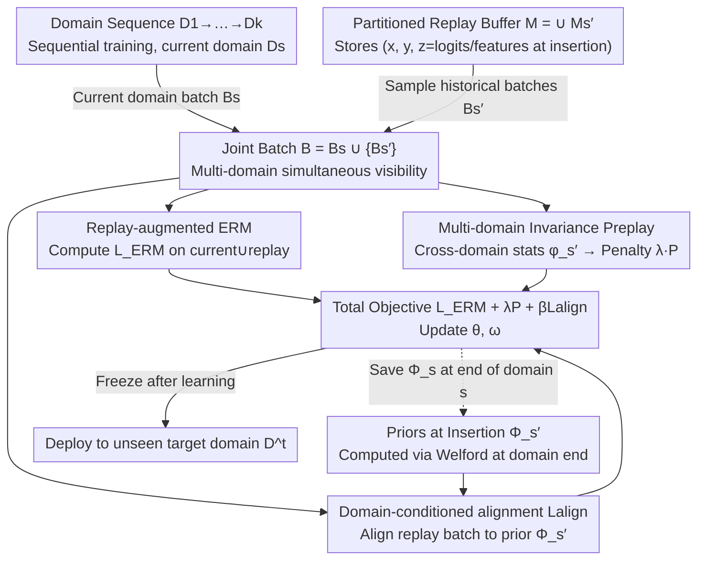

# Continual Learning of Domain-Invariant Representations

**Conference**: ICML 2026  
**arXiv**: [2605.15775](https://arxiv.org/abs/2605.15775)  
**Code**: None  
**Area**: Continual Learning / Self-supervised Representation Learning / Domain Generalization  
**Keywords**: continual learning, domain-invariant representation, replay buffer, VREX, Fishr / CORAL / MMD / ANDMask

## TL;DR
The authors explicitly inject "Domain-Invariant Representation Learning (DIRL)" into continual learning for the first time: using the replay buffer as a carrier for multi-domain invariance computation and domain-conditioned alignment. They propose five methods, ⋆-CL-{VREX, Fishr, CORAL, MMD, ANDMask}, pushing target domain accuracy to SOTA across six datasets in vision, medicine, manufacturing, and ecology.

## Background & Motivation

**Background**: Mainstream continual learning (CL) methods are categorized into four types: optimization-based (AGEM, UPGD), regularization-based (EWC, SI, SNR), architecture-based (progressive nets), and replay-based (ER-ACE, FDR, LODE, STAR). Their common goal is the stability-plasticity trade-off: avoiding forgetting on seen training domains while achieving good backwards transfer (BWT).

**Limitations of Prior Work**: All existing methods only optimize performance on "seen domains," causing models to easily learn domain-specific shortcuts (e.g., color, texture, hospital-level bias). This leads to failure when deployed to a completely new target domain. This is the specific manifestation of shortcut learning in CL scenarios—high in-domain accuracy but poor out-of-domain performance.

**Key Challenge**: Existing DIRL methods (VREX, Fishr, CORAL, MMD, ANDMask) rely on joint access to multiple domains to simultaneously optimize invariance constraints. However, CL is sequential, and data from past domains is no longer visible. Simply storing a domain-level statistic $\Phi_{s'}$ as an "anchor" and matching the current batch (a naïve extension) fails to replicate the semantics of multi-domain joint optimization, resulting in limited gains.

**Goal**: (i) Learn true domain-invariant representations on sequential data streams; (ii) evaluate under a deployment-oriented protocol—sequential training → deployment → testing on a new target domain; (iii) balance multi-domain invariance and anti-forgetting without exceeding the classic CL buffer budget.

**Key Insight**: The replay buffer in CL is a natural carrier where "multiple domains coexist." The authors move invariance computation to the replay batch (instead of just the current domain) and add an alignment loss to prevent replay representations from drifting as training progresses.

**Core Idea**: A triplet of "replay-augmented ERM" + "multi-domain invariance penalty on replay batches" + "domain-conditioned invariance alignment," rewriting any DIRL invariant (risk, gradient, feature, kernel embedding, gradient-sign mask) into a CL-friendly version.

## Method

### Overall Architecture
Setup: Model $h=g_\omega\circ f_\theta$ is trained sequentially on domain sequence $S=\{D_1,\dots,D_k\}$. Each domain allows access only to its own data plus a small buffer $M$ ($|M_{s'}|\ll|D_{s'}|$), with evaluation on a completely unseen target domain $D^t$. The overall training objective is $\min_{\theta,\omega} L^{\text{replay}}_{\text{ERM}}(\theta,\omega)+\lambda P^{\text{replay}}_s(\theta,\omega)+\beta L^{\text{align}}(\theta,\omega)$. The ERM term operates on current ∪ replay data, the second term is the multi-domain invariance penalty, and the third is the "domain-conditioned" alignment term. The pipeline is: combine current domain data + domain-partitioned replay buffer into a joint batch where "multiple domains are simultaneously visible"; compute the three losses in parallel to update the model; save the invariance prior $\Phi_{s'}$ back to the buffer after each domain; freeze the model after all domains are learned for OOD deployment.

### Key Designs

**1. Replay-augmented ERM + Partitioned Buffer: Making "Multi-domain Coexistence" a Reality in Training**

DIRL assumes simultaneous access to multiple domains, but CL is sequential. The authors observe that the replay buffer is naturally a carrier of "simultaneous multiple domains," upgrading it from a tool for anti-forgetting to a source of invariance evidence. The buffer is partitioned by domain $M=\bigcup_{s'<s}M_{s'}$, with each sample stored as $(x,y,z)$, where $z$ is auxiliary info at insertion (e.g., logits $h(x;\theta_{s'},\omega_{s'})$ or features $f_{\theta_{s'}}(x)$). The ERM term is expanded to $L^{\text{replay}}_{\text{ERM}}=\mathbb{E}_{(x,y)\sim B}[L(h(x),y)]$, where $B=\bigcup_{e\le s}B_e$ includes both current batch $B_s$ and all replay batches $B_{s'}$. This allows the buffer to simultaneously provide evidence for invariance and prevent forgetting, approximating the joint-access assumption of DIRL.

**2. Multi-domain Invariance Computation (Preplay): Unifying 5 DIRL Methods into CL**

Having multi-domain batches is not enough; a unified penalty operator must be defined "on the replay+current batch" for each invariant. For each domain, a statistic $\widehat\phi_{s'}=\phi(\theta,\omega;B_{s'})$ is used, with the penalty $P^{\text{replay}}_s=\textsc{InvPenalty}(\{\widehat\phi_{s'}\}_{s'\le s})$. The five instances are:

- ⋆-CL-VREX: $\phi_{s'}=\widehat r_{s'}=\mathbb{E}_{B_{s'}}[L(h(x),y)]$, penalty $\frac{1}{s}\sum_{s'\le s}(\widehat r_{s'}-\bar r)^2$ (cross-domain risk variance).
- ⋆-CL-Fishr: $\phi_{s'}=\widehat v_{s'}=\mathrm{Var}_{B_{s'}}(\nabla_\omega L)$, penalty $\frac{1}{s}\sum\|\widehat v_{s'}-\bar v\|_2^2$ (matches gradient variance of the classification head).
- ⋆-CL-CORAL: $\phi_{s'}=(\widehat\mu_{s'},\widehat\Sigma_{s'})$ (1st/2nd moments of features), penalty on mean and Frobenius covariance differences.
- ⋆-CL-MMD: $\phi_{s'}=\widehat\mu^z_{s'}=\mathbb{E}_{B_{s'}}[z(f_\theta(x))]$ where $z$ represents random Fourier features for an RBF kernel, penalty on mean embedding distance.
- ⋆-CL-ANDMask: Uses domain-level gradients $g_{s'}=\nabla_{\theta,\omega}L^{\text{ERM}}(B_{s'})$, constructs a sign-consistency mask $m=\mathbb{I}(\frac{1}{s}|\sum_{s'}\mathrm{sgn}(g_{s'})|\ge\tau)$, and updates $\nabla\leftarrow m\odot\frac{1}{s}\sum_{s'}g_{s'}$.

Placing invariance computation on "synchronously visible multi-domain batches" restores the joint optimization semantics of original DIRL.

**3. Domain-conditioned Invariance Alignment (Lalign): Counteracting Replay Representation Drift**

With only Preplay, representations of replay samples are pulled by new domain optimization, causing learned invariance to be "silently forgotten." $L^{\text{align}}$ uses a distilled anchor: it invokes the prior $\Phi_{s'}$ from the time of insertion (computed via Welford online mean at the end of domain $s'$) and aligns the current model's statistic on $B_{s'}$ back to it: $L^{\text{align}}=\sum_{s'<s}d(\widehat\phi_{s'}(\theta,\omega;B_{s'}),\Phi_{s'})$. Crucially, unlike the naïve method (Eq. 4) which matches the "current batch" to "past priors" (forcing the erasure of real domain differences), this matches "replayed past batches" back to "their own historical statistics," preserving the historical identity of invariance.

### Loss & Training
Total objective: $L^{\text{replay}}_{\text{ERM}}+\lambda P^{\text{replay}}_s+\beta L^{\text{align}}$. ResNet18 pre-trained on ImageNet is used for large image datasets, a 4-layer CNN for RotatedMNIST, and a 4-layer MLP for Covertype. Buffer size is 1000 (small datasets) or 5000 (others). $\lambda, \beta$ are determined via HP search. The upper bound is URM (offline DIRL with all source domains). Baselines include 13 SOTA CL methods and 3 CDA/CTTA methods (TENT, SHOT++, CoTTA).

## Key Experimental Results

### Main Results
Six datasets: RotatedMNIST, CIFAR10C, TinyImageNetC, WM811K (wafer defect, Macro F1), Covertype, Camelyon17 (medical). Reporting Mean±SE across 3 runs. ⋆-CL-CORAL / ⋆-CL-MMD / ⋆-CL-VREX ranked 1st / 2nd / 3rd on average.

| Dataset | Metric | Ours ⋆-CL-CORAL | Prev. Best Baseline | Gain |
|--------|-----|----------------|------------------|------|
| RotatedMNIST | acc (%) | 72.8 | 68.7 (CoPE) | +4.1 |
| CIFAR10C | acc (%) | 68.5 | 69.5 (STAR) | -1.0 (CORAL 2nd, ⋆-CL-MMD 69.0) |
| TinyImageNetC | acc (%) | 25.0 | 29.0 (ER-ACE) | -4.0 (⋆-CL-Fishr 29.0 / ⋆-CL-VREX 26.3) |
| WM811K | Macro F1 (%) | 84.8 | 85.4 (ER-ACE) | -0.6 (⋆-CL-MMD 85.5 highest) |
| Covertype | acc (%) | 45.2 | 41.2 (SARL) | +4.0 |
| Camelyon17 | acc (%) | 91.7 | 91.0 (AGEM) | +0.7 |
| **Average** | acc/F1 (%) | **64.7** | 62.8 (ER-ACE) | **+1.9** |

Overall, ⋆-CL-CORAL 64.7 > ⋆-CL-VREX 63.4 > ⋆-CL-MMD 63.1 > ER-ACE 62.8 > STAR 62.1. It outperforms finetune (50.4) and SARL (54.0) by 10+ pp. Relative to optimization-based methods, the gain is ~6 pp; vs regularization-based, ~10 pp; vs replay-based, ~2 pp. An 8.6 pp gap remains compared to the URM upper bound.

### Ablation Study

| Config | Key Metric | Notes |
|------|---------|------|
| Full ⋆-CL (inc. Preplay + Lalign) | Avg 64.7 | Complete method |
| naïve-CL-{VREX,Fishr,CORAL,MMD,ANDMask} | Sl. above finetune | Static prior Φ loses multi-domain semantics |
| w/o $L^{\text{align}}$ (β=0) | Drop in perf | Alignment is key for generalization, not just stability |
| Dynamic re-computation of $\Phi_{s'}$ | Drop in perf | Anchor failure; Lalign must use prior at insertion |
| Buffer reduced to 50% / 25% | Still leads vs ER | Invariance constraints support small buffers |
| CDA / CTTA Baselines | Lag by 10 pp | CL+DIRL has fundamental advantage over TTA |

### Key Findings
- **Lalign is a Key for Generalization, Not Just Stability**: Traditional views see alignment as a stability tool; this paper proves it supports OOD generalization—without it, cross-domain accuracy drops significantly.
- **Different Invariants for Different Strengths**: ⋆-CL-CORAL wins in low-data/strong-statistical-shift scenarios. ⋆-CL-Fishr is more stable for pixel-level corruptions (TinyImageNetC). ⋆-CL-MMD mirrors CORAL on distribution alignment tasks. ANDMask collapses on TinyImageNetC (11.8%) due to overly sparse masks.
- **In-domain Preserved, OOD Boosted**: All ⋆-CL methods outperform finetune/regularization on in-domain tasks, showing invariant structures benefit source domains too.
- **Positive BWT**: The ⋆-CL series shows non-negative or even positive backwards transfer, meaning learning new domains improves old domain accuracy. The authors attribute this to invariant structures being shared causal mechanisms.

## Highlights & Insights
- **Systematic Integration of DIRL and CL**: While previous DIRL assumed joint access, the authors use replay+multi-domain batches to approximate this, identifying that naïve "static priors" cannot replicate joint optimization.
- **Value of Deployment-Oriented Protocol**: Changing CL evaluation from "held-out old domains" to "completely unseen target domains" reveals that methods that "don't forget" might not actually learn invariant structures.
- **Transferable Anchor Design for Lalign**: Using statistics from the "time of insertion" as anchors (rather than dynamic re-computation) is a form of lightweight distillation applicable to other online scenarios like Federated Learning or self-supervised pre-training.

## Limitations & Future Work
- **Gap with URM Upper Bound**: A ~8.6 pp gap exists (e.g., RotatedMNIST URM 81.3 vs ⋆-CL-CORAL 72.8), suggesting that replay-based approximation of joint-DIRL is far from its ceiling.
- **Buffer Dependency**: Performance drops as buffer size decreases; buffer-free settings are not discussed.
- **Lack of Selection Guidelines**: There is no rigorous criteria for choosing which ⋆-CL variant to use based on data characteristics.
- **ANDMask Failure**: The method collapsed on TinyImageNetC. Softened or adaptive thresholds for sign-agreement might be needed for heterogeneous domains.

## Related Work & Insights
- **vs Classic CL**: Classic objectives lack "cross-domain invariance." This paper proves adding Preplay+Lalign yields a 2 pp average gain without increasing the buffer budget.
- **vs DIRL**: This work "CL-ifies" five invariance methods and demonstrates why naïve extensions fail.
- **vs CDA/CTTA**: Unlike TTA which assumes unsupervised updates at deployment, this setting is stricter (freeze after deployment) yet leads by 10 pp, suggesting "learning invariance" is more fundamental than "post-hoc adaptation."
- **vs URM**: URM serves as the upper bound via offline joint optimization. ⋆-CL-CORAL is currently the closest sequential approximation.

## Rating
- Novelty: ⭐⭐⭐⭐ Systematically bridges DIRL and CL, solving the "naïve static prior" defect with a dual-layer structure.
- Experimental Thoroughness: ⭐⭐⭐⭐⭐ 6 datasets × 17 baselines × 3 runs + 5 ⋆-CL variants + meaningful ablations.
- Writing Quality: ⭐⭐⭐⭐ Table 1 unifies the 5 methods clearly; Fig 1 clarifies the protocol. ANDMask's failure could use more analysis.
- Value: ⭐⭐⭐⭐ Directly applicable to medical/manufacturing CL. The deployment-oriented protocol may influence future CL research directions.

<!-- RELATED:START -->

## Related Papers

- [\[ICML 2026\] Learning Permutation-Invariant Macroscopic Dynamics](learning_permutation-invariant_macroscopic_dynamics.md)
- [\[CVPR 2026\] A Faster Path to Continual Learning](../../CVPR2026/others/a_faster_path_to_continual_learning.md)
- [\[CVPR 2026\] Spectral Mixture-of-Experts for Continual Learning](../../CVPR2026/others/spectral_mixture-of-experts_for_continual_learning.md)
- [\[CVPR 2025\] Sufficient Invariant Learning for Distribution Shift](../../CVPR2025/others/sufficient_invariant_learning_for_distribution_shift.md)
- [\[CVPR 2026\] Back to Source: Open-Set Continual Test-Time Adaptation via Domain Compensation](../../CVPR2026/others/back_to_source_open-set_continual_test-time_adaptation_via_domain_compensation.md)

<!-- RELATED:END -->
