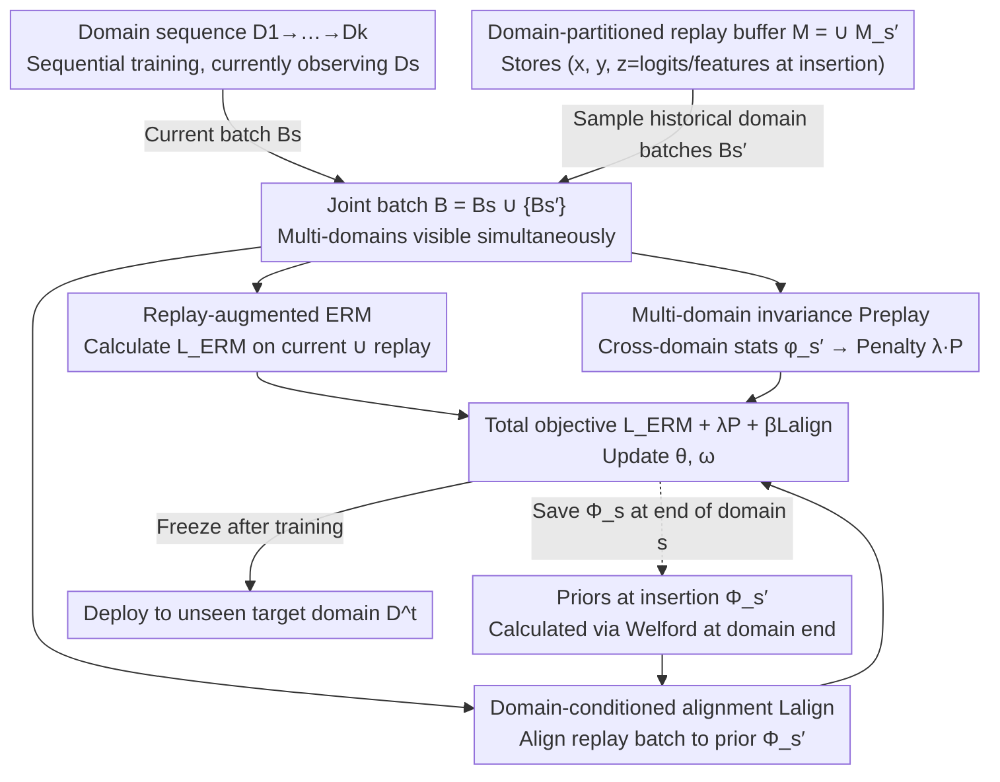

# Continual Learning of Domain-Invariant Representations

**Conference**: ICML 2026  
**arXiv**: [2605.15775](https://arxiv.org/abs/2605.15775)  
**Code**: None  
**Area**: Continual Learning / Self-Supervised Representation Learning / Domain Generalization  
**Keywords**: continual learning, domain-invariant representation, replay buffer, VREX, Fishr / CORAL / MMD / ANDMask

## TL;DR
The authors explicitly inject "Domain-Invariant Representation Learning (DIRL)" into continual learning for the first time. Using the replay buffer as a carrier for multi-domain invariance computation and domain-conditioned alignment, they propose five methods—⋆-CL-{VREX, Fishr, CORAL, MMD, ANDMask}—pushing target domain accuracy to SOTA across six vision, medical, manufacturing, and ecology datasets.

## Background & Motivation

**Background**: Mainstream continual learning (CL) methods are categorized into four types: optimization-based (AGEM, UPGD), regularization-based (EWC, SI, SNR), architecture-based (progressive nets), and replay-based (ER-ACE, FDR, LODE, STAR). Their common goal is the stability-plasticity trade-off: avoiding forgetting on seen training domains while achieving good backwards transfer (BWT).

**Limitations of Prior Work**: Existing methods optimize performance only on "seen domains," causing models to easily learn domain-specific shortcuts (e.g., color, texture, hospital-level bias). This leads to failure when deployed to an entirely new target domain. This is the manifestation of shortcut learning in CL—high in-domain accuracy but poor out-of-domain performance.

**Key Challenge**: Existing DIRL methods (VREX, Fishr, CORAL, MMD, ANDMask) rely on joint access to multiple domains to simultaneously optimize invariance constraints. However, CL is sequential, and data from past domains is no longer visible. Simply storing a domain-level statistic $\Phi_{s'}$ as an "anchor" and matching it with the current batch (naïve extension) fails to replicate the semantics of multi-domain joint optimization, yielding limited gains.

**Goal**: (i) Learn true domain-invariant representations on sequential data streams; (ii) evaluate under a deployment-oriented protocol—sequential train → deploy → test on new target domains; (iii) balance multi-domain invariance and anti-forgetting without exceeding classic CL buffer budgets.

**Key Insight**: The replay buffer in CL naturally serves as a carrier where "multiple domains coexist." The authors move invariance computation to the replay batch (rather than just the current domain) and add an alignment loss to prevent replay representations from drifting during subsequent training.

**Core Idea**: A triad of "replay-augmented ERM" + "multi-domain invariance penalty on replay batches" + "domain-conditioned invariance alignment" translates any DIRL invariant (risk, gradient, feature, kernel embedding, gradient-sign mask) into a CL-friendly version.

## Method

### Overall Architecture
Setup: The model $h=g_\omega\circ f_\theta$ is trained sequentially on active domains $S=\{D_1,\dots,D_k\}$. Each domain allows access only to its own data and a small buffer $M$ ($|M_{s'}|\ll|D_{s'}|$), and is evaluated on an unseen target domain $D^t$ after deployment. The overall training objective is $\min_{\theta,\omega} L^{\text{replay}}_{\text{ERM}}(\theta,\omega)+\lambda P^{\text{replay}}_s(\theta,\omega)+\beta L^{\text{align}}(\theta,\omega)$. ERM is performed on the union of current and replay data, the second term is the multi-domain invariance penalty, and the third is the "domain-conditioned" alignment term. The pipeline involves: combining current domain data and domain-partitioned replay buffers into a joint batch where multiple domains are "simultaneously visible"; calculating three losses in parallel to update the model; storing the invariance prior $\Phi_{s'}$ in the buffer after training each domain for future alignment; and freezing the model for evaluation on unseen target domains.

### Key Designs

**1. Replay-augmented ERM + Domain-partitioned buffer: Realizing multi-domain coexistence in every step**

DIRL assumes simultaneous access to multiple domains for joint optimization, but CL is sequential. The authors observe that the replay buffer naturally allows "multiple domains to coexist," upgrading it from a pure anti-forgetting tool to a source of invariance evidence. The buffer is partitioned by domain as $M=\bigcup_{s'<s}M_{s'}$, storing samples as $(x,y,z)$, where $z$ is auxiliary info at insertion (e.g., logits $h(x;\theta_{s'},\omega_{s'})$ or features $f_{\theta_{s'}}(x)$). The ERM term is expanded to $L^{\text{replay}}_{\text{ERM}}=\mathbb{E}_{(x,y)\sim B}[L(h(x),y)]$, where $B=\bigcup_{e\le s}B_e$ contains both the current batch $B_s$ and all replay batches $B_{s'}$. Thus, the replay buffer simultaneously provides multi-domain evidence and prevents forgetting, approximating the joint-access assumption of DIRL.

**2. Multi-domain Invariance Calculation (Preplay): Unifying 5 DIRL methods into CL**

Having multi-domain batches is not enough; a unified penalty operator "on replay + current batches" must be defined for each candidate invariant. For each domain, a statistic $\widehat\phi_{s'}=\phi(\theta,\omega;B_{s'})$ is computed, and the penalty is $P^{\text{replay}}_s=\textsc{InvPenalty}(\{\widehat\phi_{s'}\}_{s'\le s})$. Five instances are implemented:

- ⋆-CL-VREX: $\phi_{s'}=\widehat r_{s'}=\mathbb{E}_{B_{s'}}[L(h(x),y)]$, penalty $\frac{1}{s}\sum_{s'\le s}(\widehat r_{s'}-\bar r)^2$, i.e., variance of risks across domains.
- ⋆-CL-Fishr: $\phi_{s'}=\widehat v_{s'}=\mathrm{Var}_{B_{s'}}(\nabla_\omega L)$, penalty $\frac{1}{s}\sum\|\widehat v_{s'}-\bar v\|_2^2$, matching the variance of gradients at the classification head.
- ⋆-CL-CORAL: $\phi_{s'}=(\widehat\mu_{s'},\widehat\Sigma_{s'})$ first/second moments of features, penalty on mean difference + Frobenius norm of covariance difference.
- ⋆-CL-MMD: $\phi_{s'}=\widehat\mu^z_{s'}=\mathbb{E}_{B_{s'}}[z(f_\theta(x))]$, where $z$ represents random Fourier features of an RBF kernel, penalizing mean embedding distance.
- ⋆-CL-ANDMask: Domain-level gradients $g_{s'}=\nabla_{\theta,\omega}L^{\text{ERM}}(B_{s'})$ are used to construct a sign-agreement mask $m=\mathbb{I}(\frac{1}{s}|\sum_{s'}\mathrm{sgn}(g_{s'})|\ge\tau)$, updating $\nabla\leftarrow m\odot\frac{1}{s}\sum_{s'}g_{s'}$.

Placing invariance calculation on "simultaneously visible multi-domain batches" restores the joint optimization semantics of original DIRL—as long as the buffer samples representative batches, it is more accurate than using static priors.

**3. Domain-conditioned Invariance Alignment (Lalign): Offsetting replay representation drift**

With only Preplay, representations of replay samples are dragged by new domain optimization, causing "stealthy forgetting" of learned invariance. Lalign uses a knowledge distillation-style anchor to pull it back: calling the prior $\Phi_{s'}$ at insertion (calculated via Welford online mean at the end of domain $s'$), it aligns the current model's statistics on $B_{s'}$ back to it: $L^{\text{align}}=\sum_{s'<s}d(\widehat\phi_{s'}(\theta,\omega;B_{s'}),\Phi_{s'})$. A key difference from the naïve method is that while the naïve version matches the "current domain batch" to "past priors" (forcing the erasure of true domain differences), the proposed method matches the "replayed past domain batch" back to its "own original statistics," preserving the historical identity of the invariance rather than smoothing differences.

### Loss & Training
The total objective is $L^{\text{replay}}_{\text{ERM}}+\lambda P^{\text{replay}}_s+\beta L^{\text{align}}$. ResNet18 pre-trained on ImageNet is used for large image datasets, a 4-layer CNN for RotatedMNIST, and a 4-layer MLP for Covertype. Buffer size is 1000 (small datasets) or 5000 (others). $\lambda,\beta$ are determined via dataset-level HP search. The upper bound is URM (offline DIRL with access to all source domains), and baselines include 13 SOTA CL methods + 3 CDA/CTTA methods (TENT, SHOT++, CoTTA).

## Key Experimental Results

### Main Results
Six datasets: RotatedMNIST, CIFAR10C, TinyImageNetC, WM811K (wafer defects, macro F1), Covertype, and Camelyon17 (medical). Results reported as mean ± standard error over 3 runs. ⋆-CL-CORAL / ⋆-CL-MMD / ⋆-CL-VREX ranked 1st / 2nd / 3rd on average.

| Dataset | Metric | Ours ⋆-CL-CORAL | Prev. SOTA baseline | Gain |
|--------|-----|----------------|------------------|------|
| RotatedMNIST | acc (%) | 72.8 | 68.7 (CoPE) | +4.1 |
| CIFAR10C | acc (%) | 68.5 | 69.5 (STAR) | -1.0 (CORAL 2nd, ⋆-CL-MMD 69.0) |
| TinyImageNetC | acc (%) | 25.0 | 29.0 (ER-ACE) | -4.0 (⋆-CL-Fishr 29.0 / ⋆-CL-VREX 26.3) |
| WM811K | Macro F1 (%) | 84.8 | 85.4 (ER-ACE) | -0.6 (⋆-CL-MMD 85.5 highest) |
| Covertype | acc (%) | 45.2 | 41.2 (SARL) | +4.0 |
| Camelyon17 | acc (%) | 91.7 | 91.0 (AGEM) | +0.7 |
| **Average** | acc/F1 (%) | **64.7** | 62.8 (ER-ACE) | **+1.9** |

Overall average: ⋆-CL-CORAL 64.7 > ⋆-CL-VREX 63.4 > ⋆-CL-MMD 63.1 > ER-ACE 62.8 > STAR 62.1. This significantly outperforms finetuning (50.4) and SARL (54.0) by over 10 pp. Gains relative to optimization-based, regularization-based, and replay-based methods are approximately 6 pp, 10 pp, and 2 pp respectively, though an 8.6 pp gap remains compared to the URM upper bound.

### Ablation Study

| Configuration | Key Metric | Description |
|------|---------|------|
| Full ⋆-CL (inc. Preplay + Lalign) | Avg 64.7 | Complete method |
| naïve-CL-{VREX,Fishr,CORAL,MMD,ANDMask} | Slight improvement over finetune | Static prior Φ fails to capture joint-domain semantics |
| Without $L^{\text{align}}$ (β=0) | Performance drop | Indicates alignment is critical for generalization, not just anti-forgetting |
| Dynamic recalculation of $\Phi_{s'}$ at end of each domain | Performance drop | Anchor failure; proves Lalign must use priors from insertion time |
| Buffer reduced to 50% / 25% | Still leads replay baselines by ~4 pp | Invariance constraints sustain performance with small buffers |
| CDA / CTTA baselines (TENT/SHOT++/CoTTA) | Lags by up to 10 pp | Demonstrates fundamental advantage of CL+DIRL over test-time adaptation |

### Key Findings
- **Lalign is a key for generalization, not just anti-forgetting**: While traditional views see alignment as a stability tool, experiments prove it supports OOD generalization—unseen domain accuracy drops significantly when disabled.
- **Different invariants have specific strengths**: ⋆-CL-CORAL excels in low-data/strong statistical shift scenarios, ⋆-CL-Fishr is more stable on pixel-level corruption (TinyImageNetC), and ⋆-CL-MMD nearly matches CORAL on distribution alignment tasks. ANDMask failed on TinyImageNetC (11.8%) due to overly sparse sign-agreement masks.
- **In-domain stable, out-of-domain improved**: All ⋆-CL variants outperform finetuning/regularization baselines in-domain, suggesting learned invariant structures benefit source domains as well, validating the assumption that DIRL need not sacrifice in-domain performance.
- **Backwards transfer is nearly positive**: The ⋆-CL series shows non-negative or even positive BWT, meaning learning new domains can improve accuracy on old ones—a rare phenomenon in CL literature attributed to shared causal mechanisms across domains.

## Highlights & Insights
- **Systematic integration of DIRL into CL**: While DIRL previously assumed joint access, the authors use replay + multi-domain batches to approximate this, identifying that naïve "static priors" cannot replicate joint optimization semantics.
- **Value of the deployment-oriented protocol**: Shifting CL evaluation from "held-out old domains" to "entirely unseen target domains" reveals that methods that "don't forget" often fail to learn invariant structures. This protocol should be adopted by the CL community.
- **Transferable Lalign anchor design**: Using statistics at the "time of insertion" as anchors (rather than dynamic recalculation) is a form of lightweight distillation, useful for other online scenarios (federated learning, self-supervised pre-training) requiring "historical identity" maintenance.

## Limitations & Future Work
- **8.6 pp gap remains to URM upper bound**: On RotatedMNIST, URM 81.3 vs ⋆-CL-CORAL 72.8 shows that replay-based approximation of joint-DIRL is still far from the ceiling; future work could include smarter sample selection or generative replay.
- **Buffer dependency and sensitivity to diversity**: Performance drops when the buffer is reduced to 25%, and buffer-free settings were not discussed.
- **Lack of universal criteria for invariant selection**: The paper suggests "trying all and ranking" rather than providing guidance based on data characteristics (e.g., drift types).
- **ANDMask failure on hard tasks**: Results on TinyImageNetC (11.8%) were worse than finetuning. The authors admit sign-agreement is too strict for heterogeneous domains; future work could consider softening or adaptive thresholds.

## Related Work & Insights
- **Vs. Classic CL (EWC, SI, ER-ACE, STAR)**: Classic methods lack a "cross-domain invariance" term. This work proves adding Preplay+Lalign yields a 2 pp average gain without increasing buffer budget, extending the stability-plasticity framework.
- **Vs. DIRL (VREX, Fishr, CORAL, MMD, ANDMask)**: This work "CL-izes" these five invariants and uses a negative naïve baseline to show that simply storing priors is insufficient.
- **Vs. CDA/CTTA (TENT, SHOT++, CoTTA)**: CDA/CTTA assume unsupervised updates are possible on the target domain during deployment. This paper's setting is stricter (freeze after deployment) yet leads by 10 pp, suggesting "learning invariance accurately" is more fundamental than "post-hoc adaptation."
- **Vs. URM (Krishnamachari 2024)**: URM uses offline joint optimization of all source domains and is used as the upper bound here. ⋆-CL-CORAL is currently the closest method under sequential settings.

## Rating
- Novelty: ⭐⭐⭐⭐ Systematically bridges DIRL and CL, solving the fundamental flaw of naïve static priors using the Preplay+Lalign structure.
- Experimental Thoroughness: ⭐⭐⭐⭐⭐ 6 datasets × 17 baselines × 3 runs + 5 ⋆-CL methods + naïve ablation + buffer scaling/unseen domains/CDA/CTTA/in-domain/BWT. Outstanding coverage.
- Writing Quality: ⭐⭐⭐⭐ Table 1 aligns five methods into a unified template clearly; the deployment-oriented protocol in Fig 1 clarifies motivation instantly; however, ANDMask's failure on TinyImageNetC could use more depth.
- Value: ⭐⭐⭐⭐ Directly applicable to medical/manufacturing/autonomous driving CL applications; the deployment-oriented protocol may influence future CL research methodology.

<!-- RELATED:START -->

## Related Papers

- [\[ICML 2026\] Learning Permutation-Invariant Macroscopic Dynamics](learning_permutation-invariant_macroscopic_dynamics.md)
- [\[CVPR 2025\] Sufficient Invariant Learning for Distribution Shift](../../CVPR2025/others/sufficient_invariant_learning_for_distribution_shift.md)
- [\[AAAI 2026\] ParaMETA: Towards Learning Disentangled Paralinguistic Speaking Styles Representations](../../AAAI2026/others/parameta_towards_learning_disentangled_paralinguistic_speaking_styles_representa.md)
- [\[ICML 2026\] Rectified LpJEPA: Joint-Embedding Predictive Architectures with Sparse and Maximum-Entropy Representations](rectified_lpjepa_joint-embedding_predictive_architectures_with_sparse_and_maximu.md)
- [\[CVPR 2026\] Shoe Style-Invariant and Ground-Aware Learning for Dense Foot Contact Estimation](../../CVPR2026/others/shoe_style-invariant_and_ground-aware_learning_for_dense_foot_contact_estimation.md)

<!-- RELATED:END -->
