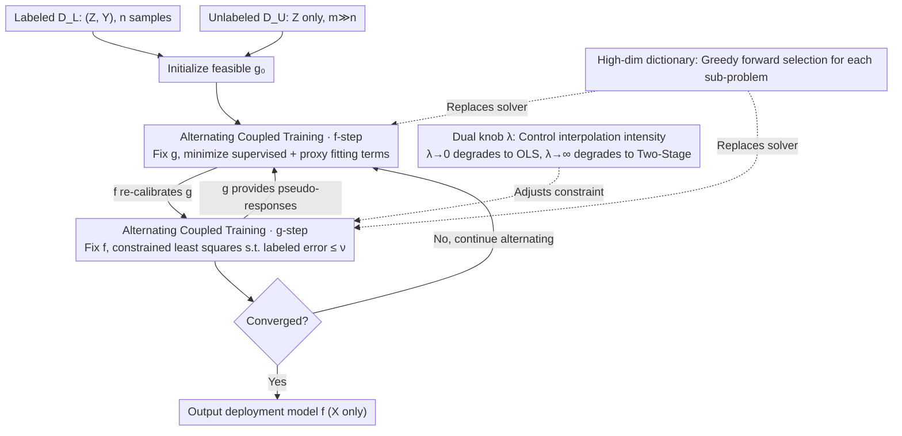

# Coupled Training with Privileged Information and Unlabeled Data

**Conference**: ICML2026  
**arXiv**: [2605.23268](https://arxiv.org/abs/2605.23268)  
**Code**: Not yet disclosed  
**Area**: Semi-supervised learning / Privileged information / Statistical learning theory  
**Keywords**: privileged information, semi-supervised learning, negative transfer, coupled training, greedy selection

## TL;DR
Addressing the "available during training, unavailable at deployment" privileged features $W$, the authors propose a framework for **joint training of a deployment model $f$ and a rich-view model $g$**. By explicitly constraining the fitting error of $g$ on labeled data to adaptively control the influence intensity of privileged information, this approach avoids the negative transfer phenomenon of traditional two-stage pseudo-labeling methods when $W$ signals are weak or noisy.

## Background & Motivation

**Background**: In scenarios such as medical imaging, longitudinal studies, and transfer learning, "privileged" features $W$ (expensive biomarkers, expert assessments, intermediate variables only collectible at future time points, etc.) are often available during training, but the deployment model must rely solely on regular features $X$ for prediction. A popular approach is the LUPI framework proposed by Vapnik, and the **two-stage pseudo-labeling method** recently extended to non-parametric settings by Xia & Wainwright (2024): Stage 1 fits a rich-view model $\hat{g}$ using $Z=(X,W)$ on labeled data $\{(Z_i, Y_i)\}_{i=1}^n$; Stage 2 uses $\hat{g}(Z_j)$ as pseudo-responses for a large set of unlabeled data $\{Z_j\}_{j=n+1}^N$, and then trains the deployment model $\hat{f}$ (using only $X$) on the combined set.

**Limitations of Prior Work**: This pipeline significantly reduces sample complexity using $W$ when privileged signals are strong. However, when $W$ is weak, noisy, or contains high-dimensional redundant components, the pseudo-responses from Stage 1 deviate severely from the true regression function $\mu$. Stage 2 learns these errors as "extra labels," resulting in prediction accuracy potentially worse than training on labeled data alone. This **negative transfer** problem, emphasized by Xia & Wainwright, is particularly prominent in clinical tasks where expensive privileged variables may not be more predictive than routine exams.

**Key Challenge**: The two-stage method treats the pseudo-responses of $\hat{g}$ as "hard targets" for Stage 2, lacking any mechanism for $\hat{f}$ to actively attenuate the influence of $\hat{g}$ if it is found to be unreliable. Conversely, completely ignoring $W$ wastes effective signals from large unlabeled samples.

**Goal**: Construct an **adaptive hybrid** mechanism that performs like the two-stage method to fully exploit privileged information when $W$ is strong, and degrades to OLS using only labeled data when $W$ is weak. This shift should be determined by the data itself rather than manual parameter tuning.

**Key Insight**: The "pseudo-response" is transformed from a hard target into a **bidirectionally coupled variable** between $f$ and $g$—$g$ provides pseudo-responses to $f$ to expand the effective sample size, while $f$ in turn "re-calibrates" $g$ on unlabeled data, requiring $g$ not to deviate too far from labeled responses. This co-regularization idea draws from multi-view learning (Sindhwani et al., 2005) but is applied to the asymmetric privileged information scenario.

**Core Idea**: A **constrained joint convex optimization** is used to simultaneously learn $f$ and $g$, with the constraint level $\nu$ (or $\lambda$ in the dual form) serving as a single knob to control the interpolation between the "Two-Stage" and "OLS" extremes.

## Method

### Overall Architecture
Let the labeled set be $\mathscr{D}_L=\{(Z_i,Y_i)\}_{i=1}^n$ and the unlabeled set be $\mathscr{D}_U=\{Z_j\}_{j=n+1}^N$ (where $Z=(X,W)$ and $m=N-n\gg n$). The goal is to learn a predictor $f$ depending only on $X$. Any $f:\mathcal{X}\to\mathbb{R}$ is lifted to $\mathcal{Z}$ as $\tilde{f}(x,w)=f(x)$. The final **constrained joint optimization problem** is:

$$\min_{(f,g)\in\mathcal{F}\times\mathcal{G}} \frac{1}{N}\Big(\sum_{i=1}^n (Y_i-f(X_i))^2 + \sum_{j=n+1}^N (g(Z_j)-f(X_j))^2\Big) \text{ s.t. } \frac{1}{n}\sum_{i=1}^n (Y_i-g(Z_i))^2 \le \nu$$

The first term is the supervised loss of $f$ on labeled data; the second term is the "proxy fitting" loss between $f$ and $g$ on unlabeled data (replacing the hard injection of $\hat{g}(Z_j)$); the constraint term forces $g$ to be a reasonable regressor on labeled data. Smaller $\nu$ approaches the two-stage method ($g$ must nearly equal the OLS of $Y$), while larger $\nu$ approaches pure labeled OLS ignoring $W$ (constraint vanishes, unlabeled term becomes meaningless). The core of the method is the **alternating coupling loop** between $f$ and $g$: $g$ feeds pseudo-responses to $f$ to expand the sample size, $f$ re-calibrates $g$ on unlabeled data, and the knob $\nu$ (or $\lambda$) regulates the influence of privileged information. In high dimensions, sub-problems use greedy selection.

### Key Designs

**1. Alternating Coupled Training Algorithm: Reducing high-dimensional joint optimization to two alternating convex sub-problems**

Optimizing $f$ and $g$ simultaneously in a high-dimensional joint space is difficult. The authors use block coordinate descent: initialize a feasible $g_0$, and at step $k$, first fix $g_{k-1}$ to solve:

$$f_k = \arg\min_f \frac{1}{N}\Big(\sum_i (Y_i-f(X_i))^2 + \sum_j (g_{k-1}(Z_j)-f(X_j))^2\Big),$$

then fix $f_k$ to solve the constrained $g_k=\arg\min_g\frac{1}{m}\sum_j(g(Z_j)-f_k(X_j))^2$ s.t. $\frac1n\sum_i(Y_i-g(Z_i))^2\le\nu$. When $\mathcal{F}, \mathcal{G}$ are convex and the loss is jointly convex, sub-problems are convex and iterations decrease monotonically. According to Grippo & Sciandrone (2000), every limit point is a global optimum. This allow using existing solvers—analytic for linear models, gradient descent for differentiable non-linear models, and greedy selection for high-dimensional dictionaries.

**2. Lagrangian Duality + Interpolation Perspective: Using a single knob $\lambda$ to link "Two-Stage" and "OLS" extremes**

Since $\nu$ is hard to interpret, the authors relax it into a Lagrangian penalty form:

$$\hat{\mathcal{L}}(f,g;\lambda)=\frac{1}{N}\Big(\sum_i (Y_i-f(X_i))^2 + \sum_j (g(Z_j)-f(X_j))^2 + \lambda\sum_i (Y_i-g(Z_i))^2\Big),$$

making the interpolation intensity explicit. $\lambda$ acts inversely to $\nu$: as $\lambda\to 0$, $g$ has no fitting pressure on labeled data, the unlabeled term fails, and the solution degrades to pure OLS. As $\lambda\to\infty$, $g$ must strictly fit labeled responses, equating to the two-stage method. Theorem 2.1 provides a clean interpolation structure: if $\mu\in\mathcal{F}\cap\mathcal{G}$ and $\eta\in\mathcal{G}$ (where $\eta(z)=\mathbb{E}[Y\mid Z=z]$), then $f^\star=\mu$ and $g^\star=\frac{m}{m+n\lambda}\mu+\frac{n\lambda}{m+n\lambda}\eta$. $g^\star$ is a weighted interpolation between the deployment target $\mu$ and the rich-view target $\eta$.

**3. Alternating Greedy Forward Selection in High-Dimensional Dictionary Spaces: Enabling the algorithm for $p\gg n$**

When $\mathcal{F}, \mathcal{G}$ are high-dimensional spaces spanned by dictionaries (sparse linear/additive models), solving large joint linear systems is computationally prohibitive. The authors replace the sub-problems in alternating minimization with greedy forward selection: at each step, an atom is picked from the dictionary that most reduces the current residual loss. Theorem 3.1 proves that overall iterations still achieve global sublinear convergence ($O(1/T)$ optimization error) on the empirical coupling objective, extending Barron / DeVore-Temlyakov greedy approximation theory to the privileged information setting and converting optimization error bounds into prediction risk bounds.

### Loss & Training
The paper uses square loss $\ell(y,y')=(y-y')^2$ for analysis, though the algorithm does not strictly depend on it (classification can use soft labels + logistic loss). $\lambda$ is tuned via a validation set. In high-dimensional settings, the relationship between dictionary size, sparsity, and sample size is analyzed.

## Key Experimental Results

### Main Results
The authors compare Two-Stage and Coupled methods on synthetic Gaussian linear models and real regression/classification benchmarks.

| Scenario | $\|\theta\|_2$ (Privileged Signal) | Two-Stage | Labeled OLS | Ours (Coupled) |
| :--- | :--- | :--- | :--- | :--- |
| Strong Privileged | Large | Optimal | Significantly worse | Near optimal |
| Weak Privileged | Small | Worse than OLS (Negative Transfer) | Good | Comparable to OLS |
| Moderate Privileged | Medium | Slightly better than OLS | Baseline | Superior to both |

A key observation is that Coupled does not perform worse than the better of the two baselines across the full spectrum of $\|\theta\|_2$, with the optimal $\lambda$ shifting smoothly according to signal strength.

### Ablation Study

| Configuration | Behavior | Description |
| :--- | :--- | :--- |
| Full Coupled (Moderate $\lambda$) | Lowest Error | Bi-directional coupling; pseudo-responses moderately attenuated. |
| $\lambda\to\infty$ | Degrades to Two-Stage | $g$ must fit $Y$; no calibration space; negative transfer in weak signal. |
| $\lambda\to 0$ | Degrades to Labeled OLS | Unlabeled data ignored; waste of $W$ in strong signal. |
| High-dim Dictionary + Greedy | Near same accuracy as closed-form | Validates Theorem 3.1 sublinear convergence in practice. |

### Key Findings
- The optimal $\lambda$ is negatively correlated with privileged signal strength: stronger signals require larger $\lambda$ (keeping $g$ close to the rich-view regression $\eta$); weaker signals require smaller $\lambda$ (keeping $g$ close to $f$).
- The correlation coefficient $\rho_\star\in[0,1]$ in Corollary 2.3 measures the alignment of residuals $\hat{e}_f$ and $\hat{e}_g$: small $\rho_\star$ implies $W$ provides significant information $X$ cannot explain, maximizing joint training gains.
- Under the greedy implementation, the algorithm restores prediction accuracy nearly identical to small-scale closed-form solutions even with dictionaries of thousands of dimensions.

## Highlights & Insights
- **Pseudo-labels as Coupling Variables**: Unlike traditional SSL treating pseudo-labels as hard targets, this work treats them as coupling variables calibrated by $f$. This "soft target + feedback loop" can extend to knowledge distillation and co-training.
- **Unified Knob $\lambda$**: Linking OLS and Two-Stage via a continuous spectrum makes the limit behavior of the method fully interpretable.
- **Multiplicative vs. Additive Risk Bounds**: Attributing negative transfer vulnerability to sensitive absolute errors and robustness to bounded relative errors suggests prioritizing relative error bounds in future SSL theoretical analysis.

## Limitations & Future Work
- Theoretical guarantees mainly cover square loss and convex function classes; non-asymptotic bounds for classification (logistic loss) are not as strong.
- Tuning $\lambda$ still relies on validation sets; no fully automated selection based on unlabeled data is provided.
- Realizability assumptions ($\mu\in\mathcal{F}\cap\mathcal{G}$) may not strictly hold for deep models; the degradation of risk bounds under model misspecification needs further characterization.
- No comparison with recent Double Machine Learning (DML) style methods for nuisance parameter estimation.

## Related Work & Insights
- **vs. Xia & Wainwright (2024) Two-Stage**: Xia treats $\hat{g}$ as a hard input for Stage 2. Ours treats $g$ and $f$ as coupled variables with explicit labeled consistency constraints, preventing mistakes in weak signal scenarios.
- **vs. LUPI (Vapnik & Vashist, 2009)**: LUPI focuses on $W$ without assuming unlabeled data; this paper explicitly incorporates $\mathscr{D}_U$ to combine privileged information and semi-supervised learning.
- **vs. Sindhwani et al. (2005) Co-Regularization**: Both use agreement terms on unlabeled data, but co-regularization is symmetric multi-view (both models deployed), while this is an asymmetric privileged setting ($f$ is the target model).

## Rating
- Novelty: ⭐⭐⭐⭐ Introduces coupling perspective to the intersection of LUPI and SSL with clean interpolation.
- Experimental Thoroughness: ⭐⭐⭐⭐ Comprehensive on synthetic and real benchmarks, though lacks large-scale deep learning validation.
- Writing Quality: ⭐⭐⭐⭐ Clear algorithm-theory-experiment chain with consistent notation.
- Value: ⭐⭐⭐⭐ Provides a continuous controllable middle ground for utilizing privileged information with generalized theoretical guarantees.

<!-- RELATED:START -->

## Related Papers

- [\[ICML 2026\] Polaris: Coupled Orbital Polar Embeddings for Hierarchical Concept Learning](polaris_coupled_orbital_polar_embeddings_for_hierarchical_concept_learning.md)
- [\[ICML 2026\] ParalESN: Enabling Parallel Information Processing in Reservoir Computing](paralesn_enabling_parallel_information_processing_in_reservoir_computing.md)
- [\[ICML 2026\] Less Data, Faster Training: Repeating Smaller Datasets Speeds Up Learning via Sampling Biases](less_data_faster_training_repeating_smaller_datasets_speeds_up_learning_via_samp.md)
- [\[ICML 2026\] Networked Information Aggregation for Binary Classification](networked_information_aggregation_for_binary_classification.md)
- [\[AAAI 2026\] Bipartite Mode Matching for Vision Training Set Search from a Hierarchical Data Server](../../AAAI2026/others/bipartite_mode_matching_for_vision_training_set_search_from_a_hierarchical_data_.md)

<!-- RELATED:END -->
