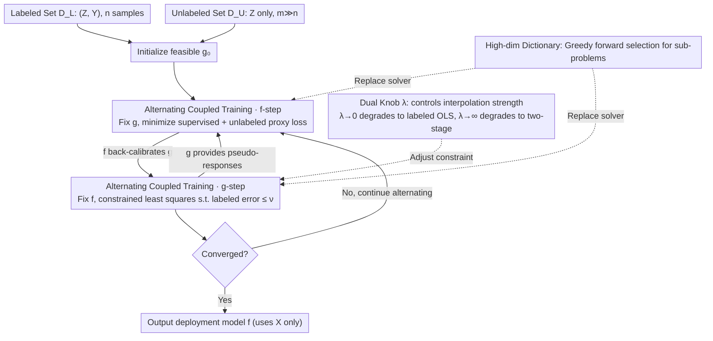

# Coupled Training with Privileged Information and Unlabeled Data

**Conference**: ICML2026  
**arXiv**: [2605.23268](https://arxiv.org/abs/2605.23268)  
**Code**: Not yet released  
**Area**: Semi-supervised Learning / Privileged Information / Statistical Learning Theory  
**Keywords**: privileged information, semi-supervised learning, negative transfer, coupled training, greedy selection

## TL;DR
Addressing privileged features $W$ that are "available during training but unavailable during deployment," the authors propose a framework for **joint training of a deployment model $f$ and a rich-view model $g$**. By explicitly constraining the fitting error of $g$ on labeled data to adaptively control the influence intensity of privileged information, this approach avoids the negative transfer phenomenon of traditional two-stage pseudo-labeling methods when $W$ signals are weak or noisy.

## Background & Motivation

**Background**: In scenarios such as medical imaging, longitudinal studies, and transfer learning, "privileged" features $W$ (e.g., expensive biomarkers, expert assessments, or intermediate variables only available at future timestamps) are often available during the training phase, but the deployment model must rely only on regular features $X$ for output. A popular approach is the LUPI framework proposed by Vapnik, as well as the **two-stage pseudo-labeling method** recently extended to non-parametric settings by Xia & Wainwright (2024). In the first stage, a rich-view model $\hat{g}$ using $Z=(X,W)$ is fitted on labeled data $\{(Z_i, Y_i)\}_{i=1}^n$. In the second stage, $\hat{g}(Z_j)$ is used as a pseudo-response for a large amount of unlabeled data $\{Z_j\}_{j=n+1}^N$, and a deployment model $\hat{f}$ using only $X$ is trained on the combined set.

**Limitations of Prior Work**: While this pipeline significantly reduces sample complexity using $W$ when privileged signals are strong, when $W$ is weak, noisy, or contains high-dimensional redundant components, the pseudo-responses fitted in the first stage deviate severely from the true regression function $\mu$. The second stage then treats these errors as "extra labels," leading to prediction accuracy that may even be worse than training on labeled data alone. This **negative transfer** issue, emphasized by Xia & Wainwright, is particularly prominent in clinical tasks where expensive privileged variables may not predict the target better than routine examinations.

**Key Challenge**: Two-stage methods treat the pseudo-responses of $\hat{g}$ as "hard targets" for the second stage, lacking a mechanism for $\hat{f}$ to actively attenuate the influence of $\hat{g}$ when it is unreliable. Conversely, completely ignoring $W$ wastes effective signals from large unlabeled samples.

**Goal**: Construct an **adaptive blending** mechanism that behaves like the two-stage method to fully exploit privileged information when $W$ signals are strong, and degrades to OLS using only labeled data when $W$ signals are weak. This transition should be determined by the data itself rather than manual parameter tuning.

**Key Insight**: The authors transform "pseudo-responses" from hard targets into **bi-directional coupling variables** between $f$ and $g$. Here, $g$ provides pseudo-responses to $f$ to expand the effective sample size, while $f$ in turn "re-calibrates" $g$ on unlabeled data, requiring that $g$ does not deviate too far from labeled responses. This co-regularization idea draws from multi-view learning (Sindhwani et al., 2005) but is applied to the asymmetric privileged information setting.

**Core Idea**: Use a **constrained joint convex optimization** to learn $f$ and $g$ simultaneously, where the constraint level $\nu$ (or $\lambda$ in dual form) acts as a single knob to interpolate between the two extremes: "two-stage method $\leftrightarrow$ OLS."

## Method

### Overall Architecture
Let the labeled set be $\mathscr{D}_L=\{(Z_i,Y_i)\}_{i=1}^n$ and the unlabeled set be $\mathscr{D}_U=\{Z_j\}_{j=n+1}^N$ (where $Z=(X,W)$ and $m=N-n\gg n$). The goal is to learn a predictor $f$ depending only on $X$. Any $f:\mathcal{X}\to\mathbb{R}$ is lifted to $\mathcal{Z}$ as $\tilde{f}(x,w)=f(x)$. The final **constrained joint optimization problem** is:

$$\min_{(f,g)\in\mathcal{F}\times\mathcal{G}} \frac{1}{N}\Big(\sum_{i=1}^n (Y_i-f(X_i))^2 + \sum_{j=n+1}^N (g(Z_j)-f(X_j))^2\Big) \text{ s.t. } \frac{1}{n}\sum_{i=1}^n (Y_i-g(Z_i))^2 \le \nu$$

The first term is the supervised loss of $f$ on labeled data, the second term is the "proxy fitting" loss between $f$ and $g$ on unlabeled data (replacing the hard injection of $\hat{g}(Z_j)$ as pseudo-labels), and the constraint term forces $g$ to be a reasonable regressor on labeled data. Smaller $\nu$ approaches the two-stage method ($g$ must nearly equal the OLS of $Y$), while larger $\nu$ approaches pure labeled OLS ignoring $W$ (constraint vanishes, unlabeled term becomes meaningless). The core of the method is the **alternating coupling loop** between $f$ and $g$: $g$ feeds $f$ pseudo-responses to expand effective samples, $f$ re-calibrates $g$ on unlabeled data, and the knob $\nu$ (or $\lambda$) regulates the influence of privileged info. In high dimensions, sub-problems are replaced with greedy selection.

### Key Designs

**1. Alternating Coupled Training Algorithm: Reducing joint optimization to two alternating convex sub-problems**

Simultaneously learning the deployment model $f$ and rich-view model $g$ in a high-dimensional joint space is difficult. The authors use block coordinate descent: initializing with any feasible $g_0$, step $k$ first fixes $g_{k-1}$ to solve

$$f_k = \arg\min_f \frac{1}{N}\Big(\sum_i (Y_i-f(X_i))^2 + \sum_j (g_{k-1}(Z_j)-f(X_j))^2\Big),$$

then fixes $f_k$ to solve the constrained $g_k=\arg\min_g\frac{1}{m}\sum_j(g(Z_j)-f_k(X_j))^2$ s.t. $\frac1n\sum_i(Y_i-g(Z_i))^2\le\nu$. When $\mathcal{F},\mathcal{G}$ are convex and the loss is jointly convex, both sub-problems are convex with monotonic descent. Per Grippo & Sciandrone (2000), every limit point is globally optimal. This allows sub-problems to be handled by existing solvers: analytical for linear models, gradients for differentiable non-linear models, or greedy selection for high-dimensional dictionaries.

**2. Lagrangian Duality + Bi-directional Interpolation Perspective: Linking "Two-Stage" and "OLS" via a single knob $\lambda$**

As the constraint level $\nu$ is hard to interpret, the authors relax it into a Lagrangian penalty form:

$$\hat{\mathcal{L}}(f,g;\lambda)=\frac{1}{N}\Big(\sum_i (Y_i-f(X_i))^2 + \sum_j (g(Z_j)-f(X_j))^2 + \lambda\sum_i (Y_i-g(Z_i))^2\Big),$$

making interpolation strength tangible. $\lambda$ moves inversely to $\nu$: as $\lambda\to 0$, $g$ has no fitting pressure on labeled data, the unlabeled term fails, and the solution degrades to pure labeled OLS. As $\lambda\to\infty$, $g$ must strictly fit labeled responses, equating to the two-stage method. Theorem 2.1 provides a clean interpolation structure: if $\mu\in\mathcal{F}\cap\mathcal{G}$ and $\eta\in\mathcal{G}$ (where $\eta(z)=\mathbb{E}[Y\mid Z=z]$), then $f^\star=\mu$ and $g^\star=\frac{m}{m+n\lambda}\mu+\frac{n\lambda}{m+n\lambda}\eta$. Thus, $g^\star$ is a weighted interpolation between the deployment target $\mu$ and rich-view target $\eta$, making limit behaviors explainable and simplifying risk bound proofs.

**3. Alternating Greedy Forward Selection in High-Dimensional Dictionaries: Scaling to $p\gg n$**

When $\mathcal{F},\mathcal{G}$ are high-dimensional spaces spanned by dictionaries (e.g., sparse linear or additive models), solving large joint linear systems is computationally prohibitive. The authors replace the sub-problems in alternating minimization with greedy forward selection: at each step, an atom is selected from the dictionary that maximizes the reduction in the current residual loss (combining block-coordinate and greedy forward stepwise). While single steps are combinatorial, Theorem 3.1 proves the global sub-linear convergence ($O(1/T)$ optimization error) on the empirical coupled objective. This extends classic Barron / DeVore-Temlyakov greedy approximation theory to the coupled privileged information setting and converts optimization error bounds into prediction risk bounds.

### Loss & Training
The paper uses squared loss $\ell(y,y')=(y-y')^2$ for analytical convenience, though the algorithm does not strictly depend on it (classification can treat $\hat Y$ as soft labels with logistic loss). $\lambda$ is tuned via a validation set. Under high-dimensional settings, the authors analyze the interaction between dictionary size, sparsity, and sample size.

## Key Experimental Results

### Main Results
The authors compare Two-Stage and Coupled methods on synthetic Gaussian linear models and real regression/classification benchmarks.

| Scenario | $\|\theta\|_2$ (Privileged Signal Strength) | Two-Stage Method | Labeled OLS | Ours (Coupled) |
| :--- | :--- | :--- | :--- | :--- |
| Strong Privileged | High | Optimal | Significantly worse | Near two-stage optimal |
| Weak Privileged | Low | Worse than OLS (Negative Transfer) | Good | Comparable to or better than OLS |
| Moderate Privileged | Medium | Slightly better than OLS | Baseline | Superior to both |

A key observation is that Coupled never performs worse than the better of the two baselines across the spectrum of $\|\theta\|_2$, with the optimal $\lambda$ shifting smoothly according to signal strength.

### Ablation Study
| Configuration | Behavior | Description |
| :--- | :--- | :--- |
| Full Coupled (Moderate $\lambda$) | Lowest Error | Bi-directional coupling between $f$ and $g$; pseudo-responses moderately attenuated. |
| $\lambda\to\infty$ | Degrades to Two-Stage | $g$ must fit $Y$; no room for calibration; negative transfer in weak signal scenarios. |
| $\lambda\to 0$ | Degrades to Labeled OLS | Unlabeled data becomes ineffective; wasted $W$ in strong signal scenarios. |
| Greedy + High-dim Dict | Near-equivalent to closed-form | Validates the practical sub-linear convergence of Theorem 3.1. |

### Key Findings
- The optimal value of $\lambda$ is negatively correlated with privileged signal strength: stronger signals favor larger $\lambda$ (pushing $g$ toward the rich-view regression $\eta$), while weaker signals favor smaller $\lambda$ (pulling $g$ toward $f$, negating the unlabeled term's pull).
- The correlation coefficient $\rho_\star\in[0,1]$ in Corollary 2.3 measures the alignment of residuals between $\hat{e}_f$ and $\hat{e}_g$: small $\rho_\star$ implies $W$ provides extra info not explained by $X$, maximizing joint training gains. Large $\rho_\star$ suggests redundancy. Unlike Xia & Wainwright's additive absolute error bounds, this paper provides multiplicative relative error bounds, showing smoother degradation in risk when $g$ worsens.
- Even with dictionaries of thousands of dimensions, the greedy implementation recovers prediction accuracy nearly identical to small-scale closed-form solutions, validating the transfer from optimization error to risk error.

## Highlights & Insights
- **Pseudo-labels as Coupled Variables**: Traditional SSL treats pseudo-labels as hard targets. This work treats them as coupled quantities calibrated by $f$, a "soft target + feedback loop" applicable to knowledge distillation and co-training.
- **Unified Interpolation View**: Connecting OLS ($\lambda\to 0$) and the Two-Stage method ($\lambda\to\infty$) via $\lambda$ makes the limit behaviors of the algorithm fully explainable.
- **Multiplicative vs. Additive Risk Bounds**: Attributing negative transfer vulnerability to sensitive absolute errors and robustness to bounded relative errors suggests a prioritized focus on relative error bounds in future SSL theory.

## Limitations & Future Work
- Theoretical guarantees mainly cover squared loss and convex classes; classification versions (logistic loss) lack equally strong non-asymptotic bounds.
- Tuning $\lambda$ depends on a validation set; there is no fully automated selection scheme based solely on unlabeled data. Reliability of validation becomes a bottleneck when $n$ is extremely small or under distribution shift.
- Realizability assumptions ($\mu\in\mathcal{F}\cap\mathcal{G}$) may not hold for deep models; the degradation of risk bounds under model misspecification needs further study.
- Comparison with recent Double Machine Learning (DML) style methods for nuisance parameter estimation is missing, despite potential connections.

## Related Work & Insights
- **vs. Xia & Wainwright (2024) Two-Stage**: While they treat $\hat{g}$ as hard pseudo-labels, this work uses $g$ and $f$ as coupled variables with explicit labeled consistency constraints, avoiding misinformation from weak signals.
- **vs. LUPI (Vapnik & Vashist, 2009)**: LUPI uses $W$ during training without assuming unlabeled data; this work integrates "privileged info + semi-supervised learning."
- **vs. Sindhwani et al. (2005) Co-Regularization**: Both use agreement terms on unlabeled data, but co-regularization is symmetric and multi-view. This work is asymmetric; $f$ is the only deployed model, while $g$ acts as an auxiliary teacher.
- **vs. Pseudo-Labeling (Lee, 2013) / Weak Supervision (Ratner et al., 2016)**: These inject pseudo-signals as exogenous; this work uses $\lambda$ as a "global influence switch" to control signal intensity.

## Rating
- Novelty: ⭐⭐⭐⭐ Coupled perspective on LUPI + SSL with clean interpolation characterization.
- Experimental Thoroughness: ⭐⭐⭐⭐ Comprehensive on synthetic and regression/classification benchmarks, but lacks large-scale deep learning validation.
- Writing Quality: ⭐⭐⭐⭐ Clear algorithm-theory-experiment chain and self-consistent notation.
- Value: ⭐⭐⭐⭐ Provides a continuous, controllable middle ground for utilizing privileged information with theoretical guarantees.

<!-- RELATED:START -->

## Related Papers

- [\[ICML 2026\] Polaris: Coupled Orbital Polar Embeddings for Hierarchical Concept Learning](polaris_coupled_orbital_polar_embeddings_for_hierarchical_concept_learning.md)
- [\[ICML 2026\] ParalESN: Enabling Parallel Information Processing in Reservoir Computing](paralesn_enabling_parallel_information_processing_in_reservoir_computing.md)
- [\[ICML 2026\] Less Data, Faster Training: Repeating Smaller Datasets Speeds Up Learning via Sampling Biases](less_data_faster_training_repeating_smaller_datasets_speeds_up_learning_via_samp.md)
- [\[ICML 2026\] Networked Information Aggregation for Binary Classification](networked_information_aggregation_for_binary_classification.md)
- [\[AAAI 2026\] Bipartite Mode Matching for Vision Training Set Search from a Hierarchical Data Server](../../AAAI2026/others/bipartite_mode_matching_for_vision_training_set_search_from_a_hierarchical_data_.md)

<!-- RELATED:END -->
