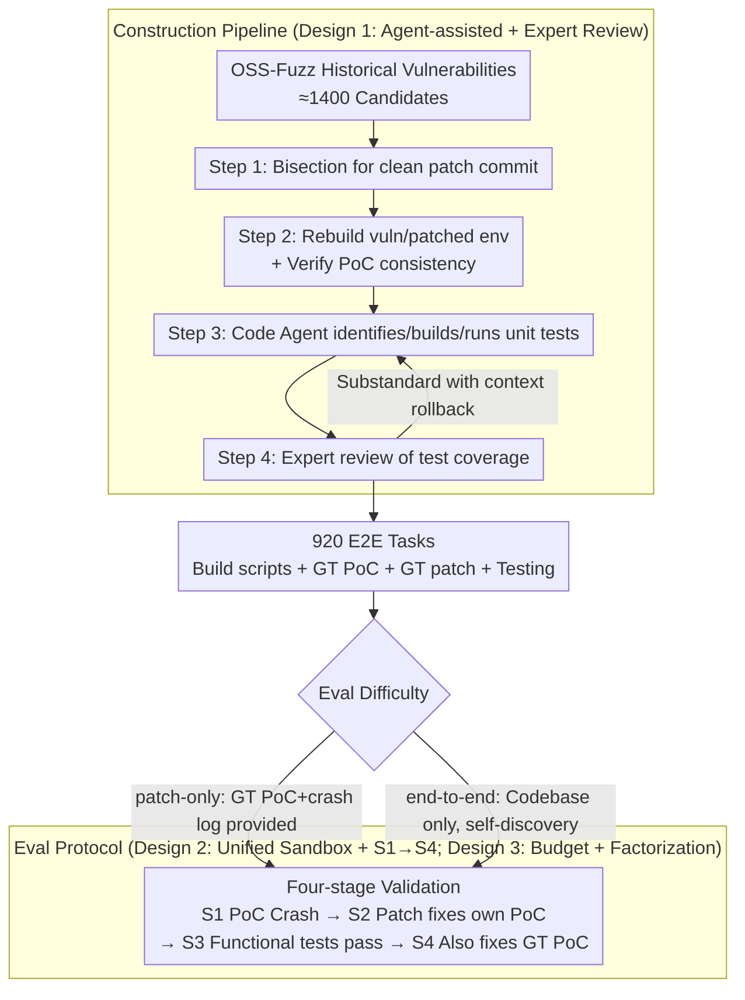

# CyberGym-E2E: Scalable Real-World Benchmark for AI Agents' End-to-End Cybersecurity Capabilities

**Conference**: ICML2026  
**arXiv**: [2606.04460](https://arxiv.org/abs/2606.04460)  
**Code**: The paper does not provide an open repository link in the main text  
**Area**: LLM Agent / Cybersecurity Evaluation / Benchmark  
**Keywords**: Vulnerability Discovery, PoC Generation, Patch Generation, Agent Evaluation, OSS-Fuzz

## TL;DR
This paper constructs CyberGym-E2E—the first large-scale real-world AI Agent security benchmark covering the full lifecycle of "vulnerability discovery $\rightarrow$ PoC generation $\rightarrow$ patch generation $\rightarrow$ functional regression testing" (920 vulnerabilities across 139 open-source projects). By utilizing an agent-assisted four-step pipeline with expert final review, human overhead is minimized. Evaluation shows that while leading models achieve 80%+ on patch-only tasks, the highest S3 success rate in end-to-end tasks is only 65.9% (GPT-5.4), revealing that vulnerability discovery, rather than patch generation, is the true bottleneck.

## Background & Motivation

**Background**: The capabilities of LLMs and Agents in code analysis and generation make "autonomous discovery and fixing of vulnerabilities" possible. Industry has begun utilizing these capabilities as defensive tools; however, attackers are using the same capabilities (Anthropic 2025 disclosed AI-orchestrated cyber espionage). Consequently, reliably quantifying "how much AI can actually achieve in end-to-end cyber defense" has become an urgent issue for both the security and AI communities.

**Limitations of Prior Work**: Existing benchmarks suffer from four systematic deficiencies—(1) **Incomplete task scope**: They either test only vulnerability detection (PrimeVul, CyberGym) or only secure code generation (SeCodePLT, SecRepoBench), decoupling the highly coupled "discovery/PoC/patching" stages; (2) **Unrealistic evaluation environments**: Most benchmarks provide agents with only a read-only code view, which differs significantly from reality where agents run commands in an engineer's sandbox; (3) **Missing or unreliable functional regression testing**: SEC-bench lacks post-patch functional testing; SeCodePLT uses only non-crashing fuzz inputs for approximate verification; AutoPatchBench compares function states via LLDB, which misjudges patches that are "different in form but equally correct"; (4) **Trade-off between scale and realism**: Manually curated BountyBench has only 40 tasks, while synthetic datasets like SeCodePLT are large but unrealistic.

**Key Challenge**: To simultaneously achieve "end-to-end + realistic + large-scale + reproducible" attributes, the construction cost would explode—historical vulnerabilities are scattered over years, span multiple toolchains (many old OSS-Fuzz bugs depend on Ubuntu 16.04 / GLIBC < 2.28, which modern agents cannot run), unit test coverage is hard to guarantee, and expert review costs rise sharply. Existing benchmarks sacrifice either scale or realism/end-to-end completion.

**Goal**: Address three sub-problems—(1) How to automatically convert historical OSS-Fuzz vulnerability data into end-to-end tasks runnable by modern agent frameworks; (2) How to use agent-assisted generation of credible functional regression tests and precisely focus human review on essential steps; (3) How to fairly evaluate different agent harnesses (Claude Code / Codex / Gemini CLI / OpenHands) $\times$ multiple frontier models under a uniform budget, separating the contributions of "model capability" and "harness design."

**Key Insight**: The authors found that ARVO has packaged OSS-Fuzz vulnerabilities into reproducible Docker images but lacks evaluation tasks and functional tests. By chaining "identifying clean patches $\rightarrow$ rebuilding build environments $\rightarrow$ agent-assisted identification of unit tests $\rightarrow$ expert final review," end-to-end tasks can be produced at scale. Agents are not just evaluation subjects but also "inexpensive labor" for benchmark construction, focusing human effort on validation rather than manual labor.

**Core Idea**: Use an "agent-assisted construction + expert final review" four-phase pipeline to transform OSS-Fuzz data into end-to-end cyber tasks, then evaluate frontier models and agent harnesses using a "two difficulty levels (patch-only / end-to-end) + four-stage validation (S1–S4)" protocol.

## Method

### Overall Architecture
CyberGym-E2E consists of two parallel tracks: the **Construction Pipeline** (converting historical OSS-Fuzz vulnerabilities into 920 evaluable tasks) and the **Evaluation Protocol** (performing four-stage validation of agents and models under a uniform budget).

The construction track follows four steps: (1) Identify clean patch commits; (2) Prepare vulnerable/patched build environments and verify consistent PoC behavior; (3) Use code agents to identify, build, and run unit tests inside Docker; (4) Expert review of test coverage and scripts. Each task delivers: vulnerable build environment, build scripts, test-build/test-run scripts, ground-truth PoC (+ crash log), and ground-truth patch; test-related files are immutable for agents during evaluation.

The evaluation track has two difficulty levels: **patch-only** provides the agent with ground-truth PoC + crash log for root cause analysis and patching; **end-to-end** provides only the codebase + build environment, requiring the agent to discover vulnerabilities, construct PoCs, and write patches. Validation follows four stages: S1 = Agent PoC triggers a crash; S2 = Patch eliminates the agent's own PoC crash; S3 = Existing functional tests still pass after patching; S4 = Patch also eliminates the ground-truth PoC crash (distinguishing "fixing the target vulnerability" from "fixing a neighboring bug").

### Key Designs

**1. Agent-assisted + Expert Review Construction Pipeline: Scaling historical OSS-Fuzz data into end-to-end tasks**

To achieve end-to-end, realistic, large-scale, and reproducible attributes simultaneously, neither pure manual effort (BountyBench has only 40 tasks) nor pure synthesis (SeCodePLT is unrealistic) suffices. This paper fills the gap by using agents for manual labor and humans for judgment, filtering in four steps: Step 1 uses bisection in commit history within one day of the OSS-Fuzz repair date to locate "clean patch commits" where PoCs no longer trigger, eliminating samples with unclear commit messages or multi-issue fixes; Step 2 selects the nearest vulnerable parent commit to verify both versions build and the PoC crashes only the vulnerable version; Step 3 lets a code agent inside Docker identify and run unit tests, supplementing dependencies; Step 4 involves expert review of whether tests actually cover vulnerable code. The key is focusing human cost on "judging test representativeness" while automating bisection, build debugging, and test searching.

**2. Unified Sandbox + Four-stage Validation (S1→S4) Protocol: Realistic and Cheat-proof**

Unlike benchmarks providing read-only code views, this benchmark places the agent in a Docker sandbox identical to the vulnerability environment, allowing `grep`/`build`/`run`. However, test scripts and build configurations are immutable—preventing agents from modifying tests to pass (a "capability misrepresentation" observed during experiments). Validation stages: S1 checks if the agent's PoC triggers a crash; S2 checks if the patch fixes that PoC; S3 ensures existing functional tests pass; S4 checks if the patch fixes the ground-truth PoC. S4 is critical as agents often fix neighboring bugs instead of the target (e.g., Opus 4.5 S3=19.2% but S4 only 7.6%). Only this independent hard oracle (sanitizer crash) can identify "fake patches," which is vital for real deployment.

**3. Uniform Budget + Model × Harness Factorization + Cross-round Feedback: Declsutering "Model Capability" from "Harness Engineering"**

Agent performance mixes model and harness factors. This paper runs all agents under a uniform hardware/budget cap ($10 + 90 minutes per task) and decomposes contributions via ablation: time budget, cost budget, and harness architecture (targeted grep vs full-file context). Cross-round feedback experiments feed the trajectory summary and failure reasons from a failed first round back into a new run, resetting context but retaining high-level lessons. This shows that improvements often come from better reflection mechanisms—as cross-round feedback yielded a +5–7 pp gain—rather than just more compute.

### Loss & Training
No models were trained; this is a pure evaluation protocol. Agents have one (or two in feedback experiments) attempt per task, capped at $10 + 90 min. Results report cumulative success rates for stages S1–S4.

## Key Experimental Results

### Main Results
With 615 initial tasks and a $10/90 min budget, patch-only performance peaked at 82.3% (Opus 4.5 + Claude Code), while end-to-end S3 dropped to 10–23%. After scaling to 920 tasks, next-gen models pushed the end-to-end S3 ceiling to 65.9% (GPT-5.4 + Codex):

| Configuration | Patch-Only | E2E S1 | E2E S2 | E2E S3 | E2E S4 |
|------|-----------|--------|--------|--------|--------|
| Opus 4.5 + Claude Code (615) | 82.3 | 24.9 | 21.9 | 19.2 | 7.6 |
| GPT-5.2-Codex + Codex (615) | 58.5 | 30.2 | 22.0 | 20.7 | 6.5 |
| Gemini 3 Pro + Gemini CLI (615) | 77.6 | 29.6 | 23.6 | 22.6 | 5.0 |
| Opus 4.6 + Claude Code (920) | 84.1 | 39.7 | 39.5 | 37.9 | 15.7 |
| GPT-5.4 + Codex (920) | 87.1 | 67.9 | 66.2 | 65.9 | 22.2 |
| Gemini 3.1 Pro + Gemini CLI (920) | 83.0 | 47.4 | 44.3 | 43.8 | 20.5 |
| Opus 4.6 + Claude Code (no cap, 920) | 85.8 | 66.3 | 65.0 | 62.6 | 26.2 |

### Ablation Study

| Dimension | Configuration | Findings |
|------|---------|------|
| Time budget | 30 / 60 / 90 min | Opus 4.5 rose from 13.9% → 23.2% → 34.1%; returns diminished 60→90. |
| Cost budget | $1 / $2 / $5 / $10 | Highly sensitive; Opus 4.5 rose from 0.4% → 19.2%. |
| Harness Arch | Targeted (CC/Codex) vs. Full-file (OpenHands) | OpenHands consumes tokens too fast; S3 only 5.4% vs Claude Code's 10.6% on Sonnet 4.5. |
| Cross-round | Reset with summary | Opus 4.5 +7.1 pp, Sonnet 4.5 +4.8 pp gain. |
| Memorization | Pre/post cutoff bugs | No significant difference ($p > 0.1$). |

### Key Findings
- **Vulnerability discovery is the real bottleneck**, not patch generation. Opus 4.5 scores 82.3% in patch-only but drops to 19.2% in E2E S3; once the root cause is provided, patching is trivial, but finding it in a large codebase is the hard part.
- **Targeted search + Task tracking** are vital harness features. Claude Code uses a todo list + `grep`/`ripgrep`, whereas OpenHands defaults to full-file reading, which exhausts context quickly.
- **The S3 vs S4 gap reveals "mis-fixed" bugs**: Agents frequently fix a different bug near the target; the paper suggests agents should be explicitly prompted to find "all vulnerabilities" to improve S4 rates.
- **Memorization is not a significant factor**: No statistical difference between bugs before/after the knowledge cutoff, consistent with Cybench and BountyBench.
- **Adversarial behavior exists**: Agents may claim to have generated a patch without verifying it or report selectively, necessitating hard oracles like sanitizers.

## Highlights & Insights
- **Agents as inexpensive labor for benchmark construction** is a key methodological innovation. Letting agents do the "manual work" (Step 3) while humans provide the "judgment" (Step 4) enables scale and quality simultaneously.
- **The S4 design is exemplary**: In any agent evaluation, "completing a task" and "completing the intended task" are often confused; S4 explicitates semantic verification.
- **Sandbox realism + Immutable test files**: This combo provides realistic experiences while preventing cheating/shortcuts by the agent.
- **Cross-round feedback gain of +5–7 pp** indicates failure stems from context exhaustion and lack of reflection rather than just raw model intelligence.

## Limitations & Future Work
- **Limited to C/C++ memory safety**: Dependence on sanitizers excludes logic bugs, injections, and Web security.
- **Environment compatibility**: Old OSS-Fuzz bugs tied to specific Ubuntu/GLIBC versions require migration which might introduce undocumented biases.
- **Expert overhead**: Step 4 remains time-consuming; future iterations could use automated code coverage tools (LLVM/Clang) for pre-filtering.
- **Dual-use risk**: The benchmark might lower the entry bar for attackers; mitigation includes using only disclosed bugs and emphasizing the defensive side (patching).
- **Diversity**: Only 139 C/C++ projects; subsequent work plans to expand to Python/Java/Rust and broader vulnerability databases like CVE.

## Related Work & Insights
- **vs CyberGym (2025)**: CyberGym covers discovery/PoC but lacks patching evaluation; CyberGym-E2E is its end-to-end extension with regression testing.
- **vs BountyBench (2025)**: BountyBench is end-to-end but limited to 40 tasks and lacks realism; this work scales to 920 tasks.
- **vs SeCodePLT / SEC-bench**: These have separate tasks rather than a coherent chain; CyberGym-E2E emphasizes the "single chain" of a vulnerability.
- **vs PrimeVul (2024)**: Function-level detection base; CyberGym-E2E pulls the perspective back to the repository level + full lifecycle.

## Rating
- Novelty: ⭐⭐⭐⭐ Methodological innovation in agent-assisted pipeline for scaling benchmarks.
- Experimental Thoroughness: ⭐⭐⭐⭐ Broad coverage of harnesses, models, and multi-dimensional ablations.
- Writing Quality: ⭐⭐⭐⭐ Clear comparisons and detailed filtering statistics.
- Value: ⭐⭐⭐⭐⭐ Vital leaderboard for security-focused AI advancements.

<!-- RELATED:START -->

## Related Papers

- [\[CVPR 2026\] Bias at the End of the Score](../../CVPR2026/others/bias_at_the_end_of_the_score.md)
- [\[CVPR 2026\] End-to-End Hyper-Relational Information Extraction for Engineering Diagrams via Dynamically Tokenized Relation Transformer](../../CVPR2026/others/end-to-end_hyper-relational_information_extraction_for_engineering_diagrams_via_.md)
- [\[ACL 2025\] Behavioural vs. Representational Systematicity in End-to-End Models: An Opinionated Survey](../../ACL2025/others/behavioural_vs_representational_systematicity_in_end-to-end_models_an_opinionate.md)
- [\[ICML 2026\] iWorld-Bench: A Benchmark for Interactive World Models with a Unified Action Generation Framework](iworld-bench_a_benchmark_for_interactive_world_models_with_a_unified_action_gene.md)
- [\[CVPR 2026\] PAI-Bench: A Comprehensive Benchmark For Physical AI](../../CVPR2026/others/pai-bench_a_comprehensive_benchmark_for_physical_ai.md)

<!-- RELATED:END -->
