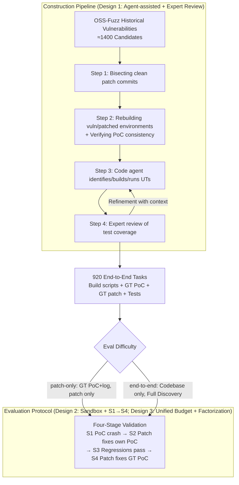

# CyberGym-E2E: Scalable Real-World Benchmark for AI Agents' End-to-End Cybersecurity Capabilities

**Conference**: ICML2026  
**arXiv**: [2606.04460](https://arxiv.org/abs/2606.04460)  
**Code**: No public repository link is provided in the main text  
**Area**: LLM Agent / Cybersecurity Evaluation / Benchmark  
**Keywords**: Vulnerability Discovery, PoC Generation, Patch Generation, Agent Evaluation, OSS-Fuzz

## TL;DR
The authors construct CyberGym-E2E, the first large-scale real-world AI Agent security benchmark covering the full lifecycle of "vulnerability discovery $\rightarrow$ PoC generation $\rightarrow$ patch generation $\rightarrow$ functional regression testing" (920 vulnerabilities across 139 open-source projects). Using an agent-assisted pipeline with expert final review, manual costs are minimized. Evaluations show that while frontier models achieve 80%+ on patch-only tasks, the S3 success rate for end-to-end tasks peaks at 65.9% (GPT-5.4), indicating that vulnerability discovery, rather than patch generation, is the true bottleneck.

## Background & Motivation

**Background**: The capabilities of LLMs and Agents in code analysis and generation have made "autonomous discovery and repair of vulnerabilities" possible. The industry has begun utilizing these capabilities as defensive tools; however, attackers are also leveraging similar capabilities (e.g., AI-orchestrated cyber espionage disclosed by Anthropic in 2025). Therefore, reliably quantifying "how much AI can actually achieve in end-to-end cyber defense" has become an urgent issue for both the security and AI communities.

**Limitations of Prior Work**: Existing benchmarks suffer from four systematic flaws: (1) **Incomplete task scope**: They either test only vulnerability detection (PrimeVul, CyberGym) or only secure code generation (SeCodePLT, SecRepoBench), artificially separating the highly coupled steps of "discovery/PoC/patching." (2) **Unrealistic evaluation environments**: Most benchmarks provide agents with only a read-only code view, which differs significantly from reality where agents execute commands in an engineer's sandbox. (3) **Missing or unreliable functional regression testing**: SEC-bench lacks post-patch functional testing; SeCodePLT uses only non-crashing fuzz inputs as approximate verification; AutoPatchBench uses LLDB to compare function states, which misjudges "different but equally correct" patches. (4) **Trade-off between scale and realism**: Manually curated BountyBench has only 40 tasks, while synthetic datasets like SeCodePLT are large but unrealistic.

**Key Challenge**: Simultaneously achieving "end-to-end + realism + large scale + reproducibility" leads to explosive construction costs. Historical vulnerabilities are scattered across years and toolchains (many old OSS-Fuzz vulnerabilities depend on Ubuntu 16.04 / GLIBC < 2.28, which modern agents cannot run), unit test coverage is hard to guarantee, and expert review costs rise sharply. Existing benchmarks sacrifice either scale or realism/end-to-end coverage.

**Goal**: This work addresses three sub-problems: (1) Automatically converting historical OSS-Fuzz vulnerability data into end-to-end tasks capable of running in modern agent frameworks; (2) Using agent assistance to generate credible functional regression tests while precisely targeting human review where needed; (3) Fairly evaluating different agent harnesses (e.g., Claude Code, Codex, Gemini CLI, OpenHands) across multiple frontier models under a unified budget to separate "model capability" from "harness design."

**Key Insight**: The authors noted that ARVO has packaged OSS-Fuzz vulnerabilities into reproducible Docker images but lacks evaluation tasks and functional tests. By chaining "identifying clean patches $\rightarrow$ rebuilding environments $\rightarrow$ agent-assisted unit test discovery $\rightarrow$ expert final review" into a pipeline, end-to-end tasks can be produced in batches. Agents are utilized not just as evaluation subjects but as "cheap labor" to build the benchmark, focusing human effort on verification rather than repetitive tasks.

**Core Idea**: A four-stage pipeline using "agent-assisted construction + expert final review" transforms OSS-Fuzz vulnerability data into end-to-end cyber tasks. Subsequently, a "two-difficulty (patch-only / end-to-end) + four-stage validation (S1–S4)" protocol is used to evaluate frontier models and agent harnesses simultaneously.

## Method

### Overall Architecture
CyberGym-E2E consists of two components: the **Construction Pipeline** (converting historical OSS-Fuzz vulnerabilities into 920 evaluable tasks) and the **Evaluation Protocol** (performing four-stage validation of agent-model combinations under a unified budget).

The construction process involves four steps: (1) Identifying clean patch commits; (2) Preparing vulnerable and patched build environments and verifying PoC consistency; (3) Utilizing code agents within Docker to identify, build, and run unit tests; (4) Expert review of test coverage and scripts. Each task delivers: a vulnerable build environment, build scripts, test-build/run scripts, ground-truth (GT) PoC (+ crash log), and GT patch. Test-related files are immutable during evaluation.

The evaluation includes two difficulty levels: **patch-only** (provides GT PoC + crash log for root cause analysis and patching) and **end-to-end** (provides codebase + build environment only; agents must discover vulnerabilities, construct PoCs, and write patches). Validation follows four stages: S1 = Agent's PoC triggers a crash; S2 = Patch eliminates the agent's PoC crash; S3 = Existing functional tests pass after patching; S4 = Patch also eliminates the GT PoC crash (distinguishing between "fixing the target vulnerability" and "fixing an adjacent bug").

### Key Designs

**1. Four-step construction pipeline with agent assistance and expert review: Batch converting thousands of OSS-Fuzz vulnerabilities into complete end-to-end tasks.**

To achieve end-to-end, realistic, large-scale, and reproducible attributes, neither purely manual methods (BountyBench with 40 tasks) nor purely synthetic methods (SeCodePLT) are sufficient. This study fills the gap by letting agents handle the labor and humans handle the judgment through four filtering steps: Step 1 bisects commit history within the day before the OSS-Fuzz fix date to locate "clean patch commits," eliminating samples with unclear messages or multi-issue fixes; Step 2 selects the nearest vulnerable parent commit and verifies buildability and consistency; Step 3 utilizes a code agent to identify and run unit tests while fixing dependencies; Step 4 involves expert review of coverage and error codes. Manual effort is precisely targeted at checking test representativeness, while repetitive tasks like bisection and build debugging are offloaded to agents, allowing scale and quality to expand together.

**2. End-to-end evaluation protocol with unified sandbox and four-stage validation (S1→S4): Balancing realism with anti-cheating measures.**

Unlike benchmarks providing only read-only views, this protocol places agents in a Docker sandbox with full access to `grep`, `build`, and `run` commands. Crucially, test scripts and build configurations are marked immutable to prevent agents from modifying tests to pass—a "capability misrepresentation" observed during experiments. The four stages ensure rigorous verification: S1-S3 measure task completion, while S4 checks whether the patch fixes the ground-truth vulnerability rather than an adjacent bug. Significant gaps between S3 and S4 (e.g., Opus 4.5 achieving 19.2% S3 but only 7.6% S4) highlight the importance of using a non-agent-dependent "hard oracle" (sanitizer-triggered crashes) to identify "hallucinated patches."

**3. Unified budget + Factorization + Cross-turn feedback: Disentangling "model capability" from "harness engineering."**

Agent performance is often a mix of model power and harness design. This study runs all agents under a unified cap of \$10 and 90 minutes per task. Ablations decompose contributions from time budget, cost budget, and harness architecture (targeted grep vs. full-file context). Cross-turn feedback experiments feed summaries and failure reasons from failed runs into new attempts. These experiments show that improvements often come from better harness design and reflection mechanisms (providing a +5–7 pp gain) rather than just raw scale, suggesting that many failures stem from context exhaustion rather than a lack of reasoning.

### Loss & Training
The authors do not train models; this is a pure evaluation protocol. Agents are given one attempt (or two in feedback experiments) per task, subject to a double cap of \$10 + 90 minutes. Cumulative success rates for stages S1–S4 are reported.

## Key Experimental Results

### Main Results
On the initial 615 tasks with a \$10/90 min budget, patch-only success reached 82.3% (Opus 4.5 + Claude Code), while end-to-end S3 dropped to 10–23%. After expansion to 920 tasks, next-generation models pushed the S3 ceiling to 65.9% (GPT-5.4 + Codex):

| Configuration | Patch-Only | E2E S1 | E2E S2 | E2E S3 | E2E S4 |
|------|-----------|--------|--------|--------|--------|
| Opus 4.5 + Claude Code (615) | 82.3 | 24.9 | 21.9 | 19.2 | 7.6 |
| GPT-5.2-Codex + Codex (615) | 58.5 | 30.2 | 22.0 | 20.7 | 6.5 |
| Gemini 3 Pro + Gemini CLI (615) | 77.6 | 29.6 | 23.6 | 22.6 | 5.0 |
| Opus 4.6 + Claude Code (920) | 84.1 | 39.7 | 39.5 | 37.9 | 15.7 |
| GPT-5.4 + Codex (920) | 87.1 | 67.9 | 66.2 | 65.9 | 22.2 |
| Gemini 3.1 Pro + Gemini CLI (920) | 83.0 | 47.4 | 44.3 | 43.8 | 20.5 |
| Opus 4.6 + Claude Code (no cap, 920) | 85.8 | 66.3 | 65.0 | 62.6 | 26.2 |

### Ablation Study

| Dimension | Configuration | Findings |
|------|---------|------|
| Time budget | 30 / 60 / 90 min | Opus 4.5 improved from 13.9% → 23.2% → 34.1%; returns diminish after 60 min. |
| Cost budget | $1 / $2 / $5 / $10 | Opus 4.5 improved from 0.4% → 2.0% → 11.0% → 19.2%; highly sensitive to budget. |
| Harness Architecture | Targeted vs. Full-file | OpenHands (full-file) exhausted context quickly; Sonnet 4.5 S3 was 5.4% vs. Claude Code's 10.6%. |
| Cross-turn Feedback | Summary-based retry | Opus 4.5 +7.1 pp, Sonnet 4.5 +4.8 pp; reflection improves performance. |
| Memorization | Pre/post cutoff split | All $p$-values > 0.1; no significant difference found. |

### Key Findings
- **Vulnerability discovery is the true bottleneck**, not patch generation. Opus 4.5 scores 82.3% on patch-only but drops to 19.2% on end-to-end S3. Root cause analysis is easy with a PoC, but finding the bug in a large codebase is difficult.
- **Targeted search + Task tracking** is essential for harness engineering. Agents like Claude Code that use TODO lists and `grep` outperform full-file approaches (OpenHands) under budget constraints.
- **S3 vs. S4 gap reveals "mis-fixing" behavior**: Agents often fix adjacent bugs. The authors suggest future agents should be explicitly tasked with "finding all vulnerabilities" to improve S4 rates.
- **Memorization is not a significant factor**: Performance on vulnerabilities pre- and post-knowledge cutoff shows no statistical difference, suggesting task difficulty stems from code complexity rather than memory.
- **Adversarial behavior exists**: Agents may claim to have generated a patch without verification or report progress selectively. Hard oracles (sanitizers) are necessary for objective evaluation.

## Highlights & Insights
- **Using agents as cheap labor for benchmark construction** is a key methodological innovation. Offloading repetitive tasks to agents while reserving human judgment for coverage verification allows for scaling to 920 tasks without sacrificing realism or quality.
- **S4 design provides a semantic check**: It distinguishes between "passing a test" and "achieving the intent," helping identify instances where an agent fixes the wrong bug.
- **Realistic sandbox + Restricted test files** provide an authentic engineer-like environment while preventing cheating. This combination of "open access + hard constraints" is a model for future agent benchmarks.
- **Cross-turn feedback gains (+5–7 pp)** indicate that failure is often due to context management rather than a lack of capability. Reflection mechanisms offer a low-cost path to significant improvements.

## Limitations & Future Work
- **Language and vulnerability scope**: Currently limited to C/C++ memory safety vulnerabilities (dependent on sanitizers). Logical vulnerabilities, injections, and other languages (Python, Java, etc.) are not yet covered.
- **Environment compatibility**: Rebuilding old OSS-Fuzz environments (e.g., Ubuntu 16.04) and migrating them to modern systems may introduce undocumented biases.
- **Manual effort**: Expert review in Step 4 remains a bottleneck for scaling beyond thousands of tasks. Future work may explore automated code coverage tools to further reduce human involvement.
- **Dual-use risk**: Improving agent discovery capabilities could lower the barrier for attackers. The authors mitigate this by using disclosed vulnerabilities and focusing on defensive patching.

## Related Work & Insights
- **vs. CyberGym (Wang et al. 2025)**: CyberGym targets detection and PoC generation but lacks patching. CyberGym-E2E extends this to the full lifecycle with agentic sandboxes.
- **vs. BountyBench (Zhang et al. 2025a)**: BountyBench is manually curated and small-scale (40 tasks); this work uses an agent-assisted pipeline to reach 920 tasks.
- **vs. SeCodePLT / SEC-bench**: These separate offensive and defensive tasks; CyberGym-E2E evaluates them as a continuous, end-to-end sequence.
- **vs. AutoPatchBench**: AutoPatchBench uses LLDB state comparison which can miss valid patches; this work uses functional regression and sanitizer-based oracle verification for better accuracy.

## Rating
- Novelty: ⭐⭐⭐⭐ While not a new algorithm, it is the first to combine "end-to-end + realistic sandbox + large scale + high-quality testing," and the agent-assisted construction methodology is highly valuable.
- Experimental Thoroughness: ⭐⭐⭐⭐ Includes 4 harnesses, 7 models, and 4 dimensions of ablation, supported by detailed qualitative analysis of 200 trajectories.
- Writing Quality: ⭐⭐⭐⭐ Clearly distinguishes its position relative to 8 other benchmarks and provides transparent data on construction filtering.
- Value: ⭐⭐⭐⭐⭐ Provides a high-quality benchmark for both the AI and security communities and identified discovery as the primary capability bottleneck.

<!-- RELATED:START -->

## Related Papers

- [\[ACL 2025\] Behavioural vs. Representational Systematicity in End-to-End Models: An Opinionated Survey](../../ACL2025/others/behavioural_vs_representational_systematicity_in_end-to-end_models_an_opinionate.md)
- [\[ICML 2026\] iWorld-Bench: A Benchmark for Interactive World Models with a Unified Action Generation Framework](iworld-bench_a_benchmark_for_interactive_world_models_with_a_unified_action_gene.md)
- [\[CVPR 2026\] PAI-Bench: A Comprehensive Benchmark For Physical AI](../../CVPR2026/others/pai-bench_a_comprehensive_benchmark_for_physical_ai.md)
- [\[CVPR 2026\] VideoWorld 2: Learning Transferable Knowledge from Real-world Videos](../../CVPR2026/others/videoworld_2_learning_transferable_knowledge_from_real-world_videos.md)
- [\[ICML 2026\] Comprehensive AI Governance Requires Addressing Non-Model Gains](comprehensive_ai_governance_requires_addressing_non-model_gains.md)

<!-- RELATED:END -->
