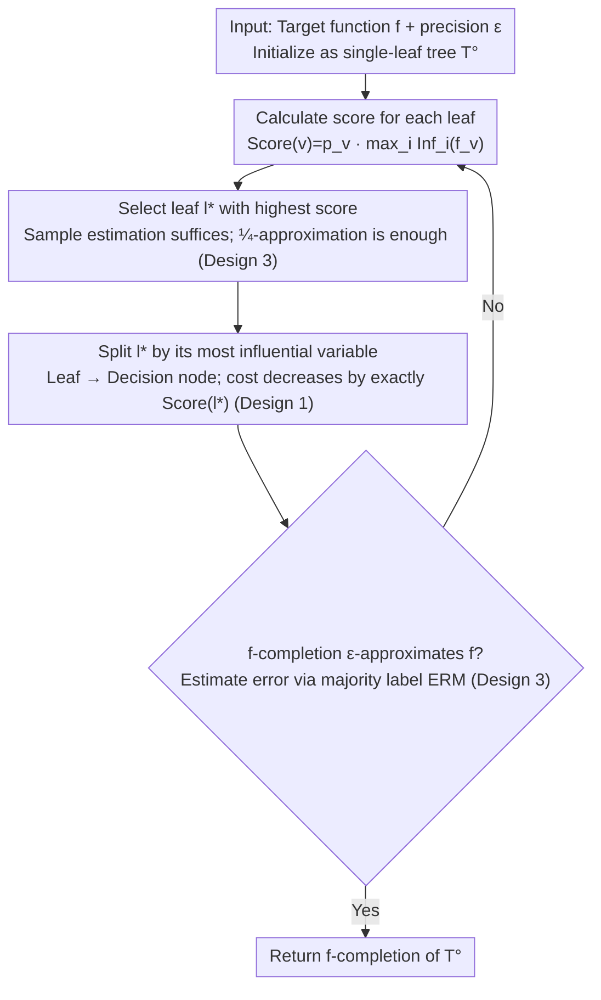

# Decision Tree Learning on Product Spaces

**Conference**: ICML 2026  
**arXiv**: [2605.12983](https://arxiv.org/abs/2605.12983)  
**Code**: None (Theoretical paper)  
**Area**: Learning Theory / Decision Tree Learning  
**Keywords**: top-down greedy heuristic, influence splitting, product distribution, PAC learning, parameter-free

## TL;DR
This paper extends the theoretical guarantees of Blanc et al. (ITCS'20) for the "top-down greedy decision tree heuristic" from uniform distributions to **arbitrary product distributions**. It provides an upper bound on tree size of $\exp(\Delta_\mathrm{opt} D_\mathrm{opt}\log(e/\epsilon))$ (strictly superior to ITCS'20 in the full binary tree case) and is **entirely parameter-free**, requiring no prior knowledge of the optimal tree size or depth.

## Background & Motivation

**Background**: Decision trees (ID3 / C4.5 / CART) dominate numerous tasks in practice via "top-down greedy + influence (or equivalent entropy/Gini) splitting." However, theoretical analysis has long been decoupled from practice—algorithms by Ehrenfeucht-Haussler, Mehta-Raghavan, and Blanc were either brute-force searches or required prior knowledge of $s$ (optimal tree size), differing significantly from real-world algorithms.

**Limitations of Prior Work**: (a) Blanc et al. (ITCS'20) provided the first rigorous guarantee for top-down greedy, but their analysis heavily relied on **uniform distribution + Boolean Fourier analysis**, limiting its applicability; (b) feature distributions in real-world data are often highly non-uniform, making previous theoretical guarantees insufficient as practical explanations; (c) even the implementation by Blanc et al. required knowing $s$ beforehand to select hyperparameters, making it unusable in engineering.

**Key Challenge**: The gap between practical algorithms (adaptive, splitting by local maximum influence, no global parameters) and theoretical algorithms (global optimization, reliance on uniform distributions, requiring $s$).

**Goal**: (1) Extend top-down greedy guarantees to arbitrary product distributions $\mu=\mu_1\times\cdots\times\mu_n$; (2) strictly tighten the upper bound for full binary trees compared to Blanc et al.; (3) provide a parameter-free implementation with a robust version that tolerates sample estimation errors.

**Key Insight**: Instead of Fourier-analytic tools, this work utilizes "two depth parameters"—maximum depth $D_\mathrm{opt}$ (used for the total influence $\le$ depth $\times$ variance inequality in Lemma 4.2) and average depth $\Delta_\mathrm{opt}$ (used for the max-influence $\ge$ variance / average depth inequality in Lemma C.1 from O'Donnell 2005). The product $\Delta_\mathrm{opt} D_\mathrm{opt}$ serves as the mixed driving term.

**Core Idea**: Use "cost = $\sum_\mathrm{leaves} p_v \cdot \mathrm{Inf}(f_v)$" as a potential function to prove: (a) error $\le$ cost, (b) each split reduces cost by an amount equal to the leaf's score, and (c) lower bounds for the score within two cost intervals, thereby bounding the total number of steps.

## Method

As a purely theoretical paper, the "Method" comprises the algorithm (adapted from Blanc et al. ITCS'20), new analysis, and a parameter-free implementation.

### Overall Architecture
The algorithm `BuildTopDownDT(f, ε)` is a **greedy iterative loop**: starting from a single-leaf tree, it calculates score = $p_v \cdot \max_i \mathrm{Inf}^\mu_i(f_v)$ for each leaf in every round. It selects the leaf with the highest score to split based on its most influential variable, then checks if the $f$-completion (filling leaves with majority labels) has $\epsilon$-approximated $f$. If not, it returns to scoring; otherwise, it terminates. The contribution lies in the **analytical framework** for this loop: using cost as a potential function to track a two-phase descent—first from $\mathrm{Inf}(f)$ to $\epsilon D_\mathrm{opt}$ (Phase 1, Lemma 4.6), then to where error $\le \epsilon$ (Phase 2, Lemma 4.7)—while providing a parameter-free implementation using sample-based score estimation and ERM majority labels for termination.

> The flowchart illustrates the algorithm loop; Design 1 (cost potential) explains "how cost drops and why error $\le$ cost," Design 2 (two depth parameters) explains "how many iterations are needed," and Design 3 provides a sampleable implementation for "scoring and termination."

### Key Designs

**1. Influence in Product Spaces + Cost Potential: Mapping "Algorithm Steps" to a Monotonically Decreasing Scalar Linked to error $\le$ cost**

The analysis in ITCS'20 relies on uniform distributions and Boolean Fourier analysis, which fails in non-uniform settings. This work avoids Fourier coefficients, using probabilistic influence: $\mathrm{Inf}^\mu_i(f)=\Pr_{x\sim\mu}[f(x)\neq f(x^{(i)})]$ (where $x^{(i)}$ is $x$ with the $i$-th coordinate resampled via $\mu_i$). Leaf score is defined as $\mathrm{Score}(v)=p_v\cdot \max_i \mathrm{Inf}_i(f_v)$, and tree cost as $\mathrm{cost}(T^\circ)=\sum_{v\in\mathrm{leaves}} p_v\cdot \mathrm{Inf}(f_v)$. Lemma 4.1 establishes error $\le$ cost, and Lemma 4.3 proves that splitting leaf $v$ reduces cost by exactly $\mathrm{Score}(v)$, translating "greedy logic" into "cost descent rate." Because these rely only on probabilistic definitions and product structures, the analysis extends naturally to any product distribution.

**2. Bound Driven by Two Depth Parameters: Separately tracking $D_\mathrm{opt}$ and $\Delta_\mathrm{opt}$ to achieve exponentially tighter bounds under non-uniform distributions**

In uniform distributions, $D_\mathrm{opt}=\Delta_\mathrm{opt}$ and they collapse; prior work did not separate them. Under non-uniformity, they can differ exponentially, making separate tracking essential for tightening the bound. $D_\mathrm{opt}$ enters via $\mathrm{Inf}(f)\le D(T)\cdot \mathrm{Var}(f)$ (Lemma 4.2), and $\Delta_\mathrm{opt}$ enters via the max-influence inequality $\max_i \mathrm{Inf}_i(f)\ge \mathrm{Var}(f)/\Delta(T)$. Two score lower bounds (Lemma 4.4 for cost $\le \epsilon D_\mathrm{opt}$ and Lemma 4.5 for cost $\ge \epsilon D_\mathrm{opt}$) provide step bounds for each phase, yielding a mixed bound $\max\bigl((e\Delta_\mathrm{opt}/(\epsilon D_\mathrm{opt}))^{\Delta_\mathrm{opt} D_\mathrm{opt}}, e^{\Delta_\mathrm{opt} D_\mathrm{opt}}\bigr)$. For path-like trees ($\Delta_\mathrm{opt}$ constant, $D_\mathrm{opt}=n$), $\Delta_\mathrm{opt} D_\mathrm{opt}$ is much smaller than $D_\mathrm{opt}^2$, proving exponentially better than "depth-only" bounds. For balanced trees ($D_\mathrm{opt}=\Delta_\mathrm{opt}=\log s$), the bound $s^{\log s\log(e/\epsilon)}$ also slightly outperforms Blanc et al.

**3. Parameter-free + Robust Implementation: Running without prior knowledge of $s$ or $D_\mathrm{opt}$ and requiring only ¼-approximate optimal leaves**

Prior theoretical algorithms required $s$ to define termination and hyperparameters, making them impractical. Theorem 5.1 proves that as long as the selected leaf satisfies $\mathrm{Score}(l')\ge \frac14 \max_l \mathrm{Score}(l)$, the bound only degrades to an index of $4\Delta_\mathrm{opt} D_\mathrm{opt}$. This tolerance allows scores to be estimated via unbiased sampling $\widehat{\mathrm{Score}}(l,i,E_i)=\frac{1}{|E_i|}\sum_{(x,x^{(i)})}\mathbf 1[x,x^{(i)}\to l]\mathbf 1[f(x)\neq f(x^{(i)})]$ with Chernoff bounds, and termination via majority-vote ERM. This is the first version that can be directly executed—also explaining why practical CART/C4.5 works on noisy data: they fall within this "1/4-approximation is enough" robust range.

### Loss & Training
N/A (Theoretical paper). The algorithm's optimization objective is "splitting the leaf with the maximum score," equivalent to greedily reducing cost; the termination condition is estimated error $\le \epsilon$.

## Key Experimental Results

### Main Results (Theoretical results, non-empirical)

| Setting | Upper Bound | Comparison with Blanc et al. ITCS'20 |
|---|---|---|
| Arbitrary product dist, general tree | $\max((e\Delta_\mathrm{opt}/(\epsilon D_\mathrm{opt}))^{\Delta_\mathrm{opt} D_\mathrm{opt}}, e^{\Delta_\mathrm{opt} D_\mathrm{opt}})$ | Generalized to non-uniform distributions |
| Uniform dist + full binary tree ($\Delta_\mathrm{opt}=D_\mathrm{opt}=\log s$) | $s^{\log s\cdot\log(e/\epsilon)}$ | Slightly tighter than $s^{O(\log(s/\epsilon)\log(1/\epsilon))}$ |
| Balanced tree ($D_\mathrm{opt},\Delta_\mathrm{opt}\in O(\log s)$) | $s^{O(\log s\cdot\log(e/\epsilon))}$ | Same as above |
| Path-like tree ($\Delta_\mathrm{opt}$ const, $D_\mathrm{opt}=n$) | Exponentially better than $D_\mathrm{opt}^2$ bound | Benefit of separate parameter tracking |

### Key Robustness Results

| Configuration | Upper Bound | Description |
|---|---|---|
| Exact score | $\Delta_\mathrm{opt} D_\mathrm{opt}$ index | Theorem 1.1 |
| Select leaf score $\ge$ ¼ max | $4\Delta_\mathrm{opt} D_\mathrm{opt}$ index | Theorem 5.1, tolerates sample estimation |
| Sample complexity per step | $\tilde O((j+1)n/\epsilon)$ | For failure probability $\delta/2$ |

### Key Findings
- $D_\mathrm{opt}$ and $\Delta_\mathrm{opt}$ must be tracked separately; doing so brings exponential improvements in path-like trees, a phenomenon previously masked by uniform distribution symmetry.
- The greedy algorithm is highly robust—selecting a 1/4-approximate optimal leaf is sufficient, enabling sample-based implementation and explaining why practical CART/C4.5 remains effective on noisy data.
- Since Koch et al. (2023) proved no poly-size algorithm exists for decision tree learning, the quasi-polynomial dependence on $s$ is nearly tight; Ours bound "hugs" the lower bound.

## Highlights & Insights
- Complete departure from Boolean Fourier tools—providing a "non-Fourier path" for further theoretical analysis (noise stability, agnostic learning) on product spaces.
- Bounding cost in two separate inequalities using $D_\mathrm{opt}$ and $\Delta_\mathrm{opt}$ is a rare "mixed parameter exponential bound" technique transferable to other greedy potential function analyses.
- The parameter-free implementation and 1/4-approximation robustness bridge the gap between "theoretical" and "executable" algorithms.

## Limitations & Future Work
- The bound remains quasi-polynomial ($s^{\log s}$); while the Koch et al. lower bound suggests this is unavoidable in the worst case, real-world data might admit better performance not captured by a tight distribution-specific bound here.
- Restricted to product distributions $\mu=\mu_1\times\cdots\times\mu_n$—real-world features are **correlated**, and extending this to non-product (Markov/general) distributions remains an open problem.
- Error measure is 0-1 loss (Boolean functions); regression trees or soft labels are not directly covered.
- Sample complexity in the worst case still depends on $n$ (feature count), which may be high in sparse, high-dimensional scenarios.

## Related Work & Insights
- **vs Blanc et al. (ITCS'20)**: Both analyze top-down greedy, but ITCS'20 is limited to uniform distributions and relies on Fourier; Ours uses product-space influence and variance-depth inequalities to bypass this.
- **vs Mehta-Raghavan (TCS'02)**: Provided an $n^{O(\log(s/\epsilon))}$ DP algorithm, but only for uniform distributions and far from practical greedy methods.
- **vs Blanc et al. (FOCS'22)**: Designed a polylog-influential variable algorithm reaching $n^{O(\log\log n)}$ runtime, which is more complex and non-greedy; Ours strictly analyzes the actual greedy heuristic.
- **vs Koch et al. (SODA'23, COLT'24)**: Provided superpolynomial / NP-hard lower bounds, proving that our quasi-poly upper bound is nearly tight.

## Rating
- Novelty: ⭐⭐⭐⭐ Not a new algorithm, but uses "mixed-depth + non-Fourier" techniques to push guarantees to arbitrary product distributions with a parameter-free implementation.
- Experimental Thoroughness: ⭐⭐⭐ Purely theoretical; no empirical experiments, but theory aligns with known upper and lower bounds.
- Writing Quality: ⭐⭐⭐⭐ Lemma chains progress clearly; proof sketches provide intuition, though some notation is dense.
- Value: ⭐⭐⭐⭐ A significant bridge in decision tree theory, providing the first rigorous guarantee for practical greedy algorithms in settings closer to real-world data distributions.

<!-- RELATED:START -->

## Related Papers

- [\[AAAI 2026\] DFDT: Dynamic Fast Decision Tree for IoT Data Stream Mining on Edge Devices](../../AAAI2026/others/dfdt_dynamic_fast_decision_tree_for_iot_data_stream_mining_on_edge_devices.md)
- [\[ICLR 2026\] Active Learning for Decision Trees with Provable Guarantees](../../ICLR2026/others/active_learning_for_decision_trees_with_provable_guarantees.md)
- [\[ICML 2026\] Structure-Induced Information for Rerooting Levin Tree Search](structure-induced_information_for_rerooting_levin_tree_search.md)
- [\[ICML 2026\] HASTE: Hardware-Aware Dynamic Sparse Training for Large Output Spaces](haste_hardware-aware_dynamic_sparse_training_for_large_output_spaces.md)
- [\[AAAI 2026\] From Sequential to Recursive: Enhancing Decision-Focused Learning with Bidirectional Feedback](../../AAAI2026/others/from_sequential_to_recursive_enhancing_decision-focused_learning_with_bidirectio.md)

<!-- RELATED:END -->
