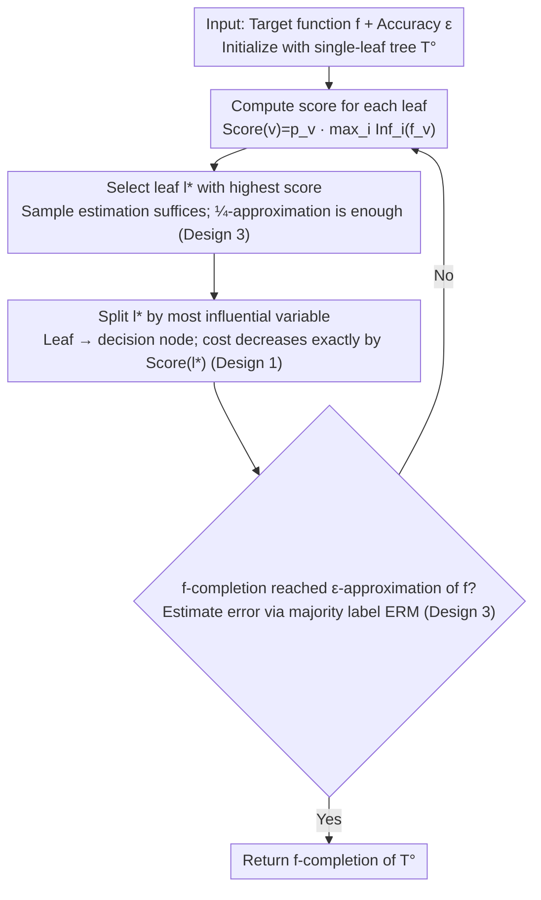

# Decision Tree Learning on Product Spaces

**Conference**: ICML 2026  
**arXiv**: [2605.12983](https://arxiv.org/abs/2605.12983)  
**Code**: None (Theoretical paper)  
**Area**: Learning Theory / Decision Tree Learning  
**Keywords**: top-down greedy heuristic, influence splitting, product distribution, PAC learning, parameter-free

## TL;DR
This paper generalizes the theoretical guarantees of Blanc et al. (ITCS'20) for the "top-down greedy decision tree heuristic" from uniform distributions to **arbitrary product distributions**. It establishes an upper bound of size $\exp(\Delta_\mathrm{opt} D_\mathrm{opt}\log(e/\epsilon))$ (strictly superior to ITCS'20 in the full binary tree case) and is **entirely parameter-free**—it can be executed without prior knowledge of the optimal tree size or depth.

## Background & Motivation

**Background**: Decision trees (ID3 / C4.5 / CART) using "top-down greedy + influence (or equivalent entropy/Gini) splitting" are dominant in practice across numerous tasks. However, theoretical analysis has long been disconnected from practice—algorithms by Ehrenfeucht-Haussler, Mehta-Raghavan, and Blanc were either brute-force searches or required prior knowledge of $s$ (the optimal tree size), differing significantly from real-world algorithms.

**Limitations of Prior Work**: (a) Blanc et al. ITCS'20 provided the first rigorous guarantee for top-down greedy splitting, but the analysis heavily relied on **uniform distribution + Boolean Fourier analysis**, limiting its scope; (b) Feature distributions in real-world data are often highly non-uniform, meaning theoretical guarantees failed to provide effective explanations for practice; (c) Even the implementation by Blanc et al. required prior knowledge of $s$ to select hyperparameters, making it industrially impractical.

**Key Challenge**: The gap between practical algorithms—which are "adaptive, split based on local maximal influence, and require no global parameters"—and theoretical algorithms—which involve "global optimization, depend on uniform distributions, and require prior knowledge of $s$."

**Goal**: (1) Extend top-down greedy guarantees to arbitrary product distributions $\mu=\mu_1\times\cdots\times\mu_n$; (2) Strictly tighten the upper bound of Blanc et al. in the case of full binary trees; (3) Provide a parameter-free implementation and a robust version (tolerant of sample estimation errors).

**Key Insight**: Instead of Fourier-analytic tools, this work utilizes "two depth parameters"—the maximum depth $D_\mathrm{opt}$ (used for the total influence $\le$ depth $\times$ variance inequality in Lemma 4.2) and the average depth $\Delta_\mathrm{opt}$ (used for the max-influence $\ge$ variance / average depth inequality in Lemma C.1 from O'Donnell 2005). The product of these two parameters, $\Delta_\mathrm{opt} D_\mathrm{opt}$, serves as the hybrid driving term.

**Core Idea**: A potential function "cost = $\sum_\mathrm{leaves} p_v \cdot \mathrm{Inf}(f_v)$" is employed to prove that (a) error $\le$ cost, (b) every split step reduces the cost strictly by an amount equal to the leaf's score, and (c) lower bounds for the score are provided across two different cost intervals, thereby bounding the total number of steps.

## Method

As a purely theoretical paper, the "Method" comprises the algorithm (derived from Blanc et al. ITCS'20) + new analysis + a parameter-free implementation.

### Overall Architecture
The algorithm `BuildTopDownDT(f, ε)` is a **greedy iterative loop**: starting from a single-leaf tree, it computes $\text{score} = p_v \cdot \max_i \mathrm{Inf}^\mu_i(f_v)$ for each leaf in every round. It selects the leaf with the highest score to split based on its most influential variable, then checks if the $f$-completion (completing leaves via majority label) has reached an $\epsilon$-approximation of $f$. If not, it returns to scoring; otherwise, it terminates. The contribution of this paper lies in establishing an **analytical framework** for this loop: using cost as a potential function to track a two-phase descent—first from $\mathrm{Inf}(f)$ to $\epsilon D_\mathrm{opt}$ (Phase 1, Lemma 4.6), then from $\epsilon D_\mathrm{opt}$ until error $\le \epsilon$ (Phase 2, Lemma 4.7)—and providing a parameter-free implementation (using samples to estimate scores and ERM majority labels for the termination criterion).

> The framework diagram depicts the algorithmic loop. Design 1 (cost potential function) explains "how the cost decreases at each step and why error $\le$ cost"; Design 2 (two depth parameters) answers "how many iterations this loop requires"; Design 3 implements "scoring/termination" via sample estimation.

### Key Designs

**1. Influence under Product Distributions + Cost Potential: Translating "algorithmic steps" into a monotonically decreasing scalar linked via error $\le$ cost**

The analysis in ITCS'20 heavily relied on uniform distribution + Boolean Fourier analysis, which fails in non-uniform settings. This paper avoids Fourier coefficients, defining influence via probability: $\mathrm{Inf}^\mu_i(f)=\Pr_{x\sim\mu}[f(x)\neq f(x^{(i)})]$ (where $x^{(i)}$ is $x$ with the $i$-th coordinate resampled via $\mu_i$). A leaf score is defined as $\mathrm{Score}(v)=p_v\cdot \max_i \mathrm{Inf}_i(f_v)$, and tree cost as $\mathrm{cost}(T^\circ)=\sum_{v\in\mathrm{leaves}} p_v\cdot \mathrm{Inf}(f_v)$. Lemma 4.1 establishes error $\le$ cost, while Lemma 4.3 proves that splitting leaf $v$ reduces cost by exactly $\mathrm{Score}(v)$. This translates the greedy heuristic's behavior into the rate of cost decay. Since these metrics rely solely on probabilistic definitions and product structures, the analysis naturally extends to any product distribution.

**2. Upper Bound Driven by Hybrid Two-Depth Parameters: Separately tracking max depth $D_\mathrm{opt}$ and average depth $\Delta_\mathrm{opt}$ to obtain exponentially tighter bounds under non-uniform distributions**

Under uniform distributions, $D_\mathrm{opt} = \Delta_\mathrm{opt}$, so prior works did not distinguish them. However, under non-uniform distributions, they can differ exponentially; tracking them separately is crucial for tightening the bound. $D_\mathrm{opt}$ enters the analysis via Lemma 4.2 ($\mathrm{Inf}(f)\le D(T)\cdot \mathrm{Var}(f)$), and $\Delta_\mathrm{opt}$ via the max-influence inequality of O'Donnell et al. ($\max_i \mathrm{Inf}_i(f)\ge \mathrm{Var}(f)/\Delta(T)$). Two score lower bounds (Lemma 4.4 for cost $\ge \epsilon D_\mathrm{opt}$ and Lemma 4.5 for cost $\le \epsilon D_\mathrm{opt}$) provide upper bounds for steps in each phase. Summing them yields the hybrid bound $\max\bigl((e\Delta_\mathrm{opt}/(\epsilon D_\mathrm{opt}))^{\Delta_\mathrm{opt} D_\mathrm{opt}}, e^{\Delta_\mathrm{opt} D_\mathrm{opt}}\bigr)$. For path-like trees ($\Delta_\mathrm{opt}$ is constant, $D_\mathrm{opt}=n$), $\Delta_\mathrm{opt} D_\mathrm{opt}$ is much smaller than $D_\mathrm{opt}^2$, proving exponentially superior to bounds using only $D_\mathrm{opt}$. For balanced trees ($D_\mathrm{opt}=\Delta_\mathrm{opt}=\log s$), the bound is $s^{\log s\log(e/\epsilon)}$, also slightly better than Blanc et al.

**3. Parameter-free + Robust Approximate Implementation: Operational without prior knowledge of $s$ or $D_\mathrm{opt}$, requiring only a ¼-approximate optimal leaf**

Previous theoretical algorithms required knowing $s$ to set termination conditions and hyperparameters, making them impractical. Theorem 5.1 proves that as long as the selected leaf satisfies $\mathrm{Score}(l')\ge \frac14 \max_l \mathrm{Score}(l)$, the upper bound only degrades to the exponent $4\Delta_\mathrm{opt} D_\mathrm{opt}$. This tolerance allows the score to be estimated via unbiased samples $\widehat{\mathrm{Score}}(l,i,E_i)=\frac{1}{|E_i|}\sum_{(x,x^{(i)})}\mathbf 1[x,x^{(i)}\to l]\mathbf 1[f(x)\neq f(x^{(i)})]$ plus a Chernoff bound. The sample complexity per step is $M_S(j,\delta,\epsilon,n)=\frac{12(j+1)n}{\epsilon}\log\frac{4j^2(j+1)n}{\delta}$. Termination is judged via majority-vote ERM error estimation. This is the first directly runnable version—simultaneously explaining why industrial CART/C4.5 works on noisy data: they fall within this "¼-approximation is enough" robust interval.

### Loss & Training
N/A (Theoretical paper). The optimization objective of the algorithm is "split the leaf with the maximum score," equivalent to greedily reducing cost. The termination condition is estimated error $\le \epsilon$ (ERM majority label + Chernoff sample size).

## Key Experimental Results

### Main Results (Theoretical, non-empirical)

| Setup | Upper Bound | Comparison with Blanc et al. ITCS'20 |
|---|---|---|
| Arbitrary product distribution, general tree | $\max((e\Delta_\mathrm{opt}/(\epsilon D_\mathrm{opt}))^{\Delta_\mathrm{opt} D_\mathrm{opt}}, e^{\Delta_\mathrm{opt} D_\mathrm{opt}})$ | Generalized to non-uniform distributions |
| Uniform distribution + Full binary tree ($\Delta_\mathrm{opt}=D_\mathrm{opt}=\log s$) | $s^{\log s\cdot\log(e/\epsilon)}$ | Slightly tighter than $s^{O(\log(s/\epsilon)\log(1/\epsilon))}$ |
| Balanced tree ($D_\mathrm{opt},\Delta_\mathrm{opt}\in O(\log s)$) | $s^{O(\log s\cdot\log(e/\epsilon))}$ | Same as above |
| Path-like tree ($\Delta_\mathrm{opt}$ constant, $D_\mathrm{opt}=n$) | Exponentially better than $D_\mathrm{opt}^2$ bound | Benefit of separate parameter tracking |

### Key Robustness Results

| Configuration | Upper Bound | Description |
|---|---|---|
| Exact Score | $\Delta_\mathrm{opt} D_\mathrm{opt}$ in exponent | Theorem 1.1 |
| Select leaf score $\ge 1/4$ max | $4\Delta_\mathrm{opt} D_\mathrm{opt}$ in exponent | Theorem 5.1; tolerates sample estimation |
| Sample complexity per step | $\tilde O((j+1)n/\epsilon)$ | For $\delta$/total failure probability = $\delta/2$ |

### Key Findings
- $D_\mathrm{opt}$ and $\Delta_\mathrm{opt}$ are two parameters that must be tracked separately; doing so yields exponential improvements on path-like trees, a phenomenon previously masked by the symmetry of uniform distributions.
- The greedy algorithm is highly robust—selecting a ¼-approximate optimal leaf is sufficient, allowing sample estimation to be applied effectively. This explains why industrial CART/C4.5 works on noisy data.
- Since Koch et al. (2023) proved no poly-size algorithm exists for decision tree learning, the quasi-polynomial dependence on $s$ is nearly tight within a constant gap—the bounds in this paper essentially "touch" the lower bounds.

## Highlights & Insights
- Completely moves away from Boolean Fourier tools—this provides a "non-Fourier path" for future theoretical analysis of decision trees on product spaces (noise stability, agnostic learning, etc.).
- Bounding the cost using $D_\mathrm{opt}$ and $\Delta_\mathrm{opt}$ across two different inequalities is a rare example of a "hybrid parameter exponential bound"—a technique transferable to any "greedy score + monotonic potential function" analysis.
- The parameter-free implementation + 1/4-approximation robustness transforms a "theoretical algorithm" into a "runnable algorithm"—a step often neglected in prior theoretical literature.

## Limitations & Future Work
- The bound remains quasi-polynomial ($s^{\log s}$), not polynomial; while Koch et al. proved this unavoidable in the worst case, real-world data might perform better, and distribution-specific tight bounds were not provided.
- Only applicable to product distributions $\mu=\mu_1\times\cdots\times\mu_n$—real-world features are **correlated**. Extending this to non-product (Markov / general) distributions remains an open problem.
- The error metric is 0-1 loss (Boolean functions $\{\pm 1\}$); regression trees or soft labels are not directly covered.
- Worst-case sample complexity still depends on $n$ (number of features), manifesting high sampling overhead in high-dimensional sparse scenarios.

## Related Work & Insights
- **vs Blanc et al. (ITCS'20)**: Also analyzed top-down greedy but only for uniform distributions and relied on Fourier analysis; this work bypasses those limitations using product-space influence + variance-depth inequalities.
- **vs Mehta-Raghavan (TCS'02)**: Provided an $n^{O(\log(s/\epsilon))}$ DP algorithm, but only for uniform distributions and deviate from practical algorithms.
- **vs Blanc et al. (FOCS'22)**: Designed a polylog-influential variable algorithm achieving $n^{O(\log\log n)}$ runtime—more complex and non-greedy. This paper provides rigorous analysis for the actual greedy approach instead.
- **vs Koch et al. (SODA'23, COLT'24)**: Provided superpolynomial / NP-hard lower bounds, proving that the quasi-poly upper bounds here are nearly tight.

## Rating
- Novelty: ⭐⭐⭐⭐ Not a new algorithm, but the "hybrid two-depth + non-Fourier" technique pushes guarantees to arbitrary product distributions and the parameter-free implementation makes the theory practical.
- Experimental Thoroughness: ⭐⭐⭐ Purely theoretical paper with no empirical experiments, though theoretical bounds are aligned with existing lower bounds.
- Writing Quality: ⭐⭐⭐⭐ Clear progression of lemmas; proof sketches provide intuition, though some notation is slightly dense.
- Value: ⭐⭐⭐⭐ Serves as a significant bridge for decision tree theory—providing the first rigorous guarantee for the actual greedy algorithm in a setting approximating real-world data distributions.

<!-- RELATED:START -->

## Related Papers

- [\[AAAI 2026\] DFDT: Dynamic Fast Decision Tree for IoT Data Stream Mining on Edge Devices](../../AAAI2026/others/dfdt_dynamic_fast_decision_tree_for_iot_data_stream_mining_on_edge_devices.md)
- [\[ICML 2026\] Structure-Induced Information for Rerooting Levin Tree Search](structure-induced_information_for_rerooting_levin_tree_search.md)
- [\[ICLR 2026\] Active Learning for Decision Trees with Provable Guarantees](../../ICLR2026/others/active_learning_for_decision_trees_with_provable_guarantees.md)
- [\[ICML 2026\] HASTE: Hardware-Aware Dynamic Sparse Training for Large Output Spaces](haste_hardware-aware_dynamic_sparse_training_for_large_output_spaces.md)
- [\[AAAI 2026\] From Sequential to Recursive: Enhancing Decision-Focused Learning with Bidirectional Feedback](../../AAAI2026/others/from_sequential_to_recursive_enhancing_decision-focused_learning_with_bidirectio.md)

<!-- RELATED:END -->
