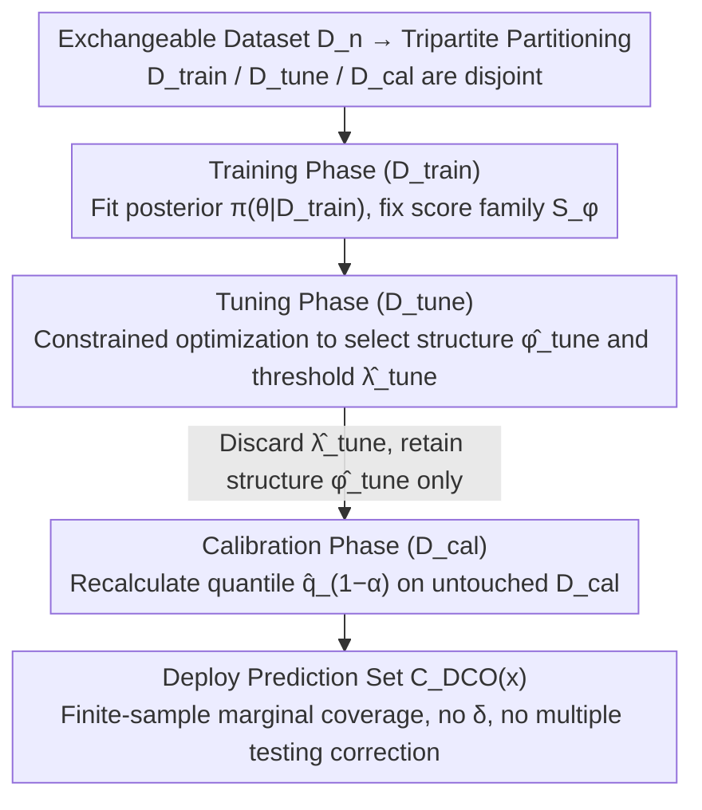

# Decoupled Conformal Optimisation: Efficient Prediction Sets via Independent Tuning and Calibration

**Conference**: ICML2026  
**arXiv**: [2605.18354](https://arxiv.org/abs/2605.18354)  
**Code**: No public link provided  
**Area**: Uncertainty Quantification / Conformal Prediction / Bayesian Optimization  
**Keywords**: Split Conformal Prediction, Bayesian Optimization, Marginal Coverage, Data Partitioning, Efficiency–Validity Decoupling

## TL;DR
This paper proposes DCO-Warmstart—a "train–tune–calibrate" tripartite Bayesian conformal optimization paradigm. By placing efficiency search on an independent tuning split and reserving the conformal quantile for an untouched calibration split, it achieves standard finite-sample marginal coverage guarantees on candidate structures of any size (even infinite) without requiring a confidence parameter $\delta$. Empirically, it typically produces smaller prediction sets than coupled calibration methods like CRC or BQ.

## Background & Motivation

**Background**: Conformal Prediction (CP) has become a mainstream uncertainty quantification paradigm due to its "distribution-free + finite-sample marginal coverage" properties. Split CP partitions data into $D_{\text{train}}$ and $D_{\text{cal}}$. After fixing a non-conformity score $S(x,y)$, the empirical $(1-\alpha)$ quantile $\hat q_{1-\alpha}$ is used to construct the prediction set $C(x)=\{y:S(x,y)\le \hat q_{1-\alpha}\}$. Recently, research has pivoted toward "smaller yet valid" prediction sets, leading to conformal optimization methods that search for optimal scores, priors, model architectures, or threshold rules to minimize set size.

**Limitations of Prior Work**: Representative methods such as BCP-CRC, Bayesian Quadrature calibration, and Learn-then-Test perform both "optimal threshold search" and "coverage certification" on the **same** hold-out dataset $D_{\text{cal}}$. Consequently, the quantile is no longer calculated on data independent of the search process, causing the exchangeability proof of standard Split CP to fail. These methods must settle for PAC-style "risk satisfied with probability $1-\delta$" guarantees and apply multiple testing corrections—which significantly inflate thresholds and prediction sets, especially when the candidate class is large.

**Key Challenge**: Optimization (efficiency) and calibration (validity) are statistically distinct tasks. The former requires repeated evaluation of candidate rules on data, while the latter requires data that has not been "polluted" by any prior search. Bundling them on a single $D_{\text{cal}}$ might seem data-efficient, but it replaces a strong, simple marginal coverage guarantee with a weaker, more complex guarantee requiring $\delta$.

**Goal**: In the context of Bayesian conformal optimization, this work aims to **restore** the finite-sample marginal coverage guarantee $\mathbb P\{Y_{m+1}\in C(X_{m+1})\}\ge 1-\alpha$ while maintaining the ability to explicitly optimize efficiency across structures (score types, prior hyperparameters, architectures, etc.) and eliminating the impact of candidate class size on the final threshold.

**Key Insight**: The authors observe that "using a validation set to select a model before performing Split CP" is already valid in naive CP—provided the choice does not depend on $D_{\text{cal}}$. The issue is that Bayesian conformal optimization blurs the boundary between search and calibration. By explicitly partitioning data into three sets and enforcing that the calibration split is used only once in the final step, the theory reverts to the classical framework.

**Core Idea**: Utilize an independent tuning split $D_{\text{tune}}$ to handle all efficiency-oriented structural selections, while the calibration split $D_{\text{cal}}$ is reserved solely for calculating the final conformal quantile. The threshold $\hat\lambda_{\text{tune}}$ obtained during the tuning phase serves only as a ranking tool and is **discarded during deployment**.

## Method

### Overall Architecture
Given an exchangeable dataset $D_n$, DCO-Warmstart partitions it into three disjoint subsets: $D_{\text{train}}\cup D_{\text{tune}}\cup D_{\text{cal}}$:

1. **Training Phase**: Fit the posterior $\pi(\theta\mid D_{\text{train}})$ on $D_{\text{train}}$ to fix a family of non-conformity scores $\{S_\phi(x,y)\}_{\phi\in\Phi}$. In the BCP setting, $S_\phi(x,y)=-\log p(y\mid x,D_{\text{train}})$ represents the negative log-posterior predictive density, where $\phi$ encodes structural choices like score types or prior hyperparameters.
2. **Tuning Phase**: Perform constrained optimization on $D_{\text{tune}}$ to find $(\hat\phi_{\text{tune}},\hat\lambda_{\text{tune}})=\arg\min_{(\phi,\lambda)\in\Phi\times\Lambda}\widehat{\mathcal S}_{\text{tune}}(\phi,\lambda)$ s.t. $\widehat R_{\text{tune}}(\phi,\lambda)\le\alpha$, where $\widehat{\mathcal S}_{\text{tune}}$ is the empirical average prediction set size and $\widehat R_{\text{tune}}$ is the empirical miscoverage rate. Leveraging the monotonicity of $\widehat R_{\text{tune}}(\phi,\cdot)$ with respect to $\lambda$, line search can be used for acceleration.
3. **Calibration Phase**: **Discard** $\hat\lambda_{\text{tune}}$ and recalculate the quantile on $D_{\text{cal}}$ as $\hat q_{1-\alpha}=S_{(k_\alpha)}$ where $k_\alpha=\lceil(m+1)(1-\alpha)\rceil$. The deployed prediction set is $C_{\text{DCO}}(x)=\{y:S_{\hat\phi_{\text{tune}}}(x,y)\le \hat q_{1-\alpha}\}$.

The critical statistical observation is that since $\hat\phi_{\text{tune}}$ depends only on $D_{\text{train}}\cup D_{\text{tune}}$, the scores on $D_{\text{cal}}$ remain exchangeable with the test point score given this fixed structure. Thus, the classical Split CP proof applies directly, yielding $\mathbb P\{Y_{m+1}\in C_{\hat\phi_{\text{tune}},\hat q_{1-\alpha}}(X_{m+1})\}\ge 1-\alpha$. This holds for **any candidate class** $\Phi$ (finite or infinite) without requiring $\delta$ or multiple testing corrections.

### Key Designs

**1. Tripartite Partitioning + "Discarding Tuning Threshold": Physical Isolation of Search and Certification**

The loss of guarantees in Bayesian conformal optimization stems from performing both threshold optimization and coverage certification on the same $D_{\text{cal}}$—once the quantile is calculated on data "contaminated" by search, exchangeability is broken, forcing a fallback to weak PAC guarantees with $\delta$ risk. This method decouples these tasks: $D_{\text{train}}$ fits the model, $D_{\text{tune}}$ selects the structure, and $D_{\text{cal}}$ determines the threshold. While the tuning phase outputs both a structure $\hat\phi_{\text{tune}}$ and a threshold $\hat\lambda_{\text{tune}}$, the **latter is only used for ranking candidates and is discarded before deployment**. The actual effective threshold is recalculated later on $D_{\text{cal}}$. This ensures $\hat\phi_{\text{tune}}$ is measurable with respect to $D_{\text{cal}}$, restoring the classical exchangeability argument and retrieving the standard marginal coverage guarantee $\mathbb P\{Y_{m+1}\in C(X_{m+1})\}\ge 1-\alpha$. Compared to BCP-CRC, DCO simply "adds one more split" to obtain a stronger and simpler guarantee.

**2. Decoupling Candidate Class Size from Final Threshold: Enabling Richer Search Spaces**

CRC/BQ-style methods must certify risks for multiple candidates on $D_{\text{cal}}$ simultaneously. Multiple testing corrections force a penalty that grows with the number of candidates $K=|\Phi|$, pushing thresholds higher and sets larger. DCO confines candidate selection entirely to $D_{\text{tune}}$. Calibration is performed only once for the fixed $\hat\phi_{\text{tune}}$, allowing Theorem 3.1 to state that coverage guarantees hold for "any finite or infinite $\Phi$." Neural architectures or continuous hyperparameters can be used as candidates without discretization or multiple testing costs. The cost of a large candidate space only affects the tuning sample complexity in Proposition 3.2: $m_{\text{tune}}\ge \max\{\log(4|\mathcal A|/\eta)/(2\varepsilon_R^2),\,B^2\log(4|\mathcal A|/\eta)/(2\varepsilon_S^2)\}$, meaning candidate size affects "tuning quality" rather than "validity."

**3. Asymptotic Equivalence to PAC Methods + DirectTune Diagnostics**

DCO is not intended to replace CRC/BQ, so the authors characterize their relationship: while guarantees differ in finite samples (marginal coverage vs. high-probability risk control), they converge to the same population threshold $\lambda^\star=\inf\{\lambda:R(\lambda)\le\alpha\}$ in the large-sample limit. Under conditions where $R(\lambda)$ is continuous and strictly monotonic near $\lambda^\star$, $\hat\lambda_{\text{DCO}}\xrightarrow{p}\lambda^\star$, and the CRC bias term $b_m(\lambda,\delta_m)$ vanishes, Proposition 3.3 proves $\hat\lambda_{\text{CRC}}-\hat\lambda_{\text{DCO}}\xrightarrow{p}0$. To visualize the "cost of skipping the calibration split," the authors introduce DirectTune as a negative control: it merges $D_{\text{cal}}$ into $D_{\text{tune}}$ and deploys $\hat\lambda_{\text{tune}}$ directly. This lacks exchangeability, and experiments show that while its prediction sets are smallest, it fails to meet coverage targets.

### Loss & Training
The objective in the tuning phase is given by Equation (9): $\min_{(\phi,\lambda)} \widehat{\mathcal S}_{\text{tune}}(\phi,\lambda)$ s.t. $\widehat R_{\text{tune}}(\phi,\lambda)\le\alpha$. In practice, this is solved via grid search over $\Phi\times\Lambda$ combined with monotonic line search. If no candidate satisfies the constraint, the one with the minimum empirical miscoverage is selected. Total computational complexity is $O(K|\Lambda|m_{\text{tune}})$ (tuning) + $O(m_{\text{cal}}\log m_{\text{cal}})$ (calibration sorting).

## Key Experimental Results

### Main Results
The authors compared DCO-Warmstart with CRC/BQ-style calibration on ImageNet-A (classification), CIFAR-100 (classification), and regression datasets (Diabetes, California Housing, Concrete). With a target coverage $1-\alpha=0.9$, DCO closely tracks the nominal level while providing tighter prediction sets:

| Dataset | Metric | CRC/BQ Style | DCO-Warmstart | Change |
|---------|--------|--------------|---------------|--------|
| ImageNet-A | Avg Set Size | 26.52 | 25.26 | ↓ 1.26 |
| ImageNet-A | 95th Pctl Size | 58.95 | 53.73 | ↓ 5.22 |
| Diabetes (Reg) | Avg Interval Width | 2.098 | 1.914 | ↓ 0.184 |

### Ablation Study
A systematic ablation of search range, split ratios, and target coverage was performed, using DirectTune as a "no-calibration" diagnostic baseline:

| Configuration | Coverage | Set Size | Description |
|---------------|----------|----------|-------------|
| DCO-Warmstart | Near $1-\alpha$ | Small | Full method, valid theoretically & empirically |
| CRC/BQ-style | $\ge 1-\alpha$ (Conservative) | Large | Multiple testing penalty inflates threshold |
| DirectTune | Usually < $1-\alpha$ | Smallest | Empirical threshold is too low; lacks exchangeability |

### Key Findings
- Calibration **cannot be omitted**: While DirectTune yields the tightest sets, its miscoverage exceeds the nominal level. This confirms that calculating the quantile on $D_{\text{cal}}$ (untouched by search) is necessary for $\ge 1-\alpha$ coverage.
- As the candidate class becomes richer, DCO's advantage over CRC/BQ grows, as the latter pays a heavier price for multiple testing corrections while the former is immune.
- In scenarios with extremely small samples where a $\delta$-risk certificate is mandatory, CRC/BQ-style methods remain appropriate. DCO's role is for settings where a tripartite split is feasible and the goal is classic marginal coverage.

## Highlights & Insights
- **Repositioning the problem rather than inventing an algorithm**: The method is essentially "split data three ways and perform Split CP rigorously," yet it is elevated to a "design principle for Bayesian conformal optimization." It clearly distinguishes between marginal coverage and high-probability risk control.
- **Unconditional coverage even with infinite candidates**: Theorem 3.1's support for infinite $\Phi$ is highly useful—neural architectures and continuous hyperparameters can be used as candidates without discretization or multiple testing costs, offering a direct trick for AutoML + UQ pipelines.
- **DirectTune as a counter-example** is more convincing than pure theory. Demonstrating that an "almost correct" method fails empirically effectively motivates practitioners to sacrifice 20–30% of their data for a proper calibration split.

## Limitations & Future Work
- Tripartite splitting fragments data. In small-sample regimes, both $D_{\text{tune}}$ and $D_{\text{cal}}$ may be insufficient, increasing variances of both the tuning selection and final quantile. While DKW inequalities are provided for calibration rates, there is no guidance on the optimal split ratio.
- The objective is marginal coverage only; it does not guarantee conditional coverage or specific risk control. For applications strictly requiring $\delta$-risk bounds, CRC/LTT remains necessary.
- Experiments focus on small-to-medium classification/regression tasks. Verification on high-dimensional tasks like LLM generation or structured output is needed.
- Constrained optimization in the tuning phase still relies on grid + line search. If the candidate class is extremely large, computational overhead might become a bottleneck.

## Related Work & Insights
- **vs BCP-CRC (Coupled Calibration)**: BCP-CRC performs threshold optimization and risk certification on the same $D_{\text{cal}}$, yielding PAC-style guarantees $\mathbb{P}(\mathbb{P}(Y\notin C(X;\lambda))\le\alpha)\ge 1-\delta$. DCO decouples these to gain simpler marginal coverage.
- **vs Learn-then-Test (LTT)**: LTT certifies candidates via hypothesis testing at the population risk level. Like CRC, it requires $\delta$ and multiple testing corrections. DCO avoids $\delta$ and remains indifferent to candidate class size.
- **vs ROCP (Risk-Optimal CP)**: ROCP also follows an "optimize then independently calibrate" route, but optimizes the entire prediction set construction and downstream decision. DCO refines this for Bayesian structures and threshold search rules.
- **vs Score-tuned CP (e.g., RAPS)**: These methods already "tune scores then perform Split CP." DCO generalizes this principle to entire Bayesian structures, including priors and architectures, formalizing it as a unified design principle.

## Rating
- Novelty: ⭐⭐⭐ Clear and practical, though essentially a systematization of "adding one more split" to Split CP.
- Experimental Thoroughness: ⭐⭐⭐⭐ Coverage of 5 benchmarks + 3 ablation dimensions + DirectTune comparison strongly supports the claims.
- Writing Quality: ⭐⭐⭐⭐ Table 1 clearly positions six classes of methods across four dimensions (optimisation/calibration/guarantee/confidence).
- Value: ⭐⭐⭐⭐ Provides a clear decision framework for when to use PAC vs marginal guarantees, easily reproducible in engineering.

<!-- RELATED:START -->

## Related Papers

- [\[ICLR 2026\] Ensemble Prediction of Task Affinity for Efficient Multi-Task Learning](../../ICLR2026/others/ensemble_prediction_of_task_affinity_for_efficient_multi-task_learning.md)
- [\[ICLR 2026\] Measuring Uncertainty Calibration](../../ICLR2026/others/measuring_uncertainty_calibration.md)
- [\[ICLR 2026\] Adaptive Conformal Guidance for Learning under Uncertainty](../../ICLR2026/others/adaptive_conformal_guidance_for_learning_under_uncertainty.md)
- [\[CVPR 2026\] Adaptive Data Augmentation with Multi-armed Bandit: Sample-Efficient Embedding Calibration for Implicit Pattern Recognition](../../CVPR2026/others/adaptive_data_augmentation_with_multi-armed_bandit_sample-efficient_embedding_ca.md)
- [\[ECCV 2024\] Dropout Mixture Low-Rank Adaptation for Visual Parameters-Efficient Fine-Tuning](../../ECCV2024/others/dropout_mixture_low-rank_adaptation_for_visual_parameters-efficient_fine-tuning.md)

<!-- RELATED:END -->
