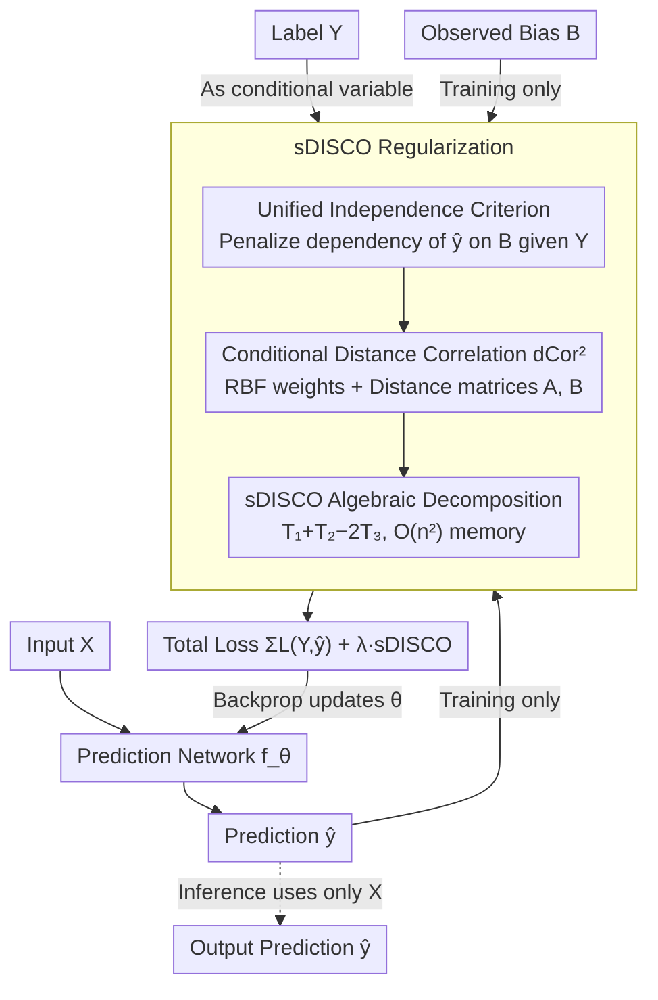

# DISCO: Mitigating Bias in Deep Learning with Conditional Distance Correlation

**Conference**: ICML2026 Oral  
**arXiv**: [2506.11653](https://arxiv.org/abs/2506.11653)  
**Code**: https://github.com/yakamoz5/DISCO  
**Area**: AI Safety / Fairness & Bias Mitigation / Causal Representation Learning  
**Keywords**: Anti-causal Model, Conditional Distance Correlation, Shortcut Learning, Causal Stability, Single-step Differentiable Estimation

## TL;DR
Using an anti-causal graph, the authors unify three types of biases—confounder, collider, and mediator—into a single conditional independence criterion $\hat{Y} \perp \mathbf{B} \mid Y$. They design sDISCO, a single-step differentiable estimator with $O(n^2)$ memory complexity, which serves as a regularization term to penalize conditional distance correlation in any gradient-trained network, thereby mitigating multiple biases and scaling to multi-bias scenarios.

## Background & Motivation
**Background**: Dataset biases lead deep models to learn task-irrelevant shortcuts rather than true signals. Typical cases include age becoming a common cause for Alzheimer's prediction in medical imaging, spurious correlations between backgrounds and waterbirds in CV, and pseudo-correlations between negation words and entailment labels in NLP. Existing mitigation methods generally fall into two categories: those targeting specific bias structures (e.g., confounder-only or collider-only) and those using empirical independence regularization (e.g., IRM, GDRO, Fishr, C-MMD), though the latter often lack a unified causal theoretical foundation.

**Limitations of Prior Work**: (1) Different bias types (confounder/collider/mediator) are usually handled separately with incompatible methods; (2) Methods using conditional independence as regularization, such as conditional MMD, lack full support for various combinations of bias and target types (binary/categorical/continuous); (3) Stronger non-linear independence criteria like conditional distance correlation (Wang et al. 2015) require $O(n^3)$ memory for V-statistic implementation, leading to OOM in deep learning batches and preventing use in backpropagation; (4) Most methods scale poorly to multi-bias scenarios.

**Key Challenge**: The "causal stability" of a model should be characterized by the observable conditional independence criterion $\hat{Y} \perp \mathbf{B} \mid Y$. However, all high-expressivity non-parametric conditional independence measures are too expensive; practitioners must either switch to weaker criteria (linear conditional covariance is unsuitable for highly non-linear NN representations) or use approximate estimators (trading off precision for scalability).

**Goal**: (i) Provide a unified causal explanation for why confounder, collider, and mediator biases can be addressed with the same conditional independence criterion; (ii) Develop a backprop-compatible conditional distance correlation estimator universal to any target-bias type combination; (iii) Compress the memory requirement from $O(n^3)$ to $O(n^2)$ while supporting exact global estimation.

**Key Insight**: The authors leverage the path-specific fairness analysis framework from Plecko & Bareinboim, abstracting the anti-causal prediction setting $Y \to X$ into a Standard Anti-Causal Model (SAM). Using counterfactual decomposition $TV = \text{ctf-stable} - \text{ctf-IE} - \text{ctf-SE}$, they prove that $\hat{Y} \perp \mathbf{B} \mid Y$ simultaneously nullifies ctf-IE and ctf-SE. Furthermore, they expand the V-statistic of Wang et al. (2015) into a batch-computable Hadamard form to avoid explicit construction of $n \times n \times n$ tensors.

**Core Idea**: The problem of "identifying the bias type" is converted into a single conditional independence constraint. A one-step matrix factorization is then used to reduce conditional distance correlation estimation to $O(n^2)$ memory, allowing it to be integrated as a regularization term into the loss of any deep model.

## Method

### Overall Architecture
The framework consists of three layers. The top layer is theoretical: establishing the SAM causal graph (target $Y \to$ input $X \to$ prediction $\hat{Y}$, with auxiliary variables $\mathbf{Z}$ and mediators $\mathbf{W}$ collectively termed bias $\mathbf{B}$) and proving that $\hat{Y} \perp \mathbf{B} \mid Y$ implies causal stability (zero counterfactual indirect and spurious effects). The middle layer is estimation: using conditional distance covariance $\mathrm{dCov}^2(X, Y \mid Z) = \mathbb{E}_Z[\mathrm{dCov}^2(X, Y \mid Z = z)]$, which equivalently characterizes conditional independence in strong negative type metric spaces, paired with RBF kernels for conditional density estimation weights. Two differentiable estimators are proposed: DISCO$_m$ (sampling $m$ reference points, memory-efficient but approximate) and sDISCO (algebraic decomposition, globally exact with $O(n^2)$ memory). The bottom layer is training: sDISCO is added as a regularizer to the ERM loss: $\min_\theta \sum L(Y, \hat{Y}) + \lambda \cdot \mathrm{sDISCO}(\hat{Y}, \mathbf{B} \mid Y)$. Forward passes and inference use only $X$, while bias $\mathbf{B}$ appears only during training for the regularization penalty.

The following diagram connects the three key designs via the training data flow: the "unified conditional independence criterion" from theory determines what to penalize, "conditional distance correlation" serves as the penalty metric, and the "sDISCO single-step algebraic decomposition" ensures efficient $O(n^2)$ memory computation. Bias $\mathbf{B}$ enters the regularizer only during backpropagation; inference depends only on input $X$.

### Key Designs

**1. SAM Anti-Causal Model + Unified Conditional Independence Criterion: Eliminating the "bias type" ambiguity**

Existing methods often design specific algorithms for different bias types (confounder/collider/mediator), which are often incompatible. The authors unify these using an anti-causal graph. In SAM, they define the counterfactual stable effect ctf-stable (the "healthy" path $Y \to X \to \hat{Y}$), the counterfactual indirect effect ctf-IE (the shortcut path $Y \to \mathbf{W} \to \hat{Y}$), and the counterfactual spurious effect ctf-SE (the non-directed path $Y$—$\mathbf{Z}$—$\hat{Y}$). Theorem 2.3 proves that if $\hat{Y} \perp \mathbf{W}, \mathbf{Z} \mid Y$, then both ctf-IE and ctf-SE are zero, ensuring causal stability. Corollary 2.5 merges $\mathbf{W}$ and $\mathbf{Z}$ into $\mathbf{B}$. Path-specific analysis reveals that the "type of bias" is irrelevant under this criterion; as long as a ctf-stable path exists and the bias is observed, a single independence constraint $\hat{Y} \perp \mathbf{B} \mid Y$ is sufficient.

**2. Conditional Distance Correlation as a Non-linear Independence Metric: Black-box friendly and type-agnostic**

NN representations are highly non-linear, making linear conditional covariance insufficient, while C-MMD lacks support for certain bias/target type combinations. The authors utilize conditional distance covariance $\mathrm{dCov}^2(X, Y \mid Z)$, which, in strong negative type metric spaces (including Euclidean space), is zero if and only if conditional independence holds. It captures arbitrary non-linear and high-dimensional dependencies. The normalized version $\mathrm{dCor}^2 = \mathrm{dCov}^2 / \sqrt{\mathrm{dVar}^2(X \mid Z) \mathrm{dVar}^2(Y \mid Z)} \in [0, 1]$ is preferred for optimization. Specifically, for samples $\{(X_i, Y_i, Z_i)\}$, weights $w_{ij}$ are calculated using an RBF kernel $K_h(Z_i, Z_j)$, followed by distance matrices $A$ and $B$. Distance centering is performed for each reference point $Z_i$ to obtain local matrices $A^{(i)}, B^{(i)}$, with the local V-statistic defined as $\mathcal{V}_{XY}^{(i)} = \sum_{k\ell} w_k^{(i)} w_\ell^{(i)} A_{k\ell}^{(i)} B_{k\ell}^{(i)}$. This approach is non-parametric and does not require explicit modeling of conditional distributions.

**3. sDISCO Single-step Algebraic Decomposition: $O(n^3) \to O(n^2)$ exact estimation for backpropagation**

Naive V-statistic implementations of distance correlation require $(n, n, n)$ tensors and $O(n^3)$ memory, which leads to OOM for standard DL batch sizes. The authors exploit the property that the weighted marginal sums of $A^{(i)}$ and $B^{(i)}$ are exactly zero. By expanding the inner product, cross-terms containing isolated marginal means vanish. Specifically, they compute local row means $M^X = WA, M^Y = WB$ and grid means $g^X = (W \circ M^X) \mathbf{1}, g^Y = (W \circ M^Y) \mathbf{1}$. Defining $T_1 = (W \circ (W(A \circ B))) \mathbf{1}$, $T_2 = g^X \circ g^Y$, and $T_3 = (W \circ M^X \circ M^Y) \mathbf{1}$, the exact local covariance for all $n$ reference points is $\mathcal{V}_{XY} = T_1 + T_2 - 2T_3$. Unlike DISCO$_m$, which requires sampling $m$ points and tuning $m$, sDISCO processes the entire batch with $O(n^2)$ memory without sacrificing precision, reducing hyperparameters to just the kernel bandwidth $\sigma_Y$ and regularization strength $\lambda$.

### Loss & Training
The objective is to minimize $\min_\theta \sum L(Y, \hat{Y}) + \lambda \cdot \mathrm{sDISCO}(\hat{Y}, \mathbf{B} \mid Y)$, where $L$ is the task-specific MLE loss (MSE for regression / CE for classification). DISCO$_m$ defaults to $m = 20\%$ of the batch size, while sDISCO uses the full batch. The forward pass depends only on $X$, and bias $\mathbf{B}$ is only required during training for the regularizer; thus, bias variables are not needed at inference time.

## Key Experimental Results

### Main Results
Six datasets were used, covering regression/classification, synthetic/real-world, and Vision/NLP domains. The protocol involves training on biased data, selecting models on an unbiased validation set, and reporting on an unbiased test set.

| Dataset | Task / Bias Type | Key Metric | DISCO$_m$ / sDISCO | SOTA Baseline |
| :--- | :--- | :--- | :--- | :--- |
| dSprites | y-pos regression, x-pos confounder | OOD MSE ↓ | **Lowest or tied lowest** | Comparable to IRM/Fishr |
| Blob (synthetic) | Causal intensity regression, mediator | OOD MSE ↓ | **Lowest** | C-MMD/GDRO were higher |
| YaleB | Head pose classification, light bias | OOD Acc ↑ | **Leading** | Adversarial baselines |
| FairFace | Gender classification, skin tone bias | Worst-group Acc ↑ | **Competitive/Leading** | GDRO is a strong baseline |
| Waterbirds | Bird classification, background bias | Worst-group Acc ↑ | **Competitive** | GDRO/JTT are strong |
| MNLI | Entailment classification, negation bias | Worst-group Acc ↑ | **Competitive/Leading** | GDRO is a strong baseline |

Compared to seven representative baselines across six datasets, the DISCO series achieves SOTA or comparable performance in most configurations. It only requires tuning two hyperparams ($\sigma_Y, \lambda$), significantly fewer than the complex combinations required by GDRO or IRM.

### Ablation Study

| Configuration | Key Property | Description |
| :--- | :--- | :--- |
| Full sDISCO | Exact + $O(n^2)$ | Seamlessly extends to multi-bias scenarios without extra cost. |
| DISCO$_m$ ($m = 0.2 n$) | Approx + Low Memory | Close to sDISCO at small batch sizes, but $m$ must be tuned. |
| Linear Cond. Cov. | Fails non-linearity | Significant drops in performance on dSprites/Blob. |
| C-MMD | Type-restricted | Performance degrades with multiple biases or mixed types. |
| No DISCO (ERM) | Shortcut learning | Significant OOD degradation; serves as a control group. |

### Key Findings
- DISCO consistently matches or outperforms the strongest baselines across all datasets while requiring significantly less hyperparameter searching than GDRO/IRM.
- sDISCO extends seamlessly to multi-bias scenarios (e.g., controlling skin tone + age in FairFace) because it simply treats multi-dimensional $\mathbf{B}$ as input for a single distance matrix.
- Counterfactual path analysis on synthetic data confirms that models trained with DISCO rely almost exclusively on the ctf-stable path (ctf-IE and ctf-SE are near zero).
- Computational overhead: sDISCO uses matrix multiplications and Hadamard products instead of triple loops, increasing wall-time by ~1.5–2× per batch, but memory remains strictly $O(n^2)$, making it feasible for standard batches (128–512).

## Highlights & Insights
- Normalizing the "bias type" problem into a unified conditional independence criterion, using the existence of a ctf-stable path as a boundary for method applicability, is a much cleaner abstraction than enumerating specific algorithms.
- The algebraic decomposition of the V-statistic from $O(n^3)$ to $O(n^2)$ is a standalone "algorithm engineering" contribution that could benefit any non-parametric method using third-order distance statistics.
- Counterfactual decomposition (ctf-stable / ctf-IE / ctf-SE) is used as an analytical tool rather than just motivation—quantifying the contribution of each path on simulated datasets makes the explanation of "why DISCO works" falsifiable and verifiable.

## Limitations & Future Work
- The criterion $\hat{Y} \perp \mathbf{B} \mid Y$ depends on the "positivity" assumption ($P(\mathbf{B} = b \mid Y = y) > 0$); if $\mathbf{B}$ is a deterministic function of $Y$, observational debiasing fails.
- In the presence of unobserved confounders $\mathbf{Z}'$, the constraint can only block paths through observed $\mathbf{B}$. Handling $\mathbf{Z}'$ requires stronger assumptions about the input $X$ not containing effective proxies for $\mathbf{Z}'$.
- Mediators are treated as shortcuts by default, but some mediators (e.g., disease severity → biomarker) carry legitimate task information. Selecting a stable subset $\mathbf{W}_{stable}$ remains a subjective modeling choice.
- The RBF bandwidth $\sigma_Y$ for sDISCO is sensitive; while the paper uses heuristics like the median heuristic, automatic bandwidth selection for an end-to-end pipeline remains an engineering challenge.

## Related Work & Insights
- **vs Veitch et al. 2021 (counterfactual invariance)**: Veitch proves counterfactual invariance under stricter conditions; this work generalizes the conclusion to the SAM setting, covering three structures.
- **vs Makar & D'Amour 2023 / Puli et al. 2021**: These works used similar criteria empirically; this paper provides the path-specific causal theoretical foundation for their effectiveness.
- **vs IRM / GDRO / Fishr**: These rely on environment/group partitioning and multi-hyperparameter heuristics. DISCO only requires observed bias $\mathbf{B}$ and target $Y$, with fewer hyperparameters and support for continuous biases.
- **vs C-MMD**: C-MMD does not support all type combinations and lacks a single-step exact implementation; sDISCO is superior in both generality and precision.

## Rating
- Novelty: ⭐⭐⭐⭐ SAM anti-causal framework + sDISCO algebraic decomposition are significant contributions that unify fragmented algorithms.
- Experimental Thoroughness: ⭐⭐⭐⭐⭐ Six datasets across vision/NLP with extensive baseline comparisons and counterfactual path analysis.
- Writing Quality: ⭐⭐⭐⭐ Rigorous causal notation and clear sDISCO derivation; introduction to SAM might be dense for readers without a causal background.
- Value: ⭐⭐⭐⭐⭐ Provides both a theoretical "why" for independence regularization and a practical, memory-efficient, multi-bias-ready estimator for deep learning pipelines.

<!-- RELATED:START -->

## Related Papers

- [\[ICLR 2026\] Mitigating Spurious Correlation via Distributionally Robust Learning with Hierarchical Ambiguity Sets](../../ICLR2026/others/mitigating_spurious_correlation_via_distributionally_robust_learning_with_hierar.md)
- [\[ICML 2026\] Possibilistic Predictive Uncertainty for Deep Learning](possibilistic_predictive_uncertainty_for_deep_learning.md)
- [\[ICML 2026\] Sequential Group Composition: A Window into the Mechanics of Deep Learning](sequential_group_composition_a_window_into_the_mechanics_of_deep_learning.md)
- [\[ACL 2025\] Mitigating Shortcut Learning with InterpoLated Learning](../../ACL2025/others/mitigating_shortcut_learning_with_interpolated_learning.md)
- [\[AAAI 2026\] How Wide and How Deep? Mitigating Over-Squashing of GNNs via Channel Capacity Constrained Estimation](../../AAAI2026/others/how_wide_and_how_deep_mitigating_over-squashing_of_gnns_via_channel_capacity_con.md)

<!-- RELATED:END -->
