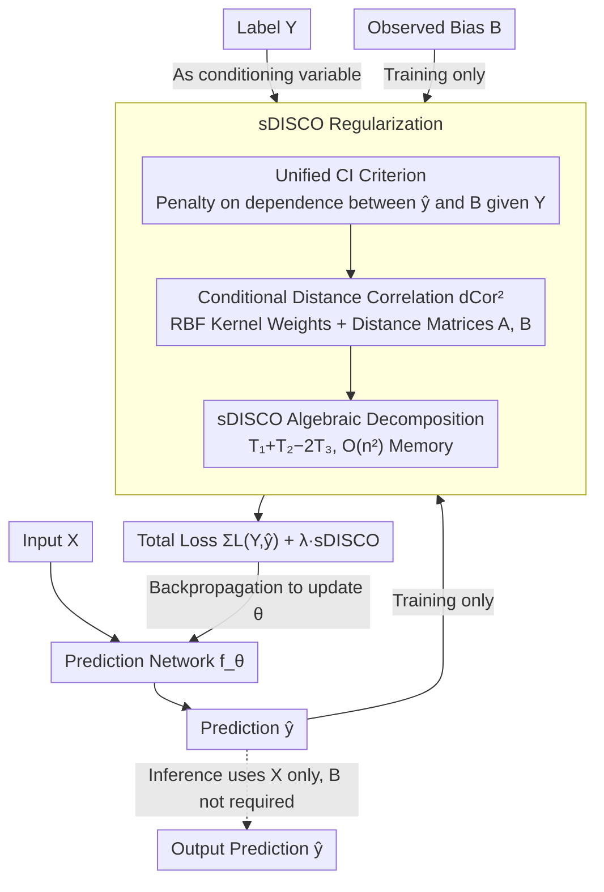

# DISCO: Mitigating Bias in Deep Learning with Conditional Distance Correlation

**Conference**: ICML2026 Oral  
**arXiv**: [2506.11653](https://arxiv.org/abs/2506.11653)  
**Code**: https://github.com/yakamoz5/DISCO  
**Area**: AI Safety / Fairness and Bias Mitigation / Causal Representation Learning  
**Keywords**: Anti-causal Models, Conditional Distance Correlation, Shortcut Learning, Causal Stability, Single-step Differentiable Estimation

## TL;DR
Using an anti-causal graph, the authors unify three types of bias (confounders, colliders, and mediators) into a single conditional independence (CI) criterion $\hat{Y} \perp \mathbf{B} \mid Y$. They then design sDISCO, a single-step differentiable estimator with $O(n^2)$ memory complexity, which serves as a regularization term using conditional distance correlation to mitigate various biases across any gradient-trained network and scalable to multi-bias scenarios.

## Background & Motivation
**Background**: Dataset bias leads deep models to learn task-irrelevant shortcuts rather than true signals—typical cases include age becoming a common cause for Alzheimer's prediction in medical imaging, spurious correlations between backgrounds and waterbirds in CV, and pseudo-correlations between negation words and entailment labels in NLP. Current mitigation methods are generally categorized into those targeting specific bias structures (e.g., confounder-only or collider-only) and those using empirical independence regularization (IRM, GDRO, Fishr, C-MMD, etc.), but they lack a unified causal theoretical foundation.

**Limitations of Prior Work**: (1) Different bias types (confounder/collider/mediator) are usually handled separately, making methods incompatible; (2) methods using CI as regularization, such as conditional MMD, lack full support for various combinations of bias and target types (binary/categorical/continuous); (3) stronger non-linear independence criteria like conditional distance correlation (Wang et al. 2015) require $O(n^3)$ memory in their V-statistic implementation, causing OOM in deep learning batches and making them unusable in backpropagation; (4) most methods have poor scalability in multi-bias scenarios.

**Key Challenge**: The "causal stability" of a model should be characterized by an observable CI criterion $\hat{Y} \perp \mathbf{B} \mid Y$, yet all expressively strong non-parametric CI measures are too expensive. Researchers must either settle for weaker criteria (linear conditional covariance is unsuitable for highly non-linear NN representations) or use approximate estimators (trading off accuracy for scalability).

**Goal**: (i) Use causal diagrams to demonstrate why confounders, colliders, and mediators can all be handled with the same CI criterion; (ii) provide a conditional distance correlation estimator that is usable in backpropagation and universal for any combination of target-bias types; (iii) reduce memory complexity from $O(n^3)$ to $O(n^2)$ while supporting exact global estimation.

**Key Insight**: Borrowing from the path-specific fairness analysis framework by Plecko & Bareinboim, the authors abstract the anti-causal prediction setting $Y \to X$ into a Standard Anti-Causal Model (SAM). Using counterfactual decomposition $TV = ctf-stable - ctf-IE - ctf-SE$, they prove that $\hat{Y} \perp \mathbf{B} \mid Y$ simultaneously zeros out ctf-IE and ctf-SE. They further expand the V-statistic of Wang et al. (2015) into a batch-computable Hadamard form, avoiding the explicit construction of $n \times n \times n$ tensors.

**Core Idea**: Transform the "which type of bias" problem into a single CI constraint and use a one-time matrix decomposition to reduce conditional distance correlation estimation to $O(n^2)$ memory, allowing it to function as a regularization term in any deep model loss.

## Method

### Overall Architecture
Divided into three layers. The top layer is theory: establishing the SAM causal graph (target $Y$ → input $X$ → prediction $\hat{Y}$, with bypass variables $\mathbf{Z}$ and mediators $\mathbf{W}$ collectively termed bias $\mathbf{B}$), proving that $\hat{Y} \perp \mathbf{B} \mid Y$ implies causal stability (zero counterfactual indirect and spurious effects). The middle layer is estimation: using conditional distance covariance $\mathrm{dCov}^2(X, Y \mid Z) = \mathbb{E}_Z[\mathrm{dCov}^2(X, Y \mid Z = z)]$, which equivalently characterizes conditional independence in strong negative-type metric spaces, paired with RBF kernels as conditional density estimation weights. Two differentiable estimators are proposed: DISCO$_m$ (sampling $m$ reference points for memory efficiency but with approximation) and sDISCO (algebraic decomposition for global exactness + $O(n^2)$ memory). The bottom layer is training: adding sDISCO as regularization to the ERM loss $\min_\theta \sum L(Y, \hat{Y}) + \lambda \cdot \mathrm{sDISCO}(\hat{Y}, \mathbf{B} \mid Y)$, where $X$ is used for forward and inference, and $\mathbf{B}$ only appears during training to calculate the regularization term.

The following flowchart links the three key designs:

### Key Designs

**1. SAM Anti-Causal Model + Unified CI Criterion: Dissolving the "bias type" specific algorithms**

Existing methods often design specific algorithms for different bias types (confounder/collider/mediator), making them incompatible. The authors unify them using an anti-causal graph: defining ctf-stable (the "healthy" path $Y \to X \to \hat{Y}$), ctf-IE (the shortcut path via $Y \to \mathbf{W} \to \hat{Y}$), and ctf-SE (undirected paths via $Y$—$\mathbf{Z}$—$\hat{Y}$). Theorem 2.3 proves that if $\hat{Y} \perp \mathbf{W}, \mathbf{Z} \mid Y$, then both ctf-IE and ctf-SE are zero, ensuring causal stability; Corollary 2.5 merges $\mathbf{W}$ and $\mathbf{Z}$ into $\mathbf{B}$. Path-specific analysis suggests that the specific type of bias is irrelevant under this criterion—as long as a ctf-stable path exists and the bias is observed, a single CI constraint $\hat{Y} \perp \mathbf{B} \mid Y$ suffices.

**2. Conditional Distance Correlation as Non-linear CI Measure: Black-box friendly and type-agnostic**

NN representations are highly non-linear, making linear conditional covariance insufficient, while C-MMD has limited support for bias/target type combinations. The authors use conditional distance covariance $\mathrm{dCov}^2(X, Y \mid Z)$, where "zeroing implies conditional independence" in strong negative-type metric spaces (including Euclidean space). This captures dependencies of arbitrary non-linearity and dimensionality. The normalized version $\mathrm{dCor}^2 = \mathrm{dCov}^2 / \sqrt{\mathrm{dVar}^2(X \mid Z) \mathrm{dVar}^2(Y \mid Z)} \in [0, 1]$ is optimized for training. For samples $\{(X_i, Y_i, Z_i)\}$, weights $w_{ij}$ are calculated via RBF kernel $K_h(Z_i, Z_j) / \sum_k K_h(Z_i, Z_k)$, followed by pairwise distance matrices $A, B$. Local centered matrices $A^{(i)}, B^{(i)}$ are derived for each reference point $Z_i$, with the local V-statistic being $\mathcal{V}_{XY}^{(i)} = \sum_{k\ell} w_k^{(i)} w_\ell^{(i)} A_{k\ell}^{(i)} B_{k\ell}^{(i)}$. It is a black-box non-parametric choice that does not require explicit conditional distribution modeling.

**3. sDISCO Algebraic Decomposition: $O(n^3) \to O(n^2)$ Exact Estimation for Backpropagation**

A naive V-statistic implementation for distance correlation requires $(n, n, n)$ tensors and $O(n^3)$ memory, which leads to OOM for standard deep learning batches. The authors exploit the property that the weighted marginal sums of $A^{(i)}, B^{(i)}$ are zero: cross-terms with isolated marginal means automatically vanish when expanding the inner product. By calculating local row means $M^X = WA, M^Y = WB$ and local grid means $g^X = (W \circ M^X) \mathbf{1}, g^Y = (W \circ M^Y) \mathbf{1}$, they define $T_1 = (W \circ (W(A \circ B))) \mathbf{1}, T_2 = g^X \circ g^Y, T_3 = (W \circ M^X \circ M^Y) \mathbf{1}$. The exact local covariance for all $n$ reference points is $\mathcal{V}_{XY} = T_1 + T_2 - 2T_3$. Unlike DISCO$_m$ which requires sampling $m$ points and tuning $m$, sDISCO processes the direct batch precisely with $O(n^2)$ memory, leaving only "kernel bandwidth $\sigma_Y$ + regularization strength $\lambda$" as hyperparameters.

### Loss & Training
Jointly minimize $\min_\theta \sum L(Y, \hat{Y}) + \lambda \cdot \mathrm{sDISCO}(\hat{Y}, \mathbf{B} \mid Y)$, where $L$ is the task-specific MLE loss (MSE for regression / CE for classification). DISCO$_m$ defaults to $m = 20\%$ of batch size; sDISCO uses the full batch. Forward passes depend only on $X$; bias $\mathbf{B}$ enters only via the regularization term during backpropagation, so bias variables are not required at inference time.

## Key Experimental Results

### Main Results
Six datasets covering regression/classification, synthetic/real, and vision/NLP; the protocol involves training on biased data, selecting models on an unbiased validation set, and reporting on an unbiased test set.

| Dataset | Task/Bias Type | Key Metric | DISCO$_m$ / sDISCO | SOTA baseline |
| :--- | :--- | :--- | :--- | :--- |
| dSprites | y-position regression, X-pos confounder | OOD MSE ↓ | **Lowest or tied** | Comparable to/better than IRM / Fishr |
| Blob (synthetic) | causal intensity regression, bias intensity mediator | OOD MSE ↓ | **Lowest** | C-MMD / GDRO significantly higher |
| YaleB | Head pose classification, light azimuth/elevation bias | OOD acc ↑ | **Leading** | Adversarial baselines |
| FairFace | Gender classification, skin tone selection bias | worst-group acc ↑ | **Competitive/Leading** | GDRO strong baseline |
| Waterbirds | Bird classification, background spurious correlation | worst-group acc ↑ | **Competitive** | GDRO/JTT strong baseline |
| MNLI | Entailment classification, negation keyword bias | worst-group acc ↑ | **Competitive/Leading** | GDRO strong baseline |

Across six datasets compared against seven representative baselines, DISCO variants achieve SOTA or comparable performance in most configurations. They only require tuning two hyperparameters ($\sigma_Y, \lambda$), significantly fewer than the complex combinations required by GDRO/IRM.

### Ablation Study

| Configuration | Key Property | Description |
| :--- | :--- | :--- |
| Full sDISCO | Global exactness + $O(n^2)$ | Seamless extension to multi-bias scenarios without extra overhead. |
| DISCO$_m$ ($m = 0.2 n$) | Approx + Lighter memory | Close to sDISCO in small batches but $m$ requires tuning. |
| Linear cond. covariance | Cannot capture non-linearity | Significant drops on dSprites/Blob non-linear biases. |
| C-MMD | Restricted type combinations | Degrades in multi-bias or mixed continuous/categorical settings. |
| No DISCO (ERM) | Shortcut learning | Significant OOD degradation; serves as control group. |

### Key Findings
- DISCO series are at least equal to and often outperform the strongest baselines, without requiring the extensive hyperparameter search needed by GDRO/IRM.
- sDISCO extends seamlessly to multi-bias scenarios (e.g., controlling both skin tone and age in FairFace) since multi-dimensional $\mathbf{B}$ can be used as a single input for distance matrices, whereas methods like C-MMD require pairwise handling or fail.
- Path-specific counterfactual analysis on controlled simulations confirms that DISCO-trained models make decisions almost entirely via the ctf-stable path (ctf-IE and ctf-SE are near zero).
- Computational overhead: sDISCO uses matrix multiplications and Hadamard products instead of triple loops. Experimental results show ~1.5–2× wall-time increase per batch, but $O(n^2)$ memory makes it fully trainable on standard batches (128–512).

## Highlights & Insights
- Normalizing the "which bias" problem into a single CI criterion and using the existence of a "ctf-stable path" as the method's boundary is much cleaner than exhausting algorithms for each bias type.
- The algebraic decomposition of the V-statistic from $O(n^3)$ to $O(n^2)$ is a reusable "algorithmic engineering" contribution—any non-parametric method using third-order distance statistics can benefit.
- Using counterfactual decomposition (ctf-stable / ctf-IE / ctf-SE) as an analysis tool rather than just motivation allows for quantifiable, falsifiable verification of why DISCO works on simulated datasets.

## Limitations & Future Work
- The $\hat{Y} \perp \mathbf{B} \mid Y$ criterion relies on the "positivity" assumption ($P(\mathbf{B} = b \mid Y = y) > 0$); if $\mathbf{B}$ is a deterministic function of $Y$, all observational debiasing and thus DISCO will fail.
- In the presence of unobserved confounders $\mathbf{Z}'$, the constraint only masks paths involving observed $\mathbf{B}$ and cannot address bias leaked through $\mathbf{Z}'$.
- Mediators are treated as shortcuts by default, but some (e.g., disease severity → biomarker) carry true task information. While authors use a $\mathbf{W}_{stable}$ subset fix, determining which mediator is "stable" remains a subjective modeling choice.
- The RBF bandwidth $\sigma_Y$ in sDISCO is sensitive; although the paper uses the median heuristic, automatic bandwidth selection remains an engineering burden for end-to-end pipelines.

## Related Work & Insights
- **vs Veitch et al. 2021**: While Veitch proves counterfactual invariance under stricter CI assumptions, this paper generalizes those conclusions to the SAM setting, covering confounder/collider/mediator structures.
- **vs Makar & D'Amour 2023 / Puli et al. 2021**: While they empirically use similar CI criteria for fairness/shortcut mitigation, this paper provides a rigorous theoretical foundation via path-specific causal analysis.
- **vs IRM / GDRO / Fishr**: These methods rely on environment/group partitions and heuristics like worst-group optimization; DISCO requires only bias variables $\mathbf{B}$ and target $Y$, has fewer hyperparameters, and supports continuous biases.
- **vs C-MMD**: C-MMD lacks full support for mixed types (e.g., continuous bias + categorical target) and has no single-step exact implementation; sDISCO is superior in type-support and accuracy.

## Rating
- Novelty: ⭐⭐⭐⭐ The SAM anti-causal framework and sDISCO algebraic decomposition are novel, unifying the fragmented "bias-type-specific" algorithms into a single criterion.
- Experimental Thoroughness: ⭐⭐⭐⭐⭐ Six datasets across domains/tasks and extensive baseline comparisons, supplemented by path-specific counterfactual analysis.
- Writing Quality: ⭐⭐⭐⭐ Clear causal notation and theorem layout; sDISCO derivation is straightforward. The density of information may be high for readers without a causal background.
- Value: ⭐⭐⭐⭐⭐ Provides a rigorous causal foundation for CI regularization while offering a memory-efficient, low-hyperparameter estimator that can be directly integrated into existing training pipelines.

<!-- RELATED:START -->

## Related Papers

- [\[ICLR 2026\] Mitigating Spurious Correlation via Distributionally Robust Learning with Hierarchical Ambiguity Sets](../../ICLR2026/others/mitigating_spurious_correlation_via_distributionally_robust_learning_with_hierar.md)
- [\[ICML 2026\] Possibilistic Predictive Uncertainty for Deep Learning](possibilistic_predictive_uncertainty_for_deep_learning.md)
- [\[ACL 2025\] Mitigating Shortcut Learning with InterpoLated Learning](../../ACL2025/others/mitigating_shortcut_learning_with_interpolated_learning.md)
- [\[ICML 2026\] Sequential Group Composition: A Window into the Mechanics of Deep Learning](sequential_group_composition_a_window_into_the_mechanics_of_deep_learning.md)
- [\[AAAI 2026\] How Wide and How Deep? Mitigating Over-Squashing of GNNs via Channel Capacity Constrained Estimation](../../AAAI2026/others/how_wide_and_how_deep_mitigating_over-squashing_of_gnns_via_channel_capacity_con.md)

<!-- RELATED:END -->
