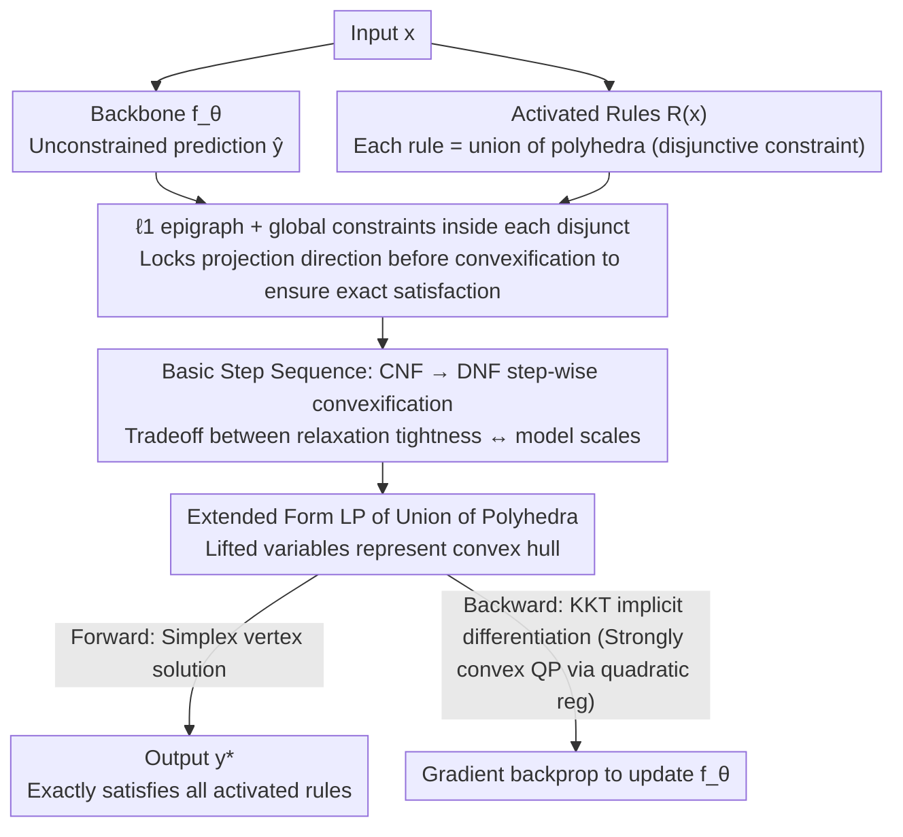

# DisjunctiveNet: Neural Symbolic Learning via Differentiable Convexified Optimization Layers

**Conference**: ICML2026  
**arXiv**: [2605.30456](https://arxiv.org/abs/2605.30456)  
**Code**: https://github.com/li-group/DisjunctiveNet.jl  
**Area**: Neuro-symbolic Learning / Differentiable Optimization Layers  
**Keywords**: Disjunctive Constraints, Convex Hull Relaxation, Differentiable LP Layers, Hard Constraint Satisfaction, Input-dependent Rules

## TL;DR
The authors formulate "input-dependent if-then logical rules" as disjunctive constraints representing the union of polyhedra. By utilizing a sequence of basic steps to convexify Conjunctive Normal Form (CNF) into the convex hull of Disjunctive Normal Form (DNF), they derive a differentiable LP projection layer. Neural network outputs passing through this layer precisely satisfy the original MILP-level constraints during both training and inference.

## Background & Motivation
**Background**: Scientific and engineering problems often exhibit two characteristics: extreme data sparsity but rich domain knowledge (physical laws, safety constraints, expert heuristics). This knowledge is typically expressed in the form of propositional logic combined with linear inequalities, such as "if $x$ is in a certain state, then output $y$ must satisfy a specific linear inequality." The mainstream approach to integrating such knowledge into neural networks is neuro-symbolic learning.

**Limitations of Prior Work**: Existing methods generally fall into three categories, each with significant drawbacks: soft penalty methods (adding rule violation costs to the loss) do not guarantee feasibility and have hard-to-tune penalty coefficients; specialized architectures (e.g., MultiplexNet) can only encode global rules independent of the input; and post-processing methods require non-differentiable ILP decoding during inference. Although differentiable optimization layers (e.g., OptNet by Amos & Kolter, CVXPYlayer) achieve end-to-end hard constraints for continuous convex sets, they fail when encountering logical operators (e.g., $\lor$, $\Rightarrow$) due to non-convex, disconnected feasible regions.

**Key Challenge**: While MILP is highly expressive, its optimal solutions are non-differentiable with respect to parameters. Conversely, continuous convex relaxations are differentiable but typically heuristic, providing no guarantee of precisely satisfying the original constraints. The fundamental difficulty lies in constructing a layer that is both differentiable and capable of precisely satisfying constraints while retaining MILP/QF-LRA level expressiveness.

**Goal**: (i) Propose a unified constraint format capable of expressing "input-dependent logic + linear inequalities"; (ii) Construct a corresponding differentiable projection layer where LP vertex solutions precisely satisfy the original non-convex constraints; (iii) Provide an adjustable complexity-tightness tradeoff between CNF and DNF.

**Key Insight**: The authors borrow from Disjunctive Programming theory (Balas, 2018), expressing rules as a union (disjunction) of polyhedra. They then use "basic steps" to step-wise convexify CNF into DNF. The convex hull of the DNF in an elevated variable space can be exactly represented by an extended formulation LP.

**Core Idea**: By using DNF expansion and the extended formulation (lifted variables), the "intersection of non-convex unions of polyhedra" is rewritten as a convex LP. An $\ell_1$ epigraph projection is then employed to ensure that vertex solutions satisfy the original constraints, achieving both differentiability and precision.

## Method

### Overall Architecture
The input $x \in \mathcal{X}$ is fed into a backbone network $f_\theta$ to obtain an unconstrained prediction $\hat{y} = f_\theta(x)$. Subsequently, an $\ell_1$ projection $y^\star(x) \in \arg\min_{y \in \mathcal{F}(x)} \|y - \hat{y}\|_1$ is performed on $\hat{y}$ to pull it back into the feasible set $\mathcal{F}(x) = \bigcap_{r \in \mathcal{R}(x)} \mathcal{C}_r(x)$ defined by all activated rules. Each rule $r$ takes the form $\mathbb{I}[x \in \mathcal{A}_r] \Rightarrow \mathbb{I}[y \in \mathcal{C}_r(x)]$, where $\mathcal{C}_r(x) = \bigcup_{j=1}^{m_r} \{y: A_{rj}(x) y \le b_{rj}(x)\}$ is the union of $m_r$ (potentially input-dependent) polyhedra. The paper proves that this constraint class is as expressive as MILP and QF-LRA, thus covering most practical scenarios. The projection is solved via an extended formulation LP, with gradients backpropagated using KKT conditions and implicit differentiation (CVXPYlayer / DiffOpt.jl). During training, quadratic regularization is added to the LP to ensure strong convexity, mitigating solution discontinuities caused by parameters appearing in constraint RHS.

### Key Designs

**1. $\ell_1$ epigraph + Global constraints inside each disjunct: Locking the projection direction within each polyhedral facet before convexification to preserve "exact satisfaction"**

A core conflict in differentiable optimization layers is that convexification may allow LP vertex solutions to drift toward "spurious points" between disjuncts, failing to exactly satisfy original logical rules. The proposed strategy integrates the projection objective $\|y - \hat{y}\|_1$ and the global feasible set $\mathcal{G}(x)$ into each polyhedral facet $\mathcal{S}_{rj}$, resulting in an extended set $\widehat{\mathcal{S}}_{rj}(x; \hat{y}) = \{(y, \eta): A_{rj}(x) y \le b_{rj}(x), -\eta \le y - \hat{y} \le \eta, y \in \mathcal{G}(x)\}$. The $\ell_1$ norm is chosen over $\ell_2$ because $\|y-\hat{y}\|_1$ has a standard epigraph form $\min \mathbf{1}^\top \eta$ s.t. $-\eta \le y-\hat{y} \le \eta$, allowing for purely linear expression and maintaining the LP structure. This is a prerequisite for the precision theorem stating that the "DNF convex hull is exactly equal to the original constraint convex hull." If convexification were performed before adding the epigraph, the projection direction would be defined in the convexified $y$-space, and the LP vertex might not fall back into an original disjunct, losing the exact satisfaction guarantee.

**2. Basic Step Sequence: Step-by-step convexification from CNF to DNF, allowing users to trade off between "relaxation tightness" and "model scale"**

Once constraints are written as a union of polyhedra, two convex relaxations exist: the CNF relaxation $\widetilde{\mathcal{F}}_{\mathrm{CNF}} = \bigcap_r \mathrm{conv}(\widehat{\mathcal{C}}_r)$ (taking the convex hull of each rule independently before intersecting) and the DNF relaxation $\widetilde{\mathcal{F}}_{\mathrm{DNF}} = \mathrm{conv}(\bigcup_{k \in \Pi(x)} \bigcap_r \widehat{\mathcal{S}}_{r,k_r})$ (intersecting all combinations of disjuncts before taking the convex hull). Theorem 3.6 proves that the DNF relaxation is exactly equal to the convex hull of the original non-convex set $\widehat{\mathcal{F}}$, and its LP vertex solutions necessarily correspond to an original disjunct combination, thereby precisely satisfying all rules. The CNF relaxation is typically strictly larger, and its vertex solutions may be infeasible. While CNF scales linearly with the number of rules, DNF's combination count $\prod_r m_r$ explodes exponentially. This paper connects these two extremes via "basic steps"—each step moves one rule from CNF to DNF: $\widetilde{\mathcal{F}}_{\mathrm{pDNF}}(\mathcal{R}_C, \mathcal{R}_D) \to \widetilde{\mathcal{F}}_{\mathrm{pDNF}}(\mathcal{R}_C \setminus \{r'\}, \mathcal{R}_D \cup \{r'\})$, yielding $\widetilde{\mathcal{F}}_{\mathrm{DNF}} \subseteq \widetilde{\mathcal{F}}_{\mathrm{pDNF}} \subseteq \widetilde{\mathcal{F}}_{\mathrm{CNF}}$. In practice, performing DNF expansion on only a few strongly interacting rules achieves near-DNF accuracy without scale explosion.

**3. Extended Formulation LP of Union of Polyhedra + Implicit Differentiation: Representing the "non-convex union" as a differentiable LP via lifted variables and KKT-based gradients**

To integrate the union of polyhedra into an end-to-end differentiable pipeline, Proposition 3.3 utilizes the lifted variable method: introducing variable copies $w_j$ and convex combination weights $\lambda_j$ for each disjunct. The constraints $A_j w_j \le \lambda_j b_j$, $w = \sum_j w_j$, $\sum_j \lambda_j = 1$, and $\lambda_j \ge 0$ provide an exact representation of $\mathrm{conv}(\bigcup_j \mathcal{S}_j)$. Combined with epigraph constraints $\eta_k \ge y_k - \lambda_k \hat{y}$ and $\eta_k \ge \lambda_k \hat{y} - y_k$, the prediction $\hat{y}$ appears only on the RHS of the LP. The forward pass invokes an LP solver (where the simplex method naturally returns vertex solutions), while the backward pass uses KKT conditions with implicit differentiation to obtain $\partial y^\star / \partial \hat{y}$. Compared to big-M MILP encoding, the extended formulation avoids binary variables and remains an LP, ensuring differentiability. The property of simplex vertex solutions aligns with Theorem 3.6, enabling both "differentiability" and "exact satisfaction." To handle solution jumps caused by parameters on the LHS/RHS, a small quadratic regularization $\mu\|y\|^2$ is added during the backward pass to convert the LP into a strongly convex QP for differentiation.

### Loss & Training
Base task loss (MSE for synthetic tasks, cross-entropy for scRNA) + end-to-end backpropagation through the projection layer. All projection models are initialized from a pre-trained base NN and then fine-tuned with the projection layer, encouraging the model to focus on "incorporating rules into predictions" rather than "re-learning the prediction task." All methods use fixed hyperparameters without per-method tuning, averaged over 3 random seeds.

## Key Experimental Results

### Main Results
Two tasks: (i) Synthetic cooling control (continuous control actions subject to global constraints + multiple simultaneously activated safety/operational disjunctive rules; oracle is QP); (ii) Single-cell RNA sequencing (scRNA-seq) classification (marker-gene rules encoding "if a gene is highly expressed, it belongs to a certain cell type"). Metrics: MSE / macro-F1 + CSAT (Constraint Satisfaction Rate, with the denominator counting only samples with non-contradictory activated rules).

| Task | Setting | Metric | Base NN | Penalty (soft) | Fine-Pen | CNF | DNF |
|--------|------|------|---------|----------------|----------|-----|-----|
| Synthetic Cooling (n=500) | OOD MSE | ↓ | High | Slightly Better | Slightly Better | Significant Drop | Lowest |
| Synthetic Cooling (n=500) | OOD CSAT | ↑ | Low | Medium | Medium | High | **100%** |
| Synthetic Cooling (n=500) | IID CSAT | ↑ | Lower | Higher | Higher | High | **100%** |
| scRNA-seq | macro-F1 / CSAT | ↑ | Baseline | Limited Gain | Limited Gain | Significant Gain | **Best, rule 100%** |

Key Observations: DNF achieves 100% CSAT on both IID and OOD test sets. CNF approaches but does not guarantee it. Soft penalty methods (including fine-pen initialized from pre-training) fail to satisfy constraints reliably even with the same starting point, validating that the hard projection layer provides not just feasibility guarantees but also a strong inductive bias, particularly evident in OOD scenarios.

### Ablation Study
Basic Step Sequence (sequential convexification): Starting from CNF and progressively incorporating more rules into DNF expansion (7 rules total, from 0 to 7).

| Configuration | OOD CSAT | OOD MSE | LP Scale |
|------|---------|---------|--------|
| CNF (0 DNF rules) | Low (major OOD drop) | High | Small |
| pDNF (1-3 DNF rules) | Monotonic Increase | Monotonic Decrease | Medium |
| pDNF (4-6 DNF rules) | Close to DNF | Close to DNF | Larger |
| DNF (All 7 rules) | **Highest (100%)** | **Lowest** | Largest |
| Computational Overhead (Inference time per sample) | CNF 25.03 ms / DNF 28.62 ms | LP Variables CNF 37.5±6.5 / DNF 44.4±14.9 | Constraints CNF 137±26 / DNF 160±63 |

### Key Findings
- The sequence of basic steps leads to a monotonic increase in CSAT and a monotonic decrease in MSE, quickly approaching DNF performance after only a few steps. This confirms the utility of pDNF in balancing precision and scale by identifying strong interactions between a few rules.
- The DNF projection layer significantly reduces MSE compared to the base NN under OOD conditions, while fine-pen (same pre-training + soft penalty fine-tuning) fails to catch up, demonstrating the qualitative advantage of hard constraints as an inductive bias for out-of-distribution generalization.
- Although DNF combinatorics are theoretically exponential, many combinations are infeasible or inactive in practice, making the actual LP scale much smaller than worst-case estimates. The increase in inference time from <1μs (base) to ~28 ms is an acceptable cost.

## Highlights & Insights
- Utilizing Disjunctive Programming—a classic tool in operations research—to provide an "end-to-end differentiable hard constraint layer" for neural networks successfully bridges the gap between MILP/QF-LRA expressiveness and differentiable frameworks.
- Integrating the $\ell_1$ epigraph into each disjunct *before* convexification is a subtle but critical technical step: it ensures the LP vertex solution corresponds to an original disjunct rather than a "spurious point" between disjuncts, resolving the conflict between "convexification" and "exact satisfaction."
- The pDNF + basic step approach is highly engineering-friendly. It maintains the precision upper bound of DNF while allowing practitioners to choose "how many rules to expand" based on computational budgets. This "precision-on-demand" philosophy is transferable to any differentiable optimization layer requiring a tradeoff between relaxation tightness and model scale.

## Limitations & Future Work
- The number of DNF disjuncts grows exponentially with the number of activated rules $|\mathcal{R}(x)|$. While many combinations can be pruned, scaling remains a challenge for very large rule sets. The authors acknowledge that "identifying the optimal order for basic steps" remains an open question.
- Solving an LP per sample is approximately 4-5 orders of magnitude slower (~28 ms vs <1μs) than a base NN, posing challenges for latency-sensitive scenarios such as real-time control or massive batch inference.
- Experiments are limited to synthetic control and scRNA-seq, where rule counts and dimensions are relatively modest. Scalability to higher-dimensional problems (e.g., interpretable constraints in vision or language tasks) requires further validation.
- The use of "strong convex QP replacement during the backward pass" to handle discontinuities caused by parameters on the LP LHS is an effective but non-rigorous engineering trick. A more systematic analysis of the relationship between the introduced bias and the original LP solution is needed.

## Related Work & Insights
- **vs OptNet / CVXPYlayer (Amos & Kolter; Agrawal et al.)**: While prior work focused on differentiable layers for convex constraints, this work extends the capability to non-convex logical/MILP-level constraints by leveraging DNF convex hulls and lifted variable methods.
- **vs MultiplexNet (Hoernle et al.)**: Unlike MultiplexNet, which handles input-independent global disjunctive constraints and relies on variational inference to "satisfy at least one," this work supports input-dependent rules and guarantees the simultaneous satisfaction of all activated rules while maintaining end-to-end differentiation.
- **vs Soft penalty / Semantic Loss (Xu et al.; Fischer et al.)**: Soft penalty methods often fail to guarantee feasibility even on IID data and degrade significantly under OOD conditions; this work uses hard projections to obtain stronger OOD inductive biases.
- **vs SATNet / LP relaxation (Wilder et al.; Ferber et al.)**: These methods utilize heuristic convex relaxations that do not guarantee exact satisfaction. This work employs the tightest convex relaxation (the convex hull) alongside simplex vertex solutions to provide mathematical guarantees of exact satisfaction.

## Rating
- Novelty: ⭐⭐⭐⭐⭐ The first to systematically apply the "basic step sequence" from disjunctive programming to differentiable constraint layers in neural networks.
- Experimental Thoroughness: ⭐⭐⭐⭐ Covering synthetic and real biological tasks with 5-7 baselines, dual IID/OOD testing, and ablation of basic step sequences. However, task scales are relatively small and restricted to the Julia ecosystem.
- Writing Quality: ⭐⭐⭐⭐ Theorems and propositions are well-structured; Figures 1 and 2 effectively convey the geometric intuition of CNF/DNF/lifted projections.
- Value: ⭐⭐⭐⭐ High practical value for scientific/engineering scenarios requiring the integration of "hard rules + data-driven" modeling (control, biology, compliance). The open-sourcing of DisjunctiveNet.jl lowers the barrier to adoption.

<!-- RELATED:START -->

## Related Papers

- [\[CVPR 2025\] Locally Orderless Images for Optimization in Differentiable Rendering](../../CVPR2025/others/locally_orderless_images_for_optimization_in_differentiable_rendering.md)
- [\[NeurIPS 2025\] Scalable GPU-Accelerated Euler Characteristic Curves: Optimization and Differentiable Learning for PyTorch](../../NeurIPS2025/others/scalable_gpu-accelerated_euler_characteristic_curves_optimization_and_differenti.md)
- [\[NeurIPS 2025\] Exact Learning of Arithmetic with Differentiable Agents](../../NeurIPS2025/others/exact_learning_of_arithmetic_with_differentiable_agents.md)
- [\[ICML 2026\] Theoretical Analysis of Sparse Optimization with Reparameterization, Weight Decay, and Adaptive Learning Rate](theoretical_analysis_of_sparse_optimization_with_reparameterization_weight_decay.md)
- [\[AAAI 2026\] DS-ATGO: Dual-Stage Synergistic Learning via Forward Adaptive Threshold and Backward Gradient Optimization for Spiking Neural Networks](../../AAAI2026/others/ds-atgo_dual-stage_synergistic_learning_via_forward_adaptive_threshold_and_backw.md)

<!-- RELATED:END -->
