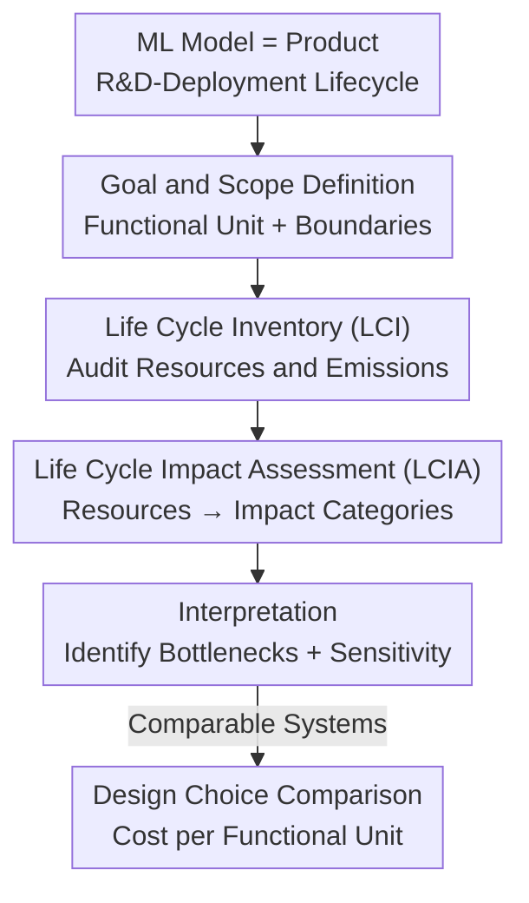

# Position: Evaluation of ML Resource Utilization Requires Model Life Cycle Assessment

**Conference**: ICML 2026  
**arXiv**: [2606.07632](https://arxiv.org/abs/2606.07632)  
**Code**: None (Position Paper)  
**Area**: Green AI / ML Resource and Environmental Impact Assessment  
**Keywords**: Life Cycle Assessment (LCA), Energy and Carbon Emissions, Embodied Costs, Functional Units, Sustainable AI

## TL;DR
This position paper argues that evaluating ML model resource consumption and environmental impact must move beyond focusing solely on the marginal costs of "single training" or "single inference." Instead, it advocates for adopting **Life Cycle Assessment (LCA)** from industrial ecology to aggregate and attribute costs—ranging from hardware manufacturing (embodied costs) to operational costs of training and deployment—across the entire R&D-deployment lifecycle. It provides a four-phase LCA-for-ML methodology, cost attribution formulas, and an OLMo2 case study.

## Background & Motivation

**Background**: As the scaling paradigm continues, data centers are predicted to consume over 10% of total U.S. electricity by 2030, with related investments reaching hundreds of billions of dollars. A large body of research on ML efficiency and high-efficiency methods (including surveys and specialized venues) has emerged, serving as a necessary first step in understanding AI resource demands.

**Limitations of Prior Work**: Existing evaluation methods have not kept pace with increasing system complexity and suffer from three major defects. First, **reliance on proxy metrics**: theoretical proxies like FLOPs and parameter counts often correlate poorly with actual latency or energy consumption, providing little information for stakeholders requiring standardized accounting. Second, **single-phase focus**: prior work typically calculates either energy/water consumption for large-scale training, marginal costs for single inference, or embodied costs of hardware manufacturing. Focusing on a single stage fails to measure the total resource and environmental cost of the decision to "build a new model"—especially since modern LLM pipelines are far more complex than classic train-test cycles (involving multi-stage pre/post-training, synthetic data/distillation/reward models, various inference-time algorithms, and heterogeneous hardware deployment). Third, **industry-level predictions are detached from real workloads**: energy predictions for data centers based on chip shipments and efficiency estimates are too abstract, masking individual workloads and failing to evaluate the real impact of specific models or efficiency improvements (projections for annual load growth vary by more than 4x).

**Key Challenge**: While AI costs and spheres of influence are expanding rapidly, measurement methods remain at a granularity of "calculating a single marginal step." Efficiency gains in one stage can shift costs to another (e.g., moving compute from training to inference time), an interaction that a single-stage perspective cannot capture.

**Goal**: To demonstrate that ML resource evaluation "requires" LCA and to implement mature LCA standards (ISO 14040/14044) for ML models by defining functional units, system boundaries, a four-phase process, and cost attribution formulas. It also addresses counter-arguments and identifies gaps in data and tools needed for implementation.

**Key Insight**: The authors observe that while LCA is mature in the semiconductor and computing hardware sectors for quantifying embodied and operational carbon, systematically applying LCA to ML models themselves (rather than just the hardware) is still in its infancy—this represents a critical gap.

**Core Idea**: Treat the ML model as a "product" and apply a "cradle-to-grave" LCA framework. By using unified functional units and system boundaries, embodied costs, operational costs (training/experimentation), and inference costs are aggregated and amortized over the model's usage, enabling comparable resource assessments and the identification of bottlenecks.

## Method

### Overall Architecture
The proposed "object of evaluation" is the entire lifecycle of an ML model rather than an isolated stage. LCA decomposes resource consumption and emissions into stages such as manufacturing, usage, and disposal, aggregating upstream costs (hardware manufacturing, training) and amortizing them during usage. For ML, this involves defining a **functional unit**—a quantitative reference for the service provided (e.g., "a base model trained for a set of language tasks" or "a batch of queries processed by the model")—establishing **system boundaries**, and following the four ISO-standard phases: Goal and Scope Definition → Life Cycle Inventory (LCI) → Life Cycle Impact Assessment (LCIA) → Interpretation. This pipeline allows "embodied costs (hardware) + operational costs (training, experiments, inference)" to be aggregated and attributed under a unified standard.

### Key Designs

**1. Functional Units and System Boundaries: Standardizing Incomparable Metrics**
A major issue with current ML energy reports is the lack of a unified reference. Reported energy consumption from different vendors (e.g., OpenAI, Google) is often incomparable due to differing workloads, and water consumption estimates can vary by orders of magnitude depending on whether Scope 2 off-site consumption is included. LCA's first phase mandates the definition of a **functional unit**: a quantitative reference for the "value provided." This varies by stakeholder—developers might focus on "a model family," while users focus on "queries processed." Standardizing these units and boundaries is the prerequisite for cross-model and cross-vendor comparisons.

**2. Product System Modeling: Incorporating Modern LLM Pipelines**
Classic ML involve "training and validation on i.i.d. data," but modern LLM development includes NAS, AutoML, long-context pre-training, and continuous re-training. The inference side introduces Chain-of-Thought, self-refinement, tool use, RAG, and in-context learning across heterogeneous hardware. LCA models these as a "product system," associating input resources and output emissions with each stage. This explicitly accounts for **cross-stage resource trade-offs** (e.g., shifting compute from training to inference).

**3. Inventory, Impact Assessment, and Interpretation: From Flow to Bottlenecks**
The **Life Cycle Inventory (LCI)** phase quantifies environmental flows related to the functional unit, including embodied costs (rare earths, PFAS, etc.) and operational flows (energy, water, carbon, air pollution). The **Life Cycle Impact Assessment (LCIA)** applies characterization factors (e.g., EPA's TRACI) to convert these into impact categories like global warming or health effects. While LLM vendors report energy and CO2e, broader environmental impacts remain largely undisclosed. **Interpretation** identifies the stages with the greatest impact, evaluates data sensitivity, and provides recommendations to optimize model design for minimal resource usage per functional unit.

**4. Mechanism: Amortizing Upstream Costs into Unit Functional Costs**
The authors provide a specific cost attribution example: using "a batch of samples processed by an LLM" as the functional unit, the unit functional cost $C_{\text{FU}}$ includes not only marginal inference costs but also amortized training and hardware manufacturing costs:

$$C_{\text{FU}} = C_{\text{Per Inference}} + \frac{\text{Hardware Utilization Time}\times C_{\text{Embodied}}}{\text{Hardware Lifespan}} + \frac{C_{\text{Experimentation}}+C_{\text{Training}}}{\text{Total Lifetime Inferences}}$$

The second term uses a "time-share" method to attribute the embodied cost of GPU manufacturing based on the workload's share of the hardware's useful life. The third term amortizes training and experimental costs over the total number of lifetime inferences. Embodied costs can be obtained from vendor disclosures (e.g., NVIDIA), while operational costs are measured directly using tools like `nvidia-smi` or Intel VTune.

### An Example: Life Cycle CO2e of OLMo2 7B
Using OLMo2 7B training and inference as an example (inference efficiency estimated via ShareGPT data, assuming a 4-year GPU lifespan): breaking down resource consumption by lifecycle stage reveals several key phenomena. Improving inference efficiency via offline batching reduces unit functional cost; embodied costs are diluted as model usage increases; and **unit inference cost is extremely sensitive to the model's "lifespan" (total inferences)**. Inference costs only begin to exceed initial training costs after tens of billions of inferences, illustrating why single-stage calculations lead to misjudgments.

## Key Experimental Results

### Key Findings
| Phenomenon | Implication |
|------|------|
| Improved batching efficiency → lower unit cost | Service-side design choices directly alter $C_{\text{FU}}$ |
| Embodied costs dilute with usage | Single-phase (manufacturing only) overestimates unit impact |
| Sensitivity to total lifespan | Inference cost takes tens of billions of uses to exceed training cost |
| Industry self-reporting: Meta/Google inference accounts for 70%/60% of AI power | Deployment dominates at scale, but research scenarios are dominated by training |

### Response to Objections
| Objection | Response |
|----------|---------|
| Efficiency gains offset AI cost growth | Jevons' paradox: cheaper units often stimulate higher total usage; the issue is resource allocation, not just reduction |
| Hardware LCA is more useful than model LCA | Hardware LCA serves infrastructure providers; model LCA is interpretable for developers/users across heterogeneous hardware |
| Resources are concentrated in a single stage | Fixed upstream costs are massive and require massive inference scale to amortize; new paradigms like multi-agent add more stages |
| Information is unavailable | Use representative averages, technical reports, and mandatory disclosures (EU AI Act, NVIDIA reports) for estimation |

### Goal (Future Work)
- **User-centric metrics**: Link functional units to real-world latency, cost, and energy constraints rather than just hardware utilization.
- **Transparent disclosure**: Disclose embodied costs and inference scale/frequency rather than just the final training run.
- **Standardization by public bodies**: Implementation of reporting requirements like the EU AI Act and White House AI Action Plan.
- **Fine-grained monitoring**: Measure energy consumption beyond the GPU (CPU, memory, interconnects) using direct component measurement rather than TDP approximations.
- **Interdisciplinary collaboration**: Collaborate with semiconductor, environmental science, and public health sectors.

## Highlights & Insights
- **Methodology Transfer**: Instead of a new algorithm, the paper introduces the mature ISO 14040/14044 LCA framework to ML evaluation, providing a ready-made scaffold for regulatory adoption.
- **Functional Units & System Boundaries**: Correctly identifies that the orders-of-magnitude difference in current energy/water reports stems from the lack of a unified reference, not measurement error.
- **Quantifying Cross-stage Trade-offs**: Enables the calculation of net benefits for designs like "inference-time compute vs. extra training" or "continuous pre-training vs. full re-training," which is essential in the era of reasoning models.
- **Reusable Attribution Formula**: The $C_{\text{FU}}$ formula provides a template for researchers to perform comprehensive Green AI accounting.

## Limitations & Future Work
- As a position paper, it lacks an empirical end-to-end LCA for a specific model, and the OLMo2 case study relies on several assumptions (4-year hardware life, ShareGPT distribution).
- Embodied cost attribution (specifically the time-share method) remains an open problem; different methods may yield significantly different conclusions.
- LCA depends heavily on proprietary vendor data; data availability remains a hurdle, though secondary data can serve as a proxy.
- Jevons' paradox suggests that even if LCA clarifies unit costs, it may not prevent the growth of total resource consumption.

## Related Work & Insights
- **vs. Single-stage Accounting**: Unlike works focusing only on training (Strubell) or inference (Luccioni), this paper advocates for modeling inter-stage interactions.
- **vs. Hardware/Data Center LCA**: While hardware LCA (Gupta et al.) focuses on physical infrastructure, model LCA focuses on the impact of serving a specific LLM request, making it more actionable for software developers.
- **vs. Industry Energy Projections**: Model LCA provides the granular workload-level data that high-level industry projections lack.

## Rating
- Novelty: ⭐⭐⭐⭐ Systematic application of LCA to ML models fills a methodological gap.
- Experimental Thoroughness: ⭐⭐⭐ Primarily case-study based; lacks a complete, verifiable end-to-end empirical LCA.
- Writing Quality: ⭐⭐⭐⭐⭐ Clear argumentation with strong structure and actionable future work.
- Value: ⭐⭐⭐⭐⭐ Highly timely for Green AI assessment and regulatory standard-setting.

<!-- RELATED:START -->

## Related Papers

- [\[ICML 2026\] Comprehensive AI Governance Requires Addressing Non-Model Gains](comprehensive_ai_governance_requires_addressing_non-model_gains.md)
- [\[AAAI 2026\] Forest vs Tree: The (N, K) Trade-off in Reproducible ML Evaluation](../../AAAI2026/others/forest_vs_tree_the_n_k_trade-off_in_reproducible_ml_evaluation.md)
- [\[ICML 2026\] nD-RoPE: A Generalized RoPE for n-Dimensional Position Embedding](nd-rope_a_generalized_rope_for_n-dimensional_position_embedding.md)
- [\[ICML 2026\] Position: Age Estimation Models Do Not Process Biometric Data](position_age_estimation_models_do_not_process_biometric_data.md)
- [\[ICML 2025\] Position: AI Evaluation Should Learn from How We Test Humans](../../ICML2025/others/position_ai_evaluation_should_learn_from_how_we_test_humans.md)

<!-- RELATED:END -->
