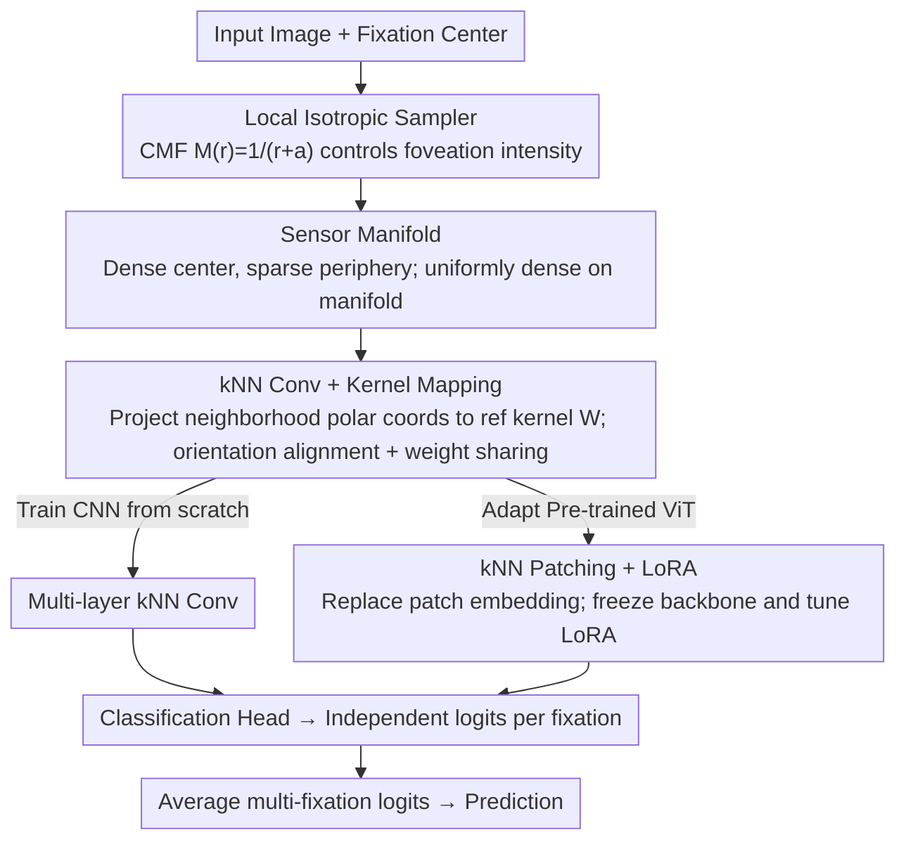

# FOVI: Bio-inspired Foveated Interface for Deep Vision Models

**Conference**: ICML 2026  
**arXiv**: [2602.03766](https://arxiv.org/abs/2602.03766)  
**Code**: https://github.com/nblauch/fovi  
**Area**: Efficient Vision Architectures / Bio-inspired  
**Keywords**: Foveated Sampling, Cortical Magnification Factor, kNN Convolution, Kernel Mapping, LoRA Adaptation

## TL;DR
Inspired by the human retina-V1 pathway, the authors construct FOVI (Foveated Interface), which uses a "cortical magnification function + local isotropic sampling" to create a non-uniform pixel distribution that remains uniformly dense on the sensor manifold. By introducing a novel kNN convolution + kernel mapping technique, FOVI is compatible with both CNNs and ViTs, allowing a DINOv3-ViT to approach full-resolution ImageNet accuracy using only ~1/16 of the pixels.

## Background & Motivation

**Background**: Mainstream deep vision models encode the world as a rectangular pixel map with uniform resolution, typically fixed at 224x224. When processing high-resolution wide-field images (e.g., in robotics, autonomous driving, or first-person vision), CNN computation grows linearly with pixels, while for ViTs, self-attention complexity expands **quadratically** with side length, making the costs prohibitive.

**Limitations of Prior Work**: Historical attempts at foveated vision generally failed in two ways. First, log-polar models sample equiangularly at logarithmic radii, and second, warped Cartesian models project log-polar samples back into "squeezed" rectangular grids. Both attempt to force a rectangular grid, resulting in **local anisotropic sampling**—where sampling intervals differ along radial vs. polar directions within the same neighborhood—causing warped receptive fields (RFs) that are biologically inaccurate and break the geometric isomorphism required for standard convolution. A few works achieving isotropic sampling (e.g., Killick et al.) rely on fixed Gaussian derivative bases and do not support end-to-end learning.

**Key Challenge**: Foveated sampling requires "sampling density to vary only with eccentricity," which naturally produces a **curved, non-rectangular** set of samples in visual space. Conversely, standard convolution/patching operators require a **regular rectangular grid** for weight sharing. These two requirements are fundamentally incompatible.

**Goal**: (1) Provide a locally isotropic sampler strictly aligned with primate retinal-V1 mapping; (2) Invent a weight-sharing, end-to-end trainable convolution operator for such irregular sampling; (3) Demonstrate that this interface can train CNNs from scratch or adapt pre-trained large ViTs (DINOv3), translating pixel savings into FLOPs, latency, and memory gains.

**Key Insight**: The authors observe a mathematical model from Rovamo & Virsu (1984): if the sampling density strictly decreases with eccentricity according to the cortical magnification function $M(r)=1/(r+a)$, and the number of angular samples is determined by "local isotropy," then these discrete points—while dense at the center and sparse at the periphery in visual space—are **uniformly dense on a 3D curved manifold (sensor manifold)**. Viewed from this sensor manifold, the problem returns to "convolution on a uniformly dense point cloud," where k-nearest neighbor (kNN) neighborhoods can replace rectangular windows.

**Core Idea**: Reformulate "foveated sampling" as "uniform sampling on a cortical sensor manifold." Then, use the pair of operators **kNN convolution + kernel mapping** to unify the geometric incompatibility of CNN and ViT architectures while maintaining weight sharing and end-to-end learning.

## Method

### Overall Architecture

The FOVI interface consists of two tightly coupled components. The first is the **Foveated Sensor**: given a field-of-view radius $r_{\max}$ and magnification parameter $a$, it first takes equidistant radii $\{r_i\}$ along the "cortical distance" $w(r)=\log(r+a)+C$. At each radius, it automatically determines the number of angular samples based on the constraint that "angular spacing $\approx$ radial spacing" (local isotropy). This results in a point cloud that is dense at the center and sparse at the periphery in visual space but uniformly dense on the Rovamo–Virsu manifold. When flattened following Schwartz's complex logarithmic model (cutting along the vertical meridian), this yields a visualized "V1 plane." The second component is **Operators for regular processing on the sensor manifold**: the authors use kNN neighborhoods instead of rectangular windows, redefining "convolution" as a weighted sum over the kNN neighborhood of each output unit on the sensor manifold. A kernel mapping technique is used to sample a "reference kernel $W$ learned on a Cartesian grid" onto each kNN in an orientation-aligned manner, achieving true weight sharing. The pipeline: **Input Image → Foveated Sampler → Features on Sensor Manifold (Uniform Point Cloud) → Multiple kNN Convolutions (for CNN) or one kNN Patching (for ViT) → Classification Head**.

### Key Designs

**1. Locally Isotropic Sampler based on CMF: Translating "Foveation" to "Uniform Manifold Sampling"**

The difficulty of foveated sampling lies in requiring density to vary only with eccentricity, creating non-rectangular point sets. Log-polar/warped Cartesian models distort RFs because radial and tangential spacings differ (anisotropy) to fit a grid. FOVI returns to the classic cortical magnification function (CMF) $M(r)=1/(r+a)$. Its integral $w(r)=\log(r+a)+C$ defines "cortical distance"; taking $n_r$ equidistant steps in $w$ yields radii $\{r_i\}$. The number of angular samples $n_s(r_i)$ is solved via the local isotropy constraint. This ensures the points are uniformly dense on the Rovamo–Virsu sensor manifold, allowing them to be treated as a regular point cloud. Parameter $a$ is a continuous knob: $a\to 0$ represents extreme foveation, while $a\to\infty$ degrades to uniform sampling. To compare different $a$ values fairly, the authors use a normalization coefficient $k_a=(\int_0^{r_{\max}}1/(r+a)\,\mathrm{d}r)^{-1}$ to align the total CMF area (total resolution). This sampler aligns with primate V1 retinotopy and avoids forced RF distortion.

**2. kNN Convolution + Kernel Mapping: Restoring Weight Sharing and Orientation Alignment on Irregular Sets**

To perform convolution on irregular kNN neighborhoods, FOVI redefines the operator: for each output unit, it finds the $k$ nearest neighbors on the sensor manifold. Each neighbor is assigned polar coordinates $(r, \theta)$, where $r$ is the geodesic distance to the center unit **on the manifold**, and $\theta$ is its polar angle relative to the center in **visual space**. These are projected to a common Cartesian system $x=r\cos\theta, y=r\sin\theta$ and aligned with a reference kernel $W$ learned on a standard grid. Weight sharing is achieved because all neighborhoods share the same $W$. Crucially, because $\theta$ is derived from visual space, even though the "convolution kernel" size scales with eccentricity, **feature orientations** (e.g., "vertical stripes") remain consistent across the image. The reference kernel uses a high resolution $s=2\sqrt{k}$ with anti-aliasing to mitigate irregularities, providing a ~+3% ImageNet gain.

**3. kNN-based Patching + LoRA: Interfacing Pre-trained ViTs with Foveated Sensors**

To enable a pre-trained ViT (DINOv3) to process foveated input without destroying its feature space, FOVI modifies only the patch embedding. They define a dense "sensor array" and a sparse "patch center array," where each patch is the kNN of its center on the sensor array. By constraining $a$, the patch count is kept identical to the baseline (e.g., 64), requiring no changes to the transformer backbone. The original ViT patch embedding is used as the reference kernel $W$ for the kNN convolution. For fine-tuning, **LoRA is applied to the patch embedding and the first half of the transformer layers**. Comparisons on IN-100 show this strategy outperforms frozen adaptation by ~30%, full fine-tuning by ~10%, and tuning only the latter half by ~15%. This is because ViT attention is independent of spatial regularity, but full fine-tuning overfits to small adaptation datasets, while freezing cannot absorb the new geometry. LoRA on the earlier layers balances capacity and regularization.

### Loss & Training

Both CNN and ViT models use standard supervised classification. For each image, 4 fixations are randomly sampled from the central region (radius 0.25 of image size). Each fixation independently produces logits, which are **averaged before calculating cross-entropy**. The authors found simple averaging more stable than learnable recurrent integrators. Inference allows up to 20 fixations, with performance typically saturating around 20. The optimizer uses cosine decay. ViT-S+ is trained for 100 epochs, while ViT-H+ is trained for 25 epochs (faster convergence but more expensive per epoch).

## Key Experimental Results

### Main Results

| Model | fix. | Pixels | Patches | GFLOPs | Top-1 | Val Latency (ms) | Val Memory (GB) |
|---|---|---|---|---|---|---|---|
| ViT-H+ uniform @224 | 1 | 50176 | 196 | 172.4 | **0.871** | 289.6 | 40.1 |
| FOVI-ViT-H+ @64 (a=2.79) | 1 | 3976 | 64 | 58.4 | 0.844 | 120.0 | 19.1 |
| FOVI-ViT-H+ @64 (a=2.79) | 3 | 11928 | 192 | 175.3 | 0.853 | 303.7 | 40.9 |
| ViT-S+ uniform @224 | 1 | 50176 | 196 | 6.16 | 0.794 | 37.9 | 4.1 |
| FOVI-ViT-S+ @64 (a=2.79) | 1 | 3976 | 64 | 2.04 | 0.700 | 27.6 | 1.7 |
| ViT-S+ uniform @64 | 1 | 4096 | 64 | 2.02 | 0.693 | 27.6 | 1.7 |
| ViT-S+ log-polar @64 (a=2.79) | 1 | 4096 | 64 | 2.02 | 0.643 | 27.9 | 1.7 |
| FOVI-ViT-S+ @64 (a=2.79) | 3 | 11928 | 192 | 6.12 | **0.735** | 46.8 | 4.3 |

(Selected from Table 1; results grouped by model scale and fixation count.)

### Ablation Study

| Configuration | ImageNet-1K Top-1 | Description |
|---|---|---|
| FOVI-CNN, $a=0.5$ (Moderate) | Optimal | For a fixed 64x64 budget, moderate foveation outperforms the pure uniform model ($a=500$). |
| FOVI-CNN, $a=50$ (Near-uniform) | Lower | Loses radial RF gradient; RF no longer grows linearly with eccentricity. |
| Ref. kernel res $s=\sqrt{k}$ | -3% | Increasing to $s=2\sqrt{k}$ provides ~3% gain via anti-aliasing. |
| DINOv3 LoRA (patch emb + early layers) | Baseline | Outperforms full fine-tuning by ~10% and frozen adaptation by ~30%. |
| FOVI-ViT-S+ vs log-polar | 0.700 vs 0.643 | At 1 fixation, FOVI is ~6% higher, validating local isotropy. |

### Key Findings

- **The "Sweet Spot" of Foveation**: Under restricted pixel budgets, moderate foveation ($a=0.5$) beats uniform sampling, showing an inverted U-curve. Too much foveation loses peripheral info; too little fails to concentrate resolution on objects. This matches ImageNet's "center + medium scale" bias.
- **Emergent Biological Alignment**: FOVI-CNN RF diameters grow approximately linearly with eccentricity. Higher layers show larger slopes and intercepts, matching pRF patterns measured via fMRI in human V1–V3 (Dumoulin & Wandell, 2008). The $a=50$ model lacks this, proving geometry stems from the sensor, not depth.
- **Plug-and-play for Large Models**: FOVI-ViT-H+ with 3 fixations (~11.9k pixels) reaches 0.853 top-1, only 1.8% behind full resolution but with FLOPs and latency comparable to 1-fixation full resolution.

## Highlights & Insights

- **Redefining Irregular Convolution**: Translating "irregular sampling" to "regular manifold operations" is an elegant perspective that preserves biological interpretability, weight sharing, and end-to-end learning—solving the long-standing flaw in log-polar methods.
- **Reusable Kernel Mapping**: Mapping a Cartesian reference kernel to arbitrary geometric neighborhoods via spatial sampling is a transferable trick applicable to point clouds, spherical, or graph convolutions.
- **Simple Averaging is Sufficient**: Averaging logits over fixations performs nearly as well as learnable integrators, providing a low-cost interface for active vision systems.
- **LoRA Strategy for Geometric Adaptation**: The empirical rule for "changing geometry, keeping semantics" is to tune the patch embedding and the first half of the layers, where low-level geometry resides, while protecting semantic layers.

## Limitations & Future Work

- Fixations are currently random; to realize the potential of "active perception," the saccade strategy should be a learnable module (e.g., RL or Bayesian active sensing).
- Training is limited to 4 fixations due to cost, potentially restricting the model's ability to learn long-term integration.
- ImageNet is center-biased; for more uniform fields (e.g., autonomous driving), the optimal foveation parameter $a$ will likely differ significantly and require recalibration.
- The need for $s=2\sqrt{k}$ kernel resolution suggests sample distribution inside kNNs is still somewhat irregular, implying further anti-aliasing or interpolation could boost accuracy.

## Related Work & Insights

- **vs. Log-polar / Warped Cartesian (Weiman & Chaikin, 1979; Wang et al., 2021)**: These force foveated samples into rectangular grids, distorting RFs. FOVI eliminates this via uniform manifold sampling.
- **vs. Killick et al. (2023)**: Also pursues isotropy but relies on fixed Gaussian derivative bases. FOVI enables end-to-end learning by mapping Cartesian reference kernels to kNNs.
- **vs. Cheung et al. (2017)**: They let the grid emerge as foveated, but the resulting irregular grid does not easily support standard convolution. FOVI provides an explicit, controllable, and convolution-compatible sampler.
- **vs. Architectural Foveation (Kerr et al., 2025)**: These only allocate resources non-uniformly but use uniform inputs, missing sensing-level efficiency. FOVI saves computation at the sensor side, closer to true active vision.

## Rating
- **Novelty**: ⭐⭐⭐⭐⭐ Integrates sensor manifolds, kNN convolution, and kernel mapping across CNNs and ViTs with a fresh geometric perspective.
- **Experimental Thoroughness**: ⭐⭐⭐⭐ Covers ImageNet/IN-100, CNNs/ViTs, and LoRA strategies, though lacks high-res real-world active vision scenarios.
- **Writing Quality**: ⭐⭐⭐⭐⭐ Clear progression from biological motivation to geometric implementation. Figures 1–3 are particularly helpful.
- **Value**: ⭐⭐⭐⭐ Provides a practical, weight-compatible entry point for porting foundation models to high-resolution active vision systems for robotics.

<!-- RELATED:START -->

## Related Papers

- [\[ICML 2026\] Complexity as Advantage: A Regret-Based Perspective on Emergent Structure](complexity_as_advantage_a_regret-based_perspective_on_emergent_structure.md)
- [\[ICML 2026\] Riemannian Networks over Full-Rank Correlation Matrices](riemannian_networks_over_full-rank_correlation_matrices.md)
- [\[ICML 2026\] iWorld-Bench: A Benchmark for Interactive World Models with a Unified Action Generation Framework](iworld-bench_a_benchmark_for_interactive_world_models_with_a_unified_action_gene.md)
- [\[ICML 2026\] New Bounds for Kernel Sums via Fast Spherical Embeddings](new_bounds_for_kernel_sums_via_fast_spherical_embeddings.md)
- [\[ICML 2026\] On Revisiting Entropy for Identifying Mislabeled Images](on_revisiting_entropy_for_identifying_mislabeled_images.md)

<!-- RELATED:END -->
