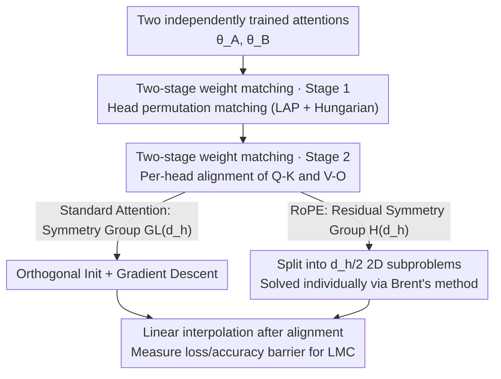

# Functional Equivalence in Attention: A Comprehensive Study with Applications to Linear Mode Connectivity

**Conference**: ICML 2026  
**arXiv**: [2606.17830](https://arxiv.org/abs/2606.17830)  
**Code**: Not mentioned  
**Area**: Neural Network Theory / Parameter Symmetry / Optimization Geometry  
**Keywords**: Functional equivalence, positional encoding, RoPE, linear mode connectivity, weight matching

## TL;DR
This paper theoretically characterizes the "functional equivalence" symmetry groups of Transformer attention with positional encodings—proving that sinusoidal positional encodings preserve the original attention's symmetry structure, while RoPE significantly compresses the symmetry group to enhance expressivity. Based on this, it designs a two-stage weight matching algorithm adaptable to both positional encodings and systematically validates linear mode connectivity (LMC) across various settings.

## Background & Motivation
**Background**: The parameter space of neural networks is "non-injective"—different parameter configurations can implement the exact same function, a phenomenon known as functional equivalence. The most typical example is permutation symmetry: swapping the order of hidden units does not change the network function. This symmetry structure has been thoroughly studied in fully connected and convolutional networks and serves as a key tool for understanding loss landscapes, weight ensembles, and mode connectivity.

**Limitations of Prior Work**: For attention architectures, the symmetry structure is much more complex. While existing work (Tran et al. 2025) has characterized the complete symmetry group of "vanilla multi-head attention," they typically assume an absence of positional encoding—yet positional encoding (PE) is an indispensable component of modern Transformers. The problem is that PE **rewrites the internal structure of attention**, meaning symmetry conclusions from the vanilla case cannot be directly applied. Without this characterization, weight alignment and LMC analysis for Transformers lack a foundation.

**Key Challenge**: Attention itself is permutation-invariant and must rely on PE to inject sequence information. However, different PEs inject information in different "ways"—absolute positional encoding (APE, such as sinusoidal) is additive on the input, while relative positional encoding (RPE, such as RoPE) inserts a rotation dependent on relative positions between Query and Key. It has not been systematically answered whether this structural difference changes the parameter symmetry group.

**Goal**: (1) Formally characterize the functional equivalence symmetry groups of multi-head attention with positional encodings (Sinusoidal, RoPE); (2) Translate this characterization into a weight matching algorithm; (3) Use it for an empirical study of LMC in Transformers across various scales and modalities.

**Key Insight**: The authors focus on "how positional encoding algebraically intervenes in attention calculation"—additive injection is a bijection and does not change the internal structure, while rotational injection blocks the cancellation of certain group actions, thereby compressing the symmetry group.

**Core Idea**: The change in the symmetry group is explained by "how positional encoding changes the cancellation of group actions." Sinusoidal encoding keeps the symmetry group unchanged, while RoPE compresses the $\mathrm{GL}(d_h)$ symmetry of the Query-Key branch into a smaller Abelian subgroup $H(d_h)$. Fewer symmetries imply higher expressivity, providing a principled explanation for why RoPE outperforms others in practice.

## Method

### Overall Architecture
The paper connects "theoretical characterization" and "algorithmic implementation." The theoretical part reviews the symmetry group of vanilla multi-head attention (MHA) and analyzes how sinusoidal encoding and RoPE rewrite the internal structure and symmetry group. The algorithmic part converts the characterized symmetry group into a **two-stage weight matching algorithm** to align two independently trained Transformers, followed by linear interpolation in parameter space and quantification of loss/accuracy barriers to judge LMC.

Let vanilla MHA be $\mathrm{MHA}(x;\theta)=\sum_{i=1}^{h}\mathrm{softmax}\big((xW_i^Q)(xW_i^K)^\top\big)\,xW_i^V (W_i^O)^\top$ with parameters $\theta=\{W_i^Q,W_i^K,W_i^V,W_i^O\}_{i=1}^h$. Its symmetry group is known to be $G_{\mathrm{Att}}(d_h,h)=S_h\times(\mathrm{GL}(d_h)\times\mathrm{GL}(d_h))^h$: $S_h$ is the permutation between heads, and each head has two sets of $\mathrm{GL}(d_h)$ actions (one for Q-K, one for V-O) that cancel out during matrix multiplication. This paper answers whether this group still holds after adding PE.

The flowchart below illustrates the weight matching algorithm pipeline, with the theoretical symmetry characterization as its algebraic premise:

### Key Designs

**1. How Positional Encoding Reshapes the Symmetry Group: Additive Invariant, Rotational Compression**

This is the theoretical core, addressing the challenge of whether vanilla symmetry conclusions apply to attention with PE. For sinusoidal encoding, the position vector $p$ is directly added to the input: $\mathrm{MHA}_{\text{Sinusoidal}}(x;\theta)=\mathrm{MHA}(x+p;\theta)$. Since the mapping $x\mapsto x+p$ is a bijection and does not touch the internal weight structure, it has no impact on parameter symmetry—the functional equivalence class with sinusoidal encoding is **identical** to the case without PE, and the symmetry group remains $G_{\mathrm{Att}}$.

RoPE is entirely different. Within each head, it separates the Query and Key with a block-diagonal rotation matrix $R_{m-n}$ dependent on relative position: $\mathrm{MHA}_{\text{RoPE}}(x;\theta)=\sum_i \mathrm{softmax}\big[x_m W_i^Q R_{m-n}(W_i^K)^\top x_n^\top\big]\,xW_i^V(W_i^O)^\top$. Crucially, the V-O branch remains purely multiplicative and identical to the vanilla case, so the $\mathrm{GL}(d_h)$ action on V-O still cancels. However, the Q-K branch is interrupted by $R_{m-n}$. The original cancellation between $W_i^Q U_i^\top$ and $(W_i^K U_i^{-1})^\top$ (i.e., $U_i U_i^{-1}$) is broken by the rotation matrix, such that generally $\mathrm{MHA}_{\text{RoPE}}(\cdot;\theta)\neq\mathrm{MHA}_{\text{RoPE}}(\cdot;g\theta)$. This implies the RoPE symmetry group is compressed—less symmetry means fewer equivalent parameter configurations, allowing the model to distinguish more functions and thus increasing expressivity. This elevates the "why RoPE works" from empirical observation to a symmetry-level explanation.

**2. The Residual Symmetry Group of RoPE $H(d_h)$: Only that which commutes with rotation remains**

Building on the previous point, the authors precisely characterize how much symmetry Q-K can retain under RoPE. A retained $U_i$ must commute with all relative rotations $R_{m-n}$. The authors construct block-diagonal matrices $P_i$ (where the $i$-th $2\times2$ block is identity and others are zero) and $J_i$ (where the $i$-th block is $\begin{psmallmatrix}0&-1\\1&0\end{psmallmatrix}$) to define the residual symmetry group:

$$H(d_h):=\Big\{U=\textstyle\sum_{i=1}^{d_h/2}(a_iP_i+b_iJ_i):(a_i,b_i)\in\mathbb{R}^2\setminus\{(0,0)\}\Big\}.$$

This is an Abelian subgroup of $\mathrm{GL}(d_h)$ isomorphic to $(\mathbb{C}^\times)^{d_h/2}$—intuitively, each $2\times2$ block only retains the degrees of freedom of "complex multiplication" (scaling + rotation), which is far smaller than the original $\mathrm{GL}(d_h)$. This characterization not only completes the theoretical gaps for RoPE's symmetry but also dictates the optimization space for Q-K weight matching.

**3. Two-Stage Weight Matching Algorithm: Discrete Permutation then Continuous Alignment**

With the symmetry group characterized, aligning two attentions $\theta_A, \theta_B$ is equivalent to finding the optimal group element $g$. Borrowing from Weight Matching, the authors split this into two steps that are **data-independent** and adaptable to both standard attention and RoPE. Stage 1 resolves head permutation: a cost matrix is constructed using $M_i=W_i^Q(W_i^K)^\top$ and $N_i=W_i^V(W_i^O)^\top$. $M_i$ is row-centered $\bar M_i=M_i-\tfrac1d(M_i\mathbf 1)\mathbf 1^\top$ to absorb the translation invariance of softmax. With costs $C_{ij}=\|\bar M_i^A-\bar M_j^B\|_F^2+\|N_i^A-N_j^B\|_F^2$, the linear assignment problem (LAP) is solved via the Hungarian algorithm in $O(h^3)$. This cost matrix is designed to be invariant to group actions on Q-K and V-O, ensuring permutation matching is unaffected by continuous symmetry.

Stage 2 resolves continuous alignment within heads: after reordering, Q-K and V-O are aligned individually per head, e.g., $L_{Q,K}(U_i)=\|W_{i,A}^Q-W_{i,B}^Q U_i^\top\|_F^2+\|W_{i,A}^K-W_{i,B}^K U_i^{-1}\|_F^2$. For standard attention, $U_i$ is optimized in $\mathrm{GL}(d_h)$ via gradient descent, starting from a closed-form initialization that constrains $U_i$ to be orthogonal. For RoPE, the search space shrinks to $H(d_h)$, which fortunately **decouples into $d_h/2$ independent 2D subproblems**, each reduced to a univariate scalar minimization solved efficiently by Brent's method. V-O alignment follows similarly. This step converts the "algebraic structure of the symmetry group" into the "solvable structure of the optimization problem"—the smaller the RoPE group, the simpler the optimization.

### Loss & Training
The matching algorithm itself does not train the network; it finds alignment group elements between two pre-trained checkpoints. Stage 1 is combinatorial optimization (LAP), and Stage 2 is continuous optimization within the corresponding symmetry groups ($\mathrm{GL}$ via GD, $H$ via Brent's method). LMC is judged by the loss barrier $B(\theta_A,\theta_B)=\sup_{t\in[0,1]}\big[L(t\theta_A+(1-t)\theta_B)-tL(\theta_A)-(1-t)L(\theta_B)\big]$, where a barrier near zero indicates the solutions are connected by a low-loss straight line.

## Key Experimental Results

### Main Results
Experiments cover vision (ViT on MNIST/CIFAR-10/100/ImageNet-1K), language modeling (GPT-2, Llama on Enwik8/WikiText103/One Billion Word), and text classification (BERT on AG News/IMDB/DBPedia), using both APE and RoPE for each model. Four "reinitialization" ranges were examined: first attention layer, all attention layers, first Transformer layer, and the entire model. Interpolations were measured across 25 points.

| Reinitialization Range | Small Datasets | Large-scale Datasets (ImageNet/WikiText103/Enwik8/1B Word) |
|------|------|------|
| First Attention Layer | Stable LMC | Stable LMC |
| First Transformer Layer | LMC Observed | LMC Observed (Except ImageNet) |
| All Attention Layers | LMC Observed | Majority LMC Observed |
| Entire Model | LMC Observed | **LMC Not Observed** (Lacking even with head sweep) |

Core conclusion: LMC appears reliably when "only attention-related parameters are reset," and **encoder architectures (ViT/BERT) consistently exhibit LMC**. However, when the entire model is reset and the data/model scale increases, LMC may disappear in decoder-only LLMs—suggesting that the loss landscape becomes too complex at scale to support LMC.

### Ablation Study
On a 6-layer, 4-head ViT/BERT (CIFAR-10/100, IMDB, DBPedia; first layer replaced), components were ablated. Stage 1 was evaluated by "rank of selected head permutation among all 24 permutations" and a normalized metric $\hat L=\tfrac{L_{\text{method}}-L_{\text{top1}}}{L_{\text{naive}}-L_{\text{top1}}}\times10^2$. Results show low rank and $\hat L \approx 0$, indicating near-optimal permutation matching. Stage 2 barrier ratios (relative to naive interpolation) are as follows:

| Configuration | Description | Loss Barrier Ratio (%) |
|------|------|------|
| Variant 1 | Stage 2 completely removed | 62–91 (High and unstable) |
| Variant 2 | Orthogonal init only, no GD | 10–16 |
| Full | Orthogonal init + GD fine-tuning | **7–12 (Lowest and most stable)** |

### Key Findings
- Head permutation matching (Stage 1) almost always selects the near-optimal permutation; visualization shows that "wrong permutations significantly worsen connectivity," proving precise matching is necessary.
- Both components of Stage 2 are essential: orthogonal initialization reduces the barrier from 60–90% to 10–16%, and gradient descent fine-tuning further suppresses it to 7–12%—initial alignment "finds the basin," while fine-tuning "polishes" the fit.
- The type of positional encoding (APE vs RoPE) does not significantly change the barrier value, but RoPE alignment in Stage 2 is more structured and solvable as decoupled low-dimensional subproblems due to its smaller group.

## Highlights & Insights
- Successfully elevates "why RoPE is strong" from empirical narrative to symmetry explanation: rotational injection breaks group cancellation on Q-K, compressing the symmetry group and expanding the distinguishable function set—a clean "structure $\leftrightarrow$ expressivity" argument.
- The $H(d_h)\cong(\mathbb{C}^\times)^{d_h/2}$ characterization is elegant: it completes the theory of RoPE symmetry while allowing Stage 2 of weight matching to decouple into 2D subproblems, directly translating theoretical characterization into algorithmic tractability.
- The observation that "encoders consistently show LMC while large decoders may lose it" is a significant empirical insight, suggesting LMC is not universal and that scale transforms loss landscape connectivity.
- Performing row-centering on $M_i$ in the cost matrix to absorb softmax translation invariance is a reusable trick for any matching problem involving softmax similarities.

## Limitations & Future Work
- The authors acknowledge that LMC behavior in ultra-large-scale models remains under-explored; while this work observes LMC failure in certain settings, "disproving LMC" is difficult as it depends on full symmetry characterization and explicit weight matching.
- Theoretical characterization only covers Sinusoidal and RoPE; other RPEs (e.g., learnable RPE, ALiBi) are not yet included. Symmetries for FFNs, residuals, and LayerNorm within full Transformer blocks are not yet integrated into a unified analysis.
- Stage 2 matching for standard attention requires gradient descent in $\mathrm{GL}(d_h)$, which may be susceptible to initialization and local minima. Barriers at scale still have a residual of 7–12% and are not fully eliminated.
- Future directions: Extend symmetry characterization to more PEs and the entire Transformer block, design faster aligners using the decoupled structure of $H(d_h)$, and systematically study the quantitative relationship between LMC failure, model generalization, and scale.

## Related Work & Insights
- **vs. Vanilla Attention Symmetry (Tran et al. 2025)**: They characterize the $G_{\mathrm{Att}}$ of MHA without PE; this paper pushes analysis into realistic settings with PE, demonstrating that Sinusoidal preserves while RoPE compresses symmetry.
- **vs. Weight Matching / Git Re-Basin (Ainsworth et al. 2023)**: Their weight matching is for general MLP/CNN; this paper customizes a two-stage algorithm for attention's specific structure (head permutations + Q-K/V-O dual GL, shrinking to $H(d_h)$ under RoPE) and explicitly handles softmax translation invariance.
- **vs. Transformer Matching (Theus et al. 2025)**: Their matching neglects symmetries within Q-K and K-V components; this paper provides a more complete group characterization and corresponding alignment methods.

## Rating
- Novelty: ⭐⭐⭐⭐⭐ First to completely characterize attention symmetry groups under RoPE and implement it as a matching algorithm.
- Experimental Thoroughness: ⭐⭐⭐⭐ Covers multiple models/modalities/scales and four reinitialization ranges, though LMC failure at scale provides only phenomena without deep mechanisms.
- Writing Quality: ⭐⭐⭐⭐ Rigorous theoretical derivation with clear structure, though notation-heavy.
- Value: ⭐⭐⭐⭐ Provides principled explanation for RoPE advantages and provides usable tools for Transformer model alignment/merging.

<!-- RELATED:START -->

## Related Papers

- [\[NeurIPS 2025\] Generalized Linear Mode Connectivity for Transformers](../../NeurIPS2025/others/generalized_linear_mode_connectivity_for_transformers.md)
- [\[ICLR 2026\] Do We Really Need Permutations? Impact of Model Width on Linear Mode Connectivity](../../ICLR2026/others/do_we_really_need_permutations_impact_of_model_width_on_linear_mode_connectivity.md)
- [\[ICML 2026\] Test-Time Training with KV Binding Is Secretly Linear Attention](test-time_training_with_kv_binding_is_secretly_linear_attention.md)
- [\[NeurIPS 2025\] Scalable Inference of Functional Neural Connectivity at Submillisecond Timescales](../../NeurIPS2025/others/scalable_inference_of_functional_neural_connectivity_at_submillisecond_timescale.md)
- [\[ICML 2026\] Connecting Independently Trained Modes via Layer-Wise Connectivity](connecting_independently_trained_modes_via_layer-wise_connectivity.md)

<!-- RELATED:END -->
