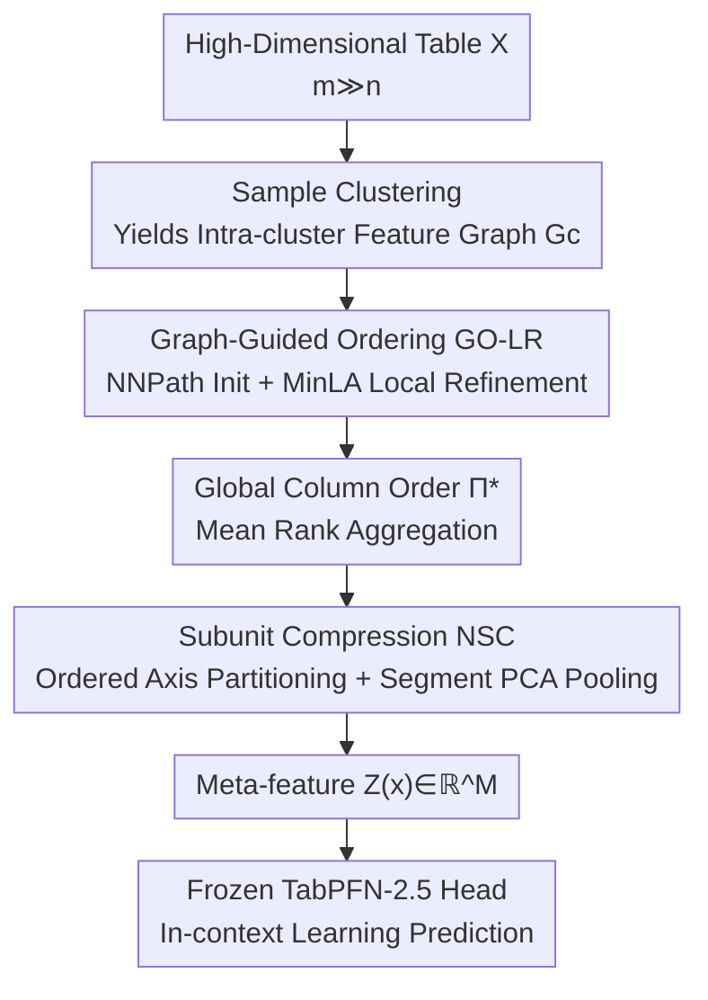

# GOTabPFN: From Feature Ordering to Compact Tokenization for Tabular Foundation Models on High-Dimensional Data

**Conference**: ICML 2026  
**arXiv**: [2606.05441](https://arxiv.org/abs/2606.05441)  
**Code**: TBD  
**Area**: Tabular Foundation Models / High-Dimensional Data / Feature Ordering / Compact Tokenization  
**Keywords**: TabPFN, HDLSS, Feature Ordering, MinLA, Subunit Compression

## TL;DR
Addressing High-Dimension Low-Sample-Size (HDLSS) tabular tasks where features far outnumber samples, this paper keeps the TabPFN backbone frozen and introduces Graph-Guided Feature Ordering (GO-LR) to arrange related features adjacently, followed by Neuro-inspired Subunit Compression (NSC) to pool adjacent segments into a few meta-features. This allows thousands of features to fit into TabPFN's feature budget, achieving the top average rank across 8 genomic/image HDLSS datasets.

## Background & Motivation

**Background**: Tabular foundation models like TabPFN rely on pre-training on synthetic tables and in-context learning to provide strong predictions without dataset-specific training. However, mainstream versions (e.g., TabPFN-2.5) are designed and evaluated with the assumption that input features are roughly within 2000.

**Limitations of Prior Work**: Many real-world HDLSS scenarios—such as gene expression, mass spectrometry, or flattened images—feature a number of features $m$ in the tens of thousands, while the number of samples $n$ is only tens to hundreds ($m \gg n$). Such inputs exceed TabPFN's operational range, necessitating feature selection or compression; otherwise, models fail to run or overfit. Simple feature selection is often insufficient: when $n \ll m$, even basic models like MLPs or Lasso can outperform "advanced" tabular methods, indicating that the issue is not just selection, but feature organization.

**Key Challenge**: Tabular data naturally lacks the spatial or temporal structure of images and text. Column order is arbitrary, and related features are scattered. While "segment-based compression" requires related features to be clustered, blind compression (like global PCA) results in latent variables that shift with sub-samples and random seeds, lacking a stable coordinate system—whereas TabPFN assumes a fixed, consistently parameterized input space. Thus, a tension exists between "dimensionality reduction" and "representation reproducibility."

**Goal**: Without retraining or modifying the **TabPFN backbone**, convert high-dimensional tables where $m \gg n$ into a dimension-controllable ($M \ll m$) and reproducible compact representation, making TabPFN-style predictors viable in true high-dimensional scenarios.

**Key Insight**: The authors formalize "learning a good column order" as a combinatorial optimization problem—the Column Permutation Problem (CPP)—and prove it is equivalent to the Weighted Minimum Linear Arrangement (MinLA). With a proper order, the structural constraint "adjacency = correlation" becomes a valid basis for compression.

**Core Idea**: Solve the HDLSS input bottleneck by using "ordering followed by segment pooling" instead of "direct feature selection or global dimensionality reduction." GO-LR aligns related features adjacently, and NSC compresses adjacent segments into stable meta-features.

## Method

### Overall Architecture

GOTabPFN is a serial pipeline consisting of a **pre-compression interface and a frozen TabPFN head**. The input is a high-dimensional table $X \in \mathbb{R}^{n \times m}$, and the output is a compact token sequence $Z(x)$ of $M$ dimensions ($M \ll m$) per sample, which is fed directly into the frozen TabPFN-2.5 for classification or regression. The process involves three steps: first, sample clustering is performed to estimate intra-cluster feature similarity graphs and compute local orderings, which are then aggregated into a single global column order $\Pi^{\ast}$ (GO-LR); second, features are partitioned into contiguous segments along this ordered axis and pooled into scalar meta-features (NSC); finally, the meta-feature sequence is passed to the frozen TabPFN head without any backpropagation through the backbone.

### Key Designs

**1. GO-LR: Formalizing Feature Ordering as MinLA and Solving via TSP-path Heuristics**

To address scattered related features, GO-LR clusters samples into $k$ clusters. For each cluster $c$, a weighted feature graph $G_c = (V, E, w^{(c)})$ is built, where edge weights $w_{ij}$ measure "dissimilarity" between features (e.g., $1-|\mathrm{corr}|$, JS, KL, cosine, or Euclidean). A local ordering $\pi$ is a bijection mapping features to positions $\{0, \dots, m-1\}$, aiming to minimize dispersion:

$$D_{G_c}(\pi) = \sum_{(i,j) \in E} w_{ij} \, |\pi(i) - \pi(j)|$$

The intuition is that larger weights (more dissimilar) should increase distance, while similar features are pulled together. The authors prove this objective is **equivalent to Weighted MinLA** (Theorem 3.1, Lemma 3.8), which is NP-hard (Lemma 3.9), and **strictly generalizes TSP-path**. Specifically, when the objective only considers edges at adjacent positions $(t, t+1)$, dispersion reduces to the TSP-path cost $\mathrm{PathCost}(\sigma) = \sum_{t} d_{\sigma_t, \sigma_{t+1}}$ (Theorem 3.12). This theory suggests a practical solution: initialize with Nearest Neighbor Path (NNPath, a TSP-path heuristic) and apply local refinement. This refinement involves choosing the better direction between the original and reversed order, followed by multiple passes of adjacent exchange (SweepRefine) that only accept exchanges which do not increase $D_{G_c}$, ensuring $D_{G_c}(\pi_c) \le D_{G_c}(\pi^{(0)})$. Local ranks are aggregated via mean rank using cluster weights $\alpha_c$, $\bar r(j) = \sum_c \alpha_c r_c(j)$, and sorted to yield the unique global order $\Pi^{\ast}$.

**2. NSC: Neuro-inspired Segmental Pooling for $m$-to-$M$ Dimension Reduction**

NSC is inspired by cortical pyramidal neurons, which organize tens of thousands of synaptic inputs into dendritic subunits that non-linearly pool locally related inputs into signals. NSC adopts this "local clustering $\to$ subunit compression" principle as an inductive bias for HDLSS: it partitions ordered features along $\Pi^{\ast}$ into $M$ contiguous segments (subunits) of length $s = \lceil m/M \rceil$. Each segment is pooled into a single scalar token. Partitioning can be uniform or adaptive—reusing the dissimilarity matrix from GO-LR to define transfer dissimilarity $\delta_t$ between adjacent positions and cutting at "maximum jumps" or "equal mass" points to ensure subunits are bounded by significant transitions.

**3. SegPCA Pooling + Fixed Sign Convention: Ensuring Reproducibility for Frozen TabPFN**

Naive compression creates drifting latent variables that violate TabPFN’s assumption of a consistent input space. The variant **NSC-pSP** solves this: for each segment, the first principal component direction $v_t = \arg\max_{\|v\|=1} v^\top \Sigma_t v$ is learned **on the training set**. Meta-features are centralized projections $z_t(x) = (u_t(x) - \mu_t)^\top v_t$. Crucially, $v_t$ is fixed during training and reused for inference with a deterministic sign convention (e.g., ensuring positive correlation with segment means), ensuring the representation is **reproducible across runs and sub-samples**. The complexity per sample is $O(m)$. The number of segments $M$ is tied to an intrinsic dimension estimate $\hat d$ using the PCA cumulative variance rule at a threshold $\tau$:

$$M = \mathrm{clip}\big(\lceil 2\hat d\rceil, \; 32, \; \min(512, m)\big)$$

This allows the meta-feature count to scale with **intrinsic** rather than ambient dimensionality—compressing heavily when redundant and bypassing compression when features are already compact (e.g., $m \le 400$).

### Loss & Training

The core of the pipeline does not rely on end-to-end backpropagation. GO-LR is a combinatorial optimization (heuristic + monotonic descent), and NSC’s PCA directions and segment statistics are fitted once on the training set. The TabPFN head is a frozen in-context learner. The only optionally learnable component is a lightweight shared pooling network $g_\theta$ (a shallow MLP) in NSC; otherwise, the steps are deterministic or non-learning, which highlights the advantage of not retraining the large backbone. Evaluation is performed via $5 \times 5$ cross-validation.

## Key Experimental Results

### Main Results

On 8 HDLSS datasets (Colon, Lung, GLI-85, SMK, etc., with features ranging from 2,000 to 22,283 and samples as low as 62), GOTabPFN achieved **1st place on all 8 datasets** with an average rank of $1.00$, significantly outperforming TANDEM (rank $3.63$) and other TabPFN variants:

| Dataset (#Feat/#Sample) | Metric | GOTabPFN | Prev. SOTA | Remarks |
| :--- | :--- | :--- | :--- | :--- |
| Colon (2000/62) | Acc | **88.18** | 87.85 (TabPFN-W) | High-dim Gene |
| GLI-85 (22283/85) | Acc | **93.82** | 91.53 (TANDEM) | Highest Dim |
| SMK (19993/187) | Acc | **74.23** | 72.72 (TANDEM) | Extreme Dim |
| ALLAML (7129/72) | Acc | **97.54** | 97.16 (TabPFN-W) | — |
| **Avg Rank (8 datasets)** | **Rank↓** | **1.00** | 3.63 (TANDEM) | **Clean Sweep** |

In cross-domain evaluations (including flattened image tables like orlraws10P and CIFAR-10), it maintained dominance, reaching $100.00$ accuracy on orlraws10P and $R^2=0.6548$ on the DrivFace regression task.

### Ablation Study

NSC offers four variants, with **NSC-pSP** (Adaptive $M$ + SegPCA) as the primary method:

| Variant | Segment Count $M$ Rule | Pooling Method | Role |
| :--- | :--- | :--- | :--- |
| NSC | Uniform | Learned Pooling | Base version |
| NSC-P | PCA Intrinsic Rule | Learned Pooling | Adaptive budget |
| NSC-SP | Fixed $M$ | SegPCA | Reproducible pooling |
| **NSC-pSP** | **PCA Intrinsic Rule** | **SegPCA** | **Main Method** |

### Key Findings
- **Gains scale with dimensionality**: On GLI-85 and SMK (extreme HDLSS), GOTabPFN shows the largest improvement over TabPFN-Wide, validating that "ordering then compression" is more effective than simply widening the input window.
- **Improved Stability**: The use of SegPCA with fixed sign conventions provides high accuracy and low variance, ensuring reproducibility—a critical factor for frozen foundation model heads.
- **Backbone Extensibility**: Compressing 22,283 dimensions into $\le 512$ meta-features allows the existing TabPFN-2.5 to be used in scenarios it was never originally designed for.

## Highlights & Insights
- **The formalization of column ordering as MinLA/TSP-path** provides a theoretical foundation for tabular preprocessing, offering both complexity bounds (NP-hard) and a practical heuristic (NNPath + SweepRefine).
- **The design for reproducibility is vital**: While simple PCA might seem sufficient, the authors identify that shifting latent variables can confuse a frozen TabPFN head. The use of SegPCA with sign conventions is a valuable insight for any "frozen backbone + frontend reduction" paradigm.
- **Intrinsic dimension-aware budgeting** avoids imposing unnecessary bottlenecks on datasets that are already compact while effectively compressing highly redundant ones.

## Limitations & Future Work
- The method depends on the quality of sample clustering and the choice of similarity metrics; in cases with extremely few samples ($n < 50$), the similarity graph might be noisy.
- GO-LR is a heuristic approximation and does not guarantee a global optimum; the final sequence quality is sensitive to the NNPath initialization.
- Evaluation focused on biological and image-flattened HDLSS with relatively few classes. Generalization to complex multi-class scenarios with high noise remains to be further explored.

## Related Work & Insights
- **vs. TabPFN-Wide / TabICL**: These models increase the feature window or use ensembles to handle order sensitivity. Ours avoids backbone modification by actively **learning an optimal order and compressing it**, saving computation.
- **vs. ProtoGate / Lasso**: Feature selection often fails in $n \ll m$ regimes. This paper argues that "organization is better than selection"—clustering related features into compressible neighborhoods rather than discarding them.
- **vs. Global PCA**: Global PCA results in shifting latent variables. NSC uses ordered segments and fixed principal directions to maintain a stable, reproducible coordinate system for the frozen TabPFN head.

## Rating
- **Novelty**: ⭐⭐⭐⭐ Combines MinLA/TSP-path theory with neuro-inspired compression for a fresh take on tabular data.
- **Experimental Thoroughness**: ⭐⭐⭐⭐ 16 datasets, 55 baselines, $5 \times 5$ CV, and consistent top performance.
- **Writing Quality**: ⭐⭐⭐⭐ Clear progression from theory to algorithm, though notation can be dense.
- **Value**: ⭐⭐⭐⭐ High practical utility by extending existing foundation models to massive dimensions without retraining.

<!-- RELATED:START -->

## Related Papers

- [\[ICML 2026\] TabSwift: An Efficient Tabular Foundation Model with Row-Wise Attention](tabswift_an_efficient_tabular_foundation_model_with_row-wise_attention.md)
- [\[ICLR 2026\] Using maximal information auxiliary variables to improve synthetic data generation based on TabPFN foundation models](../../ICLR2026/others/using_maximal_information_auxiliary_variables_to_improve_synthetic_data_generati.md)
- [\[ICML 2026\] Cascaded Flow Matching for Heterogeneous Tabular Data with Mixed-Type Features](cascaded_flow_matching_for_heterogeneous_tabular_data_with_mixed-type_features.md)
- [\[NeurIPS 2025\] Radar: Benchmarking Language Models on Imperfect Tabular Data](../../NeurIPS2025/others/radar_benchmarking_language_models_on_imperfect_tabular_data.md)
- [\[ACL 2025\] Generating Synthetic Relational Tabular Data via Structural Causal Models](../../ACL2025/others/generating_synthetic_relational_tabular_data_via_structural_causal_models.md)

<!-- RELATED:END -->
