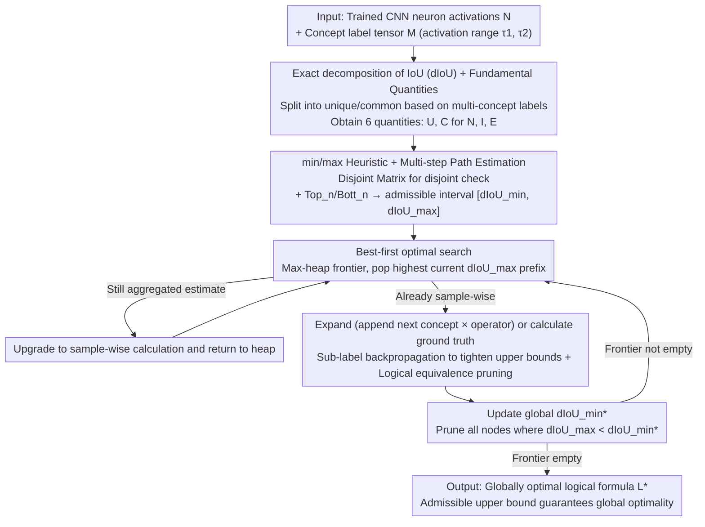

# Guaranteed Optimal Compositional Explanations for Neurons

**Conference**: ICML 2026 Oral  
**arXiv**: [2511.20934](https://arxiv.org/abs/2511.20934)  
**Code**: Provided in the paper ("We release the code at the following repository", see original text for the specific link)  
**Area**: Interpretability / Neuron Explanation / Compositional Explanations  
**Keywords**: Neuron explanation, IoU decomposition, optimal compositional explanations, heuristic search, beam search  

## TL;DR
Compositional explanations typically use beam search to find the "logical formula that best aligns with neuron activations," but beam search lacks optimality guarantees. This paper proposes an exact decomposition of IoU (dIoU) + an admissible heuristic + a best-first optimal algorithm. For the first time, it **guarantees a globally optimal solution** within a runtime comparable to beam search, revealing that 10–40% of explanations in previous literature are actually suboptimal.

## Background & Motivation

**Background**: Compositional explanations (Mu & Andreas 2020) are a class of methods specifically designed to characterize "which spatial concepts a CNN neuron aligns with." The output consists of propositional logic formulas such as `((Cat OR Car) AND White)`, with alignment quality quantified by IoU. This approach reflects the true behavior of "polysemantic neurons" more accurately than early Network Dissection, which only provided a single-concept label, making it a pillar of mechanistic interpretability.

**Limitations of Prior Work**: The full state space size for a concept set $L^1$ and formula length $n$ is $\sum_{k=1}^{n}n_o^{k-1}\prod_{i=0}^{k-1}(|L^1|-i)$. Under the standard settings of Mu & Andreas, this reaches $2.8\times 10^{14}$ operations, making exhaustive enumeration impossible. Previous methods relied on beam search with small widths, adding assumptions such as "distinct concepts" and "layer-wise incremental concatenation." The cost of beam search is a **lack of optimality guarantees**—the returned solution might not be truly optimal, and the gap to the optimum is unknown. This has kept the field in an awkward position for years: explanations look appealing, but it is unclear if they represent "reality" or are simply "what beam search found."

**Key Challenge**: Huge state space making enumeration impossible vs. beam search lacking optimality guarantees → ground truth remains unknown → impossible to judge the approximation quality of existing algorithms or systematically develop better heuristics. Running a direct BFS on medium-to-high complexity datasets would take $\sim 4\times 10^{8}$ hours, which is clearly infeasible.

**Goal**: (i) Define a set of **fundamental quantities** to decompose IoU into terms that can be independently estimated and combined via logical operators; (ii) design an **admissible heuristic** providing a $[dIoU_{\min},dIoU_{\max}]$ interval to prune the state space sufficiently; (iii) construct an optimal algorithm with time complexity in the same order of magnitude as beam search.

**Key Insight**: The authors noticed that compositional explanations only use three 0-preserving operators (OR, AND, AND NOT), and formulas can always be decomposed into "left sub-formula ⊕ right atomic concept" per Assumption 2. This implies that if IoU can be expressed as local terms accumulated along samples $x$—which can be propagated from sub-formula quantities to parent formula quantities—a classic A*-style optimal search can be performed.

**Core Idea**: Rewrite IoU as $dIoU=\frac{\sum_x|I^U(L)_x|+|I^C(L)_x|}{|^1N|+\sum_x|E^U(L)_x|+|E^C(L)_x|}$, where $I^{U/C}$ (unique/common intersection) and $E^{U/C}$ (unique/common extras) are decomposable terms partitioned by "whether a position is labeled by multiple concepts simultaneously." Based on this decomposition, min/max estimates are provided and integrated into a best-first search, implementing the first **optimal** compositional explanation algorithm.

## Method

### Overall Architecture
The method consists of three parts. The first part (Sec. 3.1) defines decomposable quantities: dataset positions $(x,j)$ are divided into **unique** $U$ (exactly one concept) and **common** $C$ ($\ge2$ concepts) based on how many concepts label them. Neuron activations, their intersections with a concept, and the "remaining labeled but not activated" regions are split by $U/C$ to obtain six fundamental quantities: $N^{U},N^{C},I^{U}(k),I^{C}(k),E^{U}(k),E^{C}(k)$. The second part (Sec. 3.2) provides the heuristic: a **Disjoint Matrix** $D$ is used to determine if the labeling on both sides of a sub-formula is disjoint, deriving min/max recurrences for $I^C$ and $E^C$ for OR/AND/AND NOT. Top-$n$/Bottom-$n$ estimates of each concept are used to estimate the "maximum/minimum gain from adding $n$ more concepts." The third part (Sec. 3.3) integrates the heuristic into a best-first search to implement the optimal algorithm.

### Key Designs

**1. Exact decomposition of IoU (dIoU) + Fundamental Quantities: Rewriting global metrics into local terms for prefix pruning**

The original IoU $|^1N\cap{}^1M_L|/|^1N\cup{}^1M_L|$ can only be calculated after the formula is fully assembled, making it impossible to prune uncompleted prefixes. Optimal search, however, requires "estimating an upper bound from a partial formula." The key decomposition in this paper involves splitting positions $(x,j)$ into unique $U$ (exactly one concept) and common $C$ ($\ge 2$ concepts). Neuron activations and their intersections/extras are split into $N^U, N^C, I^U, I^C, E^U, E^C$. For 0-preserving operators (OR, AND, AND NOT), the behavior of unique elements can be exactly derived via truth tables (Observation 1): OR adds uniques, AND clears them, and AND NOT equals the left unique. For common elements, it depends on whether sub-formulas are disjoint—if disjoint, they behave like unique elements; if overlapping, only intervals can be provided. Final equivalence is guaranteed by Lemma 3.6: $dIoU=IoU$ if all operators are 0-preserving. This separation of "exact unique propagation + bounded common elements" is the theoretical cornerstone for the admissible heuristic (upper bound $\ge$ ground truth).

**2. min/max Heuristic + Multi-step Path Estimation: Providing an admissible $[dIoU_{\min},dIoU_{\max}]$ for any prefix**

Classic A* requires an admissible heuristic for optimality; here, $dIoU_{\max}$ must never be lower than the true value. This is calculated in two layers. The first layer is single-step estimation: for a prefix adding concept $k$, the Disjoint Matrix $D$ distinguishes disjoint/overlap, and formulas (7)–(10) calculate min/max for $I^C/E^C$, while unique parts follow Observation 1. The second layer is multi-step path estimation: $\mathrm{Top}_k$ and $\mathrm{Bott}_k$ (sum of top/bottom $k$ concept quantities per sample) are pre-calculated. Formulas (11)–(14) provide $|I_{\min}|, |I_{\max}|, |\mathrm{Union}_{\min}|, |\mathrm{Union}_{\max}|$ for exclusive OR/AND/AND NOT paths. Non-exclusive paths take the max/min of individual paths (retaining admissibility). Finally:

$$dIoU_{\max}=\frac{\sum_x|I_{\max}(L)_x|}{\sum_x|\mathrm{Union}_{\min}(L)_x|}$$

$dIoU_{\min}$ is symmetric. To make the heuristic affordable, the authors use an aggregated version: summing over samples before min/max. This is slightly less precise but much cheaper than sample-wise calculation. Nodes enter the frontier using aggregated estimates and are upgraded to sample-wise only when popped.

**3. Best-first optimal search + Sub-label backpropagation: Compressing "entire space exploration" into a "sparse A* tree"**

The optimal algorithm uses a max-heap frontier. Each pop retrieves the node with the highest $dIoU_{\max}$: if it is an aggregated estimate, its precision is upgraded and it is re-queued; if it is sample-wise, it is either expanded or evaluated for ground truth. Meanwhile, a global $dIoU_{\min}^*$ is maintained to prune nodes where $dIoU_{\max} < dIoU_{\min}^*$. Four tricks make it feasible: initializing the frontier only with seeds where $dIoU_{\max} >$ global lower bound; hierarchical refinement (aggregated → sample-wise → exact); sub-label backpropagation, which stores exact quantities of sub-formulas during path evaluation so other nodes sharing that sub-formula can replace estimates with exact values; and logical equivalence pruning to remove redundant expressions like `A OR A`. Since $dIoU_{\max}$ is an admissible upper bound and the algorithm explores all nodes with bounds higher than the current best lower bound, the returned solution is guaranteed to be globally optimal (Appendix F). This fundamentally fixes the "inability to backtrack" flaw in beam search.

### Loss & Training
No training—this is an analysis/explanation algorithm. Inputs are a trained CNN, a concept label dataset, and neuron activation ranges $[\tau_1, \tau_2]$. Output is the logical formula best aligned with the neuron.

## Key Experimental Results

### Main Results
Feasibility is evaluated across three levels of data complexity, defined by "number of concepts + presence of overlapping labels": Cityscapes (25 concepts, disjoint, low); Ade20K-Detectron2 (847 concepts, no overlap, medium); Broden (1198 concepts, frequent overlap, high). 50 ResNet final layer neurons are sampled per setting, with activation ranges at the top 0.5%.

| Complexity | Algorithm | Visited | Expanded | Estimated | Sec/Unit |
| :--- | :--- | ---: | ---: | ---: | ---: |
| Low (Cityscapes) | Optimal (Ours) | 1 | 101 | 778 | 0.08 |
| Low | Beam (Ours heuristic) | 6 | 14 | 639 | 0.17 |
| Low | MMESH beam | 121 | 15 | 697 | 10.37 |
| Low | Vanilla beam | 716 | 15 | – | 2.77 |
| Medium (Ade20K-D2) | Optimal (Ours) | 1 | 4915 | 106 | 90.57 |
| Medium | Beam (Ours heuristic) | 10 | 15 | 37956 | 11.55 |
| Medium | MMESH beam | 39 | 15 | 37956 | 38.42 |
| Medium | Vanilla beam | 37979 | 15 | – | 450 |
| High (Broden) | Optimal (Ours) | 47 | 105 | 108 | 5768 |
| High | Beam (Ours heuristic) | 27 | 15 | 53752 | 123.33 |
| High | MMESH beam | 43 | 15 | 53752 | 102.35 |
| High | Vanilla beam | 53775 | 15 | – | 5929 |

**Ours (Optimal)** successfully ran on all complexity levels, with runtimes in the same order of magnitude as vanilla beam search (both $\sim$ 5800 s/unit at high complexity). **Beam search guided by our heuristic** visited the fewest nodes and had wall-clock times comparable to or faster than MMESH.

### Ablation Study
**How bad are the solutions found by beam search?**

| Model | Suboptimal Rate | Cat 1 (Diff Concept + IoU) | Cat 2 (Same Concept, Diff Logic) | Cat 3 (Same IoU, Diff Logic) |
| :--- | ---: | ---: | ---: | ---: |
| ResNet | 9% | 76% | 6% | 17% |
| AlexNet | 23% | 93% | 5% | 2% |
| DenseNet | 39% | 73% | 0% | 27% |

At high complexity, 10–40% of beam search explanations deviate from the optimum. Cat 1 (most severe) errors often involve AND / AND NOT, suggesting beam search struggles with complex negations/intersections needed for polysemantic neurons.

### Key Findings
- **Expanded nodes < 0.1% of state space**: The optimal algorithm expands only 105 nodes in Broden (vs. millions in the state space), proving the pruning efficiency of sub-label backpropagation and dual min/max estimates.
- **Aggregated estimation is key to feasibility**: The number of estimated nodes far exceeds expanded nodes (e.g., 37956 vs 4915), showing that many nodes are vetoed by low upper bounds before sample-wise calculation.
- **Ours (Heuristic-beam) is hyperparameter robust**: Run times varied only between 0.19–0.42 min/unit when length increased from 3 to 20; MMESH rose from 0.62 to 25 min/unit.
- **DenseNet has the highest suboptimality (39%)**: Cat 3 (same IoU, different expression) accounts for 27%, indicating dense connections create neurons sensitive to specific logic forms where beam search often gives "pseudoscientific" solutions with high IoU but invalid semantics.

## Highlights & Insights
- **First admissible heuristic**: Previous attempts at optimal search failed due to the lack of affordable admissible bounds. By separating unique and common elements via dIoU, A* becomes usable.
- **MMESH uses spatial info, Ours uses binary**: Thus, our heuristic can generalize to domains without spatial structure (NLP, tabular), whereas MMESH cannot.
- **Revealing beam search flaws**: The example `(ball_pit OR flower) AND NOT dining_room` proves beam search can produce semantically absurd explanations where the IoU is high simply because `dining_room` never co-occurs with the others.

## Limitations & Future Work
- Feasibility depends on having sufficient "unique elements." In NLP datasets where labels significantly overlap, bounds become too loose.
- High complexity runtime (~96 min/unit) allows for reproducible research but not interactive use.
- Frontier size may explode for non-interpretable neurons (IoU < 0.04); a two-stage "beam then optimal" strategy is suggested.
- Validation is limited to CNNs and visual concepts. Transformers and SAE feature explanations remain unexplored.

## Related Work & Insights
- **vs Mu & Andreas 2020 (vanilla beam)**: Uses the same formulas and assumptions but adds the "optimality guarantee." Vanilla beam visits 37979 nodes to match the result that our optimal search finds expanding only 4915.
- **vs MMESH (La Rosa et al., 2023)**: MMESH is the current strongest informed beam using spatial info; our heuristic is binary-only but matches or beats its wall-clock time.
- **vs Network Dissection (Bau et al., 2017)**: This framework can be used to audit whether Network Dissection's single-concept explanations are truly the single-concept optimum.
- **Implications for Mechanistic Interpretability**: Ground truth allows researchers to discuss "approximation ratios" and "suboptimality rates" for neuron explanations as they would in optimization.

## Rating
- Novelty: ⭐⭐⭐⭐⭐ First optimality guarantee in the field; dIoU is a elegant theoretical contribution.
- Experimental Thoroughness: ⭐⭐⭐⭐ Extensive comparison across complexities and backbones; however, limited to vision CNNs.
- Writing Quality: ⭐⭐⭐⭐ Formulas are dense but layered clearly via Definition/Observation/Lemma.
- Value: ⭐⭐⭐⭐⭐ Provides a ground-truth benchmark for the entire compositional explanation direction.

<!-- RELATED:START -->

## Related Papers

- [\[AAAI 2026\] Formal Abductive Latent Explanations for Prototype-Based Networks](../../AAAI2026/others/formal_abductive_latent_explanations_for_prototype-based_networks.md)
- [\[ICML 2026\] Optimal Regularization for Performative Learning](optimal_regularization_for_performative_learning.md)
- [\[ICLR 2026\] Compositional Diffusion with Guided Search for Long-Horizon Planning](../../ICLR2026/others/compositional_diffusion_long_horizon_planning.md)
- [\[CVPR 2026\] SimRecon: SimReady Compositional Scene Reconstruction from Real Videos](../../CVPR2026/others/simrecon_simready_compositional_scene_reconstruction_from_real_videos.md)
- [\[ICCV 2025\] On the Complexity-Faithfulness Trade-off of Gradient-Based Explanations](../../ICCV2025/others/on_the_complexity-faithfulness_trade-off_of_gradient-based_explanations.md)

<!-- RELATED:END -->
