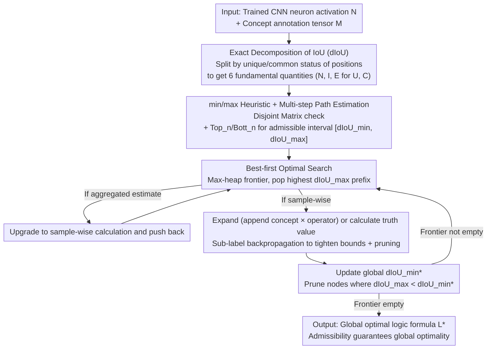

# Guaranteed Optimal Compositional Explanations for Neurons

**Conference**: ICML 2026 Oral  
**arXiv**: [2511.20934](https://arxiv.org/abs/2511.20934)  
**Code**: Provided in the paper ("We release the code at the following repository", see original text for link)  
**Area**: Interpretability / Neuron Explanation / Compositional Explanations  
**Keywords**: Neuron Explanation, IoU Decomposition, Optimal Compositional Explanations, Heuristic Search, Beam Search  

## TL;DR
Compositional explanations typically use beam search to find logical formulas that "best align with neuron activations," but beam search lacks optimality guarantees. This paper proposes an exact decomposition of IoU (dIoU) combined with an admissible heuristic and a best-first optimal algorithm. It **guarantees global optimal solutions for the first time** within runtimes comparable to beam search, revealing that 10–40% of explanations in previous literature are actually suboptimal.

## Background & Motivation

**Background**: Compositional explanations (Mu & Andreas 2020) are a class of methods designed to characterize which spatial concepts a CNN neuron aligns with. The output is a propositional logic formula such as `((Cat OR Car) AND White)`, with alignment quality quantified by Intersection over Union (IoU). This approach better reflects the behavior of "polysemantic neurons" compared to earlier Network Dissection methods that assigned only a single concept label, making it a pillar of mechanistic interpretability.

**Limitations of Prior Work**: The full state space complexity over the candidate concept set $L^1$ and formula length $n$ is $\sum_{k=1}^{n}n_o^{k-1}\prod_{i=0}^{k-1}(|L^1|-i)$. In standard settings by Mu & Andreas, this reaches $2.8\times 10^{14}$ operations, making exhaustive search impossible. Previous approaches relied on small-beam search with additional assumptions like "mutually exclusive concepts" or "layer-wise incremental concatenation." The cost of beam search is a **lack of optimality guarantees**—the returned solution might not be truly optimal, and the gap to the optimum is unknown. This has left the field in an awkward position: explanations look appealing, but it is unclear if they represent "the true behavior" or merely "what beam search found."

**Key Challenge**: Massive state space vs. lack of optimality $\rightarrow$ unknown ground truth $\rightarrow$ inability to judge the approximation quality of existing algorithms or systematically develop better heuristics. Direct Breadth-First Search (BFS) on medium-to-high complexity datasets would take $\sim 4\times 10^{8}$ hours, which is clearly infeasible.

**Goal**: (i) Define a set of **fundamental quantities** to decompose IoU into terms that can be independently estimated and combined via logic operators; (ii) Design an **admissible heuristic** providing a $[dIoU_{\min}, dIoU_{\max}]$ interval to prune the state space efficiently; (iii) Construct an optimal algorithm with time complexity in the same order of magnitude as beam search.

**Key Insight**: The authors noticed that compositional explanations only use three 0-preserving operators (OR, AND, AND NOT), and formulas can always be decomposed into "left sub-formula $\oplus$ right atomic concept." If IoU can be expressed as "local terms accumulated over samples $x$ that can be propagated from sub-formulas to parent formulas," an A*-style optimal search becomes possible.

**Core Idea**: Rewrite IoU as $dIoU=\frac{\sum_x|I^U(L)_x|+|I^C(L)_x|}{|^1N|+\sum_x|E^U(L)_x|+|E^C(L)_x|}$, where $I^{U/C}$ (unique/common intersection) and $E^{U/C}$ (unique/common extras) are decomposable terms partitioned by "whether a location is annotated by multiple concepts simultaneously." Based on this decomposition, min/max estimates are derived and integrated into a best-first search to achieve the first **optimal** compositional explanation algorithm.

## Method

### Overall Architecture
The method consists of three stages. The first part (Sec. 3.1) defines decomposable quantities: dataset positions $(x,j)$ are split into **unique** $U$ (one concept) and **common** $C$ ($\ge 2$ concepts). Six fundamental quantities ($N^U, N^C, I^U, I^C, E^U, E^C$) are derived by splitting neuron activations, intersections, and "labeled but not activated" extras by $U/C$. The second part (Sec. 3.2) provides the heuristic: a **Disjoint Matrix** $D$ determines if sub-formulas are disjoint in annotations. Min/max recursions for $I^C$ and $E^C$ are derived for OR/AND/AND NOT operators, using top-$n$/bottom-$n$ estimates of concept magnitudes to bound the gain of $n$ additional concepts. The third part (Sec. 3.3) plugs these heuristics into a best-first search.

### Key Designs

**1. Exact Decomposition of IoU (dIoU) + Fundamental Quantities: Rewriting global metrics into prunable local terms**
Original IoU $|^1N\cap{}^1M_L|/|^1N\cup{}^1M_L|$ can only be calculated after formula completion, making it impossible to prune prefixes. The key is splitting positions $(x,j)$ into unique $U$ and common $C$, and decomposing activations and intersections accordingly. For 0-preserving operators (OR, AND, AND NOT), unique element behavior is derived from truth tables (Observation 1), while common elements are bounded by checking if sub-formulas are disjoint via $D$. Lemma 3.6 ensures $dIoU=IoU$ for these operators. This separation is the theoretical foundation for an admissible heuristic (upper bound $\ge$ true value).

**2. min/max Heuristic + Multi-step Path Estimation: Providing an admissible $[dIoU_{\min}, dIoU_{\max}]$ for any prefix**
A* requires an admissible heuristic; here $dIoU_{\max}$ must never be lower than the true value. This is calculated in two layers. Layer 1 (single-step): Uses the Disjoint Matrix $D$ to derive bounds for $I^C/E^C$ while unique parts are calculated exactly. Layer 2 (path estimation): Pre-calculates $\mathrm{Top}_k$ and $\mathrm{Bott}_k$ to bound the best/worst possible gain from adding $k$ more concepts. To maintain efficiency, the authors use an **aggregated** version (summing over samples before min/max) for initial sorting and only upgrade to expensive **sample-wise** calculations for promising nodes in the frontier.

**3. Best-first Optimal Search + Sub-label Backpropagation: Compressing the search space into a sparse A* tree**
The algorithm pops the prefix with the highest $dIoU_{\max}$ from a max-heap. Four tricks make it viable: (1) Frontier initialization with nodes above a global lower bound; (2) Stratified refinement (aggregated $\rightarrow$ sample-wise $\rightarrow$ exact); (3) **Sub-label backpropagation**, which stores exact quantities of sub-formulas during path evaluation to tighten bounds of other nodes sharing the same sub-formula; (4) Logic pruning (e.g., removing `A OR A`). Since $dIoU_{\max}$ is admissible, the result is guaranteed optimal. This fixes beam search's inability to backtrack—for example, if a logic constraint is actually redundant, best-first search will eventually prioritize a higher truth value path.

## Key Experimental Results

### Main Results
Evaluation across three complexity levels: Cityscapes (25 concepts, low); Ade20K-Detectron2 (847 concepts, medium); Broden (1198 concepts, high).

| Complexity | Algorithm | Visited | Expanded | Estimated | Sec/Unit |
|:---|:---|---:|---:|---:|---:|
| Low (Cityscapes) | **Optimal (Ours)** | 1 | 101 | 778 | 0.08 |
| Low | Beam (Ours) | 6 | 14 | 639 | 0.17 |
| Low | MMESH beam | 121 | 15 | 697 | 10.37 |
| Mid (Ade20K-D2) | **Optimal (Ours)** | 1 | 4915 | 106 | 90.57 |
| Mid | Beam (Ours) | 10 | 15 | 37956 | 11.55 |
| High (Broden) | **Optimal (Ours)** | 47 | 105 | 108 | 5768 |
| High | Vanilla beam | 53775 | 15 | – | 5929 |

The **Optimal algorithm** completed all complexity levels within runtimes comparable to vanilla beam search, while the heuristic-guided beam search proved faster than previous SOTA (MMESH).

### Ablation Study
**How poor are the solutions found by beam search?**

| Model | Suboptimal Rate | Cat 1 (Diff Concept/IoU) | Cat 2 (Same Concept, Diff Logic) | Cat 3 (Same IoU, Diff Logic) |
|:---|---:|---:|---:|---:|
| ResNet | 9% | 76% | 6% | 17% |
| AlexNet | 23% | 93% | 5% | 2% |
| DenseNet | 39% | 73% | 0% | 27% |

Under high complexity, 10–40% of beam search explanations are suboptimal. Cat 1 errors are most severe, showing beam search struggles with complex negations/intersections needed for polysemantic neurons.

### Key Findings
- **Expanded nodes < 0.1% of state space**: The search efficiency of the A* tree is verified.
- **Aggregated estimation is critical**: Many nodes are rejected via low-cost summation without needing sample-wise precision.
- **Robustness to hyperparameters**: Unlike MMESH, the runtime of the proposed heuristic does not explode as beam size or formula length increases.
- **DenseNet had the highest suboptimality (39%)**: Suggesting neurons in dense connections are more sensitive to specific logical forms that beam search misses.

## Highlights & Insights
- **First Admissible Heuristic**: This work provides a computationally affordable upper bound for compositional search, bridging the gap between theoretical analysis and practical search.
- **No Spatial Dependency**: Unlike MMESH, this method uses only binary activation information, making it applicable to non-spatial domains (NLP, tabular).
- **Exposing Beam Search "Hallucinations"**: The paper demonstrates cases where beam search adds irrelevant constraints (e.g., `AND NOT dining_room` when it never co-occurs with the target) to artificially maintain an IoU that higher truth-value prefixes would have discarded.

## Limitations & Future Work
- **Reliance on Unique Quantities**: In datasets with heavy overlap (like NLP), bounds may become too loose, causing frontier explosion.
- **Computational Cost**: While optimal, high-complexity units can take $\sim$ 96 minutes per unit, which is slow for interactive use.
- **Max Formula Length**: Currently defaults to 3; extremely complex polysemantic neurons might require deeper search where heuristics might degrade toward BFS.

## Related Work & Insights
- **Mu & Andreas (2020)**: This paper uses the same formulation but provides the missing "optimality guarantee."
- **MMESH (La Rosa et al., 2023)**: Proposed heuristic is faster/comparable to MMESH without requiring spatial information.
- **Mechanistic Interpretability**: Providing ground truth allows the field to establish "approximation ratios" and "suboptimality rates" for the first time, similar to the maturity of optimization fields.

## Rating
- Novelty: ⭐⭐⭐⭐⭐ 1st optimality guarantee for compositional explanations.
- Experimental Thoroughness: ⭐⭐⭐⭐ Broad backbone coverage; high complexity testing.
- Writing Quality: ⭐⭐⭐⭐ Clear structured definitions and lemmas.
- Value: ⭐⭐⭐⭐⭐ Established a ground-truth benchmark for the field.

<!-- RELATED:START -->
<!-- Paper: Compositional Explanations of Neurons (Mu et al. 2020) -->
<!-- Paper: MMESH: Multi-modal Explanation Search (La Rosa et al. 2023) -->
<!-- RELATED:END -->

## Related Papers

- [\[AAAI 2026\] Formal Abductive Latent Explanations for Prototype-Based Networks](../../AAAI2026/others/formal_abductive_latent_explanations_for_prototype-based_networks.md)
- [\[ICLR 2026\] Compositional Diffusion with Guided Search for Long-Horizon Planning](../../ICLR2026/others/compositional_diffusion_long_horizon_planning.md)
- [\[ICML 2026\] Optimal Regularization for Performative Learning](optimal_regularization_for_performative_learning.md)
- [\[ICCV 2025\] On the Complexity-Faithfulness Trade-off of Gradient-Based Explanations](../../ICCV2025/others/on_the_complexity-faithfulness_trade-off_of_gradient-based_explanations.md)
- [\[ACL 2025\] Neuron Empirical Gradient: Discovering and Quantifying Neurons' Global Linear Controllability](../../ACL2025/others/neuron_empirical_gradient_discovering_and_quantifying_neurons_global_linear_cont.md)

<!-- RELATED:END -->
