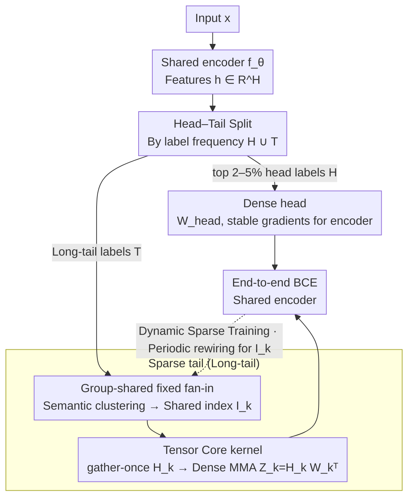

# HASTE: Hardware-Aware Dynamic Sparse Training for Large Output Spaces

**Conference**: ICML 2026  
**arXiv**: [2606.01117](https://arxiv.org/abs/2606.01117)  
**Code**: https://github.com/xmc-aalto/haste  
**Area**: Model Compression / Extreme Multi-label Classification / Hardware-Aware Sparse Training  
**Keywords**: Extreme Multi-label Classification (XMC), fixed fan-in sparsity, group sharing, Tensor Core, long-tail head-tail split  

## TL;DR
For Extreme Multi-label Classification (XMC) with millions of labels, HASTE replaces "independent per-label fan-in sampling" with "semantic group-shared fan-in," combined with a compact dense head for high-frequency labels. This enables sparse training to achieve wall-clock gains matching its theoretical FLOPs on GPUs, with up to $4.4\times$ forward and $25\times$ backward speedup compared to existing sparse baselines, while closing the accuracy gap with dense models.

## Background & Motivation

**Background**: The bottleneck in Extreme Multi-label Classification (XMC) lies in the output layer—when the number of labels $L \sim 10^{6}$, the weight matrix $W \in \mathbb{R}^{L \times H}$ is extremely demanding in both memory and computation. Over the past decade, two main approaches have emerged: one uses label trees or nearest neighbor sampling (e.g., LightXML, CascadeXML, Renee series) to compress **computation** without reducing **VRAM**; the other directly sparsifies the output layer (e.g., Spartex), compressing both computation and VRAM.

**Limitations of Prior Work**: Direct sparsification seems elegant but is inefficient on GPUs. Unstructured sparsity is often a counter-optimization on modern Tensor Cores—memory access is random and non-coalesced, and Tensor Cores cannot be utilized. Consequently, even with a 90% reduction in FLOPs, wall-clock time remains unchanged. Recent "semi-structured fixed fan-in" approaches (Spartex) assign a fixed $F$ input connections per label to ensure load balancing. However, since the fan-in indices for each label are **sampled independently and randomly**, adjacent labels read completely different features, leading to poor cache hits and memory bandwidth bottlenecks.

**Key Challenge**: To achieve wall-clock speedup, sparsity must satisfy both **regular memory access patterns** (for coalescing) and **feature reuse across outputs** (to tile $H_k$ into shared memory for repeated use). While block-sparsity (BLOCK-SPARSE) maximizes these, it severely limits expressivity—forcing all labels in a block to use the same contiguous features, resulting in a 5–10% drop in accuracy. Furthermore, sparse connections for long-tail labels provide weak gradient signals to the encoder, forcing Spartex to use an auxiliary loss that introduces hyperparameter tuning burdens.

**Goal**: (i) Find an intermediate structure between "independent per-label fan-in" and "full block-sparsity" to achieve both memory regularity and expressivity; (ii) Provide stable gradients for the encoder under long-tail distributions in a data-driven way rather than via auxiliary supervision.

**Key Insight**: XMC labels naturally cluster by semantics—in Amazon product recommendations, "wireless headphones" and "Bluetooth speakers" naturally utilize similar feature subsets. Therefore, letting **semantically similar labels share the same set of fan-in indices** aligns with the task structure and amortizes the cost of "reading the same features" across a group of labels.

**Core Idea**: Replace label-level fan-in with **group-shared fixed fan-in sparsity**, splitting the output layer into a "small dense head for high-frequency labels + a massive group-shared sparse tail for long-tail labels." This structure is implemented with Tensor Core-optimized CUDA kernels to achieve real-world wall-clock acceleration.

## Method

### Overall Architecture
Input: Sample $x$ passes through a shared encoder to get $h = f_\theta(x) \in \mathbb{R}^H$. The output layer is explicitly split into two branches:

- **Dense head**: Top 2–5% high-frequency labels $\mathcal{H}$, passing through a lightweight projection $h_{\text{head}} = P_{\text{head}}h$ followed by dense weights $W_{\text{head}}$.
- **Sparse tail**: Remaining $\mathcal{T}$ long-tail labels, passing through $h_{\text{tail}} = P_{\text{tail}}h$ followed by a group-shared fixed fan-in sparse layer.

The logit for label $\ell \in \mathcal{G}_k$ is $z_\ell(x) = \langle w_\ell, h_{\mathcal{I}_{g(\ell)}} \rangle$, where $w_\ell \in \mathbb{R}^F$ is the label-specific weight and $\mathcal{I}_{g(\ell)} \subseteq [H]$ is the **shared fan-in index set** for its group ($|\mathcal{I}_k| = F$). Training uses BCE, alternating between a "continuous phase (parameter fitting, frozen indices)" and a "discrete phase (rewiring, periodic re-selection of $\mathcal{I}_k$ via dynamic sparse training protocols)."

### Key Designs

**1. Group-shared fixed fan-in sparsity: Solving index memory, memory reuse, and task priors simultaneously by sharing indices among semantically similar labels.**

The pain point of Spartex's "independent random sampling" is that adjacent labels read different features, ruining cache hits. This method partitions labels $\{1, \dots, L\}$ into $K$ groups $\{\mathcal{G}_k\}$ of size $G$, where all labels in a group share the same fan-in index set $\mathcal{I}_k$ (while keeping independent weights $w_\ell$). Index storage is reduced from $LF$ to $(L/G)F$. Partitioning is done via semantic clustering: $\{\mathcal{G}_k\} = \arg\max_{\text{partition}} \sum_k \sum_{\ell \in \mathcal{G}_k} \mathrm{sim}(e_\ell, \mu(\mathcal{G}_k))$. Label embeddings $e_\ell$ are directly computed as the mean of encoder representations for positive samples of that label, avoiding the need for a pre-trained dense classifier. For millions of labels, a two-stage approximation is used: mini-batch spherical $k$-means to form $C \approx L/(\beta G)$ coarse clusters, followed by greedy seed-based local clustering within each group.

**2. Tensor Core-optimized gather-once + dense MMA kernel: Transforming group-shared structure into dense GEMMs for real-world acceleration.**

Since unstructured sparsity fails on Tensor Cores, a specialized kernel is required. Each thread block takes a multiple of $G$ in the label dimension to form a tile. Forward computation becomes $Z_k = H_k W_k^\top \in \mathbb{R}^{B_t \times G}$, where $H_k = h_{:, \mathcal{I}_k} \in \mathbb{R}^{B_t \times F}$ is the feature tile gathered once into shared memory per group, and $W_k \in \mathbb{R}^{G \times F}$ contains weights for all labels in the group. This is a **dense** GEMM that utilizes Tensor Core MMA primitives, with $H_k$ reused by all warps in the group. The backward pass for weights $\nabla W_k = (\nabla Z_k)^\top H_k$ is similarly a dense GEMM. For feature gradients, multiple groups might overlap on $\mathcal{I}_k$; HASTE uses Split-$K$ parallelization along the label dimension, with group size $G$ controlling the reduction parallelism.

**3. Head–Tail split instead of auxiliary supervision: Using head labels as a dense head to provide stable gradients, utilizing data distribution instead of hyperparameter-sensitive loss.**

Whereas Spartex uses an auxiliary loss to provide gradient paths for the encoder, which can conflict with the main task and is sensitive to weights/temperatures, HASTE splits the label set $\mathcal{Y} = \mathcal{H} \cup \mathcal{T}$. $\mathcal{H}$ (top 2–5% frequency) goes to a dense head, and $\mathcal{T}$ (long-tail) goes to the sparse tail. The end-to-end objective is $\min_\Theta \frac{1}{n} \sum_i [\sum_{\ell \in \mathcal{H}} \mathrm{BCE} + \sum_{\ell \in \mathcal{T}} \mathrm{BCE}]$. Head labels are activated in almost every batch, providing a stable dense gradient flow to the encoder. Once the encoder is well-trained by the head, the tail labels only require local fine-tuning. This achieves the same goal as auxiliary loss but through "architectural inductive bias" using the existing data structure, introducing only one hyperparameter (split frequency).

### Loss & Training
End-to-end BCE with BF16 precision. Encoder uses Adam, while the output layer uses SGD with momentum. Dynamic sparse training follows the RigL approach, with periodic rewiring to update group-level indices $\mathcal{I}_k$ while maintaining $|\mathcal{I}_k| = F$.

## Key Experimental Results

### Main Results
Four XMC datasets with labels ranging from 670K to 8.6M.

| Dataset | Metric | Dense | Spartex (sparse SOTA) | block sparse | HASTE | VRAM (GiB) |
|--------|------|-------|----------------------|--------------|-------|------------|
| Amazon-670K | P@1 | 50.6 | 47.1 | 45.0 | **48.1** | 2.1 (vs Spartex 3.7) |
| AmazonTitles-670K | P@1 | 43.7 | 42.6 | 39.4 | **43.0** | 3.2 (vs Spartex 5.0) |
| Amazon-3M | P@1 | 52.6 | 50.2 | 27.9 | **52.5** | 5.67 (vs Spartex 13.5) |
| LF-Paper2Keywords-8.6M | P@1 | 43.6 | 40.7 | 22.8 | **47.5** | 12.5 (vs Spartex 18.4) |

HASTE **consistently outperforms Spartex** across all datasets while or utilizing 1.5–2.5x less VRAM. Training time per epoch dropped from 86:38 to 21:39 on Amazon-3M. On the largest dataset, LF-Paper2Keywords-8.6M, HASTE's P@1 even **surpassed dense** by 3.9 points.

### Ablation Study
| Configuration | P@1 (Amazon-670K) | Description |
|------|-------------------|------|
| HASTE (Full) | 48.1 | Semantic grouping + HT split |
| Random grouping | 46.3 | Semantic grouping Gain: +1.8 |
| Frequency grouping | 46.7 | Inferior to semantic grouping |
| No Head–Tail split | 46.8 | HT Split Gain: +1.3 |
| Group size $G=16$ | 48.1 | Best expressivity |
| Group size $G=64$ | 47.5 | Fastest kernel but lowest accuracy |

### Key Findings
- **Kernel-level micro-benchmarks are the main selling point**: Speedups of up to $4.4\times$ (forward) and $25\times$ (backward) over standard fixed fan-in, with speed comparable to a FLOPs-matched dense model. This is the first time "sparse FLOPs" truly translate to "sparse wall-clock speed."
- **Semantic grouping outperforms frequency grouping** (+1.4 P@1), supporting the inductive bias hypothesis that task-aligned feature sharing is beneficial.
- **Improved PSP@k (tail-heavy metrics)**: On Amazon-3M, PSP@1 rose from 14.3 (Spartex) to 15.9. This suggests the head-tail split benefits tail labels by improving the shared encoder through the head branch.
- **Group size $G$ is a classic trade-off**: Larger $G$ increases speed (more reuse) but slightly decreases accuracy. $G=16\sim 32$ was found to be the sweet spot.

## Highlights & Insights
- **Simultaneous Alignment of Inductive Bias and Hardware**: Usually, being "GPU-friendly" and "task-friendly" are at odds. Here, "semantically similar labels sharing features" fits the task structure and provides the regular memory access required by Tensor Cores.
- **Replacing Auxiliary Loss with Data Structure**: Using a dense head to stabilize gradients is an architectural inductive bias that can be applied to other long-tail tasks like segmentation or retrieval.
- **Honest Evaluation Benchmarks**: The authors report "wall-clock time + VRAM" instead of just FLOPs and compare against FLOPs-matched dense models, which is rare in sparse literature.

## Limitations & Future Work
- Evaluation is limited to single A100 GPUs; interaction between group-shared fan-in and multi-GPU communication (NCCL) remains unexplored.
- Grouping requires an initial encoder representation $e_\ell$. While the authors use pre-trained BERT, bootstrapping a new encoder from scratch is not discussed.
- Optimal group size $G$ likely varies by GPU architecture; automated $G$ searching or integration with N:M sparsity is a future direction.
- Combination with FP8/INT4 quantization (complementary to ELMO) is a logical next step.

## Related Work & Insights
- **vs. Spartex**: HASTE is the evolution of Spartex, replacing independent per-label fan-in with group sharing and replacing auxiliary loss with head-tail splitting, solving the memory wall and supervision sensitivity.
- **vs. BLOCK-SPARSE**: Block-sparse is fast but too rigid (Amazon-3M P@1 27.9 vs. HASTE 52.5). HASTE finds a middle ground with "group-shared but arbitrary indices."
- **vs. ELMO (FP8 Quantization)**: Orthogonal. ELMO reduces precision while HASTE reduces connectivity. HASTE's results on LF-8.6M suggest that "cutting connections" is more effective than "cutting precision" at extreme scales.
- **vs. RigL / Dynamic Sparsity**: HASTE scales the mask granularity from per-weight to per-group, successfully aligning dynamic sparse training with system-level tiling.

## Rating
- Novelty: ⭐⭐⭐⭐ 
- Experimental Thoroughness: ⭐⭐⭐⭐⭐ 
- Writing Quality: ⭐⭐⭐⭐ 
- Value: ⭐⭐⭐⭐⭐ 

<!-- RELATED:START -->

<!-- Related papers would go here -->

<!-- RELATED:END -->

## Related Papers

- [\[ICML 2026\] AMDP: Asynchronous Multi-Directional Pipeline Parallelism for Large-Scale Models Training](amdp_asynchronous_multi-directional_pipeline_parallelism_for_large-scale_models_.md)
- [\[ACL 2025\] HATA: Trainable and Hardware-Efficient Hash-Aware Top-k Attention for Scalable Large Model Inference](../../ACL2025/others/hata_trainable_and_hardware-efficient_hash-aware_top-k_attention_for_scalable_la.md)
- [\[CVPR 2025\] Subnet-Aware Dynamic Supernet Training for Neural Architecture Search](../../CVPR2025/others/subnet-aware_dynamic_supernet_training_for_neural_architecture_search.md)
- [\[ICML 2026\] Decision Tree Learning on Product Spaces](decision_tree_learning_on_product_spaces.md)
- [\[CVPR 2025\] ZO-SAM: Zero-Order Sharpness-Aware Minimization for Efficient Sparse Training](../../CVPR2025/others/zo-sam_zero-order_sharpness-aware_minimization_for_efficient_sparse_training.md)

<!-- RELATED:END -->
