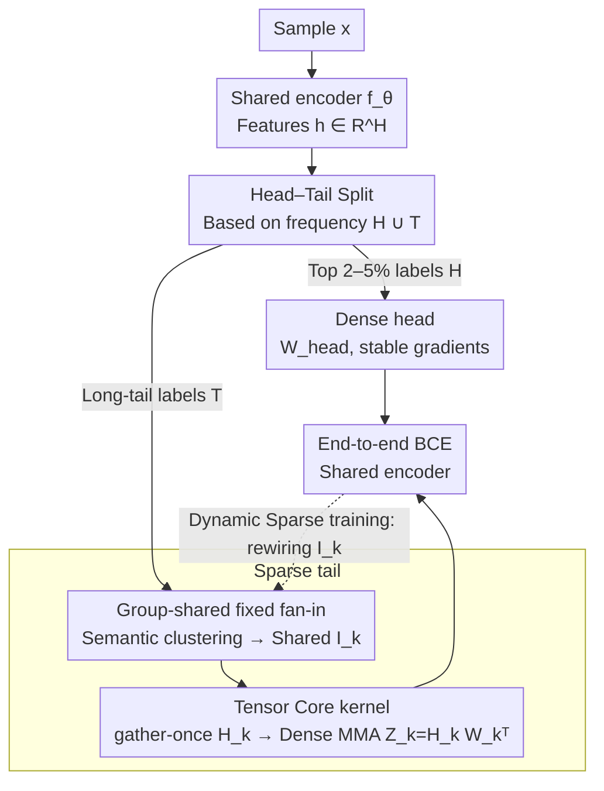

# HASTE: Hardware-Aware Dynamic Sparse Training for Large Output Spaces

**Conference**: ICML 2026  
**arXiv**: [2606.01117](https://arxiv.org/abs/2606.01117)  
**Code**: https://github.com/xmc-aalto/haste  
**Area**: Model Compression / Extreme Multi-label Classification / Hardware-Aware Sparse Training  
**Keywords**: Extreme Multi-label Classification, Fixed fan-in Sparsity, Group Sharing, Tensor Core, Long-tail Head-Tail Splitting  

## TL;DR
For Extreme Multi-label Classification (XMC) with millions of labels, HASTE replaces "per-label independent fan-in sampling" with "semantically grouped shared fan-in." Combined with a small dense head for high-frequency labels, this allows sparse training to achieve wall-clock gains matching its theoretical FLOPs on GPUs—reaching up to $4.4\times$ forward and $25\times$ backward speedups over existing sparse baselines while almost closing the accuracy gap with dense models.

## Background & Motivation

**Background**: The primary bottleneck in Extreme Multi-label Classification (XMC) lies in the output layer—when the number of labels $L\sim 10^{6}$, the weight matrix $W\in\mathbb{R}^{L\times H}$ is extremely demanding in terms of both memory and computation. Research over the past decade has split into two main paths: one relies on label trees or nearest neighbor sampling (LightXML, CascadeXML, Renee series) to reduce **computation** while leaving **VRAM** untouched; the other sparsifies the output layer directly (e.g., Spartex) to compress both.

**Limitations of Prior Work**: Direct sparsification seems elegant but is inefficient on GPUs. Unstructured sparsity acts as a "de-optimization" on modern Tensor Cores due to random memory access and lack of coalescing, meaning a 90% reduction in FLOPs often results in zero wall-clock improvement. Recent "semi-structured fixed fan-in" approaches (Spartex) assign a fixed $F$ input connections per label to balance load; however, the fan-in indices for each label are sampled **independently and randomly**. Consequently, adjacent labels access entirely different features, leading to poor cache hits and memory bandwidth bottlenecks.

**Key Challenge**: To achieve wall-clock benefits, sparsity must satisfy both **regular memory access patterns** (for coalescing) and **feature reuse across outputs** (to tile the same $H_k$ into shared memory for repeated use). Block sparsity (BLOCK-SPARSE) maximizes these but severely reduces representational capacity—forcing all labels in a block to use the same contiguous feature subset, which drops accuracy by 5–10 points. Furthermore, gradient signals from sparse connections to the encoder are inherently thin for long-tail labels, forcing Spartex to use an auxiliary loss that introduces new hyperparameter tuning burdens.

**Goal**: (i) Identify an intermediate structure between "independent per-label fan-in" and "full block sparsity" that achieves both memory regularity and expressivity. (ii) Provide stable gradients to the encoder under long-tail distributions using a data-driven approach rather than auxiliary supervision.

**Key Insight**: XMC label semantics are naturally clustered—in Amazon recommendations, "wireless headphones" and "Bluetooth speakers" naturally utilize similar feature subsets. Therefore, letting **semantically similar labels share the same set of fan-in indices** matches the task structure and amortizes the cost of loading features across a group of labels.

**Core Idea**: Replace label-level fan-in with **group-shared fixed fan-in sparsity**. The output layer is split into a "small dense head for high-frequency labels + a massive group-shared sparse tail for the long tail." A specialized CUDA kernel optimized for Tensor Cores is implemented to translate this structure into actual wall-clock acceleration.

## Method

### Overall Architecture
Input: Sample $x$ is processed by a shared encoder to get $h=f_\theta(x)\in\mathbb{R}^H$. The output layer is explicitly split into two branches:

- **Dense head**: Top 2–5% high-frequency labels $\mathcal{H}$, using a lightweight projection $h_{\text{head}}=P_{\text{head}}h$ followed by dense weights $W_{\text{head}}$.
- **Sparse tail**: Remaining $\mathcal{T}$ long-tail labels, using $h_{\text{tail}}=P_{\text{tail}}h$ followed by a group-shared fixed fan-in sparse layer.

The logit for label $\ell\in\mathcal{G}_k$ is $z_\ell(x)=\langle w_\ell,\,h_{\mathcal{I}_{g(\ell)}}\rangle$, where $w_\ell\in\mathbb{R}^F$ is the label-specific weight and $\mathcal{I}_{g(\ell)}\subseteq[H]$ is the **shared fan-in index set** for its group ($|\mathcal{I}_k|=F$). Training uses BCE, alternating between a "continuous phase (parameter fitting, frozen indices)" and a "discrete phase (rewiring, periodically reselecting $\mathcal{I}_k$ via dynamic sparse training protocols)."

### Key Designs

**1. Group-Shared Fixed Fan-in Sparsity: Aligning semantics with hardware**

Independent random sampling in Spartex causes adjacent labels to read disparate features. This work partitions labels $\{1,\dots,L\}$ into $K$ groups $\{\mathcal{G}_k\}$ of size $G$. All labels in a group share the same fan-in index set $\mathcal{I}_k$ (while maintaining unique weights $w_\ell$). Index storage is reduced from $LF$ to $(L/G)F$. Groups are formed by semantic clustering: $\{\mathcal{G}_k\}=\arg\max_{\text{partition}}\sum_k\sum_{\ell\in\mathcal{G}_k}\mathrm{sim}(e_\ell,\mu(\mathcal{G}_k))$, where label embeddings $e_\ell$ are the normalized average of encoder representations for positive samples. This reduces index memory by $G\times$, enables feature tile reuse, and introduces a task-aligned inductive bias.

**2. Tensor Core Gather-Once + Dense MMA Kernel**

To translate the structure into speed, the kernel uses thread blocks that tile the label dimension in multiples of $G$. The forward pass computes $Z_k=H_k W_k^\top\in\mathbb{R}^ {B_t\times G}$, where $H_k=h_{:,\mathcal{I}_k}\in\mathbb{R}^{B_t\times F}$ is the feature tile gathered once into shared memory, and $W_k\in \mathbb{R}^{G\times F}$ contains weights for the group. This is a **dense** GEMM that hits Tensor Core MMA primitives. The backward pass for weights $\nabla W_k=(\nabla Z_k)^\top H_k$ is similarly a dense GEMM. For feature gradients, a Split-$K$ approach is used to parallelize the reduction across labels.

**3. Head–Tail Splitting instead of Auxiliary Supervision**

To address the gradient sparsity issue in the long tail, the label set is cut into $\mathcal{Y}=\mathcal{H}\cup\mathcal{T}$. $\mathcal{H}$ (top 2–5%) uses a dense head to provide stable, dense gradient flow to the encoder in every batch. The sparse tail handles the remaining labels. This utilizes the data's inherent long-tail structure instead of hyperparameter-sensitive auxiliary losses. Encoder training is "saturated" by the dense head, allowing the long-tail sparse classifiers to fine-tune effectively even with thin gradients.

## Key Experimental Results

### Main Results
Evaluation on four XMC datasets (670K to 8.6M labels).

| Dataset | Metric | Dense | Spartex (sparse SOTA) | block sparse | HASTE | VRAM (GiB) |
|--------|------|-------|----------------------|--------------|-------|------------|
| Amazon-670K | P@1 | 50.6 | 47.1 | 45.0 | **48.1** | 2.1 (vs Spartex 3.7) |
| AmazonTitles-670K | P@1 | 43.7 | 42.6 | 39.4 | **43.0** | 3.2 (vs Spartex 5.0) |
| Amazon-3M | P@1 | 52.6 | 50.2 | 27.9 | **52.5** | 5.67 (vs Spartex 13.5) |
| LF-Paper2Keywords-8.6M | P@1 | 43.6 | 40.7 | 22.8 | **47.5** | 12.5 (vs Spartex 18.4) |

HASTE **consistently outperforms Spartex** with 1.5–2.5$\times$ less VRAM. Epoch time on Amazon-3M dropped from 86:38 to 21:39. On the largest dataset, HASTE **outperformed the dense model** by 3.9 points on P@1.

### Ablation Study

| Configuration | P@1 (Amazon-670K) | Note |
|------|-------------------|------|
| HASTE (Full) | 48.1 | Semantic grouping + HT split |
| Random grouping | 46.3 | Semantic grouping Gain: +1.8 |
| Frequency grouping | 46.7 | Worse than semantic |
| No Head–Tail split | 46.8 | HT Gain: +1.3 P@1 |
| Group size $G=16$ | 48.1 | Best expressivity |
| Group size $G=64$ | 47.5 | Fastest kernel, lowest accuracy |

### Key Findings
- **Kernel-level efficiency**: Speedups of up to $4.4\times$ (forward) and $25\times$ (backward) over standard fixed fan-in baselines. "Sparse FLOPs" finally translate to "Sparse wall-clock."
- **Semantic grouping matters**: Superior to frequency-based or random grouping (+1.4 P@1), confirming the inductive bias of sharing fan-in indices based on task structure.
- **Improved Tail Performance**: PSP@1 (propensity-scored precision) on Amazon-3M rose from 14.3 (Spartex) to 15.9, indicating that stable encoder gradients from the dense head benefit the long-tail classification.
- **Group Size $G$ Trade-off**: Larger $G$ increases kernel speed (more reuse) but slightly decreases precision; $G=16\sim 32$ is identified as the sweet spot.

## Highlights & Insights
- **Alignment of Inductive Bias and Hardware**: Usually, being "GPU-friendly" and "Task-friendly" involves a trade-off. Here, semantic sharing fits the task structure and provides the regular memory access required by Tensor Cores.
- **Structural Replacement for Auxiliary Loss**: Using the data's long-tail distribution (Head-Tail split) to stabilize training is more robust and less sensitive to hyperparameters than synthetic auxiliary tasks.
- **Honest Benchmarking**: The paper reports actual wall-clock time and VRAM instead of just FLOPs, comparing against FLOPs-matched dense bottlenecks.

## Limitations & Future Work
- Evaluation is limited to single A100 GPUs; interaction between group-shared fan-in and multi-GPU communication (e.g., NCCL all-reduce) requires further study.
- Grouping depends on pre-computed encoder representations. While BERT was used here, bootstrapping new encoders from scratch is less clear.
- $G$ is a manual hyperparameter coupled with hardware tile sizes; automated tuning or integration with N:M sparsity is a future path.

## Related Work & Insights
- **vs Spartex**: HASTE removes the "memory wall" caused by per-label random gathering and replaces auxiliary loss with the HT split.
- **vs BLOCK-SPARSE**: HASTE offers more flexibility ("group-shared but indices can be any") than rigid block sparsity, avoiding the massive accuracy drop (52.5 vs 27.9 on Amazon-3M).
- **vs ELMO (FP8 Quantization)**: Orthogonal. HASTE reduces connection density while ELMO reduces numerical precision. They could be combined for further gains.
- **vs RigL**: HASTE scales dynamic sparse training by moving from per-weight masks to per-group masks, aligning mask updates with kernel design.

## Rating
- Novelty: ⭐⭐⭐⭐ 
- Experimental Thoroughness: ⭐⭐⭐⭐⭐ 
- Writing Quality: ⭐⭐⭐⭐ 
- Value: ⭐⭐⭐⭐⭐ 

<!-- RELATED:START -->

## Related Papers

- [\[ICML 2026\] AMDP: Asynchronous Multi-Directional Pipeline Parallelism for Large-Scale Models Training](amdp_asynchronous_multi-directional_pipeline_parallelism_for_large-scale_models_.md)
- [\[ACL 2025\] HATA: Trainable and Hardware-Efficient Hash-Aware Top-k Attention for Scalable Large Model Inference](../../ACL2025/others/hata_trainable_and_hardware-efficient_hash-aware_top-k_attention_for_scalable_la.md)
- [\[CVPR 2025\] Subnet-Aware Dynamic Supernet Training for Neural Architecture Search](../../CVPR2025/others/subnet-aware_dynamic_supernet_training_for_neural_architecture_search.md)
- [\[ICML 2026\] Decision Tree Learning on Product Spaces](decision_tree_learning_on_product_spaces.md)
- [\[CVPR 2025\] ZO-SAM: Zero-Order Sharpness-Aware Minimization for Efficient Sparse Training](../../CVPR2025/others/zo-sam_zero-order_sharpness-aware_minimization_for_efficient_sparse_training.md)

<!-- RELATED:END -->
