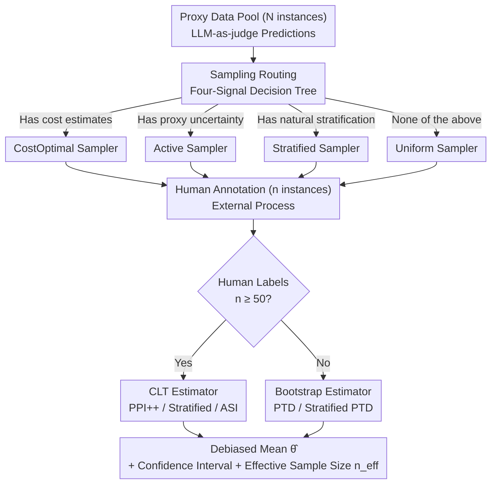

# Industrializing Prediction-Powered Inference: The GLIDE Library for Reliable GenAI and Agentic Systems Evaluation

**Conference**: ICML2026  
**arXiv**: [2605.31278](https://arxiv.org/abs/2605.31278)  
**Code**: https://github.com/EmertonData/glide  
**Area**: LLM Evaluation / Statistical Inference / Agentic Systems  
**Keywords**: Prediction-Powered Inference, LLM-as-Judge, Stratified Sampling, Active Sampling, Effective Sample Size  

## TL;DR
GLIDE unifies the latest estimators (PPI++, Stratified PPI, PTD, ASI) and samplers (uniform, stratified, active, cost-optimal) from the PPI (prediction-powered inference) family into a scipy-style mean estimation library. It specifically addresses the hybrid evaluation challenge of "expensive human annotation + cheap but biased LLM-as-judge," accompanied by Monte Carlo validation and a decision tree to enable industrialized, reliable assessment of GenAI and Agentic systems.

## Background & Motivation

**Background**: Evaluating the "quality" of GenAI or Agentic systems typically boils down to a mean estimation task—accuracy, relevance rate, hallucination rate, toxicity rate, and tool-use success rate are all $\theta^\star=\mathbb{E}[Y]$. Currently, two mainstream approaches have flaws: (i) full human annotation, which is reliable but slow and expensive (expert review of an agentic trajectory—including retrieval, tool calls, reasoning, and final response—can cost several dollars); (ii) LLM-as-judge, which is cheap (cents per instance) but prone to systematic bias, especially in knowledge-intensive domains like medicine, law, and finance.

**Limitations of Prior Work**: The PPI framework proposed by Angelopoulos et al. (2023) was originally designed for this "small gold standard + large proxy prediction" scenario—providing unbiased estimates and nominal coverage confidence intervals. However, (i) extensions of PPI (PPI++, Stratified, PTD, ASI, cost-optimal) are scattered across various papers with inconsistent notation and fragmented reference implementations; (ii) the existing `ppi_py` library is an early foundational implementation of PPI that covers GLM/M-estimators but lacks depth for specialized mean estimation and integration of new methods; (iii) Agentic evaluation possesses four unique attributes (extreme cost asymmetry, natural stratification, available proxy uncertainty, and critical deployment scenarios) that perfectly match PPI branches, yet no library connects them end-to-end.

**Key Challenge**: In actual deployment, engineers need a path that provides unbiased estimation, valid confidence intervals, and maximizes annotation budget savings, with an automated way to select methods based on specific conditions (e.g., availability of cost estimates, proxy uncertainty, or natural stratification). The fragmentation of academic implementations makes this engineering-wise infeasible.

**Goal**: Industrialize the progress of the PPI family from the past three years into a single scipy-style library, covering (1) unified estimator encapsulation; (2) unified sampler encapsulation; (3) a reproducible Monte Carlo validation suite; (4) an empirically calibrated decision tree for method selection; and (5) real-world agentic benchmark cases.

**Key Insight**: The authors intentionally focus **only on mean estimation**—the form taken by 90% of deployment-side evaluation metrics. Removing the generality of GLM/M-estimators significantly simplifies the codebase. Multiple estimators that diverge in general M-estimation collapse into the same form for mean estimation, improving API consistency. Simultaneously, "sampling / annotation / estimation" are explicitly divided into three stages, allowing samplers and estimators to be swapped and combined independently.

**Core Idea**: Use the PPI++ style of "small human annotation + large LLM-as-judge prediction → unbiased mean + valid confidence interval" as the core, with stratified/active/cost-optimal methods as orthogonal plugins. It emphasizes an engineering slogan: "A better proxy does not replace human annotation but amplifies the human annotation budget."

## Method

### Overall Architecture
GLIDE divides the evaluation pipeline into three steps: **Sampling → Annotation → Estimation**. Given a pool of $N$ proxy-labeled data points (from LLM-as-judge), (1) a sampler selects $n$ instances for human annotation; (2) the annotation step is business-specific and external to the library; (3) an estimator merges $n$ human gold labels with $N$ proxy predictions to produce a debiased estimate $\hat\theta$ and a confidence interval. This sampler ↔ estimator decoupling allows for flexible mix-and-match, and new method contributors only need to implement a single file.

The core formula of PPI (PPI++, Angelopoulos 2023b):
$$\hat\theta^{\text{PPI++}}_\lambda = \frac{1}{n}\sum_{i=1}^n Y_i + \lambda\left(\frac{1}{N}\sum_{j=1}^N f(X_j) - \frac{1}{n}\sum_{i=1}^n f(X_i)\right)$$

Where $f$ is the proxy (LLM-as-judge), and $\lambda\in\mathbb{R}$ is the power-tuning parameter. $\lambda^\star$ has a closed-form solution to minimize asymptotic variance, ensuring that PPI++ is asymptotically **never worse** than classical estimators using only human labels, even if the proxy is adversarial. The library structure can be viewed as "a decision tree selecting methods at the sampling and estimation ends, with a business-managed annotation step in between":

### Key Designs

**1. Three-step decoupling + scipy-style API: Making sampling and estimation pluggable orthogonal objects**

Recent improvements in PPI literature over the last three years address different segments—some modify sampling, others modify estimation—but they are scattered across papers, making them difficult to combine. GLIDE splits the pipeline into Sampling → Annotation → Estimation, making both ends independently replaceable. Samplers expose a `sample` method returning $(\pi, \xi)$, where $\pi\in[0,1]^N$ is the sampling probability for each observation and $\xi\in\{0,1\}^N$ is the actual inclusion indicator. Estimators are stateful objects where `estimate` returns a dataclass containing the point estimate, confidence interval, effective sample size $n_{\text{eff}}$, and metric labels. Consequently, an end-to-end flow (sampling + annotation + estimation) can be executed in just 6 lines of Python. Adopting the scipy/scikit-learn paradigms minimizes the learning curve, while the decoupling allows independent improvements in sampling and estimation to overlap seamlessly.

**2. 5 Sampler Categories × 5 Estimator Categories: Mapping Agentic evaluation attributes to a method menu**

Agentic evaluation has four unique attributes—extreme cost asymmetry, natural stratification, available proxy uncertainty, and critical deployment scenarios—each corresponding to a branch of PPI. GLIDE presents these as a continuous "If X, then use Y" menu. Samplers include: `UniformSampler` (baseline), `StratifiedSampler` (supporting proportional or Neyman allocation $n_h\propto N_h\sigma_h$, using Hamilton’s method for integer constraints), `ActiveSampler` (independent Bernoulli sampling proportional to proxy uncertainty), and `CostOptimalSampler` variants. Estimators include: `PPIMeanEstimator` (PPI++ + power tuning), `StratifiedPPIMeanEstimator`, `PTDMeanEstimator` (Predict-Then-Debias, bootstrap-based for small $n<50$), `StratifiedPTDMeanEstimator`, and `ASIMeanEstimator` (IPW debiasing with active sampling), alongside 3 classical baselines. This prevents practitioners from having to cross-reference multiple papers and repositories.

**3. Four-signal decision tree: Helping engineers select the right combination in 30 seconds**

Simplifying selection is crucial for industrialization. GLIDE embeds method selection into a decision tree. The first half (sampling) routes based on three boolean signals: cost estimates available → CostOptimal; proxy uncertainty available → ActiveSampler; natural stratification with heterogeneous proxies → StratifiedSampler; else → UniformSampler. The second half (estimation) uses a single threshold: if human labels $n \ge 50$ (per stratum), use CLT-based estimators (PPI++ / Stratified PPI++ / ASI); otherwise, use bootstrap-based PTD variants. This tree is empirically calibrated using the Monte Carlo validation suite in Section 5, downgrading method selection from a research problem to a table lookup.

### Loss & Training
This work does not involve training but focuses on statistical inference. All estimators return a `PredictionPoweredMeanInferenceResult`. The Key Performance Indicator (KPI) is the effective sample size $n_{\text{eff}}=n\cdot\widehat{\text{Var}}(\bar Y_n)/\widehat{\text{Var}}(\hat\theta^{\text{PPI++}}_\lambda)$. The ratio $n_{\text{eff}}/n \ge 1$ translates directly into "saved annotation hours."

## Key Experimental Results

### Main Results
**Monte Carlo Validation**: Synthetic binary classification task, true value $\theta^\star=0.55$, proxy mean $0.50$ (biased), controlled by Pearson correlation $\rho$ for proxy quality. $N_{\text{true}}=500$, $N_{\text{proxy}}=1000$, 90% confidence level, 1000 repetitions, $\rho\in\{0.1, 0.2, \dots, 0.9\}$.

| Correlation $\rho$ | Method | Empirical Coverage | Interval Width | $n_{\text{eff}}$ |
|-------------|------|-----------|----------|------------------------------|
| 0.1 | Labeled-only | 0.90 | 0.073 | 500 |
| 0.1 | PTD | 0.90 | 0.072 | ≈ 500 |
| 0.5 | Labeled-only | 0.90 | 0.073 | 500 |
| 0.5 | PTD | 0.90 | 0.060 | ≈ 750 |
| 0.9 | Labeled-only | 0.90 | 0.073 | 500 |
| 0.9 | **PTD** | **0.90** | **0.049** | **≈ 1100 (2.2×)** |

PTD matches the 90% nominal coverage across all $\rho$; better proxies result in narrower intervals and larger $n_{\text{eff}}$. If the proxy is uninformative, PTD automatically collapses to the labeled-only width, never performing worse.

**Agentic Case: R-Judge Safety Evaluation**: 568 user/agent dialogues across 5 domains (general, programming, finance, web, IoT), true value $\theta^\star\approx 0.525$. Proxy uses `claude-sonnet-4.5` as LLM-as-judge with 1–10 verbalized confidence; overall proxy mean ≈0.655 (+13 pp bias), $\rho\approx 0.59$. Budget $n=100$ human labels, $N=468$ proxy labels, 1000 repetitions.

| Protocol | 90% Coverage | Interval Width | $n_{\text{eff}}$ |
|------|-----------|----------|------------------|
| Labeled-only ($n=100$) | 0.90 | 0.164 | 100 |
| Proxy-only (No debiasing) | <0.05 | 0.066 | — |
| PPI++ (uniform) | 0.90 | 0.137 | ≈ 143 |
| ASI (active) | 0.90 | 0.135 | ≈ 148 |
| **Stratified PPI++ (Neyman)** | **0.90** | **0.131** | **≈ 157 (1.57×)** |

### Ablation Study

| Configuration | Empirical Coverage (90%) | Avg Interval Width | Description |
|------|------------------|--------------|------|
| Full: PPI++ + power tuning | 0.90 | 0.137 | Default recommended combination |
| w/o power tuning ($\lambda=1$) | 0.90 | 0.142 | Slightly wider, but maintains coverage |
| w/o stratification | 0.90 | 0.137 | Reverts to standard PPI++, loses stratification gain |
| w/o active sampling (using uniform) | 0.90 | 0.137 | Same as PPI++ |
| Poor Proxy ($\rho=0.1$ simulation) | 0.90 | 0.072 ≈ baseline | Proxy degrades; interval widens; coverage holds |
| Proxy-only (No human labels) | < 0.05 | 0.066 | Narrow but centered incorrectly; coverage fails |

### Key Findings
- **Robustness of "Coverage Never Fails"**: All 4 protocols with human labels adhere to nominal coverage across all $\rho$ and confidence levels. Only the "proxy-only" baseline fails spectacularly, confirming that PPI’s "unconditional-on-proxy" theoretical guarantee holds in real LLM-as-judge scenarios.
- **Stratification > Active** (on R-Judge): In this benchmark, stratification (by the 5 application domains) slightly outperformed active sampling based on proxy uncertainty, while being more engineer-friendly as it doesn't require uncertainty signals.
- **Monotonic Function of Proxy Quality ↔ $n_{\text{eff}}$**: Improving $\rho$ from 0.1 to 0.9 increased $n_{\text{eff}}$ from ≈500 to ≈1100 (while holding human $n=500$ constant), translating "better LLM-as-judge" directly into a 2.2× budget multiplier.
- **PTD is Essential for Small Samples**: CLT-based estimators underestimate interval width when $n \lesssim 50$ per stratum; the bootstrap-based PTD version is the stable engineering fallback.

## Highlights & Insights
- **Decoupling is the Scalable Library Design**: Sampler and estimator contributors can work independently, allowing external academic work to be absorbed continuously—a victory for software engineering in statistics.
- **"Better proxies amplify, not replace"**: Quantifying the return on investment for LLM-as-judge as an $n_{\text{eff}}/n$ ratio provides "hard numbers" for product decisions on whether to upgrade judges.
- **Embedded Decision Tree**: Encapsulating statistical expertise into the API entry point by downgrading "which estimator to choose" to a table lookup is a model for other statistical inference libraries.
- **Strategic Focus on Mean Estimation**: Sacrificing the generality of GLMs or quantiles allows for deeper mean estimation implementation and consistent APIs; given that 90% of industry metrics are means, this is the correct trade-off.

## Limitations & Future Work
- **Inference only for Means**: Scenarios involving quantiles (e.g., P95 latency, toxicity in worst-case scenarios) or regression coefficients still require `ppi_py`.
- **Sample Size Constraints**: CLT-based estimators require $n \ge 50$ per stratum; validation for ultra-small samples ($n < 20$) lacks rigorous upper bounds.
- **Identity Assumptions**: Currently assumes single proxy and i.i.d. data; does not yet support multi-proxy aggregation, covariate/label shift, or anytime-valid (streaming) monitoring.
- **Annotation Process Excluded**: In vertical domains, the annotation pipeline itself is the hardest and most expensive part; GLIDE assumes this capability already exists.
- **Non-deterministic Evaluation**: Agentic systems vary across runs; how to allocate budget between "input coverage" and "output replication" remains an open question.
- **Multi-annotator Truth**: When experts disagree, the target isn't the population mean but the latent label mean with annotation uncertainty; the framework needs extension here.

## Related Work & Insights
- **vs `ppi_py` (Angelopoulos et al. 2023a)**: The foundational library. GLIDE is a "production-enhanced" version for mean estimation, providing newer methods and validation suites. They are complementary.
- **vs HELM / DeepEval / RAGAS**: These act as upstream orchestrators that run evaluations and produce proxies/labels; GLIDE is the downstream statistical layer that converts their output into debiased estimates with coverage guarantees.
- **vs Egami et al. 2023 (design-based supervised learning)**: Similar concepts in social sciences; GLIDE systemizes this for ML engineering.
- **vs Csillag et al. 2025 (PPI e-values)**: Provides a path for anytime-valid PPI for streaming monitoring in the GLIDE roadmap.
- **vs Cowen-Breen et al. 2026 / Shan et al. 2025 (multi-proxy aggregation)**: Multi-judge aggregation is the top priority for the GLIDE roadmap.

## Rating
- Novelty: ⭐⭐⭐ (Technically a synthesis of existing methods, but high engineering value in **industrialization + decision tree design**)
- Experimental Thoroughness: ⭐⭐⭐⭐ (Comprehensive Monte Carlo coverage and real agentic case studies)
- Writing Quality: ⭐⭐⭐⭐⭐ (Framework and decision tree explained with exceptional clarity)
- Value: ⭐⭐⭐⭐⭐ (Directly addresses the industry pain point of Agentic/GenAI evaluation; likely to gain rapid adoption)

## Related Papers
- [\[ICML 2025\] Prediction-Powered Adaptive Shrinkage Estimation](../../ICML2025/others/prediction-powered_adaptive_shrinkage_estimation.md)
- [\[ACL 2025\] Identifying Reliable Evaluation Metrics for Scientific Text Revision](../../ACL2025/others/reliable_eval_metrics_scientific.md)
- [\[NeurIPS 2025\] Prediction-Powered Semi-Supervised Learning with Online Power Tuning](../../NeurIPS2025/others/prediction-powered_semi-supervised_learning_with_online_power_tuning.md)
- [\[ICML 2026\] Inference of Online Newton Methods with Nesterov's Accelerated Sketching](inference_of_online_newton_methods_with_nesterovs_accelerated_sketching.md)
- [\[ACL 2025\] SEOE: A Scalable and Reliable Semantic Evaluation Framework for Open Domain Event Detection](../../ACL2025/others/seoe_semantic_eval.md)

## Related Papers

- [\[ICML 2025\] Prediction-Powered Adaptive Shrinkage Estimation](../../ICML2025/others/prediction-powered_adaptive_shrinkage_estimation.md)
- [\[ACL 2025\] SEOE: A Scalable and Reliable Semantic Evaluation Framework for Open Domain Event Detection](../../ACL2025/others/seoe_semantic_eval.md)
- [\[AAAI 2026\] MicroEvoEval: A Systematic Evaluation Framework for Image-Based Microstructure Evolution Prediction](../../AAAI2026/others/microevoeval_a_systematic_evaluation_framework_for_image-based_microstructure_ev.md)
- [\[ICML 2026\] Inference of Online Newton Methods with Nesterov's Accelerated Sketching](inference_of_online_newton_methods_with_nesterovs_accelerated_sketching.md)
- [\[ICML 2026\] Beyond Model Readiness: Institutional Readiness for AI Deployment in Public Systems](beyond_model_readiness_institutional_readiness_for_ai_deployment_in_public_syste.md)

<!-- RELATED:END -->

<!-- RELATED:START -->

## Related Papers

- [\[ICML 2025\] Prediction-Powered Adaptive Shrinkage Estimation](../../ICML2025/others/prediction-powered_adaptive_shrinkage_estimation.md)
- [\[ACL 2025\] SEOE: A Scalable and Reliable Semantic Evaluation Framework for Open Domain Event Detection](../../ACL2025/others/seoe_semantic_eval.md)
- [\[AAAI 2026\] MicroEvoEval: A Systematic Evaluation Framework for Image-Based Microstructure Evolution Prediction](../../AAAI2026/others/microevoeval_a_systematic_evaluation_framework_for_image-based_microstructure_ev.md)
- [\[ICML 2026\] Beyond Model Readiness: Institutional Readiness for AI Deployment in Public Systems](beyond_model_readiness_institutional_readiness_for_ai_deployment_in_public_syste.md)
- [\[ICML 2026\] Inference of Online Newton Methods with Nesterov's Accelerated Sketching](inference_of_online_newton_methods_with_nesterovs_accelerated_sketching.md)

<!-- RELATED:END -->
