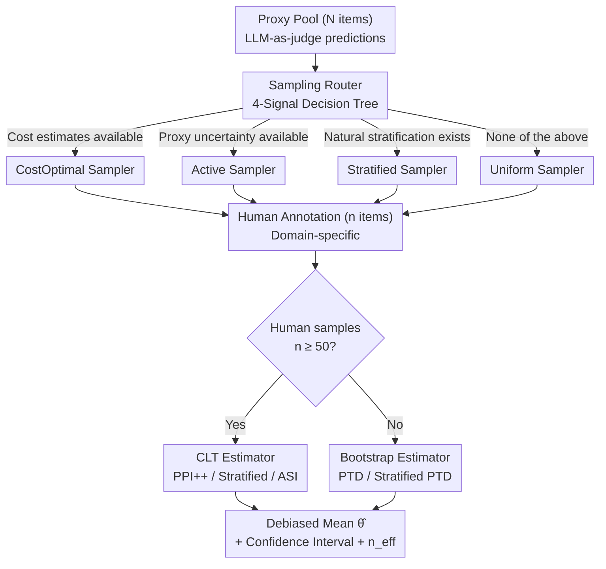

# Industrializing Prediction-Powered Inference: The GLIDE Library for Reliable GenAI and Agentic Systems Evaluation

**Conference**: ICML2026  
**arXiv**: [2605.31278](https://arxiv.org/abs/2605.31278)  
**Code**: https://github.com/EmertonData/glide  
**Area**: LLM Evaluation / Statistical Inference / Agentic Systems  
**Keywords**: Prediction-Powered Inference, LLM-as-Judge, Stratified Sampling, Active Sampling, Effective Sample Size  

## TL;DR
GLIDE unifies the latest estimators (PPI++, Stratified PPI, PTD, ASI) and samplers (uniform, stratified, active, cost-optimal) from the PPI (prediction-powered inference) family into a scipy-style mean estimation library. It is designed to solve the hybrid evaluation problem of "expensive human annotation + cheap but biased LLM-as-judge," providing Monte Carlo validation and a decision tree to enable industrial-grade reliable assessment for GenAI and Agentic systems.

## Background & Motivation

**Background**: Evaluating the "quality" of GenAI/Agentic systems often reduces to a mean estimation task—accurate rate, relevance rate, hallucination rate, toxicity rate, or tool-use success rate are all $\theta^\star=\mathbb{E}[Y]$. Current mainstream practices have distinct flaws: (i) full human annotation is reliable but expensive and slow; analyzing one agentic trajectory (including retrieval, tool calls, reasoning, and final response) can cost experts several dollars; (ii) LLM-as-judge is inexpensive (cents per item) but suffers from systematic bias, particularly in knowledge-intensive domains like medicine, law, and finance.

**Limitations of Prior Work**: The PPI framework proposed by Angelopoulos et al. (2023) was originally designed for this "small ground truth + large proxy predictions" scenario—providing unbiased estimates and nominal confidence intervals. However: (i) extensions of PPI (PPI++, Stratified, PTD, ASI, cost-optimal) are scattered across various papers with inconsistent notation and fragmented reference implementations; (ii) the existing `ppi_py` library represents early implementations, covering GLM/M-estimators but lacking depth in mean estimation or integration of newer methods; (iii) Agentic evaluation possesses four unique attributes (extreme cost asymmetry, natural stratification, available proxy uncertainty, and critical deployment scenarios) that align perfectly with PPI branches, yet no library connects them end-to-end.

**Key Challenge**: In production, engineers need a path that provides unbiased estimation, valid confidence intervals, and minimized annotation budgets, while automatically selecting methods based on specific conditions (availability of cost estimates, proxy uncertainty, natural stratification, or budget constraints). The fragmentation of academic implementations makes this industrially unfeasible.

**Goal**: Industrialize the progress of the PPI family from the last three years into a single scipy-style library, covering: (1) unified estimator encapsulation; (2) unified sampler encapsulation; (3) a reproducible Monte Carlo validation suite; (4) an empirically calibrated decision tree for method selection; and (5) real-world agentic benchmark cases.

**Key Insight**: Ours focuses exclusively on **mean estimation**—the form taken by 90% of deployment-side evaluation metrics. Removing the generality of GLM/M-estimation significantly simplifies the codebase. Several estimators that diverge in general M-estimation collapse into the same form for mean estimation, improving API consistency. Simultaneously, "sampling, annotation, and estimation" are explicitly separated into three stages, allowing independent substitution and combination of samplers and estimators.

**Core Idea**: Use PPI++ style "small human annotation + large LLM-as-judge predictions → unbiased mean + valid confidence intervals" as the core. Integrate stratified, active, and cost-optimal components as orthogonal plugins, emphasizing the engineering slogan: "A better proxy does not replace human annotation; it amplifies the human annotation budget."

## Method

### Overall Architecture
GLIDE divides the evaluation pipeline into three steps: **Sampling → Annotation → Estimation**. Given a pool of $N$ proxy-labeled data points (from LLM-as-judge): (1) a sampler selects $n$ items for human annotation; (2) the annotation step is domain-specific and handled externally; (3) an estimator merges $n$ human ground truths with $N$ proxy predictions to produce a debiased estimate $\hat\theta$ and a confidence interval. This sampler-estimator decoupling allows for arbitrary mix-and-match and simplifies the contribution of new methods.

The core formula for PPI (PPI++, Angelopoulos 2023b) is:
$$\hat\theta^{\text{PPI++}}_\lambda = \frac{1}{n}\sum_{i=1}^n Y_i + \lambda\left(\frac{1}{N}\sum_{j=1}^N f(X_j) - \frac{1}{n}\sum_{i=1}^n f(X_i)\right)$$

Where $f$ is the proxy (LLM-as-judge) and $\lambda\in\mathbb{R}$ is the power-tuning parameter. The optimal $\lambda^\star$ has a closed-form solution that minimizes asymptotic variance, ensuring that PPI++ is asymptotically **never worse** than a classical estimator using only human labels, even if the proxy is adversarial. The library structure employs a decision tree to select methods for both sampling and estimation:

### Key Designs

**1. Three-step Decoupling + Scipy-style API: Plug-and-Play Orthogonal Objects**
Recent improvements in PPI literature often address only one segment—either sampling or estimation—but remain scattered in separate papers. GLIDE segments the pipeline into Sampling → Annotation → Estimation. Samplers expose a `sample` method returning $(\pi,\xi)$, where $\pi\in[0,1]^N$ is the sampling probability for each observation and $\xi\in\{0,1\}^N$ is the inclusion indicator. Estimators are stateful objects where `estimate` returns a dataclass containing point estimates, confidence intervals, effective sample size $n_{\text{eff}}$, and metric labels. This allows researchers to contribute new methods by writing a single file.

**2. 5 Samplers × 5 Estimators: Mapping Agentic Evaluation Properties**
Agentic evaluation has unique properties addressed by specific PPI branches. Samplers include: `UniformSampler`, `StratifiedSampler` (supporting proportional or Neyman allocation $n_h\propto N_h\sigma_h$), `ActiveSampler` (Bernoulli sampling proportional to proxy uncertainty), and `CostOptimalSampler` (optimal probability based on proxy/annotation cost ratios). Estimators include: `PPIMeanEstimator` (PPI++ with power tuning), `StratifiedPPIMeanEstimator`, `PTDMeanEstimator` (Predict-Then-Debias using bootstrap for $n<50$), and `ASIMeanEstimator` (IPW debiasing for active sampling).

**3. Four-Signal Decision Tree: Automated Method Selection**
GLIDE embeds method selection into a decision tree for engineers unfamiliar with statistical details. The sampling branch routes based on: availability of cost estimates → CostOptimal; proxy uncertainty → ActiveSampler; heterogeneous-proxy stratification → StratifiedSampler. The estimation branch depends on a threshold: if human samples $n \ge 50$ (per stratum), CLT-based estimators are used; otherwise, bootstrap-based PTD variants are selected. This tree is empirically calibrated using the Monte Carlo validation suite in Section 5.

## Key Experimental Results

### Main Results
**Monte Carlo Validation**: A synthetic binary classification task with $\theta^\star=0.55$ and a biased proxy mean of $0.50$. Proxy quality is controlled by Pearson correlation $\rho$. $N_{\text{true}}=500, N_{\text{proxy}}=1000$, confidence level 90%, 1000 iterations.

| Correlation $\rho$ | Method | Empirical Coverage | Interval Width | Effective Sample Size $n_{\text{eff}}$ |
|-------------|------|-----------|----------|------------------------------|
| 0.1 | Labeled-only | 0.90 | 0.073 | 500 |
| 0.1 | PTD | 0.90 | 0.072 | ≈ 500 |
| 0.5 | Labeled-only | 0.90 | 0.073 | 500 |
| 0.5 | PTD | 0.90 | 0.060 | ≈ 750 |
| 0.9 | Labeled-only | 0.90 | 0.073 | 500 |
| 0.9 | **PTD** | **0.90** | **0.049** | **≈ 1100 (2.2×)** |

PTD maintains 90% nominal coverage across all $\rho$. Better proxies lead to narrower intervals and higher $n_{\text{eff}}$.

**Agentic Case: R-Judge Safety Evaluation**: 568 user/agent dialogues across 5 domains. $\theta^\star\approx 0.525$. Claude-3-sonnet acts as the judge with 1–10 verbalized confidence. Proxy mean $\approx 0.655$ (bias +13 pp), $\rho\approx 0.59$. Budget $n=100, N=468$.

| Protocol | 90% Coverage | Interval Width | $n_{\text{eff}}$ |
|------|-----------|----------|------------------|
| Labeled-only ($n=100$) | 0.90 | 0.164 | 100 |
| Proxy-only (No debiasing) | <0.05 | 0.066 | — |
| PPI++ (Uniform) | 0.90 | 0.137 | ≈ 143 |
| ASI (Active) | 0.90 | 0.135 | ≈ 148 |
| **Stratified PPI++ (Neyman)** | **0.90** | **0.131** | **≈ 157 (1.57×)** |

### Ablation Study

| Configuration | Empirical Coverage (90%) | Mean Interval Width | Description |
|------|------------------|--------------|------|
| Full: PPI++ + power tuning | 0.90 | 0.137 | Default recommended combination |
| w/o power tuning ($\lambda=1$) | 0.90 | 0.142 | Slightly wider, maintains coverage |
| w/o stratification | 0.90 | 0.137 | Reverts to standard PPI++ |
| w/o active sampling | 0.90 | 0.137 | Same as PPI++ |
| Low Proxy Quality ($\rho=0.1$) | 0.90 | 0.072 ≈ baseline | Intervals widen automatically |
| Proxy-only (No human labels) | < 0.05 | 0.066 | Narrow but biased; coverage fails |

### Key Findings
- **Robust "Never-Broken" Coverage**: All protocols using human labels maintain nominal coverage across all $\rho$. Only the "proxy-only" baseline fails, validating PPI's theoretical guarantees in real LLM-as-judge scenarios.
- **Stratification > Active (on R-Judge)**: Stratifying by application domain outperformed active sampling based on proxy uncertainty on this benchmark and is more engineer-friendly as it doesn't require uncertainty signals.
- **Proxy Quality ↔ $n_{\text{eff}}$ Monotonicity**: Increasing $\rho$ from 0.1 to 0.9 increases $n_{\text{eff}}$ from 500 to 1100, directly translating better judges into amplified budgets.
- **PTD for Small Samples**: CLT-based estimators require $n \gtrsim 50$ per stratum; otherwise, they underestimate width. Bootstrap-based PTD is the reliable engineering fallback.

## Highlights & Insights
- **Three-Stage Decoupling**: Designing the library around Sampling/Annotation/Estimation allows contributors to work on independent segments, which is a significant win for software engineering scalability.
- **Amplifying Human Budget**: Quantifying the return on LLM-as-judge investments through the $n_{\text{eff}}/n$ ratio provides "hard numbers" for product decisions.
- **Embedded Decision Tree**: Lowering the barrier to entry by turning a research question into a look-up table is an excellent model for statistical software design.
- **Mean Estimation Focus**: Trading generality for depth in mean estimation ensures consistency for 90% of real-world deployment metrics.

## Limitations & Future Work
- **Mean Estimation Only**: Scenarios involving quantiles (e.g., P95 latency) or GLM coefficients still require `ppi_py`.
- **Sample Size Constraints**: $n < 50$ requires bootstrap PTD; validity for extremely small samples ($n < 20$) lacks strict upper bounds.
- **i.i.d. Assumption**: Currently lacks support for multiple proxy aggregation, covariate/label shift, or anytime-valid streaming monitoring.
- **Non-deterministic Evaluations**: For agentic systems where one input has multiple outputs, budget allocation between "input coverage" and "output replication" remains an open question.
- **Multi-annotator Truth**: The framework needs extension for cases where multiple experts disagree, moving from population mean to latent label means.

## Related Work & Insights
- **vs. `ppi_py`**: GLIDE provides recent methods (Stratified, PTD, ASI) and a systematic validation suite specifically for mean estimation in LLM contexts.
- **vs. Eval Harnesses (HELM, RAGAS)**: These are upstream orchestrators that produce proxies and ground truths; GLIDE is the downstream statistical layer providing debiased estimates with coverage guarantees.
- **vs. Csillag et al. 2025 (PPI e-values)**: Provides potential for anytime-valid streaming in future iterations.

## Rating
- Novelty: ⭐⭐⭐ High engineering value in industrialization and decision-tree design rather than new theoretical methods.
- Experimental Thoroughness: ⭐⭐⭐⭐ Detailed Monte Carlo validation and real-world agentic case study.
- Writing Quality: ⭐⭐⭐⭐⭐ Clear segmentation of the framework; effective explanation of statistical concepts for engineering contexts.
- Value: ⭐⭐⭐⭐⭐ Addresses a critical pain point in Agentic/GenAI evaluation with an out-of-the-box solution.

## Related Papers

- [\[ICML 2025\] Prediction-Powered Adaptive Shrinkage Estimation](../../ICML2025/others/prediction-powered_adaptive_shrinkage_estimation.md)
- [\[ACL 2025\] SEOE: A Scalable and Reliable Semantic Evaluation Framework for Open Domain Event Detection](../../ACL2025/others/seoe_semantic_eval.md)
- [\[AAAI 2026\] MicroEvoEval: A Systematic Evaluation Framework for Image-Based Microstructure Evolution Prediction](../../AAAI2026/others/microevoeval_a_systematic_evaluation_framework_for_image-based_microstructure_ev.md)
- [\[ICML 2026\] Inference of Online Newton Methods with Nesterov's Accelerated Sketching](inference_of_online_newton_methods_with_nesterovs_accelerated_sketching.md)
- [\[ICML 2026\] Beyond Model Readiness: Institutional Readiness for AI Deployment in Public Systems](beyond_model_readiness_institutional_readiness_for_ai_deployment_in_public_syste.md)

<!-- RELATED:END -->

<!-- RELATED:START -->

## Related Papers

- [\[ICML 2026\] Inference of Online Newton Methods with Nesterov's Accelerated Sketching](inference_of_online_newton_methods_with_nesterovs_accelerated_sketching.md)
- [\[ICML 2026\] Beyond Model Readiness: Institutional Readiness for AI Deployment in Public Systems](beyond_model_readiness_institutional_readiness_for_ai_deployment_in_public_syste.md)
- [\[ICML 2026\] Decoupled Conformal Optimisation: Efficient Prediction Sets via Independent Tuning and Calibration](decoupled_conformal_optimisation_efficient_prediction_sets_via_independent_tunin.md)
- [\[ICML 2026\] Mapping Human Anti-collusion Mechanisms to Multi-agent AI Systems](mapping_human_anti-collusion_mechanisms_to_multi-agent_ai_systems.md)
- [\[AAAI 2026\] MicroEvoEval: A Systematic Evaluation Framework for Image-Based Microstructure Evolution Prediction](../../AAAI2026/others/microevoeval_a_systematic_evaluation_framework_for_image-based_microstructure_ev.md)

<!-- RELATED:END -->
