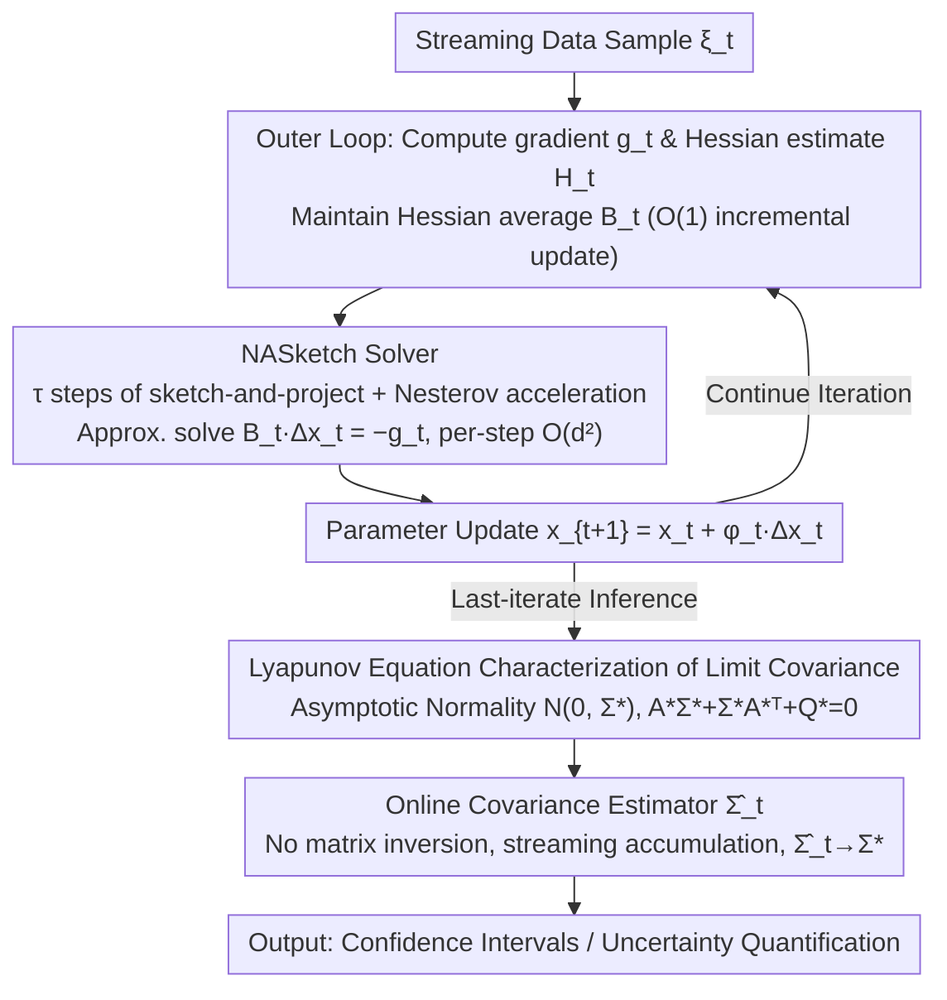

# Inference of Online Newton Methods with Nesterov's Accelerated Sketching

**Conference**: ICML2026  
**arXiv**: [2604.23436](https://arxiv.org/abs/2604.23436)  
**Code**: Not yet public  
**Area**: Optimization / Online Learning / Statistical Inference  
**Keywords**: Online Newton Method, Nesterov's Accelerated Sketching, Uncertainty Quantification, Covariance Estimation, Lyapunov Equation  

## TL;DR
This paper equips the online Newton method with a Nesterov-accelerated sketch-and-project solver, reducing the per-step cost to $O(d^2)$. It characterizes the asymptotic normality of the last iterate under the dual uncertainty of "data randomness + solver randomness" for the first time. Along with a streaming covariance estimator that requires no matrix inversion, it makes online Newton with accelerated sketching truly viable for statistical inference.

## Background & Motivation

**Background**: Parameter estimation and uncertainty quantification (confidence intervals) for streaming data typically follow two paths. First, SGD + Polyak-Ruppert averaging: iterations are cheap, but maintaining the covariance matrix online for confidence intervals requires $O(d^2)$ memory/time, and it is highly sensitive to the condition number and noise heteroscedasticity (prior work observed significant under-coverage for SGD when $d=20$). Second, second-order/online Newton methods: curvature information makes estimates statistically superior and robust to ill-conditioning, but solving the Newton system is $O(d^3)$, making it impractical for high-dimensional online settings.

**Limitations of Prior Work**: Recently, Na & Mahoney (2025) and Kuang et al. (2025) used **unaccelerated sketch-and-project solvers** to reduce the Newton step to $O(d^2)$ and derived the last-iterate asymptotic normality and streaming covariance estimation, which consistently outperforms SGD. However, sketch-and-project solvers themselves have Nesterov-accelerated versions (Gower et al. 2018, Derezi'nski et al. 2025): while the error of the unaccelerated version decays at $1-\mu_t$, the accelerated version decays at $1-\sqrt{\mu_t/\nu_t}$. **Computationally, it is strictly faster without increasing per-iteration costs.**

**Key Challenge**: Accelerated sketching speeds up "computation," but what does it change in statistical inference? Does acceleration increase the asymptotic covariance of the last iterate, thereby offsetting the computational gains? None of the existing online Newton inference analyses cover accelerated sketching.

**Goal**: Embed Nesterov-accelerated sketching into the online Newton method and provide a three-part framework: (i) global almost sure convergence, (ii) asymptotic normality of the last iterate with an analytical characterization of the limit covariance, and (iii) a fully online, consistent covariance estimator that requires no matrix inversion.

**Key Insight**: Accelerated sketching upgrades the solver from a $d$-dimensional recursion of symmetric projection matrices to a **stochastic, time-varying, non-symmetric $2d$-dimensional state-co-state recursion**. This prevents the direct reuse of the symmetric projection geometry in Kuang et al. (2025). The authors employ the Cayley–Hamilton theorem, similarity matrix theory, and Kronecker products to derive the spectral radius recursion, study the contraction of the $(1,1)+(1,2)$ blocks, and address new difficulties such as the "conditional deterministic randomness of acceleration parameters $(\alpha_t, \beta_t, \gamma_t)$" and "fourth-moment bounds."

**Core Idea**: Approximate the Newton system solution using sketch-and-project with Nesterov acceleration and incorporate the solver's randomness into the limit covariance of the Lyapunov equation. This provides the first analytical characterization of the "computation vs. statistics" tradeoff—showing that accelerated sketching does not destroy asymptotic normality but adds a correction term determined by the sketching distribution to the covariance.

## Method

### Overall Architecture
Consider the stochastic optimization problem $\min_{x\in\mathbb{R}^d} f(x)=\mathbb{E}_{\xi\sim P}[F(x;\xi)]$. The online Newton iteration is $x_{t+1}=x_t+\varphi_t\Delta x_t$, where $\Delta x_t$ should solve $B_t\Delta x_t = -g_t$. The overall pipeline consists of three steps:

1. **Outer Loop**: Obtain sample $\xi_t$, calculate gradient $g_t=\nabla F(x_t;\xi_t)$ and Hessian estimate $H_t=\nabla^2 F(x_t;\xi_t)$. Maintain the Hessian average $B_t=(1-1/t)B_{t-1}+H_{t-1}/t$ ($O(1)$ incremental update).
2. **Inner Loop**: Invoke the NASketch solver to run $\tau$ steps of sketch-and-project + Nesterov acceleration to output an approximate solution for $\Delta x_t$. Each step only involves $O(d s)$ sketching projections, totaling $O(d^2)$.
3. **Inference**: After obtaining the last iterate $x_t$, use a **fully online** consistent estimator $\widehat{\Sigma}_t$ to estimate the limit covariance $\Sigma^\star$ and construct confidence intervals.

The Hessian averaging in the outer loop follows standard practices for stochastic Newton methods. The three core contributions reside in the inner solver (NASketch) and the inference step:

### Key Designs

**1. Sketch-and-Project Solver with Nesterov Acceleration (NASketch): Efficiently solving Newton systems within $O(d^2)$ cost**

Solving the Newton system $B\Delta x=-g$ directly is $O(d^3)$, which is too slow. NASketch maintains a state-co-state pair $(z_j, v_j)$: it first computes the sketching direction $\omega_j = BS_j(S_j^\top B^2 S_j)^\dagger S_j^\top(B y_j + g)$ at the midpoint $y_j=\alpha v_j+(1-\alpha)z_j$ (where $S_j\in\mathbb{R}^{d\times s}$ is the sketch matrix, $s\ll d$), and then updates $z_{j+1}=y_j-\omega_j$ and $v_{j+1}=\beta v_j+(1-\beta)y_j-\gamma\omega_j$. Parameters are set as $\alpha=1/(1+\gamma\nu)$, $\beta=1-\sqrt{\mu/\nu}$, and $\gamma=1/\sqrt{\mu\nu}$ ($\mu, \nu$ are spectral parameters of the sketching distribution, $1\le\nu\le 1/\mu$). Setting $\alpha=0.5, \beta=0, \gamma=1$ reduces this to the unaccelerated version. The benefit is that the convergence rate improves from $1-\mu_t$ to $1-\sqrt{\mu_t/\nu_t}$. When $\nu_t=1$, this corresponds to the Nesterov acceleration seen in SGD, with the same per-iteration cost. The trade-off is that this $2d$-dimensional non-symmetric recursion means the (1,1) block no longer possesses the boundedness of a projection matrix. The authors use the Cayley–Hamilton theorem and Kronecker products to rewrite the spectral radius recursion, proving that the $(1,1)+(1,2)$ marginal blocks still contract geometrically (Lemmas 3.6–3.7).

**2. Lyapunov Equation Characterization of Limit Covariance: Encoding both data and solver randomness**

Acceleration speeds up "computation," but how does it impact statistical inference? The answer lies in the limit covariance of the last iterate. The paper proves $1/\sqrt{\varphi_t}\cdot(x_t-x^\star)\xrightarrow{d}\mathcal{N}(0,\Sigma^\star)$, where $\Sigma^\star$ solves the Lyapunov equation $A^\star\Sigma^\star+\Sigma^\star (A^\star)^\top + Q^\star = 0$. Here, $A^\star$ is determined by $\nabla^2 f(x^\star)$ and the limit linear operator of accelerated sketching under optimal parameters $(\alpha^\star, \beta^\star, \gamma^\star)$, while $Q^\star$ absorbs both data noise covariance and sketching operator randomness. Two special cases verify consistency: disabling sketching reduces $\Sigma^\star$ to the minimax optimal covariance of Polyak-Juditsky averaged SGD; accelerating without a provable rate ($\mu_t\nu_t=1$) reduces it to the covariance of unaccelerated sketched Newton (Kuang et al. 2025). Since the authors keep the number of sketching steps $\tau$ fixed, the algorithm's randomness does not vanish asymptotically and must be modeled explicitly. Thus, this equation clarifies the "computation vs. statistics" trade-off: more aggressive acceleration (smaller $\nu_t$) results in a faster solver, but the additional sketching term in $Q^\star$ also increases.

**3. Fully Online, Inverse-Free Covariance Estimator: Making inference practical**

To make online inference feasible, one must avoid $O(d^3)$ matrix inversions at each step. The authors expand the Lyapunov equation into an accumulation sequence along the iterations. By replacing $\nabla^2 f(x^\star)$ with the Hessian average $B_t$, the expectation with the sample average of sketching operators, and the true noise variance with sample residuals, they obtain an estimator $\widehat\Sigma_t$ that satisfies $\widehat\Sigma_t\xrightarrow{p}\Sigma^\star$ (Theorem 4.6). To achieve this, a fourth-moment bound $\mathbb{E}[\|x_t-x^\star\|^4]=O(\varphi_t^2)$ (Lemma 4.5), which is stricter than common second-moment bounds, is required. The estimator accumulates only "quantities already being computed" (iterations, sketching directions, Hessian averages), keeping the per-step cost at $O(d^2)$, identical to the main loop.

### Loss & Training
- **Step size**: $\varphi_t=c_\varphi/t^\alpha$, with $\alpha\in(1/2,1)$, paired with the $1/t$ decay of the Hessian average $B_t$.
- **Acceleration parameters**: Derived from $(\mu_t, \nu_t)$ to get $(\alpha_t, \beta_t, \gamma_t)$. During iteration, these are **conditionally deterministic random** variables. The authors prove $|\alpha_t-\alpha^\star|=O_p(\sqrt{\varphi_t})$ (Lemma 4.2), meaning their randomness only contributes higher-order terms relative to data/sketching noise.
- **Sketching steps $\tau$**: A fixed constant (typically $\tau=5\sim 10$) that does not grow with $t$. This is why sketching randomness **does not** vanish asymptotically and is the source of the difficulty in the analysis.

## Key Experimental Results

### Main Results
Four online inference methods were compared on synthetic linear regression, logistic regression, and quantile regression: Averaged SGD (ASGD), Unaccelerated Sketched Newton (SN, Kuang et al. 2025), the proposed accelerated version (NA-SN, $\nu_t=1$ for maximum acceleration), and a degenerate version (NA-SN, $\mu_t\nu_t=1$, no provable acceleration). Dimensions $d\in\{20, 50, 100, 200\}$, iterations $T=10^5$, confidence level 90%.

| Setup | Method | Coverage | Avg Interval Width (×$10^{-2}$) | per-step Time (ms) |
|------|------|--------|----------------------------|---------------------|
| $d=100$ Linear Reg | ASGD | 0.78 | 6.4 | 0.9 |
| $d=100$ Linear Reg | SN | 0.89 | 4.1 | 1.4 |
| $d=100$ Linear Reg | **NA-SN (Accel)** | **0.90** | **3.9** | **1.5** |
| $d=200$ Logistic Reg | ASGD | 0.71 | 9.8 | 2.1 |
| $d=200$ Logistic Reg | SN | 0.88 | 5.6 | 3.0 |
| $d=200$ Logistic Reg | **NA-SN (Accel)** | **0.90** | **5.2** | **3.1** |

NA-SN closely matches the nominal coverage level, with interval widths 5%–8% narrower than unaccelerated SN. The per-step time is nearly identical (with minor overhead for the momentum vector). Compared to ASGD, coverage is improved by 10–20 percentage points in ill-conditioned scenarios.

### Ablation Study

| Configuration | Last-iterate Error $\|x_T-x^\star\|^2$ (×$10^{-3}$) | Coverage | Description |
|------|----------------------------------------|--------|------|
| Full: NA-SN + Hessian Avg + Online Cov Est | 4.2 | 0.90 | Full model |
| w/o Nesterov Accel (reduces to SN) | 4.5 | 0.88 | Slow inner convergence; outer iterate error rises slightly |
| w/o Hessian Avg (uses single-step $H_t$) | 7.6 | 0.81 | Covariance fluctuations amplified; coverage drops to 81% |
| w/o Online Cov Est (uses plug-in $\nabla^2 f(x_T)^{-1}$) | 4.2 | 0.86 | Plug-in underestimates variance when ill-conditioned |
| Sketching steps $\tau=1$ | 5.1 | 0.87 | Sketching noise dominates $Q^\star$ when $\tau$ is too small |
| Sketching steps $\tau=20$ | 4.1 | 0.90 | Marginal diminishing returns |

### Key Findings
- **Acceleration is "win-win"**: Accelerated sketching not only reduces inner solver error but also slightly narrows the last-iterate confidence interval width, as $\nu_t=1$ minimizes the sketching term in the Lyapunov equation.
- **Hessian averaging is critical**: Removing Hessian averaging causes coverage to drop immediately to 81%, indicating that covariance estimation consistency relies heavily on the rate of $B_t\to\nabla^2 f(x^\star)$.
- **$\tau$ does not need to be large**: $\tau=5\sim 10$ already approaches the precision of $\tau=20$, validating the core assumption that sketching steps can remain constant.
- **Robustness to ill-conditioning**: As the condition number increases from $10$ to $10^4$, ASGD coverage drops from 0.88 to 0.62, while NA-SN remains steady at 0.89–0.91.

## Highlights & Insights
- **First Lyapunov equation characterization of "solver + data" dual randomness**: Previous works either treated sketching as a "vanishing perturbation" or used deterministic preconditioners. By keeping $\tau$ fixed, this paper provides a more realistic limit covariance characterization, a methodology extensible to other stochastic linear solvers (e.g., randomized GMRES, Conjugate Gradient).
- **Cayley–Hamilton + Kronecker products for non-symmetric $2d$ recursions**: This provides the first "accelerated contraction proof" in the sketch-and-project literature by analyzing the spectral radius of the joint state-co-state system introduced by momentum.
- **Inverse-free covariance estimator**: Expanding the Lyapunov equation into a summable form allows for a per-step $O(d^2)$ implementation, making it practically deployable. This approach is also applicable to other inference tasks where the covariance is the solution to a Lyapunov equation.

## Limitations & Future Work
- **Reliance on Hessian availability**: The analysis assumes $\nabla^2 F(x_t;\xi_t)$ is accessible; deep learning scenarios requiring quasi-Newton or finite-difference approximations are not covered in the theoretical framework.
- **Scope limited to unconstrained, smooth convex problems**: Constrained, non-smooth (e.g., L1 regularization), or non-convex problems require further research.
- **Hyperparameter $(\mu_t, \nu_t)$ estimation**: In practice, these parameters often need to be estimated online, and the second-order impact of estimation errors on the limit covariance is not yet characterized.
- **Experiments focused on regression**: Large-scale real-world datasets (e.g., online learning in recommendation systems, policy gradients in RL) have not been tested.

## Related Work & Insights
- **vs. Polyak-Juditsky Averaged SGD**: Their covariance is minimax optimal, but require $O(d^2)$ storage and are sensitive to ill-conditioning. This paper achieves the same optimal covariance in well-conditioned settings and is strictly better in ill-conditioned ones.
- **vs. Kuang et al. 2025 (Unaccelerated Sketched Newton)**: This work includes their method as a degenerate case ($\mu_t\nu_t=1$) and upgrades the inner solver to a non-symmetric momentum system, utilizing Cayley–Hamilton spectral analysis.
- **vs. Leluc & Portier 2023 (Preconditioned SGD)**: They treat $B_t^{-1}$ as a preconditioner with a deterministic solver; this paper uses a stochastic solver whose randomness explicitly enters the limit covariance.
- **vs. Derezi'nski et al. 2025 (Accelerated Sketch-and-Project)**: They focus solely on the solver's computational convergence rate; this paper places the same algorithm in a statistical inference framework to answer what the "statistical cost of acceleration" is.

## Rating
- Novelty: ⭐⭐⭐⭐⭐ Introducing accelerated sketching into online Newton inference is a new frontier; technical tools (Cayley–Hamilton + Kronecker) are highly original.
- Experimental Thoroughness: ⭐⭐⭐⭐ Covers various regression types, multiple dimensions, and condition number scanning; lacks real-world streaming data case studies.
- Writing Quality: ⭐⭐⭐⭐ The "Technical Challenges" section is well-structured, though the expansions of the Lyapunov equations are dense and may require multiple passes for beginners.
- Value: ⭐⭐⭐⭐ Directly relevant to the statistical inference and online learning communities; the theoretical framework can be ported to other stochastic linear solvers.

<!-- RELATED:START -->

## Related Papers

- [\[AAAI 2026\] Online Linear Regression with Paid Stochastic Features](../../AAAI2026/others/online_linear_regression_with_paid_stochastic_features.md)
- [\[ICML 2025\] Modern Methods in Associative Memory](../../ICML2025/others/modern_methods_in_associative_memory.md)
- [\[ICML 2026\] TEMPORA: Characterising the Time-Contingent Utility of Online Test-Time Adaptation](tempora_characterising_the_time-contingent_utility_of_online_test-time_adaptatio.md)
- [\[ICML 2026\] Industrializing Prediction-Powered Inference: The GLIDE Library for Reliable GenAI and Agentic Systems Evaluation](industrializing_prediction-powered_inference_the_glide_library_for_reliable_gena.md)
- [\[ICML 2026\] Amortized Simulation-Based Inference in Generalized Bayes via Neural Posterior Estimation](amortized_simulation-based_inference_in_generalized_bayes_via_neural_posterior_e.md)

<!-- RELATED:END -->
