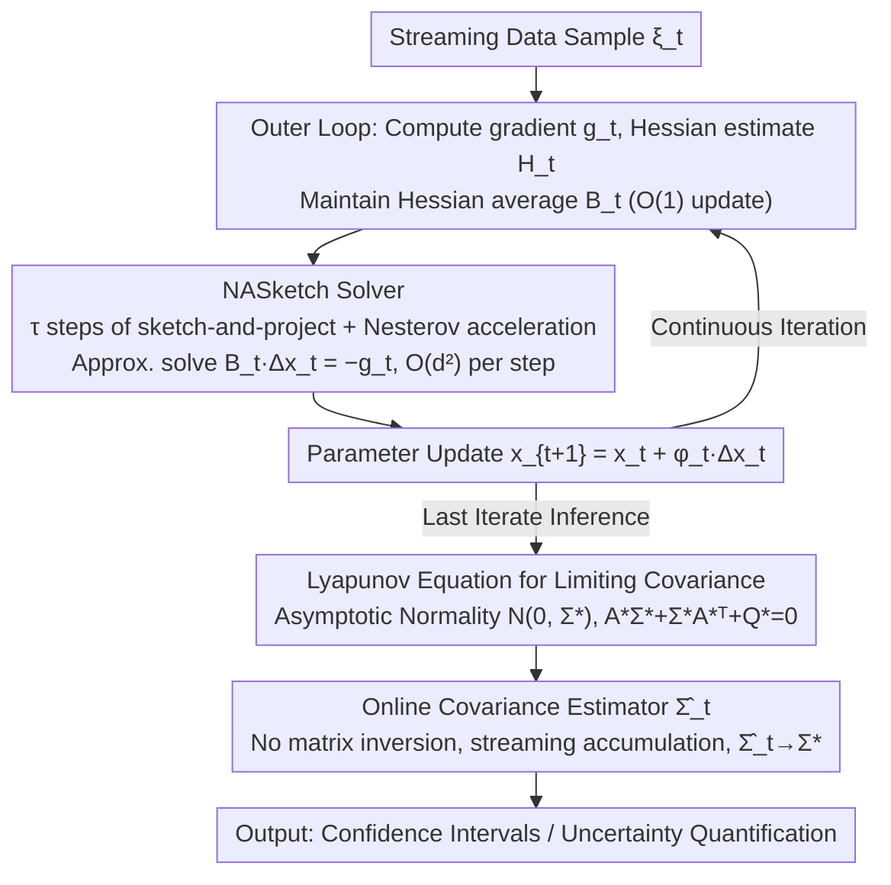

# Inference of Online Newton Methods with Nesterov's Accelerated Sketching

**Conference**: ICML2026  
**arXiv**: [2604.23436](https://arxiv.org/abs/2604.23436)  
**Code**: Not yet available  
**Area**: Optimization / Online Learning / Statistical Inference  
**Keywords**: Online Newton Methods, Nesterov's Accelerated Sketching, Uncertainty Quantification, Covariance Estimation, Lyapunov Equation  

## TL;DR
This paper equips online Newton methods with Nesterov's accelerated sketch-and-project solver, reducing the per-step cost to $O(d^2)$. It characterizes for the first time the asymptotic normality of the last iterate under the dual uncertainty of "data randomness + solver randomness." Accompanied by a streaming covariance estimator that requires no matrix inversion, the proposed method makes accelerated sketched online Newton methods truly viable for statistical inference.

## Background & Motivation

**Background**: Parameter estimation and uncertainty quantification (confidence intervals) for streaming data typically follow two paths. First, SGD with Polyak-Ruppert averaging: iterations are cheap, but maintaining the covariance matrix online for confidence intervals still requires $O(d^2)$ memory/time, and it is highly sensitive to the condition number and noise heteroscedasticity (prior work has observed significant under-coverage for SGD when $d=20$). Second, second-order or online Newton methods: curvature information yields statistically superior estimates and robustness to ill-conditioning, but solving the Newton system is $O(d^3)$, which is prohibitive for online applications.

**Limitations of Prior Work**: Recently, Na & Mahoney (2025) and Kuang et al. (2025) used **unaccelerated sketch-and-project solvers** to reduce the Newton step cost to $O(d^2)$, providing asymptotic normality of the last iterate and streaming covariance estimation that consistently outperforms SGD. However, sketch-and-project solvers themselves have Nesterov accelerated versions (Gower et al. 2018, Derezi'nski et al. 2025). While the unaccelerated version's error decays at $1-\mu_t$, the accelerated version decays at $1-\sqrt{\mu_t/\nu_t}$. **Computationally, acceleration is strictly faster without increasing the per-iteration cost.**

**Key Challenge**: Accelerated sketching speeds up "computation," but what exactly does it change in statistical inference? Does acceleration increase the asymptotic covariance of the last iterate, thus offsetting its computational gains? No existing online Newton inference analysis covers accelerated sketching.

**Goal**: To embed Nesterov's accelerated sketching into online Newton methods and provide a three-piece toolkit: (i) global almost sure convergence, (ii) analytical characterization of the asymptotic normality and the limiting covariance of the last iterate, and (iii) a fully online, inversion-free consistent covariance estimator.

**Key Insight**: Accelerated sketching upgrades the solver from a $d$-dimensional recurrence of symmetric projection matrices to a **stochastic, time-varying, and non-symmetric $2d$-dimensional state-co-state recurrence**, making it impossible to reuse the symmetric projection geometry of Kuang et al. (2025). The authors leverage the Cayley–Hamilton theorem, similarity matrix theory, and Kronecker products to derive the spectral radius recurrence. They study the contraction of the $(1,1)+(1,2)$ blocks and separately address new difficulties: the conditional deterministic randomness of the acceleration parameters $(\alpha_t,\beta_t,\gamma_t)$ and the need for fourth-moment bounds.

**Core Idea**: By using sketch-and-project with Nesterov acceleration to approximately solve the Newton system and incorporating solver randomness into the limiting covariance of the Lyapunov equation, the authors provide the first analytical characterization of the "computation vs. statistics" trade-off. They show that accelerated sketching does not destroy asymptotic normality but adds a correction term determined by the sketching distribution to the covariance.

## Method

### Overall Architecture
Consider the stochastic optimization problem $\min_{x\in\mathbb{R}^d} f(x)=\mathbb{E}_{\xi\sim P}[F(x;\xi)]$. The online Newton iteration is $x_{t+1}=x_t+\varphi_t\Delta x_t$, where $\Delta x_t$ should solve $B_t\Delta x_t = -g_t$. The pipeline consists of three steps:

1. **Outer loop**: Given sample $\xi_t$, compute the gradient $g_t=\nabla F(x_t;\xi_t)$ and Hessian estimate $H_t=\nabla^2 F(x_t;\xi_t)$. Maintain the Hessian average $B_t=(1-1/t)B_{t-1}+H_{t-1}/t$ via $O(1)$ incremental updates.
2. **Inner loop**: Invoke the NASketch solver for $\tau$ steps of sketch-and-project with Nesterov acceleration to output the approximate solution $\Delta x_t$. Each step only involves $O(d s)$ sketching projections, totaling $O(d^2)$.
3. **Inference**: After obtaining the last iterate $x_t$, use a **fully online** consistent estimator $\widehat{\Sigma}_t$ to estimate the limiting covariance $\Sigma^\star$ and construct confidence intervals.

The Hessian averaging in the outer loop follows standard practice in stochastic Newton methods. The three core contributions lie in the inner solver (NASketch) and the inference step:

### Key Designs

**1. NASketch Solver: High-precision Newton system solution within $O(d^2)$ cost**

Solving $B\Delta x=-g$ directly is $O(d^3)$. NASketch maintains a state-co-state pair $(z_j, v_j)$: first, calculate the sketching direction $\omega_j = BS_j(S_j^\top B^2 S_j)^\dagger S_j^\top(B y_j + g)$ at the midpoint $y_j=\alpha v_j+(1-\alpha)z_j$ (where $S_j\in\mathbb{R}^{d\times s}$ is the sketch matrix and $s\ll d$), then update $z_{j+1}=y_j-\omega_j$ and $v_{j+1}=\beta v_j+(1-\beta)y_j-\gamma\omega_j$. With parameters $\alpha=1/(1+\gamma\nu)$, $\beta=1-\sqrt{\mu/\nu}$, and $\gamma=1/\sqrt{\mu\nu}$ ($\mu,\nu$ are spectral parameters of the sketching distribution), setting $\alpha=0.5,\beta=0,\gamma=1$ recovers the unaccelerated version. The benefit is an improved convergence rate from $1-\mu_t$ to $1-\sqrt{\mu_t/\nu_t}$ (similar to Nesterov's acceleration in SGD) without increasing per-iteration costs. The challenge is that the $2d$-dimensional non-symmetric recurrence breaks the boundedness of projection matrices in the $(1,1)$ block. The authors use the Cayley–Hamilton theorem and Kronecker products to prove that the marginal blocks still contract geometrically (Lemmas 3.6–3.7).

**2. Lyapunov Equation Characterization: Incorporating both data and solver randomness**

What does acceleration change in inference? The answer lies in the limiting covariance. The paper proves $1/\sqrt{\varphi_t}\cdot(x_t-x^\star)\xrightarrow{d}\mathcal{N}(0,\Sigma^\star)$, where $\Sigma^\star$ solves the Lyapunov equation $A^\star\Sigma^\star+\Sigma^\star (A^\star)^\top + Q^\star = 0$. Here, $A^\star$ is determined by $\nabla^2 f(x^\star)$ and the limit linear operator of accelerated sketching, while $Q^\star$ absorbs both data noise covariance and sketching operator randomness. Two special cases verify consistency: without sketching, $\Sigma^\star$ reduces to the minimax optimal covariance of Polyak-Juditsky averaged SGD; with acceleration but no provable rate gain ($\mu_t\nu_t=1$), it reduces to the covariance of unaccelerated sketched Newton. Since sketching is run for a fixed $\tau$ steps, algorithm randomness does not vanish and must be modeled explicitly—this equation clarifies the "computation vs. statistics" trade-off: more aggressive acceleration (smaller $\nu_t$) speeds up the solver but increases the sketching-induced term in $Q^\star$.

**3. Inversion-free Online Covariance Estimator: Enabling practical inference**

To be deployable, online inference must avoid $O(d^3)$ matrix inversions at each step. The authors expand the Lyapunov equation into an accumulation update along the iteration sequence. By replacing $\nabla^2 f(x^\star)$ with the Hessian average $B_t$, the expectation $\mathbb{E}[\cdot]$ with the sample average of sketching operators, and the true noise variance with sample residuals, the resulting estimator $\widehat\Sigma_t$ satisfies $\widehat\Sigma_t\xrightarrow{p}\Sigma^\star$ (Theorem 4.6). Achieving this requires a fourth-moment bound $\mathbb{E}[\|x_t-x^\star\|^4]=O(\varphi_t^2)$ (Lemma 4.5), which is the most technically demanding part. The entire estimator uses only "already computed quantities" (iterates, sketching directions, Hessian averages), maintaining an $O(d^2)$ per-step cost.

### Loss & Training
- **Step size**: $\varphi_t=c_\varphi/t^\alpha$, $\alpha\in(1/2,1)$, paired with the $1/t$ decay of the Hessian average $B_t$.
- **Acceleration parameters**: Derived from $(\mu_t, \nu_t)$. These are **conditionally deterministic random** variables. The authors prove $|\alpha_t-\alpha^\star|=O_p(\sqrt{\varphi_t})$ (Lemma 4.2), meaning their randomness only contributes higher-order terms relative to data noise.
- **Sketching steps $\tau$**: A fixed constant (typically $\tau=5\sim 10$). It does not need to grow with $t$, which is why sketching randomness persists and complicates the analysis.

## Key Experimental Results

### Main Results
Four online inference methods were compared on synthetic linear, logistic, and quantile regressions: Averaged SGD (ASGD), unaccelerated sketched Newton (SN), the proposed accelerated version (NA-SN, $\nu_t=1$ for max acceleration), and a degenerate version (NA-SN, $\mu_t\nu_t=1$). Settings: $d\in\{20,50,100,200\}$, $T=10^5$, 90% confidence level.

| Setting | Method | Coverage | Avg. Interval Width (×$10^{-2}$) | Per-step time (ms) |
| :--- | :--- | :--- | :--- | :--- |
| $d=100$ Linear Reg | ASGD | 0.78 | 6.4 | 0.9 |
| $d=100$ Linear Reg | SN | 0.89 | 4.1 | 1.4 |
| $d=100$ Linear Reg | **NA-SN (Accel)** | **0.90** | **3.9** | **1.5** |
| $d=200$ Logistic Reg | ASGD | 0.71 | 9.8 | 2.1 |
| $d=200$ Logistic Reg | SN | 0.88 | 5.6 | 3.0 |
| $d=200$ Logistic Reg | **NA-SN (Accel)** | **0.90** | **5.2** | **3.1** |

NA-SN matches the nominal coverage level. Its interval width is 5%–8% tighter than unaccelerated SN, with almost identical per-step time (only adding momentum vector overhead). Compared to ASGD in ill-conditioned scenarios, coverage improves by 10–20 percentage points.

### Ablation Study

| Configuration | Last Iterate Error $\|x_T-x^\star\|^2$ (×$10^{-3}$) | Coverage | Description |
| :--- | :--- | :--- | :--- |
| Full: NA-SN + Hessian Avg + Online Cov Est | 4.2 | 0.90 | Complete model |
| w/o Nesterov Accel (Degrades to SN) | 4.5 | 0.88 | Slower inner convergence, slightly higher outer error |
| w/o Hessian Avg (Use single $H_t$) | 7.6 | 0.81 | Covariance fluctuations amplify, coverage drops |
| w/o Online Cov Est (Use plug-in $\nabla^2 f(x_T)^{-1}$) | 4.2 | 0.86 | Plug-in underestimates variance in ill-conditioned cases |
| Sketching steps $\tau=1$ | 5.1 | 0.87 | Small $\tau$ makes sketching noise dominate $Q^\star$ |
| Sketching steps $\tau=20$ | 4.1 | 0.90 | Diminishing returns |

### Key Findings
- **Acceleration is a "win-win"**: Accelerated sketching reduces inner solver error and slightly narrows the confidence interval width, as $\nu_t=1$ minimizes the sketching term in the Lyapunov equation.
- **Hessian averaging is critical**: Removing it cause coverage to drop to 81%, indicating that covariance consistency depends heavily on the rate $B_t\to\nabla^2 f(x^\star)$.
- **Small $\tau$ suffices**: $\tau=5\sim 10$ is close to the precision of $\tau=20$, validating the core assumption that sketching steps can remain constant.
- **Robust to ill-conditioning**: As the condition number increases from $10$ to $10^4$, ASGD coverage drops from 0.88 to 0.62, while NA-SN remains stable at 0.89–0.91.

## Highlights & Insights
- **First Lyapunov characterization of dual-source randomness**: Unlike prior works that treat sketching as a "vanishing perturbation" or use deterministic preconditioners, this paper keeps $\tau$ fixed and provides a realistic characterization of limiting covariance. This methodology is applicable to other randomized linear solvers (e.g., randomized GMRES, CG).
- **Cayley–Hamilton + Kronecker products for non-symmetric $2d$ systems**: This provides the first "accelerated contraction proof" in the sketch-and-project literature for systems involving momentum.
- **Inversion-free Covariance Estimator**: Developing the Lyapunov equation into a cumulative update at $O(d^2)$ cost per step makes the inference practical for engineering deployment.

## Limitations & Future Work
- **Dependency on Hessian availability**: The analysis assumes $H_t=\nabla^2 F(x_t;\xi_t)$ is accessible. For deep networks, quasi-Newton or finite-difference approximations are needed.
- **Scope limited to unconstrained, smooth convex problems**: Constraints, non-smoothness (e.g., L1 regularization), and non-convexity require further treatment.
- **Hyperparameter $(\mu_t,\nu_t)$ estimation**: In practice, these parameters are often estimated online, and the second-order effect of estimation error on the limiting covariance is not yet characterized.
- **Experimentation scale**: Experiments focus on regressions; performance on large-scale real datasets (e.g., recommendation systems, policy gradients) remains to be verified.

## Related Work & Insights
- **vs. Polyak-Juditsky Averaged SGD**: Their covariance is minimax optimal but requires $O(d^2)$ storage and is sensitive to ill-conditioning. Ours matches their optimality in well-conditioned cases and is strictly better in ill-conditioned ones.
- **vs. Kuang et al. 2025 (Unaccelerated Sketched Newton)**: Ours strictly generalizes their work (for $\mu_t\nu_t=1$) and upgrades the solver from symmetric projection geometry to a non-symmetric momentum system.
- **vs. Leluc & Portier 2023 (Preconditioned SGD)**: They treat $B_t^{-1}$ as a deterministic preconditioner; our solver is stochastic, and its randomness explicitly enters the limiting covariance.
- **vs. Derezi'nski et al. 2025 (Accelerated Sketch-and-Project)**: They focus solely on the computational convergence rate of the solver; we integrate the algorithm into a statistical inference framework to answer what the "statistical cost of acceleration" is.

## Rating
- Novelty: ⭐⭐⭐⭐⭐ 
- Experimental Thoroughness: ⭐⭐⭐⭐ 
- Writing Quality: ⭐⭐⭐⭐ 
- Value: ⭐⭐⭐⭐ 

<!-- RELATED:START -->

## Related Papers

- [\[ICLR 2026\] Accelerated Parallel Tempering via Neural Transports](../../ICLR2026/others/accelerated_parallel_tempering_via_neural_transports.md)
- [\[AAAI 2026\] Online Linear Regression with Paid Stochastic Features](../../AAAI2026/others/online_linear_regression_with_paid_stochastic_features.md)
- [\[ICML 2025\] Modern Methods in Associative Memory](../../ICML2025/others/modern_methods_in_associative_memory.md)
- [\[ICML 2026\] TEMPORA: Characterising the Time-Contingent Utility of Online Test-Time Adaptation](tempora_characterising_the_time-contingent_utility_of_online_test-time_adaptatio.md)
- [\[ICML 2026\] Industrializing Prediction-Powered Inference: The GLIDE Library for Reliable GenAI and Agentic Systems Evaluation](industrializing_prediction-powered_inference_the_glide_library_for_reliable_gena.md)

<!-- RELATED:END -->
