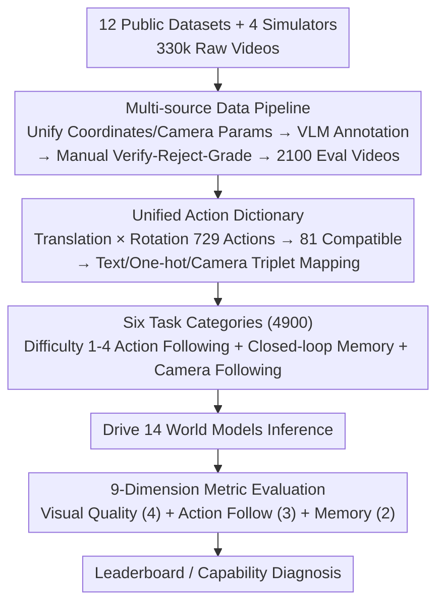

# iWorld-Bench: A Benchmark for Interactive World Models with a Unified Action Generation Framework

**Conference**: ICML 2026  
**arXiv**: [2605.03941](https://arxiv.org/abs/2605.03941)  
**Code**: iWorld-Bench.com (Project Page)  
**Area**: Interactive World Models / Benchmark / Video Generation Evaluation  
**Keywords**: World Models, Action-Controllable Video Generation, Camera Control, Memory Capability, Cross-modal Evaluation

## TL;DR
iWorld-Bench is the first unified benchmark designed specifically for "Interactive World Models." It proposes an Action Generation Framework capable of mapping text, one-hot, and camera intrinsic/extrinsic inputs into a unified instruction space. Based on 4.9K tasks selected from 330K videos and 9 evaluation metrics, it provides a comprehensive comparison of 14 mainstream models.

## Background & Motivation
**Background**: World models (e.g., Genie, HunyuanVideo, Wan, Matrix-Game, CameraCtrl) are evolving toward an "interactive" direction, where they must predict the future while responding to external action commands. Potential applications cover game engines, autonomous driving, and embodied AI.

**Limitations of Prior Work**: (1) Existing benchmarks are mostly single-view and single-scene, often derived from pedestrian street views. (2) "Action" modalities vary significantly across models—textual instructions, one-hot keys, or camera parameters—meaning the same "move forward" command corresponds to dozens of different low-level signals. (3) Most benchmarks are designed for general T2V or embodied manipulation, lacking assessment of interactive response, camera following, and memory stability.

**Key Challenge**: The absence of cross-modal action semantic alignment and the lack of "interactivity" coverage in task systems result in world model evaluations being "apples to oranges."

**Goal**: (1) Construct a multi-scene, multi-view, all-weather dataset for world models; (2) Provide a cross-modal unified action encoding framework; (3) Design task sets that distinguish between "action following capability" and "memory capability" with 9 corresponding metrics.

**Key Insight**: The authors observe that first-person camera motion can be decomposed into orthogonal translation and rotation subspaces. By discretizing each subspace into 27 actions (resulting in 729 combinations) and filtering for 81 actions compatible with most models, a unified "Action Dictionary" is formed. All modalities are mapped to this dictionary.

**Core Idea**: Use the "Unified Action Dictionary" to bring world models with heterogeneous modalities onto the same evaluation plane. By layering multi-scene, multi-weather data and closed-loop tasks, the evaluation covers three core dimensions: action following, visual quality, and spatial memory.

## Method

### Overall Architecture
iWorld-Bench consists of three components: (1) Data Pipeline — Collecting 330K videos from 12 public datasets (KITTI, NCLT, TartanAir, SpatialVid, etc.) and 4 simulators (AerialVLN, UAV_ON, Openfly, EmbodiedCity), unifying coordinate systems and camera formats, and selecting 2100 evaluation videos via VLM auto-labeling and manual verification; (2) Action Generation Framework — Defining a 729-dimensional action space mapped to 81 cross-modal compatible actions, each represented by a text/one-hot/camera parameter triplet; (3) 6 evaluation task categories — Difficulty 1-4 Action Following (4000 tasks), Memory (200 tasks requiring closed-loop returns), and Camera Following (700 tasks), totaling 4900 tasks. Finally, the framework drives inference for 14 mainstream world models, ranked by 9 metrics.

### Key Designs

**1. Multi-source Data Pipeline: Unifying heterogeneous datasets for world model training**

Most existing datasets with high-quality camera parameters cannot be used directly to train/evaluate world models because coordinate systems and parameter formats differ, leading to physical trajectory mismatches. The authors built a standardized pipeline: collecting 330k videos from diverse sources, calibrating them to a unified right-handed coordinate system using a diagonal correction matrix for consistency. Continuous trajectories are segmented into 81-frame clips with row-major $3 \times 4$ projection matrices. Following a "Verify-Reject-Grade" protocol, annotators refine VLM labels, resulting in 2100 high-quality videos covering UGV/UAV/Human/Robot perspectives across various weather and lighting conditions.

**2. Unified Action Dictionary (Action Generation Framework): Mapping heterogeneous actions to a common subspace**

The primary obstacle in evaluating world models is the divergence in "action" modalities. The authors address this by orthogonally decomposing first-person camera motion into translation $T$ and rotation $R$ subspaces (27 atomic actions each, $|T| \times |R| = 729$). Given that most models do not support vertical translation or rolling, they filter this to $9 \times 9 = 81$ core actions. Each is assigned a (text, one-hot, camera intrinsics+extrinsics) triplet, marked with difficulty $D \in \{1, \dots, 6\}$ and validity $V \in \{0, 1\}$. This projects all models onto an 81-dimensional subspace for fair comparison, regardless of their native input modality.

**3. Six Task Categories (including Closed-loop Memory): Exposing spatial memory flaws**

The set includes 4000 action following tasks (Difficulties 1-4 based on occlusion and background clutter), 700 Camera Following tasks, and 200 closed-loop Memory tasks. Memory tasks are particularly insightful; while many models score high on open-loop tasks, memory tasks require the model to return to the starting point (Start = End) in a single inference sequence. Two metrics are used: Memory Symmetry (pixel consistency between symmetric frames) and Trajectory Alignment (mirror similarity of instantaneous displacement vectors). Results show over half the models score $< 0.5$ on Symmetry, exposing "goldfish memory" issues caused by factors like KV-cache truncation.

**4. 9-Dimension Metric System: Decomposing "Performance" into non-redundant categories**

A single score often masks the trade-off between "high visual quality but low controllability" and vice versa. Evaluation is split into Visual Quality (4 metrics: MUSIQ, temporal consistency of brightness/color, HSV drift, and sharpness), Action Following (3 metrics: comparing ViPE-extracted trajectories against GT), and Memory (2 metrics). To isolate errors, Trajectory Accuracy (vs. commands) is separated from Trajectory Tolerance (vs. GT video processed through the same estimator), effectively canceling out estimator noise.

### Loss & Training
This paper presents an evaluation benchmark and does not involve a training process. **Evaluation Protocol**: All 14 models were run on NVIDIA A800 GPUs using original inference settings (default sampling, no ensembles). Each task used the same initial frame and action sequence. The 9 metrics were calibrated against human preference experiments.

## Key Experimental Results

### Main Results
Comparison of total scores for 14 models on 4 action following categories + memory tasks (Selection):

| Control Mode | Model | Avg | Trajectory Acc | Memory Sym | Rank |
|--------------|-------|-----|----------------|------------|------|
| One-hot | HY-World 1.5 | **0.787** | 0.747 | **0.848** | 1 |
| Camera | videox-fun-Wan | 0.747 | 0.717 | **0.901** | 2 |
| Text | HunyuanVideo-1.5| 0.719 | 0.684 | 0.634 | 3 |
| Camera | AC3D | 0.715 | 0.579 | 0.907 | 4 |
| Text | CogVideoX-I2V | 0.696 | 0.595 | 0.601 | 5 |
| Camera | MotionCtrl | 0.549 | 0.673 | 0.310 | 14 |

On the 700 camera parameter tasks (Camera Following), AC3D leads with Trajectory Tolerance of 0.909 and Motion Smoothness of 0.992, while early methods like ASTRA achieve only 0.428.

### Ablation Study
Cross-modal comparison (Execution variance of the same action semantics across different input modalities):

| Dimension | Text (Avg of 5) | One-hot (Avg of 2) | Camera (Avg of 7) | Interpretation |
|-----------|----------------|--------------------|-------------------|----------------|
| Image Quality | 0.64 (High) | 0.58 | 0.51 | Text models inherit T2V visual priors |
| Traj. Accuracy | 0.62 | **0.72** | 0.62 | One-hot discrete signals provide strongest control |
| Memory Symmetry| 0.51 | 0.59 | 0.59 | Text models are most prone to "forgetting" |

### Key Findings
- **Visual Quality vs. Controllability Trade-off**: CogVideoX-I2V achieves the highest visual consistency (0.899) but a lower trajectory accuracy (0.595). AC3D (fine-tuned from CogVideoX) shows improved control but degraded visual metrics, indicating a cost for camera-control fine-tuning.
- **One-hot Superiority**: Models using keyboard-style encoding (e.g., HY-World 1.5, Matrix-Game 2.0) outperform text models in action following, suggesting that discrete, strongly aligned action signals are easier for learning physics.
- **Memory as a Bottleneck**: None of the 14 models scored $> 0.85$ on Memory Symmetry; nearly all models deviated from the initial scene when returning to the starting point in a closed-loop trajectory.
- **Strong Encoder Progress**: Trajectory Tolerance for early methods is significantly lower, reflecting the progress made by newer camera control injection mechanisms.

## Highlights & Insights
- The "729 $\rightarrow$ 81 Action Dictionary" is a clever conceptual innovation: it enables comparisons across heterogeneous modalities through dimension alignment and is inherently scalable.
- Framing memory evaluation as a closed-loop path task is a simple yet powerful design that effectively exposes the "goldfish memory" limitations of current world models.
- Separating Trajectory Accuracy and Trajectory Tolerance effectively mitigates noise from the ViPE estimator, serving as a useful evaluation design trick.
- The dataset's coverage of 4 perspectives, 9 weather types, and 5 indoor conditions makes it more comprehensive than WorldScore or EWMBench.

## Limitations & Future Work
- Evaluation relies on single inference results rather than multi-run averages or ensembles; some sampling-sensitive models might be undervalued.
- The 81-action dictionary remains discrete, with limited coverage of truly continuous, fine-grained operations (e.g., minute steering angles).
- Camera trajectory estimation depends on the ViPE extractor; errors in ViPE within specific scenes could ripple through multiple scores.
- Real-time performance and long-term consistency (> 10s video) were not evaluated and are left for future work.

## Related Work & Insights
- **vs. WorldScore (Duan 2025)**: WorldScore focuses on general world generation without interactive or memory task designs; iWorld-Bench treats "interactivity" as a primary concern.
- **vs. EWMBench / WorldEval**: These focus on embodied strategy evaluation for robotic arms; iWorld-Bench focuses on first-person motion-based world models.
- **vs. VBench (Huang 2024)**: VBench evaluates general video generation quality without addressing action controllability.
- **vs. MovBench / WorldBench**: Previous benchmarks are single-modality; this work achieves cross-modal comparability for the first time via the Action Generation Framework.

## Rating
- **Novelty**: ⭐⭐⭐⭐ — The cross-modal dictionary and closed-loop memory tasks fill a significant gap in world model evaluation.
- **Experimental Thoroughness**: ⭐⭐⭐⭐⭐ — Evaluating 14 models over 4900 tasks with 9 metrics across three modalities is exceptionally rare in scope.
- **Writing Quality**: ⭐⭐⭐⭐ — Clear storyline with high information density, though sub-task layers are slightly redundant.
- **Value**: ⭐⭐⭐⭐ — Provides the first standardized yardstick for the emerging field of interactive world models, anchoring future iterations.

<!-- RELATED:START -->

## Related Papers

- [\[CVPR 2026\] PAI-Bench: A Comprehensive Benchmark For Physical AI](../../CVPR2026/others/pai-bench_a_comprehensive_benchmark_for_physical_ai.md)
- [\[CVPR 2026\] 4DWorldBench: A Comprehensive Evaluation Framework for 3D/4D World Generation Models](../../CVPR2026/others/4dworldbench_a_comprehensive_evaluation_framework_for_3d4d_world_generation_mode.md)
- [\[ICLR 2026\] DA-AC: Distributions as Actions — A Unified RL Framework for Diverse Action Spaces](../../ICLR2026/others/distributions_as_actions_a_unified_framework_for_diverse_action_spaces.md)
- [\[CVPR 2026\] CAD-Refiner: A Unified Framework for CAD Generation and Iterative Editing](../../CVPR2026/others/cad-refiner_a_unified_framework_for_cad_generation_and_iterative_editing.md)
- [\[AAAI 2026\] Beyond World Models: Rethinking Understanding in AI Models](../../AAAI2026/others/beyond_world_models_rethinking_understanding_in_ai_models.md)

<!-- RELATED:END -->
