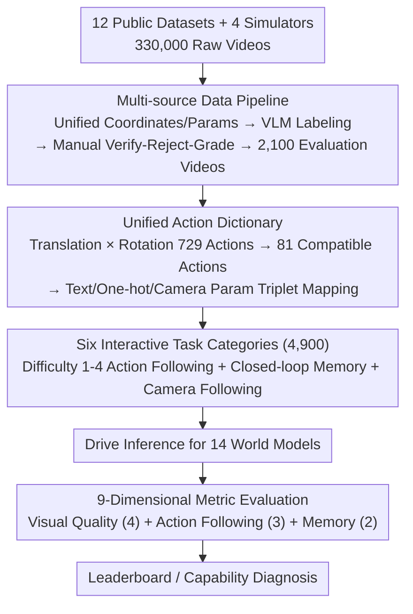

# iWorld-Bench: A Benchmark for Interactive World Models with a Unified Action Generation Framework

**Conference**: ICML 2026  
**arXiv**: [2605.03941](https://arxiv.org/abs/2605.03941)  
**Code**: iWorld-Bench.com (Project Homepage)  
**Area**: Interactive World Models / Benchmark / Video Generation Evaluation  
**Keywords**: World Models, Action-controllable Video Generation, Camera Control, Memory Capacity, Cross-modal Evaluation

## TL;DR
iWorld-Bench is the first unified evaluation benchmark specifically designed for "interactive world models." It proposes an Action Generation Framework capable of converting text, one-hot, and camera intrinsic/extrinsic action inputs into a unified instruction space. Based on 330K videos, 4.9K tasks and 9 metrics were refined to perform a comprehensive comparison across 14 mainstream models.

## Background & Motivation
**Background**: World models (Genie, HunyuanVideo, Wan, Matrix-Game, CameraCtrl, etc.) are evolving toward an interactive direction that can both predict the future and respond to external action instructions. Potential applications include game engines, autonomous driving, and embodied intelligence.

**Limitations of Prior Work**: (1) Existing benchmarks are mostly single-perspective and single-scene, often derived from pedestrian street views. (2) "Action" modalities used by different models are completely different—text instructions, one-hot keys, and camera parameters. The same "move forward" command corresponds to dozens of different low-level signals across models, making direct comparison impossible. (3) Most existing benchmarks are designed for general T2V or embodied manipulation, lacking investigation into interactive response, camera following, and memory capacity.

**Key Challenge**: The lack of cross-modal action semantic alignment combined with task systems that do not cover the core dimension of "interactivity" results in world model evaluations being an "apples-to-oranges" comparison.

**Goal**: (1) Construct a multi-scene, multi-perspective, all-weather world model dataset. (2) Provide a cross-modally unified action encoding framework. (3) Design a task set that distinguishes "action following capability" from "memory capacity," accompanied by 9 corresponding metrics.

**Key Insight**: It is observed that first-person camera motion can be decomposed into two orthogonal subspaces: translation and rotation. Each subspace is discretized into 27 actions, totaling 729 combinations. From these, 81 actions compatible with most models are screened to serve as a unified "Action Dictionary." All modalities are mapped onto this dictionary.

**Core Idea**: Use a "unified action dictionary" to bring world models with heterogeneous modalities onto the same evaluation plane. Supplement this with multi-scene, multi-weather data and closed-loop task designs to ensure the evaluation covers action following, visual quality, and spatial memory.

## Method

### Overall Architecture
iWorld-Bench consists of three components: (1) Data Pipeline—collects 330,000 videos from 12 public datasets (KITTI, NCLT, TartanAir, SpatialVid, etc.) and 4 simulators (AerialVLN, UAV_ON, Openfly, EmbodiedCity), unifies coordinate systems/camera parameter formats, automatically labels them using VLMs, and selects 2,100 evaluation videos after manual verification. (2) Action Generation Framework—defines a 729-dimensional action space mapped to 81 cross-modal compatible actions, with each action paired with a triplet representation of text, one-hot, and camera parameters. (3) 6 Categories of Evaluation Tasks—4,000 action following tasks (Difficulty 1-4), 200 Memory tasks (closed-loop paths requiring the model to return to the starting point), and 700 Camera Following tasks (specifically testing camera parameter models), totaling 4,900 tasks with 9 metrics. Finally, this task set drives inference for 14 mainstream world models, ranked by 9-dimensional metrics.

### Key Designs

**1. Multi-source Data Pipeline: "Cleaning" Heterogeneous Datasets into a Unified Format for World Models**

Existing datasets with high-quality camera parameters cannot be directly used to train or evaluate world models because coordinate systems and parameter formats vary, leading to physical misalignment of trajectories. A standardization pipeline was built to address this: 330,000 videos from various sources were unified into a right-handed coordinate system using a diagonal correction matrix for physical consistency. Continuous trajectories were sliced into fixed 81-frame segments with intrinsics and $3\times4$ projection matrices. After VLM auto-labeling, annotators followed a "Verify-Reject-Grade" protocol to select 2,100 high-quality videos covering UGV/UAV/human/robot perspectives, 9 outdoor weather conditions, and 5 indoor lighting setups.

**2. Unified Action Dictionary (Action Generation Framework): Pulling Heterogeneous Action Modalities into a Common Subspace**

The primary barrier to evaluation is that action modalities are inconsistent. The solution decomposes first-person camera motion into translation $T$ and rotation $R$ subspaces, each with 27 atomic actions. The total space is $|T|\times|R|=729$. Considering most models do not support vertical translation or rolling, 81 core actions were selected. Each action is mapped to a (text, one-hot, camera intrinsics+extrinsics) triplet, labeled with difficulty $D\in\{1,\dots,6\}$ and validity $V\in\{0,1\}$. This projects all models onto an 81-dimensional common subspace, ensuring fairness across different input types.

**3. Six Interactive Task Categories: Exposing Spatial Memory Weaknesses via Closed-loop Tasks**

Based on the dictionary, 4,900 tasks were designed, including 4,000 action following tasks, 700 Camera Following tasks, and 200 closed-loop Memory tasks. The Memory task requires the model to return to the starting point (start = end), testing whether the model can reproduce the initial visual and geometric state. Two metrics are used: Memory Symmetry (pixel consistency of symmetric frames) and Trajectory Alignment (mirror similarity of displacement vectors). This design reveals issues like KV-cache truncation and attention decay; more than half the models scored below 0.5 in Symmetry.

**4. 9-Dimensional Evaluation Metric System: Decomposing "Usability" into Non-redundant Categories**

To avoid masking trade-offs, evaluation is split into Visual Quality (4 metrics), Action Following (3 metrics), and Memory (2 metrics). Visual Quality uses MUSIQ, temporal consistency of brightness/color, HSV drift, and a combined Tenengrad+BRISQUE sharpness measure. Action Following utilizes ViPE to extract trajectories, distinguishing between "Intrinsic Estimation Error" and "Model Execution Error" by comparing Trajectory Accuracy (against commands) and Trajectory Tolerance (against GT video trajectories through the same estimator).

### Loss & Training
This paper presents an evaluation benchmark and does not involve a training process. Evaluation Protocol: All 14 models were run on NVIDIA A800 using original inference settings. Each task used the same initial frame and action sequence. The 9 metrics were calibrated via human preference experiments.

## Key Experimental Results

### Main Results
Comparison of total scores for 14 models on 4 types of action following and memory tasks (excerpt):

| Control Method | Model | Avg | Trajectory Acc | Memory Sym | Rank |
|----------------|-------|-----|----------------|------------|------|
| One-hot | HY-World 1.5 | **0.787** | 0.747 | **0.848** | 1 |
| Camera | videox-fun-Wan | 0.747 | 0.717 | **0.901** | 2 |
| Text | HunyuanVideo-1.5 | 0.719 | 0.684 | 0.634 | 3 |
| Camera | AC3D | 0.715 | 0.579 | 0.907 | 4 |
| Text | CogVideoX-I2V | 0.696 | 0.595 | 0.601 | 5 |
| Camera | MotionCtrl | 0.549 | 0.673 | 0.310 | 14 |

For the 700 camera parameter tasks, AC3D led significantly with a Trajectory Tolerance of 0.909 and Motion Smoothness of 0.992.

### Ablation Study
Cross-modal comparison table (Execution differences for the same action semantics):

| Dimension | Text Control (Avg of 5) | One-hot (Avg of 2) | Camera (Avg of 7) | Insight |
|-----------|-------------------------|--------------------|-------------------|---------|
| Image Quality | 0.64 (High) | 0.58 | 0.51 | Text models inherit T2V visual priors |
| Trajectory Accuracy | 0.62 | **0.72** | 0.62 | One-hot discrete signals provide strongest control |
| Memory Symmetry | 0.51 | 0.59 | 0.59 | Text models are most prone to "forgetting" |

### Key Findings
- **Visual Quality $\leftrightarrow$ Controllability Trade-off**: CogVideoX-I2V had the highest visual consistency (0.899) but low trajectory accuracy (0.595). AC3D, fine-tuned from it, significantly improved control at the cost of visual metrics.
- **One-hot Discrete Actions are Globally Optimal for Control**: Models like HY-World 1.5 using keyboard-style encoding outperformed text models in action following, suggesting discrete, strongly aligned signals facilitate learning physics.
- **Memory Capacity is a Universal Weakness**: No model achieved Memory Symmetry $> 0.85$. Almost all models deviated from the initial frame upon returning to the origin in closed-loop paths.
- **Strong Encoders Create Sharp Early Features**: New generation camera control injection mechanisms show real progress over early methods (MotionCtrl, CameraCtrl) in Trajectory Tolerance.

## Highlights & Insights
- The "729 $\to$ 81 Action Dictionary" is the most ingenious part of the paper: it makes incomparable modalities comparable via dimension alignment and remains extensible.
- Transforming memory evaluation into a closed-loop path task is a simple yet powerful design that exposes the "goldfish memory" of current world models.
- Separating Trajectory Accuracy and Trajectory Tolerance effectively cancels out noise from the ViPE estimator, a valuable evaluation trick.
- Data coverage (4 perspectives, 9 weather types, 5 lighting types) is more comprehensive than WorldScore (3,000 cases) or EWMBench (2,100 robotic arm cases).

## Limitations & Future Work
- Evaluation relies on single inference runs rather than averages or ensembles; sampling-sensitive models might be undervalued.
- The 81-action dictionary remains discrete, offering limited coverage for truly continuous, fine-grained operations.
- Camera trajectory metrics depend on the ViPE extractor; errors in ViPE could affect multiple scores.
- Real-time performance and long-term consistency ($>10$s) were not evaluated and are reserved for future work.
- The high cost of collecting 330K videos and rendering from 4 simulators creates a high barrier to reproduction.

## Related Work & Insights
- **vs WorldScore (Duan 2025)**: WorldScore focuses on general world generation without interactive/memory task designs; iWorld-Bench treats interactivity as a first-class citizen.
- **vs EWMBench / WorldEval**: These focus on robotic arm policy evaluation; iWorld-Bench targets first-person motion world models.
- **vs VBench (Huang 2024)**: VBench evaluates general video generation quality without action controllability; iWorld-Bench is complementary.
- **vs MovBench / WorldBench**: Previous benchmarks were unimodal; this work achieves cross-modal comparability for the first time via the Action Generation Framework.

## Rating
- Novelty: ⭐⭐⭐⭐ — The cross-modal action dictionary and closed-loop memory tasks are genuine conceptual innovations filling a gap in world model evaluation.
- Experimental Thoroughness: ⭐⭐⭐⭐⭐ — 14 models $\times$ 4,900 tasks $\times$ 9 metrics $\times$ 3 input modalities represents rare depth and breadth.
- Writing Quality: ⭐⭐⭐⭐ — Clear storyline and high information density, though sub-task hierarchies are slightly redundant.
- Value: ⭐⭐⭐⭐ — Provides the first recognized yardstick for the emerging field of interactive world models, serving as an anchor for future iterations.

<!-- RELATED:START -->

## Related Papers

- [\[ICLR 2026\] PU-Bench: A Unified Benchmark for Rigorously Reproducible PU Learning](../../ICLR2026/others/pu-bench_a_unified_benchmark_for_rigorous_and_reproducible_pu_learning.md)
- [\[CVPR 2026\] PAI-Bench: A Comprehensive Benchmark For Physical AI](../../CVPR2026/others/pai-bench_a_comprehensive_benchmark_for_physical_ai.md)
- [\[ICLR 2026\] DA-AC: Distributions as Actions — A Unified RL Framework for Diverse Action Spaces](../../ICLR2026/others/distributions_as_actions_a_unified_framework_for_diverse_action_spaces.md)
- [\[AAAI 2026\] Beyond World Models: Rethinking Understanding in AI Models](../../AAAI2026/others/beyond_world_models_rethinking_understanding_in_ai_models.md)
- [\[ICML 2026\] CyberGym-E2E: Scalable Real-World Benchmark for AI Agents' End-to-End Cybersecurity Capabilities](cybergym-e2e_scalable_real-world_benchmark_for_ai_agents_end-to-end_cybersecurit.md)

<!-- RELATED:END -->
