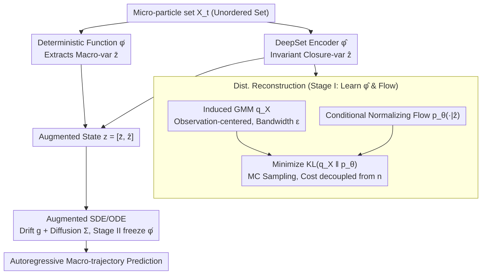

# Learning Permutation-Invariant Macroscopic Dynamics

**Conference**: ICML2026  
**arXiv**: [2605.30812](https://arxiv.org/abs/2605.30812)  
**Code**: Not yet public  
**Area**: Scientific Computing / Closure Modeling / Set Representation Learning  
**Keywords**: Permutation-invariant closure variables, distribution reconstruction, DeepSet encoder, conditional normalizing flow, macroscopic dynamics

## TL;DR
Aiming at the naturally unordered microscopic states of particle systems, this paper proposes an autoencoder framework that "reconstructs density instead of particles." It utilizes a DeepSet encoder to obtain permutation-invariant closure variables $\hat{\bm{z}}$ and employs conditional normalizing flows with a Gaussian mixture density, centered at observation points, as the reconstruction target. This approach bypasses point cloud matching and enables learning macroscopic dynamics via an SDE/ODE alongside macroscopic observables.

## Background & Motivation

**Background**: In scientific computing, high-dimensional microscopic states $X_t = \{\bm{x}_t^1,\dots,\bm{x}_t^n\}$ are often compressed into low-dimensional "closure variables" to predict the evolution of macroscopic quantities (energy, mixing ratios, polymer stretch). Prevailing methods use MLP/CNN autoencoders with point-wise MSE reconstruction losses, treating latent variables as closure variables.

**Limitations of Prior Work**: These approaches assume a fixed ordering of inputs—suitable for grid-based PDEs but failing for interacting particle systems. The same physical configuration under different indices is treated as different vectors. Point-wise MSE treats $(\hat{\bm{x}}^1,\hat{\bm{x}}^2,\hat{\bm{x}}^3)$ and $(\hat{\bm{x}}^3,\hat{\bm{x}}^2,\hat{\bm{x}}^1)$ distinctly, meaning latent variables are not inherently permutation-invariant.

**Key Challenge**: While encoders can be forced to be invariant via DeepSet or Set Transformer, the decoder lacks a "natural order." Forcing a decoder to output an ordered set for point-wise loss essentially crams $n!$ equivalent permutations into one target. This requires either expensive Hungarian matching or permutation-invariant distances like Chamfer/EMD (which are unstable and can blur point-level supervision).

**Goal**: (i) Learn closure variables strictly invariant to input ordering; (ii) Avoid reliance on point-to-point matching; (iii) Jointly learn the stochastic dynamics of macroscopic observables with generalization across different particle counts.

**Key Insight**: Instead of reconstructing "which particle is where," it is better to reconstruct the "overall spatial density distribution of particles." By inducing a Gaussian mixture $q_X(\mathbf{x})$ centered at observation points for each set $X$ and fitting it with a conditional normalizing flow, the density remains naturally invariant to particle indexing, completely bypassing the matching problem.

**Core Idea**: Replace "set reconstruction" with "reconstructing the distribution induced by the set"—this target is naturally permutation-invariant, and the decoder complexity is decoupled from $n$.

## Method

### Overall Architecture
The input is a microscopic particle set $X_t \in \mathcal{X}$ at time $t$. A **pre-defined deterministic function** $\bar{\bm{\varphi}}$ directly extracts macroscopic quantities of interest $\bar{\bm{z}}_t$ (e.g., mean system energy, A-B neighbor ratio $(R_{AB},R_{BA})$). A **learned DeepSet encoder** $\hat{\bm{\varphi}}$ extracts permutation-invariant closure variables $\hat{\bm{z}}_t$. These are concatenated into an augmented macroscopic state $\bm{z}_t = [\bar{\bm{z}}_t, \hat{\bm{z}}_t]$. An SDE (or ODE) is learned on $\bm{z}_t$ to predict future states. Training occurs in two stages: first, learn $(\hat{\bm{\varphi}}, \bm{\psi})$ using distribution reconstruction loss; second, freeze $\hat{\bm{\varphi}}$ and learn the dynamics $(\bm{g}, \bm{\Sigma})$.

### Key Designs

**1. DeepSet Encoder → Permutation-Invariant Closure Variables: Baking invariance into the architecture rather than approximating it via data augmentation.**

Particle sets are inherently unordered. Point-wise MSE treats $(\hat{\bm{x}}^1,\hat{\bm{x}}^2,\hat{\bm{x}}^3)$ and its permutations as different vectors, preventing latent invariance. This work uses the DeepSet paradigm at the encoder—each particle passes independently through an MLP, followed by symmetric pooling (sum/mean) and another MLP—mapping set $X = \{\bm{x}^i\}_{i=1}^n$ to $\hat{\bm{z}} = \hat{\bm{\varphi}}(X)$. This strictly satisfies $\hat{\bm{\varphi}}(\sigma X) = \hat{\bm{\varphi}}(X), \forall \sigma \in S_n$ with $\mathcal{O}(n)$ complexity. Crucially, invariance is a hard property of the architecture, not just "learned" through random permutations. Existing works either use augmentation with MLP encoders (AE-Aug, which is not strictly invariant) or use DeepSet with MSE decoders (AE-InvE, where the decoder breaks invariance). This method target end-to-end structural invariance.

**2. Distribution Reconstruction → Replacing Point-to-Point Matching: Instead of reconstructing "which particle is where," reconstruct the "collective particle density," making the target itself permutation-invariant.**

Traditional point cloud reconstruction relies on Hungarian matching ($\mathcal{O}(n^3)$) or Chamfer/EMD (noisy gradients, unstable optimization), which are cumbersome. This method changes the reconstruction target: for each set $X$, a Gaussian mixture is induced with bandwidth $\epsilon$ centered at observation points: $q_X(\mathbf{x}) = \frac{1}{|X|}\sum_{\bm{x}^i \in X}\delta_\epsilon(\mathbf{x} - \bm{x}^i)$. A conditional normalizing flow $p_\theta(\mathbf{x}\mid\hat{\bm{z}})$ fits this, minimizing $\mathcal{L}_{\mathrm{rec}} = \mathbb{E}_X[\mathrm{KL}(q_X \,\|\, p_\theta(\cdot\mid\hat{\bm{z}}))]$. Density is naturally invariant to particle indexing, eliminating the matching problem. The KL divergence is estimated via MC samples from $q_X$. Since $q_X$ is a uniform mixture of Gaussians, sampling is efficient and parallelizable, and decoding complexity is decoupled from $n$. The bandwidth $\epsilon$ also acts as a "resolution knob": small $\epsilon$ preserves detail but requires higher $\hat{z}_{\mathrm{dim}}$.

**3. Augmented SDE + Two-Stage Training → Joint Macroscopic Dynamics: Concatenating target macro-vars with learned closure variables to learn stochastic dynamics, using reconstruction loss to prevent representation collapse.**

Using only macro-vars $\bar{\bm{z}}$ is often not closed—"macroscopic evolution depends on microscopic degrees of freedom" is the core difficulty of closure modeling. Thus, $\hat{\bm{z}}$ representing microscopic information must be included. These are combined into an augmented state $\bm{z}_t = [\bar{\bm{z}}_t, \hat{\bm{z}}_t]$. The drift $\bm{g}$ and diffusion $\bm{\Sigma}$ (MLPs) learn the conditional distribution $p_{\bm{g},\bm{\Sigma}}(\bm{z}_{t+1}\mid\bm{z}_t) = \mathcal{N}(\bm{z}_t + \bm{g}\Delta t,\,\Delta t\,\bm{\Sigma}\bm{\Sigma}^\top)$ via Euler-Maruyama discretization. However, pure reconstruction-free end-to-end training is prone to representation collapse where latent variables become constants. The reconstruction loss is retained as a regularization term. Two-stage training (Stage 1: $\mathcal{L}_{\mathrm{rec}}$ for $(\hat{\bm{\varphi}}, \bm{\psi})$; Stage 2: freeze $\hat{\bm{\varphi}}$ for dynamics) prevents interference between objectives.

### Loss & Training
Total loss $\mathcal{L} = \mathcal{L}_{\mathrm{rec}} + \lambda_{\mathrm{dyn}}\mathcal{L}_{\mathrm{dyn}}$, implemented via two-stage sequential training. KL estimation utilizes a fixed number of MC samples from $q_X$, making training/inference costs insensitive to $n$. During inference, the encoder is used once (to construct $\bm{z}_0$), followed by autoregressive extrapolation by the dynamics model.

## Key Experimental Results

### Main Results

Three micro-scenarios: (i) 2D interacting particle energy evolution (deterministic, ODE, MRE evaluation); (ii) Lennard-Jones binary particle mixing (stochastic, SDE, MMD evaluation); (iii) Polymer deformation in stretch flow (video input, deterministic ODE). Evaluation settings: in-dst (same distribution), diff-init (initial mode shift), diff-N (particle count shift).

| Task | Case | AE-Aug | AE-InvE | AE-InvE-CD | InvE | Ours |
|------|------|--------|---------|------------|------|------|
| Particle Energy (MRE ↓) | in-dst | $1.25 \times 10^{-3}$ | $2.41 \times 10^{-4}$ | $6.14 \times 10^{-5}$ | $6.01 \times 10^{-5}$ | $\mathbf{5.19 \times 10^{-5}}$ |
| Particle Energy (MRE ↓) | diff-N | N/A | $2.49 \times 10^{-4}$ | $6.43 \times 10^{-5}$ | $6.13 \times 10^{-5}$ | $\mathbf{5.22 \times 10^{-5}}$ |
| Mixing Ratio (MMD ↓) | in-dst | $1.91 \times 10^{-2}$ | $2.60 \times 10^{-2}$ | $2.24 \times 10^{-2}$ | $1.43 \times 10^{-1}$ | $\mathbf{1.09 \times 10^{-2}}$ |
| Mixing Ratio (MMD ↓) | diff-N | N/A | $5.26 \times 10^{-2}$ | $2.16 \times 10^{-2}$ | $1.41 \times 10^{-1}$ | $\mathbf{9.64 \times 10^{-3}}$ |

AE-Aug results in N/A for diff-N because the MLP autoencoder size is tied to the particle count; this highlights the advantage of the DeepSet encoder.

### Ablation Study

| Configuration | Key Difference | Performance |
|------|---------|------|
| Ours (DeepSet + Dist. Rec.) | Complete model | Optimal in all in-dst / diff-N |
| AE-InvE (DeepSet + Point-wise MSE) | Non-invariant decoder | 1 order of magnitude worse than Ours |
| AE-InvE-CD (DeepSet + Chamfer) | Invariant but point-matching | Close to Ours, but gap in diff-init |
| InvE (No reconstruction, joint) | Removed $\mathcal{L}_{\mathrm{rec}}$ | MMD 1 order of magnitude higher; "representation collapse" |
| AE-Aug (MLP + Augmentation) | Approx. invariance via aug. | Energy curves distinguishable for 3 random permutations; Ours curves overlap |

### Key Findings
- **Strict vs. Approximate Invariance**: AE-Aug produces distinct energy predictions for three random permutations of the same configuration. Ours, due to architectural and loss guarantees, shows perfectly overlapping curves in Fig 4(c)—a clear victory of "structural invariance" over "learned invariance."
- **Indispensability of Reconstruction Loss**: Removing reconstruction (InvE baseline) leads to failure in all mixing tasks, suggesting reconstruction-free closure easily falls into the "latent variable as a constant" collapse.
- **Particle Count Generalization**: Trained on 300 particles and tested on 400 (diff-N), Ours shows almost no MRE drop ($5.19 \to 5.22 \times 10^{-5}$), thanks to the $\mathcal{O}(n)$ nature of DeepSet and distribution loss decoupling from $n$.
- **Coupling of Bandwidth $\epsilon$ and Latent Dimension**: Small $\epsilon$ requires larger $\hat{z}_{\mathrm{dim}}$ for multi-modal fitting; large $\epsilon$ achieves near perfection with small dimensions—providing a clear "compression rate" control for closure variables.

## Highlights & Insights
- **Moving Symmetry from Loss to Target**: While previous point cloud generation used Chamfer/EMD to make the loss invariant, this work makes the "reconstructed object" (density) invariant. This "target-switching" strategy is transferable to molecular conformations, point cloud generation, and 3D reconstruction.
- **Distribution Reconstruction as Implicit Regularization**: Using $\epsilon$ as a bottleneck—for the same $\hat{z}_{\mathrm{dim}}$, a larger $\epsilon$ forces the encoder to capture macro-structures while discarding micro-noise. This functions like a scale-adaptive information bottleneck, which is more physically grounded than KL-VAE.
- **OnsagerNet-friendly**: The dynamics network can be seamlessly replaced with structured drift networks like OnsagerNet, making this a general closure modeling backend with a flexible frontend.

## Limitations & Future Work
- **Dependency on Deterministic Macro-quantities $\bar{\bm{\varphi}}$**: Assumes macro-vars of interest (energy, mixing) are explicit deterministic functions; cases with unknown or partially observed macro-vars are not discussed.
- **Bandwidth $\epsilon$ as Hyperparameter**: Although sensitivity analysis is provided, there is no adaptive or learned mechanism for $\epsilon$; multi-scale systems might requiring per-scene tuning.
- **Narrow Video/Image Experiments**: The polymer video task is a modified scenario (3D coordinates rendered as Gaussian blobs); the effectiveness on real unstructured video (multiple objects, occlusion) is unverified.
- **Lack of Theoretical Guarantees**: Can distribution reconstruction uniquely recover the latent variables relevant to macroscopic dynamics? The choices of KL and Gaussian kernels remain somewhat empirical.
- **Future Improvements**: Could introduce learnable multi-bandwidths (mixture of $\epsilon$), replace $q_X$ with sharper kernels (Cauchy/Laplace), or combine distribution reconstruction with score matching to avoid the Jacobian overhead of normalizing flows.

## Related Work & Insights
- **vs. Champion et al. (2019, SINDy autoencoder)**: They perform closure via MLP autoencoders + point-wise MSE assuming ordered coordinates. This work tackles the unordered case and elevates the loss from "point-level" to "distribution-level."
- **vs. Chen et al. (2023b, Polymer dynamics)**: Same experimental scenario (polymer stretching), but they use MLP for ordered bead coordinates. This work starts from image input and uses distribution reconstruction to achieve comparable results, proving modal robustness.
- **vs. Achlioptas et al. (2018) / Point Cloud AE series**: They also seek invariant latents but reconstruct point sets via Chamfer/EMD. This work reconstructs density via KL, avoiding matching steps and reducing complexity from $\mathcal{O}(n^2)$ to $\mathcal{O}(1)$ relative to set size.

## Rating
- Novelty: ⭐⭐⭐⭐ The perspective of "reconstructing density, not points" is clear and rare, though Kilgour 2025 explored similar directions.
- Experimental Thoroughness: ⭐⭐⭐⭐ Three diverse scenarios, three settings, five baselines, and particle count generalization tests.
- Writing Quality: ⭐⭐⭐⭐ Logical motivation and compact formulas.
- Value: ⭐⭐⭐⭐ Directly valuable for particle systems, molecular simulation, and fluid closure modeling.

<!-- RELATED:START -->

## Related Papers

- [\[ICML 2026\] Continual Learning of Domain-Invariant Representations](continual_learning_of_domain-invariant_representations.md)
- [\[CVPR 2025\] Sufficient Invariant Learning for Distribution Shift](../../CVPR2025/others/sufficient_invariant_learning_for_distribution_shift.md)
- [\[CVPR 2026\] Shoe Style-Invariant and Ground-Aware Learning for Dense Foot Contact Estimation](../../CVPR2026/others/shoe_style-invariant_and_ground-aware_learning_for_dense_foot_contact_estimation.md)
- [\[NeurIPS 2025\] Learning Dynamics of RNNs in Closed-Loop Environments](../../NeurIPS2025/others/learning_dynamics_of_rnns_in_closed-loop_environments.md)
- [\[ICLR 2026\] SONIC: Spectral Oriented Neural Invariant Convolutions](../../ICLR2026/others/sonic_spectral_oriented_neural_invariant_convolutions.md)

<!-- RELATED:END -->
