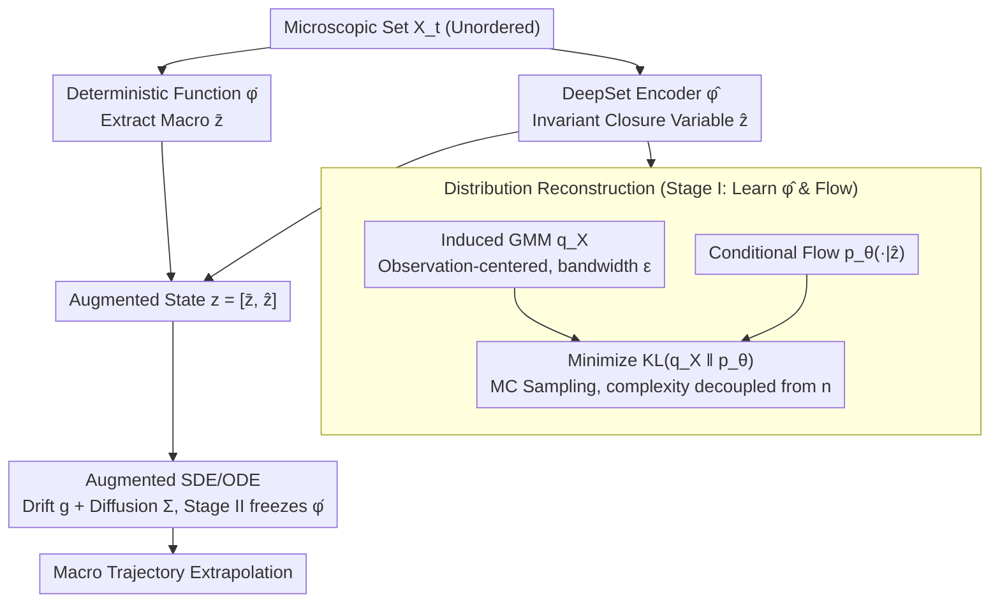

# Learning Permutation-Invariant Macroscopic Dynamics

**Conference**: ICML2026  
**arXiv**: [2605.30812](https://arxiv.org/abs/2605.30812)  
**Code**: Not yet public  
**Area**: Scientific Computing / Closure Modeling / Set Representation Learning  
**Keywords**: Permutation-invariant closure variables, distribution reconstruction, DeepSet encoder, conditional normalizing flows, macroscopic dynamics

## TL;DR
This paper proposes an autoencoder framework focused on "reconstructing density rather than particles" for naturally unordered microstates in particle systems. Using a DeepSet encoder to obtain permutation-invariant closure variables $\hat{\bm{z}}$, it employs a conditional normalizing flow to target the Gaussian mixture density centered at observation points. this approach bypasses point-cloud matching, and the learnable closure variables are integrated with macroscopic observables into an SDE/ODE to model dynamics.

## Background & Motivation

**Background**: In scientific computing, it is often necessary to compress high-dimensional microstates $X_t = \{\bm{x}_t^1,\dots,\bm{x}_t^n\}$ into low-dimensional "closure variables" to predict the evolution of macroscopic quantities (e.g., energy, mixing ratios, polymer extension). Common approaches utilize MLP/CNN autoencoders with point-wise MSE reconstruction losses, treating latent variables as closure variables.

**Limitations of Prior Work**: These methods typically assume a fixed ordering of inputs. While suitable for grid-based PDEs, this fails for interacting particle systems: the same physical configuration under different indices is treated as different vectors. Point-wise MSE distinguishes between $(\hat{\bm{x}}^1,\hat{\bm{x}}^2,\hat{\bm{x}}^3)$ and $(\hat{\bm{x}}^3,\hat{\bm{x}}^2,\hat{\bm{x}}^1)$, preventing latent variables from being permutation-invariant.

**Key Challenge**: While encoders can be made invariant using DeepSet or Set Transformers, decoders lack a "natural order." Forcing a decoder to output an ordered set for point-wise loss essentially collapses $n!$ equivalent permutations into one target. This requires either expensive Hungarian matching or unstable permutation-invariant distances like Chamfer/EMD, which often blur point-level supervision.

**Goal**: (i) Learn closure variables strictly invariant to input ordering; (ii) avoid dependency on point-to-point matching; (iii) jointly learn the stochastic dynamics of macroscopic observables with generalization across varying particle counts.

**Key Insight**: Instead of reconstructing "which particle is where," the model reconstructs the "spatial density distribution of the particle ensemble." By inducing a Gaussian mixture $q_X(\mathbf{x})$ centered at observation points for each set $X$ and fitting it with a conditional normalizing flow, the density itself becomes naturally invariant to particle indexing, completely bypassing matching issues.

**Core Idea**: Replace "set reconstruction" with "reconstructing the distribution induced by the set." This target is naturally permutation-invariant, and the decoder complexity is decoupled from $n$.

## Method

### Overall Architecture
The input is a microscopic particle set $X_t \in \mathcal{X}$ at time $t$. A **pre-defined deterministic function** $\bar{\bm{\varphi}}$ extracts the macroscopic quantities of interest $\bar{\bm{z}}_t$ (e.g., mean energy, A-B neighbor ratios $(R_{AB},R_{BA})$). A **learned DeepSet encoder** $\hat{\bm{\varphi}}$ extracts permutation-invariant closure variables $\hat{\bm{z}}_t$. These form the augmented macroscopic state $\bm{z}_t = [\bar{\bm{z}}_t, \hat{\bm{z}}_t]$. An SDE (or ODE) is learned on $\bm{z}_t$ to predict future states. Training occurs in two stages: first, learning $(\hat{\bm{\varphi}}, \bm{\psi})$ via distribution reconstruction loss, then freezing $\hat{\bm{\varphi}}$ to learn the dynamics $(\bm{g}, \bm{\Sigma})$.

### Key Designs

**1. DeepSet Encoder → Invariant Closure Variables: Embedding invariance into the architecture rather than approximating it through data augmentation.**

Particle sets are naturally unordered. Point-wise MSE treats $(\hat{\bm{x}}^1,\hat{\bm{x}}^2,\hat{\bm{x}}^3)$ and its permutations as distinct vectors. This work uses the DeepSet paradigm: each particle passes through an MLP independently, followed by symmetric pooling (sum/mean) and a final MLP. This maps the set $X = \{\bm{x}^i\}_{i=1}^n$ to $\hat{\bm{z}} = \hat{\bm{\varphi}}(X)$, strictly satisfying $\hat{\bm{\varphi}}(\sigma X) = \hat{\bm{\varphi}}(X), \forall \sigma \in S_n$, with $\mathcal{O}(n)$ complexity. Crucially, invariance is a hard architectural property, not a heuristic learned via random shuffling.

**2. Distribution Reconstruction Target → Replacing Point-to-Point Matching: Reconstructing the ensemble density so the target itself is permutation-invariant.**

Traditional point cloud reconstruction relies on Hungarian matching ($\mathcal{O}(n^3)$) or Chamfer/EMD (high gradient noise), which are often suboptimal. This method shifts the target: for each set $X$, it induces a Gaussian mixture $q_X(\mathbf{x}) = \frac{1}{|X|}\sum_{\bm{x}^i \in X}\delta_\epsilon(\mathbf{x} - \bm{x}^i)$ with bandwidth $\epsilon$. A conditional normalizing flow $p_\theta(\mathbf{x}\mid\hat{\bm{z}})$ is then used to minimize $\mathcal{L}_{\mathrm{rec}} = \mathbb{E}_X[\mathrm{KL}(q_X \,\|\, p_\theta(\cdot\mid\hat{\bm{z}}))]$. Since density is invariant to indexing, the matching problem is avoided. The KL divergence is estimated via MC samples from $q_X$, which is efficient and decouples decoder complexity from $n$. The bandwidth $\epsilon$ acts as a "resolution knob."

**3. Augmented SDE + Two-Stage Training → Joint Macroscopic Dynamics: Concatenating target macro-quantities with learned closure variables for stochastic dynamics.**

Macroscopic variables $\bar{\bm{z}}$ alone are often not self-consistent; macroscopic evolution depends on microscopic degrees of freedom. The augmented state $\bm{z}_t = [\bar{\bm{z}}_t, \hat{\bm{z}}_t]$ allows the drift $\bm{g}$ and diffusion $\bm{\Sigma}$ to learn the conditional distribution $p_{\bm{g},\bm{\Sigma}}(\bm{z}_{t+1}\mid\bm{z}_t)$ through the Euler-Maruyama discretized likelihood $\mathcal{L}_{\mathrm{dyn}}$. To prevent representation collapse (where latent variables become constant), the reconstruction loss is retained as a regularizer. Two-stage training ensures the two objectives do not interfere.

### Loss & Training
The total loss is $\mathcal{L} = \mathcal{L}_{\mathrm{rec}} + \lambda_{\mathrm{dyn}}\mathcal{L}_{\mathrm{dyn}}$, optimized sequentially. KL estimation uses a fixed number of MC samples from $q_X$, making training and inference costs insensitive to $n$. During inference, the encoder is used only once (to initialize $\bm{z}_0$), followed by autoregressive extrapolation by the dynamics model.

## Key Experimental Results

### Main Results

Evaluated on three scenarios: (i) 2D interacting particle system energy (Deterministic, ODE); (ii) Lennard-Jones binary particle mixture (Stochastic, SDE); (iii) Polymer deformation in stretching flows (Video input, ODE). Test settings include: in-dst, diff-init (initial mode shift), and diff-N (particle count shift).

| Task | Setting | AE-Aug | AE-InvE | AE-InvE-CD | InvE | Ours |
|------|------|--------|---------|------------|------|------|
| Particle Energy (MRE ↓) | in-dst | $1.25 \times 10^{-3}$ | $2.41 \times 10^{-4}$ | $6.14 \times 10^{-5}$ | $6.01 \times 10^{-5}$ | $\mathbf{5.19 \times 10^{-5}}$ |
| Particle Energy (MRE ↓) | diff-N | N/A | $2.49 \times 10^{-4}$ | $6.43 \times 10^{-5}$ | $6.13 \times 10^{-5}$ | $\mathbf{5.22 \times 10^{-5}}$ |
| Mixing Ratio (MMD ↓) | in-dst | $1.91 \times 10^{-2}$ | $2.60 \times 10^{-2}$ | $2.24 \times 10^{-2}$ | $1.43 \times 10^{-1}$ | $\mathbf{1.09 \times 10^{-2}}$ |
| Mixing Ratio (MMD ↓) | diff-N | N/A | $5.26 \times 10^{-2}$ | $2.16 \times 10^{-2}$ | $1.41 \times 10^{-1}$ | $\mathbf{9.64 \times 10^{-3}}$ |

AE-Aug is "N/A" on diff-N because the MLP autoencoder size is fixed to the particle count; DeepSet's ability to handle varying $n$ is a key advantage.

### Ablation Study

| Configuration | Key Difference | Performance |
|------|---------|------|
| Ours (DeepSet + Dist. Recon.) | Complete model | Optimal in all settings |
| AE-InvE (DeepSet + Point MSE) | Non-invariant decoder | Worse by 1 order of magnitude |
| AE-InvE-CD (DeepSet + Chamfer) | Invariant point matching | Close to ours, but lags on diff-init |
| InvE (No recon, Joint training) | No $\mathcal{L}_{\mathrm{rec}}$ | MMD an order of magnitude higher |
| AE-Aug (MLP + Shuffling Aug) | Approx. invariance | Clearly distinct curves for permutations |

### Key Findings
- **Strict vs. Approximate Invariance**: AE-Aug shows varied energy predictions for different permutations of the same configuration. Ours yields identical results (curves overlap in Fig 4(c)) due to structural guarantees.
- **Necessity of Reconstruction Loss**: Removing reconstruction (InvE) leads to failure in mixing tasks, suggesting reconstruction-free approaches are prone to representation collapse to constants.
- **Particle Count Generalization**: Trained on 300 particles and tested on 400, the MRE remains stable ($5.19 \to 5.22 \times 10^{-5}$), attributed to DeepSet's $\mathcal{O}(n)$ nature and distribution loss decoupling.
- **$\epsilon$ and Latent Dimension Interaction**: Small $\epsilon$ requires higher $\hat{z}_{\mathrm{dim}}$ to fit multi-modal distributions, while larger $\epsilon$ allows for near-perfect reconstruction with lower dimensionality.

## Highlights & Insights
- **Moving Symmetry from Loss to Target**: Unlike point-cloud generation that uses Chamfer/EMD to make the loss invariant, this work makes the reconstruction target (density) invariant, allowing the use of standard KL.
- **Distribution Reconstruction as Implicit Regularization**: Using $\epsilon$ as a bottleneck forces the encoder to capture macroscopic structure while discarding microscopic noise, acting as a physically motivated information bottleneck.
- **OnsagerNet-compatibility**: The dynamics network can be replaced with structured networks like OnsagerNet, making this a general closure modeling backend for various front-end encoders.

## Limitations & Future Work
- **Dependency on $\bar{\bm{\varphi}}$**: Assumes macro-quantities of interest are explicit deterministic functions.
- **Hyperparameter Dependency**: Bandwidth $\epsilon$ requires manual tuning; adaptive mechanisms are not yet implemented.
- **Scope of Video Experiments**: The polymer video task is restricted (converting 3D coordinates to Gaussian blobs) and hasn't yet been verified on unstructured videos with occlusions.
- **Identifiability Theory**: Lack of theoretical proof that distribution reconstruction uniquely recovers the latent variables relevant to macroscopic dynamics.

## Related Work & Insights
- **vs. Champion et al. (2019, SINDy autoencoder)**: They use MLP-based closure for ordered coordinates; this work extends closure modeling to unordered sets.
- **vs. Chen et al. (2023b, Polymer dynamics)**: This work achieves comparable results starting from image inputs using the same distribution reconstruction logic.
- **vs. Achlioptas et al. (2018) / Point Cloud AEs**: While both seek invariant latents, this work avoids $\mathcal{O}(n^2)$ Chamfer/EMD complexities in favor of $\mathcal{O}(1)$ sampling-based density reconstruction.
- **Transferable Insight**: Reconstructing density may be superior to point-matching for tasks involving molecular graphs or social networks.

## Rating
- Novelty: ⭐⭐⭐⭐ The density-reconstruction perspective is clear and relatively rare in this context.
- Experimental Thoroughness: ⭐⭐⭐⭐ Diverse scenarios and cross-particle count testing.
- Writing Quality: ⭐⭐⭐⭐ Logical derivation and compact formulation.
- Value: ⭐⭐⭐⭐ Directly applicable to particle systems, molecular simulations, and fluid closure modeling.

<!-- RELATED:START -->

## Related Papers

- [\[ICML 2026\] Continual Learning of Domain-Invariant Representations](continual_learning_of_domain-invariant_representations.md)
- [\[CVPR 2025\] Sufficient Invariant Learning for Distribution Shift](../../CVPR2025/others/sufficient_invariant_learning_for_distribution_shift.md)
- [\[ICLR 2026\] SONIC: Spectral Oriented Neural Invariant Convolutions](../../ICLR2026/others/sonic_spectral_oriented_neural_invariant_convolutions.md)
- [\[CVPR 2026\] Dynamics: Language-Based Representation for Inferring Rigid-Body Dynamics From Videos](../../CVPR2026/others/dynamics_language-based_representation_for_inferring_rigid-body_dynamics_from_vi.md)
- [\[NeurIPS 2025\] Learning Dynamics of RNNs in Closed-Loop Environments](../../NeurIPS2025/others/learning_dynamics_of_rnns_in_closed-loop_environments.md)

<!-- RELATED:END -->
